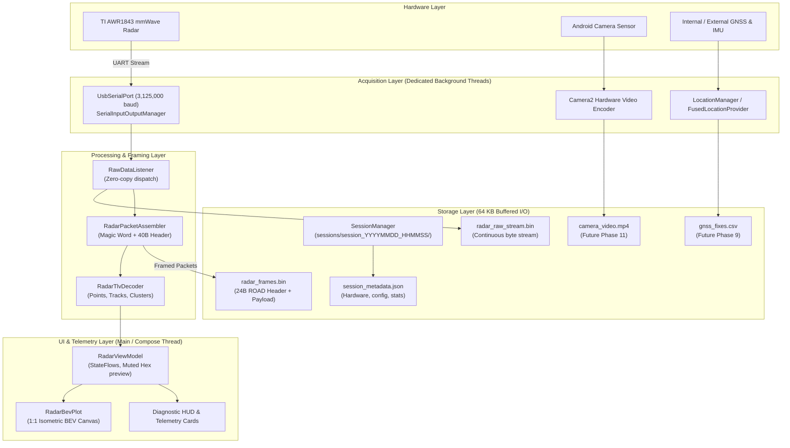

# RoadSense System Architecture & Multi-Sensor Roadmap

> **Target Audience:** Systems Architects, Android Engineers, and AI Agents developing or integrating sensors for **RoadSense**.
> **Location:** `.artifacts/Intel/roadsense_system_architecture_and_roadmap.md`
> **Maintainers:** RoadSense Core Engineering Team

---

## 1. System Vision & Objective

**RoadSense** is a high-reliability, zero-loss Android data acquisition platform engineered for automotive edge logging. It captures, synchronizes, and persists multimodal sensor streams:
1. **Radar:** TI AWR1843BOOST FMCW mmWave Radar over high-speed USB-UART (3,125,000 baud).
2. **GNSS / IMU:** High-frequency Android Location (GPS, GLONASS, Galileo) & hardware IMU sensors.
3. **Camera:** Android Camera2 / CameraX hardware-encoded video stream with frame-level timestamps.
4. **Common Timebase:** Nanosecond-synchronized monotonic time across all sensor modalities.

---

## 2. End-to-End Dataflow Architecture



---

## 3. Threading & Concurrency Model

A fundamental requirement of RoadSense is **absolute isolation between acquisition, disk I/O, and UI rendering**:

```
+---------------------------------------------------------------------------------+
| Thread 1: USB Read Thread (NORM_PRIORITY + 2)                                  |
| - SerialInputOutputManager reads OS USB buffer                                   |
| - Executes RawDataListener callbacks with zero heap allocation                  |
+---------------------------------------------------------------------------------+
                                      │
                                      ▼
+---------------------------------------------------------------------------------+
| Thread 2: Radar Recorder Worker (SingleThreadExecutor, NORM_PRIORITY + 1)       |
| - Writes to 64 KB BufferedOutputStream (radar_raw_stream.bin)                    |
| - Prepends 24-byte ROAD sync header and writes to radar_frames.bin               |
| - Dispatches to fsync() on session closure                                       |
+---------------------------------------------------------------------------------+
                                      │
                                      ▼
+---------------------------------------------------------------------------------+
| Thread 3: Decoding & Domain Processing (Default Dispatcher)                     |
| - RadarPacketAssembler reconstructs packets across chunk boundaries              |
| - RadarTlvDecoder parses Q-format metric coordinates and filters inactive slots  |
| - Updates latestFrame StateFlow                                                  |
+---------------------------------------------------------------------------------+
                                      │
                                      ▼
+---------------------------------------------------------------------------------+
| Thread 4: UI & Compose Rendering (Main Thread)                                  |
| - Canvas renders isometric BEV plot at screen refresh rate (60/120 Hz)          |
| - UI can lag, rotate, or collapse without affecting Thread 1 or Thread 2        |
+---------------------------------------------------------------------------------+
```

---

## 4. The Unified Monotonic Timebase

### The Problem
Automotive multimodal fusion fails if sensors use different time references:
* Radar DSP cycle counter (`timeCpuCycles`) resets on reboot and drifts with clock temperature.
* Wall-clock time (`System.currentTimeMillis()`) is subject to NTP jumps, daylight saving, and user clock changes.

### The Solution
All sensor records in RoadSense are stamped with **Host Monotonic Nanoseconds**:
$$\text{Timestamp} = \text{SystemClock.elapsedRealtimeNanos()}$$

* **Source:** Hardware clock maintained by the Android kernel CPU monotonic timer.
* **Properties:** Monotonically non-decreasing, immune to NTP adjustments, continues running in low-power sleep.
* **Cross-Sensor Alignment:**
  - Radar packet arrival $\rightarrow$ Stamped with `elapsedRealtimeNanos()`.
  - Camera frame exposure $\rightarrow$ Android `CameraCaptureSession` exposes `CaptureResult.SENSOR_TIMESTAMP` (which is in `elapsedRealtimeNanos()`).
  - GNSS location fix $\rightarrow$ Android `Location.getElapsedRealtimeNanos()`.

---

## 5. Storage Hierarchy & Session File Layout

Each recording session is isolated in its own self-contained directory under the app-specific external storage:
`/sdcard/Android/data/com.bajajauto.roadsense/files/sessions/session_YYYYMMDD_HHMMSS/`

```
session_20260909_111841/
├── session_metadata.json          <-- Session manifest & device telemetry
├── radar/
│   ├── radar_frames.bin           <-- Framed binary packets with 24B sync header
│   └── radar_raw_stream.bin       <-- Unaltered UART byte-stream (ground-truth audit)
├── camera/                        <-- (Phase 11)
│   ├── video.mp4                  <-- Hardware H.264/H.265 encoded video
│   └── frame_timestamps.csv       <-- Frame index, monotonic_ns, exposure_time
└── gnss/                          <-- (Phase 9)
    └── gnss_fixes.csv             <-- Lat, lon, alt, speed, bearing, monotonic_ns
```

### 5.1 Framed Binary Header (`radar_frames.bin`)
Every assembled packet is wrapped with a lightweight **24-byte big-endian sync header**:

```text
Offset 0   (4 bytes): Magic ASCII "ROAD" (0x52, 0x4F, 0x41, 0x44)
Offset 4   (8 bytes): Host Monotonic Nanoseconds (Long)
Offset 12  (8 bytes): Host Wall-Clock Milliseconds (Long)
Offset 20  (4 bytes): Payload Length N (Int)
Offset 24  (N bytes): TI Radar Packet (Magic Word + 40B Header + TLVs)
```

---

## 6. Multi-Sensor Integration Roadmap

```
Milestones 01-08: Radar USB, Baud 3.125M, Framing, TLV Decoding, BEV Canvas [COMPLETED]
Milestone 09:     Structured Session Architecture & Binary Recording         [COMPLETED]
                                   │
                                   ▼
Milestone 10:     Phase 9 — GNSS / Location Acquisition & Logging
                  - LocationProviderManager with FusedLocationProviderClient
                  - Real-time Lat/Lon/Speed/Bearing telemetry card
                  - Thread-safe CSV writer stamped with elapsedRealtimeNanos()
                                   │
                                   ▼
Milestone 11:     Phase 10 — Monotonic Timebase Synchronization Engine
                  - Temporal alignment validator verifying dt across Radar and GNSS
                  - Offline correlation tool (tools/sync_validator.py)
                                   │
                                   ▼
Milestone 12:     Phase 11 — Camera2 Hardware Video Recording
                  - Camera2 / CameraX pipeline with MediaCodec hardware acceleration
                  - Concurrent video capture (1080p @ 30/60 FPS)
                  - Frame exposure timestamp callback logging
                                   │
                                   ▼
Milestone 13:     Phase 12 — Master Multi-Sensor Recording Controller
                  - Single master Start/Stop session button
                  - Dynamic storage space checking & thermal throttling safeguards
                  - One-click session package export & ADB pull integration
```
