# Bajaj Auto ARAS / ADAS GitLab Migration & Repository Architecture Plan

> **Author / Project**: Advanced Rider Assistance Systems (ARAS / ADAS)  
> **Target Platform**: GitLab Enterprise  
> **Status**: Migration Blueprint & Structural Specification  
> **Date**: October 2026  

---

## Table of Contents
1. [Executive Summary](#1-executive-summary)
2. [Why GitLab? Enterprise Power & Key Capabilities](#2-why-gitlab-enterprise-power--key-capabilities)
3. [Local Repositories & Assets Inventory](#3-local-repositories--assets-inventory)
4. [GitLab Organization Architecture](#4-gitlab-organization-architecture)
   - [Mermaid Architecture Diagram](#mermaid-architecture-diagram)
5. [Detailed Project Specifications & Migration Mapping](#5-detailed-project-specifications--migration-mapping)
   - [Subgroup 01: Firmware & Embedded](#subgroup-01-firmware--embedded)
   - [Subgroup 02: Perception & Fusion](#subgroup-02-perception--fusion)
   - [Subgroup 03: Simulation & Digital Twin](#subgroup-03-simulation--digital-twin)
   - [Subgroup 04: Telemetry & Visualization](#subgroup-04-telemetry--visualization)
   - [Subgroup 05: Edge Loggers & In-Vehicle Tools](#subgroup-05-edge-loggers--in-vehicle-tools)
   - [Subgroup 06: Architecture & Standards](#subgroup-06-architecture--standards)
   - [Subgroup 07: Research & Archive](#subgroup-07-research--archive)
6. [Git LFS (Large File Storage) Strategy](#6-git-lfs-large-file-storage-strategy)
7. [Step-by-Step Repository Migration Guide](#7-step-by-step-repository-migration-guide)
8. [Starter CI/CD Pipeline Blueprints](#8-starter-cicd-pipeline-blueprints)

---

## 1. Executive Summary

This document outlines the strategic migration of all Advanced Rider Assistance Systems (ARAS) codebases, simulation environments, telemetry pipelines, and algorithms from scattered local drives (`D:\ARAS`, `D:\Gitea`, `D:\Work`, and `D:\CARLA`) into a centralized, corporate **GitLab** ecosystem.

By migrating to GitLab, the ARAS team transitions from ad-hoc folder management and isolated local git repos to an industry-standard automotive software DevOps lifecycle featuring:
- Predictable, domain-driven subgroup classification.
- Automated CI/CD testing and binary distribution.
- Native Git LFS handling for heavy automotive logs and neural weights.
- Single-pane visibility across algorithms, firmware, simulation, and hardware telemetry.

---

## 2. Why GitLab? Enterprise Power & Key Capabilities

GitLab is significantly more powerful than standalone git servers (like Gitea) or basic code hosts. In automotive ADAS engineering, it acts as a complete product delivery platform:

### 2.1 Multi-Level Nested Groups & Subgroups
* **GitHub limitation**: Flat hierarchy (Organization $\rightarrow$ Repository).
* **GitLab capability**: Arbitrary nested subgroups (`bajaj-aras / 01-firmware-embedded / radar-mrr-awr1843`).
* **Benefit**: Permissions, deploy tokens, security policies, and CI/CD variables can be defined once at the group or subgroup level and automatically inherited by child repositories.

### 2.2 Built-In Package & Generic Binary Registry
* **Current state**: Precompiled executables (`visualizer_v3.2.6.exe`), firmware `.bin`/`.hex` files, and `.zip` bundles are stored directly on disk or in repository trees.
* **GitLab solution**: Built-in Generic Package Registry. Your CI/CD builds artifacts and publishes versioned release packages (`v1.0.0`, `v1.1.0`) downloadable via API or web UI without bloating the git history.

### 2.3 Native Git LFS (Large File Storage)
* **The challenge**: ADAS development involves large radar logs (`.mcap`, `.mat`, `.log`), model weights (`yolo26n.pt`, depth nets), and CARLA maps that corrupt git performance if pushed as regular commits.
* **GitLab solution**: Native Git LFS server with chunked parallel uploads, automated deduplication, and streaming transfers.

### 2.4 Scalable Hybrid CI/CD Runners
* **Heterogeneous build infrastructure**:
  * **Windows GPU Runners**: For CARLA 0.9.16 execution, Shenron synthetic radar processing, and PyTorch depth networks.
  * **Linux Embedded Runners**: For cross-compiling ARM code for Raspberry Pi gateways and compiling TI mmWave DSP firmware.
  * **Lightweight Shared Runners**: For linting, unit tests, and documentation generation.

### 2.5 Issue Boards, Epics & Merge Request Code Reviews
* Track high-level epics (e.g., *"Euro NCAP AEB Compliance v1.2"*) that cascade down into firmware tasks, simulation test cases, and visualization UI improvements.
* Strict branch protection with `CODEOWNERS` ensuring firmware and safety-critical algorithms cannot be merged without designated lead approvals.

---

## 3. Local Repositories & Assets Inventory

Below is the verified audit of all projects discovered across `D:\ARAS`, `D:\Gitea`, `D:\Work`, and `D:\CARLA`:

| Current Local Path | Active Branch / State | Primary Tech | Functional Summary |
| :--- | :--- | :--- | :--- |
| `D:\Work\Repo\Radar_Realtime_Tracker_MRR` | `CAN_fix` (Git) | C (TI Code Composer) | Dual-core MSS/DSS firmware for TI AWR1843 radar running on-chip tracking. |
| `D:\Work\Repo\Protobuf_CAN` | `main` (Git) | C / Python / Protobuf | High-speed radar point cloud (100–500 pts) streaming over CAN FD @ 20Hz. |
| `D:\Work\Final Project Files Ishan Aji Hassan Bajaj` | Local directory | Python / Shell | RPi + Kvaser U100 + MCP2515 CAN-FD to CAN 2.0 gateway with video sync. |
| `D:\Work\Repo\CANenbl_unifiedRadarTracker` | `main` (Git) | Python | Real-time radar point cloud & CAN odometry fusion tracker for embedded Linux. |
| `D:\Gitea\CAN_unified_radar_tracker_py` | `Tracker_mods` (Git) | Python | Gitea working branch of the unified radar tracker. |
| `D:\Gitea\Radar_tracker_m` | `master` (Git) | MATLAB | Research algorithm for radar target clustering & CAN state tracking. |
| `D:\ARAS\segregatedv12_EGO_CAN_IMU` | Local directory | Python / MATLAB | Ego-velocity estimator and motion classifier (straight/turn) using radar & IMU. |
| `D:\Work\CV` | Local directory | PyTorch / Python | Monocular depth estimation (Video-Depth-Anything) and YOLO bounding box depth. |
| `D:\Work\Repo\RoadSense` | `main` (Git) | Kotlin (Android) | Android multi-sensor data logger (Camera + GNSS + AWR1843 TLV over USB/UART). |
| `D:\ARAS\working app` | Local directory | Kotlin | Original Kotlin prototype files for the Android radar logger. |
| `D:\CARLA\CARLA_0.9.16\PythonAPI\Fox` | `refactor_architecture` (Git)| Python / CARLA | Fox CARLA ADAS simulation project with scenario-driven controllers. |
| `D:\Gitea\BATL_CARLA_SIM-gitea` | `Shenron` (Git) | Python / CARLA | Gitea simulation mirror with Shenron radar integration. |
| `D:\Work\Repo\C-Shenron` | `main` (Git) | Python / C++ | High-fidelity physics-based radar simulator (Shenron) for CARLA. |
| `D:\Work\Repo\OSC-NCAP-scenarios` | `main` (Git) | OpenSCENARIO / OpenDRIVE | Standard Euro NCAP collision avoidance scenario definitions. |
| `D:\Work\Repo\ESMINI` | `main` (Git) | C++ / OpenSCENARIO | Lightweight OpenSCENARIO player (esmini) for headless validation. |
| `D:\Work\Repo\B_SIGNALIZER` | `main` (Git) | React / Node / WebGL | Web-native CAN telemetry analysis, DBC parsing, and time-series platform. |
| `D:\Work\Repo\App_Maker` | `main` (Git) | Electron / Node / TS | RadarSync desktop visualizer application and HTTP telemetry server. |
| `D:\Work\Repo\refactor` | `refactor/sync-centralize` | Vue / Node / JS | Centralized, refactored visualizer core and telemetry pipelines. |
| `D:\ARAS\JSON_MCAP_Konverter` | `master` (Git) | Python / TS | Converts raw radar JSON logs to robotics-standard Foxglove MCAP format. |
| `D:\ARAS\Foxglove_SRC\foxglove-opensource`| Git repo | TypeScript / React | Customized fork of Foxglove Studio for Bajaj ADAS layout configurations. |
| `D:\ARAS\py_recorder` | `master` (Git) | Python | Standalone Python radar logging application. |
| `D:\ARAS\AWR2RPi_readData_py` | Git repo | Python | Multi-threaded UART parser and real-time GUI for AWR1432 on Raspberry Pi. |
| `D:\Work\Repo\ADAS_DATA_ARCHITECTURE` | `main` (Git) | Markdown / Schemas | Master architectural specification, ICDs, conversion catalogs, data flows. |
| `D:\ARAS\Presentations` & `Scenarios` | Local directories | Markdown / PPTX | Engineering presentation guidelines, LaTeX standards, scenario roadmaps. |
| `D:\Work\Repo\LearningC` | `main` (Git) | C | Embedded C training modules and hardware peripheral exercises. |

---

## 4. GitLab Organization Architecture

To make navigation intuitive for any developer or stakeholder, all repositories are organized into **7 domain-specific subgroups** under a root group named **`bajaj-aras`**.

### Mermaid Architecture Diagram

```mermaid
flowchart TD
    ROOT["🏢 Root Group: bajaj-aras"]

    SG1["📁 01-firmware-embedded"]
    SG2["📁 02-perception-fusion"]
    SG3["📁 03-simulation-digitaltwin"]
    SG4["📁 04-telemetry-visualization"]
    SG5["📁 05-edge-loggers"]
    SG6["📁 06-architecture-standards"]
    SG7["📁 07-research-archive"]

    ROOT --> SG1
    ROOT --> SG2
    ROOT --> SG3
    ROOT --> SG4
    ROOT --> SG5
    ROOT --> SG6
    ROOT --> SG7

    %% Subgroup 1: Firmware
    P1["radar-mrr-awr1843<br/><i>TI AWR1843 Dual-Core DSP Firmware</i>"]
    P2["protobuf-can-streamer<br/><i>CAN FD 20Hz Radar Point Cloud Streamer</i>"]
    P3["can-fd-gateway<br/><i>RPi CAN-FD to CAN 2.0 Hardware Bridge</i>"]
    SG1 --> P1
    SG1 --> P2
    SG1 --> P3

    %% Subgroup 2: Perception & Fusion
    P4["radar-can-fusion-tracker<br/><i>Real-Time Embedded Radar + CAN Tracker</i>"]
    P5["ego-motion-estimator<br/><i>Radar + IMU Vehicle Motion Classifier</i>"]
    P6["vision-depth-perception<br/><i>Monocular Depth & YOLO 3D Bounding Box</i>"]
    SG2 --> P4
    SG2 --> P5
    SG2 --> P6

    %% Subgroup 3: Simulation & Digital Twin
    P7["fox-carla-simulation<br/><i>Modular CARLA 0.9.16 ADAS Testing Rig</i>"]
    P8["carla-shenron-radar<br/><i>Physics-Based Radar Simulator Model</i>"]
    P9["ncap-scenarios-openscenario<br/><i>Euro NCAP Collision Test Suites</i>"]
    P10["esmini-scenario-lab<br/><i>Lightweight OpenSCENARIO Headless Runner</i>"]
    SG3 --> P7
    SG3 --> P8
    SG3 --> P9
    SG3 --> P10

    %% Subgroup 4: Telemetry & Visualization
    P11["bsignalizer-can-platform<br/><i>Web-Native High-Performance CAN Visualizer</i>"]
    P12["radarsync-visualizer-app<br/><i>Desktop Electron/Node RadarSync Client</i>"]
    P13["visualizer-core-refactor<br/><i>Modular Telemetry Frontend Engine</i>"]
    P14["mcap-telemetry-tools<br/><i>JSON to Foxglove MCAP Converters</i>"]
    P15["foxglove-studio-custom<br/><i>Customized Foxglove Studio Dashboard</i>"]
    SG4 --> P11
    SG4 --> P12
    SG4 --> P13
    SG4 --> P14
    SG4 --> P15

    %% Subgroup 5: Edge Loggers
    P16["roadsense-android-logger<br/><i>Android Video + GNSS + Radar Logger</i>"]
    P17["py-radar-recorder<br/><i>Python Test Drive Acquisition Suite</i>"]
    SG5 --> P16
    SG5 --> P17

    %% Subgroup 6: Architecture & Standards
    P18["adas-data-architecture<br/><i>Master Schemas, ICDs & Global Glossary</i>"]
    P19["aras-engineering-standards<br/><i>LaTeX Guidelines & Presentation Specs</i>"]
    SG6 --> P18
    SG6 --> P19

    %% Subgroup 7: Research & Archive
    P20["radar-tracker-matlab<br/><i>Original MATLAB Research Implementation</i>"]
    P21["awr1432-uart-rpi-eval<br/><i>Legacy AWR1432 Python UART GUI</i>"]
    P22["learning-c<br/><i>Embedded C Learning Modules</i>"]
    SG7 --> P20
    SG7 --> P21
    SG7 --> P22
```



---

## 5. Detailed Project Specifications & Migration Mapping

### Subgroup 01: Firmware & Embedded
*Path: `bajaj-aras / 01-firmware-embedded`*

1. **`radar-mrr-awr1843`**
   - **Source**: `D:\Work\Repo\Radar_Realtime_Tracker_MRR`
   - **Language/Framework**: C (TI Code Composer Studio, BIOS / SysConfig).
   - **Description**: Production firmware executing on TI AWR1843 MSS (Cortex-R4F) and DSS (C674x DSP). Handles chirp profiling, range/Doppler FFT, CFAR target detection, clustering, and Kalman tracking directly on the sensor.
   - **CI/CD Recommendation**: Headless TI C compiler checks, static code analysis (`cppcheck`).

2. **`protobuf-can-streamer`**
   - **Source**: `D:\Work\Repo\Protobuf_CAN`
   - **Language/Framework**: C / Python / Google Protocol Buffers.
   - **Description**: Serialization suite enabling 100–500 radar point cloud targets to be transmitted over CAN FD at 20 Hz without exceeding automotive bus load limits.
   - **CI/CD Recommendation**: Automated `protoc` schema compilation test, Python bus simulation test.

3. **`can-fd-gateway`**
   - **Source**: `D:\Work\Final Project Files Ishan Aji Hassan Bajaj`
   - **Language/Framework**: Python / Linux SocketCAN.
   - **Description**: Bidirectional bridge between CAN-FD (Kvaser U100 on `can0`) and vehicle CAN 2.0 (MCP2515 SPI on `can1`), including hardware camera trigger synchronization.
   - **CI/CD Recommendation**: SocketCAN virtual interface unit tests (`vcan0`).

---

### Subgroup 02: Perception & Fusion
*Path: `bajaj-aras / 02-perception-fusion`*

1. **`radar-can-fusion-tracker`**
   - **Source**: `D:\Work\Repo\CANenbl_unifiedRadarTracker` (consolidating `D:\Gitea\CAN_unified_radar_tracker_py`)
   - **Language/Framework**: Python 3 (NumPy, SciPy, Multi-processing).
   - **Description**: Real-time tracker operating on Raspberry Pi / embedded Linux. Ingests raw radar point cloud TLVs and fuses them with vehicle speed and yaw rate for dynamic coordinate stabilization and obstacle tracking.
   - **CI/CD Recommendation**: `pytest` regression run on recorded `.mat` / `.jsonl` sample drive logs.

2. **`ego-motion-estimator`**
   - **Source**: `D:\ARAS\segregatedv12_EGO_CAN_IMU`
   - **Language/Framework**: Python / MATLAB.
   - **Description**: Algorithms for decomposing radar point Doppler into vehicle self-motion vs. external object velocity, classifying host vehicle movement states (straight, curve, lane-change).

3. **`vision-depth-perception`**
   - **Source**: `D:\Work\CV`
   - **Language/Framework**: PyTorch / Python (YOLO, Video-Depth-Anything).
   - **Description**: Camera-based perception stack computing metric spatial bounding box coordinates for fused radar-camera object verification.
   - **Git LFS Required**: `*.pt`, `*.pth`, `*.onnx` model weights.

---

### Subgroup 03: Simulation & Digital Twin
*Path: `bajaj-aras / 03-simulation-digitaltwin`*

1. **`fox-carla-simulation`**
   - **Source**: `D:\CARLA\CARLA_0.9.16\PythonAPI\Fox` (consolidating `D:\Gitea\BATL_CARLA_SIM-gitea`)
   - **Language/Framework**: Python 3 / CARLA 0.9.16 API.
   - **Description**: Scenario orchestration platform for virtual validation of ARAS logic, sensor placement, and synthetic radar injection.

2. **`carla-shenron-radar`**
   - **Source**: `D:\Work\Repo\C-Shenron`
   - **Language/Framework**: Python / C++ (Shenron Radar Physics Engine).
   - **Description**: Realistic ray-tracing and physics-based radar simulator providing high-fidelity point clouds inside CARLA.

3. **`ncap-scenarios-openscenario`**
   - **Source**: `D:\Work\Repo\OSC-NCAP-scenarios`
   - **Language/Framework**: XML (OpenSCENARIO 1.x) / OpenDRIVE.
   - **Description**: Official Euro NCAP test scenarios (Car-to-Car Rear, Turn-Across-Path, Vulnerable Road User AEB/FCW).

4. **`esmini-scenario-lab`**
   - **Source**: `D:\Work\Repo\ESMINI`
   - **Language/Framework**: C++ / esmini binary runner.
   - **Description**: Lightweight OpenSCENARIO testbench for rapid scenario debugging without full Unreal Engine overhead.

---

### Subgroup 04: Telemetry & Visualization
*Path: `bajaj-aras / 04-telemetry-visualization`*

1. **`bsignalizer-can-platform`**
   - **Source**: `D:\Work\Repo\B_SIGNALIZER`
   - **Language/Framework**: TypeScript / React / Node / WebGL / Rust/WebAssembly.
   - **Description**: High-performance web-native CAN bus telemetry analysis application supporting DBC decoding and multi-channel waveform playback.

2. **`radarsync-visualizer-app`**
   - **Source**: `D:\Work\Repo\App_Maker` (incorporating assets from `D:\ARAS\executable` & `v3.2.6`)
   - **Language/Framework**: TypeScript / Node / Electron (`pkg`).
   - **Description**: The official standalone desktop GUI application (`RadarSync`) for real-time sensor visualization and log inspection.
   - **GitLab Registry**: Automated build pipeline generating `visualizer_vX.Y.Z.exe` in the GitLab Generic Package Registry.

3. **`visualizer-core-refactor`**
   - **Source**: `D:\Work\Repo\refactor` / `D:\Gitea\refactor-gitea`
   - **Language/Framework**: Vue / JavaScript.
   - **Description**: Modular next-gen visualizer UI components and decoupled data pipelines.

4. **`mcap-telemetry-tools`**
   - **Source**: `D:\ARAS\JSON_MCAP_Konverter`
   - **Language/Framework**: Python / TypeScript.
   - **Description**: Telemetry processing toolkit for converting raw radar JSON logs into Foxglove MCAP files with synchronized channels.

5. **`foxglove-studio-custom`**
   - **Source**: `D:\ARAS\Foxglove_SRC\foxglove-opensource`
   - **Language/Framework**: TypeScript / React.
   - **Description**: Tailored Foxglove Studio fork featuring proprietary Bajaj ARAS panels and layout templates.

---

### Subgroup 05: Edge Loggers & In-Vehicle Tools
*Path: `bajaj-aras / 05-edge-loggers`*

1. **`roadsense-android-logger`**
   - **Source**: `D:\Work\Repo\RoadSense` (incorporating `D:\ARAS\working app`)
   - **Language/Framework**: Kotlin / Android SDK.
   - **Description**: In-vehicle Android data acquisition application recording synchronized front camera video, GNSS location, and TI AWR1843 radar frames via USB-UART OTG.
   - **CI/CD Recommendation**: Gradle build producing release APKs published to GitLab Package Registry.

2. **`py-radar-recorder`**
   - **Source**: `D:\ARAS\py_recorder`
   - **Language/Framework**: Python.
   - **Description**: Multi-sensor recording session launcher for bench and vehicle tests.

---

### Subgroup 06: Architecture & Standards
*Path: `bajaj-aras / 06-architecture-standards`*

1. **`adas-data-architecture`**
   - **Source**: `D:\Work\Repo\ADAS_DATA_ARCHITECTURE`
   - **Language/Framework**: Markdown / JSON Schema.
   - **Description**: The master blueprint for the entire team. Defines the Global Glossary, Data Object Catalogs, Conversion Matrices, and ICDs connecting radar, CAN, tracker, and simulation.
   - **GitLab Pages**: Configured to auto-build a searchable internal documentation website on every commit.

2. **`aras-engineering-standards`**
   - **Source**: `D:\ARAS\Presentations` & `D:\ARAS\Scenarios`
   - **Language/Framework**: Markdown / LaTeX / Office Templates.
   - **Description**: Repository governing technical documentation guidelines, LaTeX equation formatting standards, and ADAS test scenario matrices.

---

### Subgroup 07: Research & Archive
*Path: `bajaj-aras / 07-research-archive`*

1. **`radar-tracker-matlab`**
   - **Source**: `D:\Gitea\Radar_tracker_m`
   - **Language/Framework**: MATLAB.
   - **Description**: Historical algorithmic baseline used for initial sensor fusion validation.

2. **`awr1432-uart-rpi-eval`**
   - **Source**: `D:\ARAS\AWR2RPi_readData_py`
   - **Language/Framework**: Python.
   - **Description**: Initial evaluation code for AWR1432BOOST radar sensors.

3. **`learning-c`**
   - **Source**: `D:\Work\Repo\LearningC`
   - **Language/Framework**: C.
   - **Description**: Onboarding exercises and embedded C reference examples.

---

## 6. Git LFS (Large File Storage) Strategy

Large binary files must **never** be committed into normal git history. In GitLab, configure Git LFS globally before initiating repository migrations.

### Standardized `.gitattributes` File
Add this `.gitattributes` file to the root of your repositories:

```gitattributes
# Sensor Logs & Data Dumps
*.mat filter=lfs diff=lfs merge=lfs -text
*.mcap filter=lfs diff=lfs merge=lfs -text
*.bag filter=lfs diff=lfs merge=lfs -text
*.pcap filter=lfs diff=lfs merge=lfs -text
*.log filter=lfs diff=lfs merge=lfs -text

# Neural Network Weights
*.pt filter=lfs diff=lfs merge=lfs -text
*.pth filter=lfs diff=lfs merge=lfs -text
*.onnx filter=lfs diff=lfs merge=lfs -text
*.tflite filter=lfs diff=lfs merge=lfs -text

# Executables, Packages & Archives
*.exe filter=lfs diff=lfs merge=lfs -text
*.bin filter=lfs diff=lfs merge=lfs -text
*.hex filter=lfs diff=lfs merge=lfs -text
*.zip filter=lfs diff=lfs merge=lfs -text
*.tar.gz filter=lfs diff=lfs merge=lfs -text

# Multimedia
*.mp4 filter=lfs diff=lfs merge=lfs -text
*.avi filter=lfs diff=lfs merge=lfs -text
```

---

## 7. Step-by-Step Repository Migration Guide

Follow this standard procedure for each repository to preserve full git history, branches, and tags.

### Step 1: Install & Verify Git LFS Locally
Run once in PowerShell:
```powershell
git lfs install
```

### Step 2: Prepare the Local Repository
Navigate to the repository on your disk (example: `CANenbl_unifiedRadarTracker`):
```powershell
cd D:\Work\Repo\CANenbl_unifiedRadarTracker

# Check untracked large files and add LFS tracking
git lfs track "*.mat" "*.mcap" "*.pt" "*.exe"
git add .gitattributes
git commit -m "chore: configure Git LFS tracking rules"
```

### Step 3: Create the Project on GitLab
1. In GitLab, navigate to the target subgroup (e.g., `bajaj-aras / 02-perception-fusion`).
2. Click **New project** $\rightarrow$ **Create blank project**.
3. Set Project Name: `radar-can-fusion-tracker`.
4. **Uncheck** *"Initialize repository with a README"* (must be a completely blank repository).

### Step 4: Add GitLab Remote and Push All Branches & Tags
```powershell
# Add the new GitLab remote URL
git remote add gitlab https://<gitlab-server>/bajaj-aras/02-perception-fusion/radar-can-fusion-tracker.git

# Push all branches
git push gitlab --all

# Push all tags
git push gitlab --tags

# Push LFS objects
git lfs push --all gitlab
```

---

## 8. Starter CI/CD Pipeline Blueprints

### Example A: Python Tracker Unit Tests & Linting
File: `.gitlab-ci.yml` in `radar-can-fusion-tracker`
```yaml
stages:
  - test
  - quality

variables:
  PIP_CACHE_DIR: "$CI_PROJECT_DIR/.cache/pip"

cache:
  paths:
    - .cache/pip/
    - venv/

test:python-3.11:
  stage: test
  image: python:3.11-slim
  before_script:
    - python -m venv venv
    - . venv/bin/activate
    - pip install -r requirements.txt
    - pip install pytest
  script:
    - pytest tests/ -v

lint:flake8:
  stage: quality
  image: python:3.11-slim
  before_script:
    - pip install flake8
  script:
    - flake8 src/ --max-line-length=120 --exclude=venv
  allow_failure: true
```

### Example B: Auto-Publish Documentation with GitLab Pages
File: `.gitlab-ci.yml` in `adas-data-architecture`
```yaml
stages:
  - deploy

pages:
  stage: deploy
  image: python:3.11-slim
  before_script:
    - pip install mkdocs-material
  script:
    - mkdocs build --site-dir public
  artifacts:
    paths:
      - public
  only:
    - main
```

---

*Document generated and verified on D Drive (`D:\GITLAB_MIGRATION_ARCHITECTURE.md`).*
