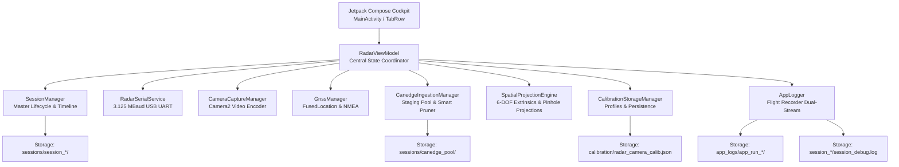

# RoadSense: System Architecture & Storage Specification

> **Document Name:** `01_ARCHITECTURE_AND_STORAGE.md`  
> **Location:** `context/01_ARCHITECTURE_AND_STORAGE.md`  
> **Audience:** Autonomous AI Coding Agents & System Architects  

---

## 1. High-Level Software Architecture

RoadSense uses modern Android MVVM (Model-View-ViewModel) architecture with unidirectional data flow (UDF) powered by Jetpack Compose, Kotlin Coroutines, and reactive `StateFlow` primitives.



---

## 2. Core Package & Component Mapping

| Subsystem / Layer | Key Kotlin Classes | Primary Responsibility |
|---|---|---|
| **UI Cockpit** | `ui/MainActivity.kt`<br>`ui/RadarViewModel.kt`<br>`ui/screens/*.kt`<br>`ui/components/*.kt` | Multi-tab Compose UI with 6 cockpit tabs: Radar, GNSS, Camera, CANedge, SBS (Side-by-Side dual feed), and Storage (Session Deck). Features dedicated Fullscreen Camera Viewfinder, Calibration Studio, and Quick Nudge Bar. Exposes single source of truth via `StateFlow`. |
| **Session Control** | `recording/SessionManager.kt`<br>`recording/SessionInfo.kt`<br>`recording/SessionTimelineWriter.kt` | Manages active recording sessions, folder initialization, metadata generation, and nanosecond monotonic timestamp events. |
| **Radar Ingestion** | `radar/service/RadarSerialService.kt`<br>`radar/parser/RadarPacketParser.kt`<br>`radar/model/RadarFrame.kt` | Custom USB FTDI/CDC serial driver operating at 3.125 Mbps. Rings buffers and decodes TLV binary frames into point clouds and clusters. |
| **Camera Capture** | `camera/CameraEngine.kt`<br>`camera/CameraSessionRecorder.kt`<br>`ui/screens/CameraDashboardCard.kt` | Camera2 video recording, smart infinity focus lock, tap-to-focus/AE lock, nanosecond frame logging (`camera_frames.csv`), autonomous dual-zone Road AE, and robust SurfaceTexture lifecycle handoffs. |
| **Sensor Fusion & Spatial Calibration** | `fusion/engine/SpatialProjectionEngine.kt`<br>`fusion/engine/CameraIntrinsicsProvider.kt`<br>`fusion/model/CalibrationParameters.kt`<br>`fusion/storage/CalibrationStorageManager.kt`<br>`ui/components/ViewfinderRadarOverlay.kt` | 6-DOF extrinsic rigid transform ($[\mathbf{R} \mid \mathbf{T}]$), Camera2 intrinsic matrix ($K$), real-time closed-form touch reverse solver, ground plane contact footprint projection, hybrid RViz-style radar lollipops, concentric range arcs, and Painter's algorithm depth-sorting. |
| **GNSS Tracking** | `gnss/GnssManager.kt`<br>`ui/screens/GnssDashboardCard.kt` | FusedLocationProviderClient + NMEA sentence parsing. Generates synchronized `gnss_track.csv`. |
| **CANedge2 Sync** | `canedge/ingestion/CanedgeIngestionManager.kt`<br>`canedge/repository/CanedgeRepository.kt`<br>`canedge/network/CanedgeHttpClient.kt` | ESP32 REST client, persistent staging pool (`canedge_pool/`), deferred drive sync, smart auto-pruning engine, and OneDrive-style unified file explorer. |
| **Diagnostics** | `logging/AppLogger.kt` | Continuous app-wide flight recorder (`app_system.log`) and active session flight recorder (`session_debug.log`). |

---

## 3. Storage Directory Hierarchy (Physical On-Device Layout)

All persistent logs, calibration profiles, and active sessions are stored inside the app's external files directory:
`/sdcard/Android/data/com.bajajauto.roadsense/files/`

```text
/sdcard/Android/data/com.bajajauto.roadsense/files/
 │
 ├── calibration/                                  <-- SENSOR FUSION & EXTRINSIC CALIBRATION PROFILES
 │    └── radar_camera_calib.json                  <-- Active 6-DOF extrinsics, pitch/yaw/roll, setback & heights
 │
 ├── app_logs/                                     <-- CONTINUOUS APP-WIDE FLIGHT RECORDER LOGS
 │    ├── app_run_20260911_090015/
 │    │    └── app_system.log                      <-- Full idle diagnostics (Wi-Fi, sync, UI, crashes)
 │    └── app_run_20260911_121542/
 │         └── app_system.log
 │
 └── sessions/
      │
      ├── canedge_pool/                            <-- PERSISTENT STAGING POOL FOR CANedge MF4 CHUNKS
      │    ├── 00000041_00000050.MF4               <-- Format: {FOLDER_ID}_{FILE_ID}.MF4
      │    ├── 00000041_00000051.MF4
      │    └── 00000041_00000052.MF4
      │
      └── session_20260911_111401/                 <-- PERMANENT MULTI-SENSOR RECORDING SESSION
           ├── session_metadata.json               <-- Session-wide descriptor & hardware properties
           ├── session_debug.log                   <-- Active recording flight recorder stream
           ├── session_timeline.csv                <-- Nanosecond cross-sensor monotonic event index
           │
           ├── radar/
           │    ├── radar_raw_stream.bin           <-- Raw binary UART byte stream from TI sensor
           │    └── radar_frames.bin               <-- Decoded binary framed packets (ROAD magic)
           │
           ├── camera/
           │    ├── camera_video.mp4               <-- Recorded H.264 video file
           │    └── camera_frames.csv              <-- Per-frame PTS & monotonic capture timestamps
           │
           ├── gnss/
           │    └── gnss_track.csv                 <-- Lat, lon, alt, speed, bearing, accuracy
           │
           └── can/
                ├── 00000041_00000051.MF4          <-- CANedge chunks assigned to this drive session
                └── 00000041_00000052.MF4
```

---

## 4. Metadata Schemas

### 4.1 `session_metadata.json` Schema
Written by `SessionManager.writeMetadata(sessionInfo)` upon session start and finalized upon session stop:
```json
{
  "sessionId": "session_20260911_111401",
  "startTimeWallMs": 1789105441000,
  "startTimeIso": "2026-09-11T11:14:01.000+05:30",
  "startTimeMonotonicNs": 128459201400000,
  "stopTimeWallMs": 1789105655000,
  "stopTimeIso": "2026-09-11T11:17:35.000+05:30",
  "durationMs": 214000,
  "stopTimeMonotonicNs": 128673201400000,
  "device": {
    "manufacturer": "samsung",
    "model": "SM-M215F",
    "device": "m21",
    "sdkInt": 31
  },
  "radar": {
    "sensor": "TI AWR1843BOOST",
    "baudRateDataPort": 3125000,
    "baudRateCliPort": 115200,
    "totalFrames": 2140,
    "totalBytes": 14582000
  },
  "gnss": {
    "sensor": "Android GNSS Location Provider",
    "totalFixes": 214
  },
  "camera": {
    "sensor": "Android Camera Video Encoder (H.264)",
    "totalFrames": 6420
  },
  "can": {
    "sensor": "CSS Electronics CANedge2",
    "totalFiles": 3
  },
  "activeStreams": [
    "radar/radar_frames.bin",
    "radar/radar_raw_stream.bin",
    "gnss/gnss_fixes.csv",
    "camera/camera_video.mp4",
    "camera/camera_frames.csv",
    "can/00000041_00000051.MF4",
    "can/00000041_00000052.MF4",
    "can/00000041_00000053.MF4",
    "session_timeline.csv",
    "session_debug.log"
  ]
}
```

### 4.2 `session_timeline.csv` Format
The monotonic synchronization spine for post-processing alignment:
```csv
elapsedRealtimeNs,sensor,event,sequenceId,relativePath,summary
128459201400000,SESSION,START,0,session_metadata.json,Session initialized: session_20260911_111401
128459235000000,RADAR,FRAME,1,radar/radar_frames.bin,points=32;clusters=4;tracks=2
128459240000000,CAMERA,FRAME,1,camera/camera_video.mp4,ptsUs=1000;width=1920;height=1080
128459290000000,GNSS,FIX,1,gnss/gnss_track.csv,lat=18.5204;lon=73.8567;speed=11.2;bearing=88.4
128469201400000,CAN,MF4_FILE,1,can/00000041_00000051.MF4,size=2415800;remotePath=/00000041/00000051.MF4
128673201400000,SESSION,STOP,0,session_metadata.json,Session finished: totalFrames=2140;totalFixes=214
```
