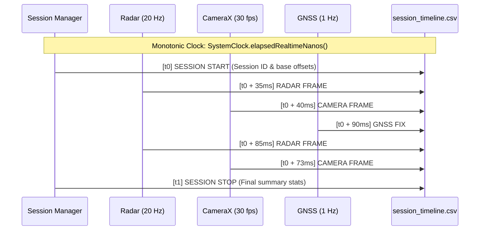

# RoadSense: Camera, GNSS & Cross-Sensor Synchronization

> **Document Name:** `03_CAMERA_GNSS_AND_CROSS_SENSOR_SYNC.md`  
> **Location:** `context/03_CAMERA_GNSS_AND_CROSS_SENSOR_SYNC.md`  
> **Audience:** Autonomous AI Coding Agents & Computer Vision Engineers  

---

## 1. Nanosecond Synchronization Architecture

Multimodal sensor alignment (Radar + Video + GNSS + CAN) requires a **strictly monotonic, high-resolution physical time base**.

### The Clock Domain Challenge:
* **Wall-Clock Time (`System.currentTimeMillis()`):** Prone to NTP adjustments, daylight savings shifts, cellular carrier time adjustments, and step discontinuities. It CANNOT be trusted for cross-sensor interpolation.
* **Android Realtime Monotonic Clock (`SystemClock.elapsedRealtimeNanos()`):** Guaranteed to be strictly monotonic, never steps backwards, ticks during system sleep, and provides nanosecond resolution.



---

## 2. Camera Pipeline & Frame Capture Index

### 2.1 CameraX Video Recording
* **Implementation:** `CameraCaptureManager.kt` using Jetpack CameraX `VideoCapture` and `Recorder`.
* **Video Encoding:** Hardware-accelerated H.264 (AVC) in MP4 container at 1080p (1920x1080) or 720p (1280x720) at 30 fps.
* **Output File:** `session_YYYYMMDD_HHMMSS/camera/camera_video.mp4`.

### 2.2 Per-Frame Monotonic Index (`camera_frames.csv`)
Because MP4 containers store presentation timestamps (PTS) relative to video start rather than absolute monotonic system clocks, RoadSense captures each frame's exact monotonic timestamp at exposure/encoding:
```csv
frameIndex,ptsUs,elapsedRealtimeNs,wallTimeMs,width,height
1,1000,128459240000000,1789105441040,1920,1080
2,34333,128459273333000,1789105441073,1920,1080
3,67666,128459306666000,1789105441106,1920,1080
```
This enables the PC Python pipeline (`tools/sync_and_process_sessions.py`) to perform exact nanosecond nearest-neighbor or linear interpolation between radar point cloud detections and MP4 video frames.

### 2.3 Viewfinder Lifecycle & Preview Continuity
1. **Default Preview Muting for Battery & GPU Savings:** Camera preview is muted by default on cold app launch to eliminate unnecessary sensor power draw and GPU fill rate when the user is only monitoring radar or CAN data.
2. **Gesture & Swipe Continuity (Glitch Elimination):**
   * *Problem:* Previously, horizontal tab or vertical card scrolling gestures triggered transient compose recompositions that tore down and re-instantiated the `TextureView`, causing the camera sensor to blink/flicker and relaunch.
   * *Solution:* Decoupled viewfinder rendering lifecycle from gesture states. Viewfinder surface remains bound to the Camera HAL session continuously while permitted and unmuted, ensuring smooth gesture navigation without preview resets.
3. **Surface Handoff Protection:** Switching between the standalone `CameraDashboardCard` and `SbsDashboardCard` destroys and recreates `TextureView` surfaces. To prevent race conditions where tearing down the old surface closes the newly attached preview surface, `CameraEngine.detachPreviewSurface(surfaceTexture)` validates that the detached texture matches `previewSurfaceTexture` before releasing HAL capture requests.

### 2.4 Focus Architecture: Hyperfocal Road Mode & Tap AF/AE Lock
1. **Hyperfocal Road Infinity Lock:**
   * Vehicle windshield rain, wiper streaks, dust, and reflections frequently trick Android's continuous autofocus (`CONTROL_AF_MODE_CONTINUOUS_VIDEO`) into hunting or focusing on the windshield glass instead of traffic ahead.
   * RoadSense introduces **Smart Infinity Focus**: Locks the lens to optical infinity (`LENS_FOCUS_DISTANCE = 0.0f`, `CONTROL_AF_MODE_OFF`).
   * **Smart Recording Interlock:** Whenever the user begins session recording (`startVideoRecording`), the camera engine automatically applies infinity lock to ensure clear long-distance telemetry throughout the drive.
2. **Interactive Tap-to-Focus & Exposure Lock:**
   * User can tap anywhere on the live viewfinder to target a specific vehicle, license plate, or shadow region.
   * Maps normalized coordinates `(normX, normY)` to Camera2 active sensor array space via sensor orientation transforms.
   * Sets a localized `MeteringRectangle` (12% sensor footprint) for both AF and AE, triggers an active focus sweep, and locks both AF and AE state machines (`CONTROL_AF_MODE_AUTO`, `CONTROL_AE_LOCK = true`).
   * Displays an interactive yellow reticle overlay with `[Reset Lock]` to revert to continuous road tracking.

### 2.5 Autonomous Dual-Zone Luminance Analysis (Dynamic Road AE)
Forward-facing vehicle cameras suffer from **Sky-Bloom**: high dynamic range daylight sky dominates the top 35% of the sensor, driving the ISP's global matrix metering to underexpose the lower road surface, vehicles, and road hazards into deep shadow.

RoadSense implements **Approach 3: Autonomous Dual-Zone Photometric Analysis**:
* **Real-Time 4 Hz Analyzer:** Samples a downsampled $32 \times 24$ thumbnail bitmap directly from the active preview `TextureView` on `Dispatchers.Default` (zero Camera HAL stream overhead; avoids HAL concurrent surface limit crashes).
* **Dual-Zone Photometric Luminance:** Computes ITU-R BT.601 perceived luminance ($Y = 0.299R + 0.587G + 0.114B$):
  $$\bar{L}_{\text{sky}} = \frac{1}{|\mathcal{Z}_{\text{sky}}|} \sum_{(x,y) \in \mathcal{Z}_{\text{sky}}} Y(x,y) \quad (\text{top } 35\%)$$
  $$\bar{L}_{\text{road}} = \frac{1}{|\mathcal{Z}_{\text{road}}|} \sum_{(x,y) \in \mathcal{Z}_{\text{road}}} Y(x,y) \quad (\text{bottom } 65\%)$$
  $$\text{Contrast Ratio } R = \frac{\bar{L}_{\text{sky}}}{\max(\bar{L}_{\text{road}}, 1.0)}$$
* **Dynamic State Transitions:**
  * **`SKY_BLOOM` ($R \ge 1.8\times$):** Restricts `CaptureRequest.CONTROL_AE_REGIONS` to the bottom 65% road zone and dynamically applies $+0.5$ to $+1.0$ EV compensation. Road surfaces and vehicle plates remain bright and clear.
  * **`BALANCED` ($0.9\times \le R < 1.8\times$):** Reverts `CONTROL_AE_REGIONS` to `null` (full matrix) and clears EV compensation (0.0 EV).
  * **`NIGHT_TUNNEL` ($R < 0.9\times$):** Sky is darker than or equal to the road. Sky rejection is disabled to prevent overexposing the dark environment and blowing out headlights/streetlights.
  * **`TAP_LOCKED`:** Manual user tap locks exposure completely, overriding autonomous Road AE until reset.
* **Rotation-Aware Active-Array Mapping:** Sensor crop rectangles are mapped via `SENSOR_ORIENTATION` and display rotation to ensure the bottom 65% of the driver's perspective is always metered regardless of portrait/landscape or sensor mounting orientation.

---

## 3. GNSS Subsystem & Track Logging

### 3.1 Dual-Source Positioning Engine
* **High-Accuracy Fused Location:** `FusedLocationProviderClient` with `PRIORITY_HIGH_ACCURACY` (GPS + GLONASS + Galileo + BeiDou + Wi-Fi/Cell RTT).
* **Raw NMEA Stream:** `OnNmeaMessageListener` capturing raw `$GNGGA`, `$GNRMC`, and `$GNVTG` sentences for post-processing carrier-phase validation.

### 3.2 GNSS Track File (`gnss_track.csv`)
Saved inside `session_YYYYMMDD_HHMMSS/gnss/gnss_track.csv`:
```csv
elapsedRealtimeNs,wallTimeMs,latitude,longitude,altitude,speedMps,bearingDeg,accuracyM
128459290000000,1789105441090,18.5204312,73.8567431,560.4,11.25,88.4,1.8
128460290000000,1789105442090,18.5204481,73.8568524,560.5,11.31,88.6,1.7
```
Speed is logged in meters per second (m/s), latitude/longitude in WGS84 decimal degrees, and altitude in meters above the WGS84 ellipsoid.
