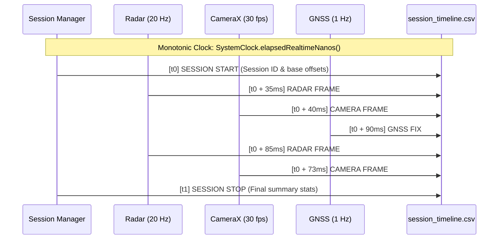

# RoadSense: Camera, GNSS & Cross-Sensor Synchronization

> **Document Name:** `03_CAMERA_GNSS_AND_CROSS_SENSOR_SYNC.md`  
> **Location:** `context/03_CAMERA_GNSS_AND_CROSS_SENSOR_SYNC.md`  
> **Audience:** Autonomous AI Coding Agents & Computer Vision Engineers  

---

## 1. Nanosecond Synchronization Architecture

Multimodal sensor alignment (Radar + Video + GNSS + CAN) requires a **strictly monotonic, high-resolution physical time base**.

### The Clock Domain Challenge:
* **Wall-Clock Time (`System.currentTimeMillis()`):** Prone to NTP adjustments, daylight savings shifts, cellular carrier time adjustments, and step discontinuities. It CANNOT be trusted for cross-sensor interpolation.
* **Android Realtime Monotonic Clock (`SystemClock.elapsedRealtimeNanos()`):** Guaranteed to be strictly monotonic, never steps backwards, ticks during system sleep, and provides nanosecond resolution.



---

## 2. Camera Pipeline & Frame Capture Index

### 2.1 CameraX Video Recording
* **Implementation:** `CameraCaptureManager.kt` using Jetpack CameraX `VideoCapture` and `Recorder`.
* **Video Encoding:** Hardware-accelerated H.264 (AVC) in MP4 container at 1080p (1920x1080) or 720p (1280x720) at 30 fps.
* **Output File:** `session_YYYYMMDD_HHMMSS/camera/camera_video.mp4`.

### 2.2 Per-Frame Monotonic Index (`camera_frames.csv`)
Because MP4 containers store presentation timestamps (PTS) relative to video start rather than absolute monotonic system clocks, RoadSense captures each frame's exact monotonic timestamp at exposure/encoding:
```csv
frameIndex,ptsUs,elapsedRealtimeNs,wallTimeMs,width,height
1,1000,128459240000000,1789105441040,1920,1080
2,34333,128459273333000,1789105441073,1920,1080
3,67666,128459306666000,1789105441106,1920,1080
```
This enables the PC Python pipeline (`tools/sync_and_process_sessions.py`) to perform exact nanosecond nearest-neighbor or linear interpolation between radar point cloud detections and MP4 video frames.

### 2.3 Camera Performance & Auto-Focus Backlog
1. **Preview Muting:** Running CameraX preview concurrently with Compose tab switches consumes significant GPU fill rate. Starting with preview closed/muted by default (with manual toggle) avoids UI lag.
2. **Windshield Reflection & Hyperfocal Lock:** Windshield rain/dust often tricks Android's continuous autofocus into focusing on the windshield glass.
   * *Solution:* Hyperfocal Road Mode (`CaptureRequest.CONTROL_AF_MODE = CONTROL_AF_MODE_OFF` with `LENS_FOCUS_DISTANCE = 0.0f`) to lock focus to infinity (>= 3m).
   * *Interactive Tap-to-Focus:* Compose touch listener using `MeteringRectangle` on `CONTROL_AF_REGIONS`.

### 2.4 Side-by-Side (SBS) Synchronized Feed & Surface Handoff
* **Dual Viewport:** The SBS tab (`SbsDashboardCard.kt`) displays the live Camera viewfinder (50% width) and real-time Radar Bird's-Eye View (50% width) simultaneously.
* **Surface Handoff Protection:** Switching between the standalone `CameraDashboardCard` and `SbsDashboardCard` destroys and recreates TextureView surfaces. To prevent race conditions where tearing down the old surface closes the newly attached preview surface, `CameraEngine.detachPreviewSurface(surfaceTexture)` validates that the detached texture matches `previewSurfaceTexture` before releasing HAL capture requests.

---

## 3. GNSS Subsystem & Track Logging

### 3.1 Dual-Source Positioning Engine
* **High-Accuracy Fused Location:** `FusedLocationProviderClient` with `PRIORITY_HIGH_ACCURACY` (GPS + GLONASS + Galileo + BeiDou + Wi-Fi/Cell RTT).
* **Raw NMEA Stream:** `OnNmeaMessageListener` capturing raw `$GNGGA`, `$GNRMC`, and `$GNVTG` sentences for post-processing carrier-phase validation.

### 3.2 GNSS Track File (`gnss_track.csv`)
Saved inside `session_YYYYMMDD_HHMMSS/gnss/gnss_track.csv`:
```csv
elapsedRealtimeNs,wallTimeMs,latitude,longitude,altitude,speedMps,bearingDeg,accuracyM
128459290000000,1789105441090,18.5204312,73.8567431,560.4,11.25,88.4,1.8
128460290000000,1789105442090,18.5204481,73.8568524,560.5,11.31,88.6,1.7
```
Speed is logged in meters per second (m/s), latitude/longitude in WGS84 decimal degrees, and altitude in meters above the WGS84 ellipsoid.
