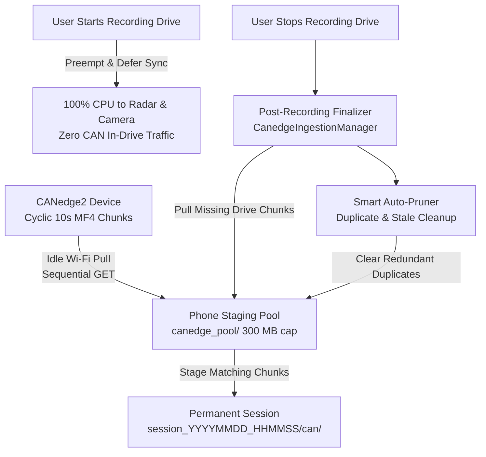

# RoadSense: CANedge2 Hardware & Autonomous Ingestion Engine

> **Document Name:** `04_CANEDGE2_AUTONOMOUS_INGESTION_ENGINE.md`  
> **Location:** `context/04_CANEDGE2_AUTONOMOUS_INGESTION_ENGINE.md`  
> **Audience:** Autonomous AI Coding Agents & Embedded Telemetry Engineers  

---

## 1. Hardware Specifications & Networking

* **Device Model:** CSS Electronics CANedge2 (2x CAN/CAN-FD logger with Wi-Fi AP/station mode).
* **Target Device ID:** `7AC5E17F`
* **Firmware Version:** `01.09.03` (Configuration version: `01.09`).
* **Wi-Fi AP Credentials:** SSID: `M21` | Pass: `987654321` (2.4 GHz WPA2).
* **Logging Mode:** Cyclic FIFO logging enabled (`"cyclic": 1`), splitting `.MF4` (MDF4) files every 1 minute (60 seconds).
* **Target Sync Scope:** 2 most recent folders on the logger (reduced from 5 folders for rapid synchronizations).
* **CAN Physical Layer:** CAN1 @ 500 kbit/s (RX mode, all standard 11-bit and extended 29-bit identifiers accepted).

---

## 2. The Single-Connection ESP32 Web Server Quirk (Bug #10)

The CANedge2 web interface runs on an embedded ESP32 microcontroller with single-threaded socket handling:
1. **No Concurrent Requests:** The device crashes, closes sockets with `EOFException`, or drops Wi-Fi if multiple HTTP GET requests hit it concurrently.
2. **Sequential Requests Only:** All downloads and directory listings MUST be queued sequentially.
3. **No HTTP DELETE:** The ESP32 API does not support `DELETE`. SD card FIFO pruning is handled automatically by firmware cyclic logging.
4. **Client Backoff Tuning:**
   * OkHttpClient configured with `readTimeout(30, TimeUnit.SECONDS)`.
   * Sequential non-blocking downloads with a 1.5-second error backoff cooldown.
   * `listRecentSessionMf4Files` uses per-folder resilience: if one folder query encounters a transient socket drop, it retries with exponential backoff rather than aborting the entire scan.

---

## 3. Autonomous Staging Pool Architecture (`canedge_pool/`)



### 3.1 Deferred In-Drive Sync (Radar & Camera Priority)
Attempting to pull multi-megabyte MF4 files over Wi-Fi while driving causes CPU contention and Wi-Fi chip thermal throttling, causing radar packet drops and camera frame skipping.
* **During Active Drive (`activeSession != null`):** All background pool sync jobs are immediately canceled/deferred.
* **Post-Recording Finalizer (`onSessionStopped`):** Once the drive completes, the finalizer launches, queries the CANedge logger for closed chunks covering the drive's time window, pulls missing chunks into `canedge_pool/`, and stages them into `session_*/can/`.

### 3.2 Physical Recording Monotonic Timestamp Calculation
Because a 1-minute (60s) MF4 chunk was recorded during the 60 seconds *preceding* its file creation time, RoadSense computes its exact physical start offset:
```kotlin
val chunkStartOffsetMs = (file.lastWrittenMs - CHUNK_DURATION_MS) - session.startTimeWallMs // CHUNK_DURATION_MS = 60_000L
val chunkMonoNs = session.startTimeMonotonicNs + (chunkStartOffsetMs.coerceAtLeast(0L) * 1_000_000L)
```
This physical monotonic timestamp is stamped into `session_timeline.csv`.

---

## 4. Exact Name-by-Name Target Scope Verification

To prevent sync status bar overflow (e.g. `120 / 88`), `poolSyncedFiles` is calculated using a strict name-by-name lookup table against planned remote files:

$$\text{verifiedSyncedCount} = \sum_{r \in \text{remoteFiles}} \left[ \text{FileExists}(r.\text{name}) \land \text{SizeMatches}(r.\text{bytes}) \right]$$

### Cross-Session Local Awareness:
A file is verified as synced on the phone if it exists **either** in `canedge_pool/` OR in any recorded session's `can/` directory. Even when duplicates are pruned from `canedge_pool/`, the system remembers that the file is safely stored on the phone!

---

## 5. Smart Auto-Pruning Engine

Implemented in `CanedgeIngestionManager.pruneStagingPool()`, running asynchronously on `Dispatchers.IO`:

### 5.1 Auto-Rescue (Zero Data Loss Guarantee)
Before deleting any file from `canedge_pool/`, the engine scans all recorded session directories (`sessions/session_*/`). If a pool chunk falls into the time window of an earlier session that hadn't finished staging its CAN data, the engine **auto-rescues** it by copying it into `session_*/can/` first.

### 5.2 Duplicate Removal
Once a chunk has been copied into a session folder, the duplicate copy in `canedge_pool/` is deleted. This immediately eliminates duplicate disk usage.

### 5.3 Out-of-Scope & Stale Purging
Chunks that accumulated from drives where RoadSense was not recording, or from folders outside the 2 most recent folders on CANedge, are purged. If offline, files older than 48 hours not belonging to any session are deleted.

### 5.4 300 MB FIFO Storage Cap
If total pool size exceeds `MAX_POOL_SIZE_BYTES` (300 MB), the oldest pool files (by `lastModified`) are pruned in FIFO order, strictly protecting active session chunks.

### 5.5 Auto-Pruning Triggers:
1. **App Boot:** In `CanedgeIngestionManager.init`.
2. **Drive Session Stop:** In the `finally` block of `onSessionStopped`.
3. **Idle Sync Completion:** In the `finally` block of `performPoolSync`.
4. **Manual Button Click:** On "Prune Pool" tap in the unified file explorer.

---

## 6. De-Cluttered 3-Column Unified File Explorer Dialog

The file explorer modal (`CanedgeUnifiedFileExplorerDialog`) presents an uncluttered, modern tree view grouped into collapsible folders (e.g. `00000047/`), replacing bulky text badges with **3 dedicated indicator columns** beside each file:

```text
FOLDER: 00000047/ (3 files • 4.2 MB)                     [CAN] [DEV] [SES]
  ├── 00000047_00000001.MF4 (1.4 MB)                      ●     ●     ●
  ├── 00000047_00000002.MF4 (1.4 MB)                      ●     ●     ○
  └── 00000047_00000003.MF4 (1.4 MB)                      ●     ○     ○
```

### 6.1 Column Indicators
| Column | Header | Icon Component | Active Meaning | Dimmed Meaning (`alpha = 0.2f`) |
|---|---|---|---|---|
| **Col 1** | `CAN` | `Icons.Default.SdStorage` | File physically present on remote CANedge SD card | Not on remote SD card |
| **Col 2** | `DEV` | `Icons.Default.PhoneAndroid` (or spinner) | File cached locally on phone (in `canedge_pool/` or `session_*/can/`) | Not downloaded to phone |
| **Col 3** | `SES` | `Icons.Default.CheckCircle` (Green `#4CAF50`) | File staged & attached to a recorded drive session folder | Unattached to any session |

### 6.2 Top Explanatory Legend
A compact top bar directly explains the 3 columns:
* **CAN**: On Logger SD
* **DEV**: Copied to Phone
* **SES**: Attached to Session

---

## 7. Real-Time Transfer Telemetry & Landscape Cockpit Layout

### 7.1 Real-Time Transfer Telemetry Engine
`CanedgeSyncStats` continuously streams transfer telemetry during staging or idle pool synchronization:
* **`activeFileName`:** Specific MF4 file actively being fetched (e.g. `00000045_00000002.MF4`).
* **`activeFileProgress`:** Real-time completion fraction ($0.0 \rightarrow 1.0$) tied to `LinearProgressIndicator`.
* **`transferSpeedBytesPerSec` / `formattedSpeed`:** Live throughput calculated dynamically (`elapsedMs = SystemClock.elapsedRealtime() - startDownloadMs`), cleanly formatted as `KB/s` or `MB/s`.
* **`formattedTransferSize`:** Exact payload progress (e.g. `1.7 / 2.8 MB`).
* **`etaSeconds`:** Dynamic estimated time to completion remaining.

### 7.2 Adaptive Dual-Pane Landscape Cockpit
When the device is mounted in landscape orientation (`Configuration.ORIENTATION_LANDSCAPE`):
* **Left Pane (Hardware & Controls):** Hardware connection status, AP credentials, Device ID/IP, action controls (Discover/Disconnect, Sync Scope, File Explorer, Prune Pool), and diagnostic telemetry.
* **Right Pane (Live Operations Console):** `CanedgeLiveTransferCard` with active chunk name, progress bar, live speed, bytes transferred, and ETA, alongside the three cockpit metric cards (`TARGET SCOPE`, `SYNC STATUS`, `THIS SESSION`).
