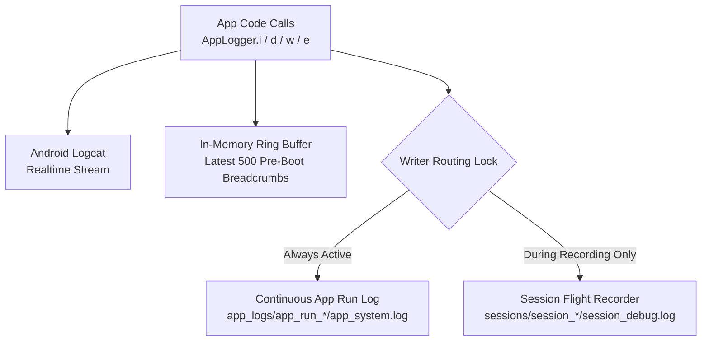

# RoadSense: Diagnostics & Black-Box Flight Recorder

> **Document Name:** `05_FLIGHT_RECORDER_AND_DIAGNOSTICS.md`  
> **Location:** `context/05_FLIGHT_RECORDER_AND_DIAGNOSTICS.md`  
> **Audience:** Autonomous AI Coding Agents & Embedded Diagnostics Engineers  

---

## 1. Flight Recorder Architecture Overview

Automotive field testing involves intermittent hardware disconnections, Wi-Fi timeouts, thermal throttling, and sensor resets. Without comprehensive logging, idle and intermittent bugs are impossible to diagnose.

RoadSense implements a **Dual-Stream Black-Box Flight Recorder** (`AppLogger.kt`):



---

## 2. Dual-Stream Logging Layers

### Layer 1: Continuous App-Wide Diagnostics (`app_logs/`)
* **Initialization:** `AppLogger.initAppLogging(applicationContext)` is invoked in `MainActivity.onCreate()`.
* **Path:** `/sdcard/Android/data/com.bajajauto.roadsense/files/app_logs/app_run_YYYYMMDD_HHMMSS/app_system.log`.
* **Lifecycle:** Active from application launch until `MainActivity.onDestroy()`.
* **Scope:** Captures idle CANedge Wi-Fi discovery, HTTP downloads, pool pruning, Radar USB connection handshakes, Camera preview lifecycle, and unhandled exceptions.
* **Auto-Retention:** Automatically purges `app_run_*` folders older than 5 days or exceeding 10 total directories.

### Layer 2: Active Session Diagnostics (`session_debug.log`)
* **Attachment:** `AppLogger.attachSession(sessionDir)` is called by `SessionManager.createSession()`.
* **Path:** `session_YYYYMMDD_HHMMSS/session_debug.log`.
* **Breadcrumbs Flush:** Dumps all pre-session ring-buffer breadcrumbs (events leading up to the "Record" button press), then streams all in-drive events in real time.
* **Detachment:** `AppLogger.detachSession()` flushes remaining buffers and closes the writer upon session completion.

---

## 3. Log Formatting & Real-Time Flush Guarantee

Every log entry is formatted with millisecond precision, log severity, component tag, and thread name:
```text
[2026-09-11 11:14:01.125] [INFO ] [CanedgeIngestion] (DefaultDispatcher-worker-1) Identified 3 CAN chunks belonging to session session_20260911_111401
[2026-09-11 11:14:02.450] [DEBUG] [RadarSerialService] (RadarSerialThread) Read 1284 bytes from FTDI ring buffer. Frame #214 parsed.
[2026-09-11 11:14:03.010] [WARN ] [CanedgeHttpClient] (OkHttp Dispatcher) Socket timeout on /00000041/00000052.MF4. Backing off 1.5s...
```

### Crash-Resilient Flush:
To guarantee that logs survive sudden process kills, Android OS low-memory terminations, or kernel panics, every line written to `appLogWriter` and `activeWriter` is explicitly followed by `writer.flush()`.

---

## 4. Diagnostic Run Header Format

Each `app_system.log` begins with an authoritative system telemetry header:
```text
===========================================================================
RoadSense Continuous Diagnostics Flight Recorder
App Run: app_run_20260911_122908
Started At: 2026-09-11 12:29:08.512
Package: com.bajajauto.roadsense
Device: samsung SM-M215F (Android 11, API 30)
Log File: /storage/emulated/0/Android/data/com.bajajauto.roadsense/files/app_logs/app_run_20260911_122908/app_system.log
===========================================================================
```

---

## 5. PC ADB Extraction of Flight Recorder Logs

Continuous app logs are automatically pulled alongside recording sessions when using the PC toolchain:
```powershell
# Sync both sessions and continuous diagnostics logs to PC
python tools/sync_and_process_sessions.py --sync-only

# Destination on PC:
# logs/app_logs/app_run_YYYYMMDD_HHMMSS/app_system.log
```
