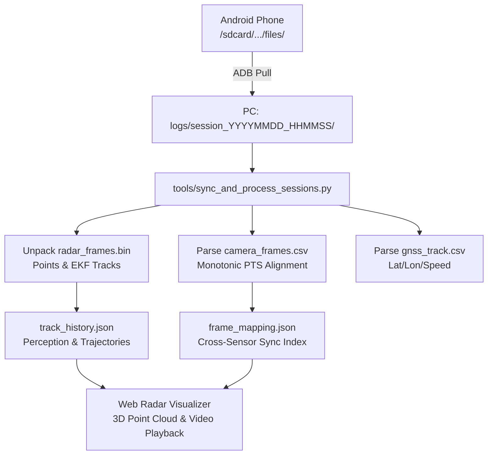

# RoadSense: PC Tooling & Web Visualizer Pipeline

> **Document Name:** `06_PC_TOOLING_AND_VISUALIZER_PIPELINE.md`  
> **Location:** `context/06_PC_TOOLING_AND_VISUALIZER_PIPELINE.md`  
> **Audience:** Autonomous AI Coding Agents, Data Scientists & Visualizer Developers  

---

## 1. Toolchain Overview

The RoadSense PC Toolchain automates:
1. **ADB Device Sync:** Extracting recording sessions and continuous diagnostics logs from the connected phone over USB.
2. **Binary Frame Parsing:** Unpacking raw `radar_frames.bin` (ROAD magic headers + TI mmWave TLVs).
3. **Cross-Sensor Alignment:** Mapping radar frames to video frames via monotonic nanosecond timestamps.
4. **Visualizer Serialization:** Emitting standardized JSON files (`track_history.json`, `frame_mapping.json`) consumed by the web radar visualizer.



---

## 2. Command-Line Usage

The pipeline can be executed via the master batch script or directly using Python 3:

### Master Batch Script:
```cmd
sync_and_process_logs.bat
```

### Direct Python Commands:
```powershell
# Full Automated Sync & Process (All sessions)
python tools/sync_and_process_sessions.py

# Sync only (pull without re-processing)
python tools/sync_and_process_sessions.py --sync-only

# Process only (re-process already synced sessions)
python tools/sync_and_process_sessions.py --process-only

# Process a specific session directory
python tools/sync_and_process_sessions.py --session session_20260911_111401
```

---

## 3. Output Artifacts & JSON Schemas

### 3.1 `track_history.json`
Contains synchronized radar perception data per frame:
```json
{
  "sessionId": "session_20260911_111401",
  "fps": 20.0,
  "totalFrames": 2140,
  "frames": [
    {
      "frameId": 1,
      "timestampNs": 128459235000000,
      "wallTimeMs": 1789105441035,
      "pointCloud": [
        {"x": 2.45, "y": 12.80, "z": 0.15, "doppler": -1.2, "snr": 18.5}
      ],
      "tracks": [
        {
          "trackId": 3,
          "posX": 2.41,
          "posY": 12.75,
          "posZ": 0.12,
          "velX": -0.1,
          "velY": -1.25,
          "accX": 0.0,
          "accY": 0.0,
          "history": [
            {"x": 2.43, "y": 12.85},
            {"x": 2.41, "y": 12.75}
          ]
        }
      ]
    }
  ]
}
```

### 3.2 `frame_mapping.json`
Maps every radar frame index to its closest corresponding camera video frame index:
```json
{
  "mapping": [
    {
      "radarFrameId": 1,
      "radarTimestampNs": 128459235000000,
      "videoFrameId": 1,
      "videoTimestampNs": 128459240000000,
      "syncDeltaMs": 5.0
    }
  ]
}
```
If `syncDeltaMs` is positive, the camera frame occurred slightly after the radar frame. The visualizer uses this delta to smoothly interpolate track overlays onto the video player.

---

## 4. Standalone Multi-Sensor Diagnostic & Validation Suite (`scripts/`)

Located in the root `scripts/` folder (with comprehensive documentation in `scripts/README.md`), this suite of 7 standalone Python tools enables rapid post-session triage without launching full visualizer pipelines:

| Script | Purpose | Key Checks / Metrics |
|---|---|---|
| `session_health_check.py` | **Master Triage** | Validates presence, non-zero size, and integrity across all 4 sensor directories (`radar/`, `camera/`, `gnss/`, `can/`) |
| `validate_radar_stream.py` | **Radar Verification** | Validates TI mmWave magic word (`0x0201040306050807`), decodes TLVs, verifies point counts & FPS |
| `validate_camera_video.py` | **Camera Verification** | Validates MP4 video stream readability, resolution, frame rate, duration, and monotonic PTS alignment |
| `validate_gnss_fixes.py` | **GNSS Verification** | Verifies NMEA/CSV latitude, longitude, fix accuracy (HDOP), speed (m/s), and satellite lock count |
| `validate_canedge_staging.py`| **CANedge Verification** | Inspects MF4 (MDF4) chunks in `can/`, verifies physical recording timestamps vs session timeline |
| `audit_cross_sensor_sync.py`| **Sync Drift Audit** | Parses `session_timeline.csv`, computes cross-sensor latency deltas and inter-sensor time drift |
| `search_flight_recorder.py` | **Flight Recorder Search** | Regex search across `app_system.log` and `session_debug.log` for errors, warnings, drops, and reconnects |

### Quick Invocation Example:
```powershell
# Run all health checks on a session
python scripts/session_health_check.py logs/session_20260911_141256

# Audit cross-sensor time synchronization
python scripts/audit_cross_sensor_sync.py logs/session_20260911_141256
```
