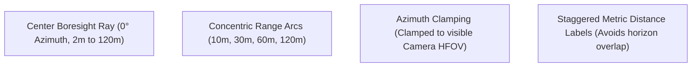

# RoadSense: Radar-Camera Spatial Calibration & Multimodal Fusion

> **Document Name:** `08_RADAR_CAMERA_SPATIAL_CALIBRATION_AND_FUSION.md`  
> **Location:** `context/08_RADAR_CAMERA_SPATIAL_CALIBRATION_AND_FUSION.md`  
> **Audience:** Autonomous AI Coding Agents, Perception Engineers & ADAS Researchers  
> **Last Updated:** September 22, 2026  

---

## 1. Overview & Problem Formulation

In a multimodal automotive sensing suite, the Texas Instruments **AWR1843 mmWave radar** and the forward-facing **Android smartphone camera** operate in completely different coordinate systems:

1. **Radar Sensor Reference Frame (Vehicle ISO):**
   * $+X_r$: Lateral right across vehicle bumper (meters)
   * $+Y_r$: Longitudinal forward along road direction (meters)
   * $+Z_r$: Vertical upward from radar antenna center (meters)
   * Target coordinates: $\mathbf{P}_r = [X_r, Y_r, Z_r]^T$
2. **Camera Optical Reference Frame:**
   * $+X_c$: Right across camera sensor (meters)
   * $+Y_c$: Downward toward the ground (meters)
   * $+Z_c$: Forward along camera optical axis (meters)
   * Target coordinates: $\mathbf{P}_c = [X_c, Y_c, Z_c]^T$

Because the phone is mounted on the windshield behind and above the bumper radar, with arbitrary pitch (downward tilt), yaw (heading deviation), and roll (windshield mount tilt), projecting radar detections onto the camera viewfinder requires **accurate extrinsic rigid calibration ($[\mathbf{R} \mid \mathbf{T}]$)** and **intrinsic camera projection ($K$)**.

---

## 2. Mathematical Foundation

```mermaid
graph LR
    Pr["Radar Target P_r<br>(X_r, Y_r, Z_r)"] -->|Rigid Extrinsics [R | T]| Pc["Camera Space P_c<br>(X_c, Y_c, Z_c)"]
    Pc -->|Pinhole Matrix K| Pix["Screen Pixels<br>(u, v)"]
```

### 2.1 6-DOF Extrinsic Rigid Transformation
The physical displacement between radar and camera is parameterized by 6 degrees of freedom:
* **Translation Vector $\mathbf{T}$:**
  * $\Delta X$: Lateral mount offset (typically $0.0\,\text{m}$ for centered mounts).
  * $\Delta Y$: Longitudinal setback from front bumper to windshield mount (typically $1.6\,\text{m}$ to $2.0\,\text{m}$).
  * $\Delta Z$: Height offset from radar bumper level to phone camera lens (typically $0.5\,\text{m}$ to $0.8\,\text{m}$).
* **Rotation Matrix $\mathbf{R}$:**
  Composed of Tait-Bryan rotations for pitch $\theta$, yaw $\psi$, and roll $\phi$:
  $$\mathbf{R} = \mathbf{R}_z(\phi) \cdot \mathbf{R}_x(\theta) \cdot \mathbf{R}_y(\psi)$$
* **Coordinate Conversion (ISO to Optical):**
  Accounting for the 90° optical axis alignment (forward is $+Y_r$ in radar, but $+Z_c$ in camera):
  $$X_c = X_r - \Delta X$$
  $$Y_c = -(Z_r - \Delta Z)$$
  $$Z_c = Y_r + \Delta Y$$

### 2.2 Pinhole Camera Intrinsics ($K$)
Retrieved dynamically at runtime via Android Camera2 `CameraCharacteristics`:
* **Focal Lengths:** $f_x, f_y$ in pixels, extracted from `LENS_INTRINSIC_CALIBRATION` or calculated from sensor active array size and horizontal field of view ($\text{HFOV}$):
  $$f_x = \frac{W_{\text{pixels}}}{2 \cdot \tan(\text{HFOV} / 2)}, \quad f_y = f_x$$
* **Principal Point:** Optical center $c_x = W / 2$, $c_y = H / 2$.
* **Screen Projection:**
  $$u = f_x \frac{X_c}{Z_c} + c_x, \quad v = f_y \frac{Y_c}{Z_c} + c_y$$

---

## 3. Interactive Reverse Touch Solver (Drag-to-Snap)

Traditional checkerboard and laser target calibration cannot be performed on roadside test drives. RoadSense implements an **interactive closed-form touch reverse solver**:

### 3.1 Closed-Form Angle Inversion
Given a physical target (e.g. the rear bumper of a parked vehicle at known radar distance $Y_r$) and the user's touch location $(u, v)$ on the viewfinder, the solver analytically computes the exact camera **Pitch ($\theta$)** and **Yaw ($\psi$)** in a single pass ($O(1)$ time, zero iterative non-linear optimization):

1. Unproject pixel coordinates to normalized ray slopes:
   $$x_n = \frac{u - c_x}{f_x}, \quad y_n = \frac{v - c_y}{f_y}$$
2. Reconstruct 3D camera vector given longitudinal distance $Z_c = Y_r + \Delta Y$:
   $$X_c = x_n \cdot Z_c, \quad Y_c = y_n \cdot Z_c$$
3. Recover angular offsets relative to ideal boresight:
   $$\theta = -\arctan\left(\frac{Y_c - \Delta Z}{Z_c}\right) \times \frac{180^\circ}{\pi}$$
   $$\psi = \arctan\left(\frac{X_c}{Z_c}\right) \times \frac{180^\circ}{\pi}$$

### 3.2 Trackpad Delta Drag Mode
To prevent the user's finger from visually occluding the target vehicle or reticle on screen, `RadarViewModel.applyCalibrationDelta(deltaXPx, deltaYPx)` translates touch gestures into relative incremental nudges, allowing precise sub-pixel alignment from anywhere on the screen canvas.

---

## 4. Calibration Studio HUD & Nudge Controls

### 4.1 UI Components
* **`FullscreenCalibrationStudio.kt`:** Dedicated edge-to-edge calibration workbench displaying the camera feed, synthetic target calipers, real-time horizon line, and ground ladder rungs.
* **`CameraCalibrationCard.kt`:** Expandable configuration card in the Camera dashboard tab providing numeric pitch/yaw/roll sliders, distance dials, and profile resets.
* **`QuickNudgeBar.kt`:** Floating translucent bottom toolbar with $\pm 0.1^\circ$ and $\pm 0.5^\circ$ micro-step nudge buttons, revert, and persistent save actions.

### 4.2 Profile Persistence
Calibration state is serialized by `CalibrationStorageManager.kt` to:
`/sdcard/Android/data/com.bajajauto.roadsense/files/calibration/radar_camera_calib.json`
```json
{
  "profileName": "Default Mount",
  "setbackM": 1.8,
  "heightOffsetM": 0.6,
  "lateralOffsetM": 0.0,
  "targetDistanceM": 10.0,
  "targetWidthM": 1.4,
  "targetHeightM": 0.5,
  "radarHeightM": 0.95,
  "pitchDeg": -3.2,
  "yawDeg": 0.4,
  "rollDeg": 0.0,
  "lastCalibratedTimestampMs": 1789981200000
}
```

---

## 5. Perspective Radar Range Rings & Boresight Overlay

To provide intuitive spatial depth cues across the road without visual clutter, `SpatialProjectionEngine.calculateRadarRangeOverlay()` generates:



1. **Ground-Anchored Concentric Arcs:**
   Curves evaluated at radial distance $R \in \{10, 30, 60, 120\}\,\text{m}$ on the road surface ($Z_{\text{road}} = -H_{\text{radar}}$).
2. **Azimuth Clamping:**
   Angles are clamped to the camera's visible horizontal field of view ($\approx \pm 28^\circ$) to prevent arcs from curving unrealistically or plunging vertically off the screen bottom.
3. **Staggered Metric Labels:**
   Label anchor azimuths are staggered (e.g. $10\text{m} \to +6^\circ$, $30\text{m} \to +14^\circ$, $60\text{m} \to -10^\circ$, $120\text{m} \to -18^\circ$) so distance text never overlaps vertically near the vanishing line.

---

## 6. Hybrid Radar Lollipop & Ground Plane Footprint Visualization

Overlaying raw 2D radar points on a 2D camera feed introduces severe **depth ambiguity**, **distance compression ($1/Y$)**, and **occlusion reversal** (distant radar points appear to float on top of foreground cars). RoadSense solves this via an RViz-inspired **Hybrid Lollipop & Ground Footprint** system:

```text
       [  ID: #1 • 14m  ]        <-- Floating Track ID & Metric Range Badge
             ( O )                <-- Specular Core & Outer Halo Centroid (Z_head)
               |
               |                  <-- Vertical Perspective Stem (drawLine)
               |
             / - \                <-- Ground Ellipse Footprint on Asphalt (Z_road)
            (  .  )               <-- Ground Contact Anchor Dot
```

### 6.1 Three-Part Architectural Elements
1. **Ground Contact Footprint (`calculateGroundFootprintEllipse`):**
   * Generates a 12-segment closed polygon flat on the road surface ($Z_{\text{road}} = -H_{\text{radar}}$).
   * In camera perspective, the horizontal circle naturally foreshortens into an ellipse resting flat on the asphalt.
   * Rendered with translucent asphalt fill ($\alpha \times 0.25$) and glowing perimeter stroke.
2. **Vertical Perspective Stem:**
   * Projecting both road contact $(X, Y, Z_{\text{road}})$ and vehicle centroid $(X, Y, Z_{\text{head}})$ through the camera matrix automatically captures camera pitch, roll, and perspective tilt.
   * Rendered using `drawLine` with rounded stroke caps (`StrokeCap.Round`).
3. **Lollipop Head with Glowing Halo:**
   * Outer halo glow + solid core circle + white specular dot for tracked vehicles.
   * Radius scales with inverse distance: $(15.0 / \text{depthM})$.

### 6.2 Track-Point Association Gating
Raw radar points (TLV Type 1) within $1.8\,\text{m}$ of an active hardware track (TLV Type 3) are associated with that obstacle, enabling cohesive cluster rendering and clutter suppression.

### 6.3 Painter's Algorithm Depth-Sorting
To eliminate occlusion inversion, all projected lollipops are sorted strictly descending by forward depth:
```kotlin
lollipops.sortByDescending { it.depthM }
```
Distant targets ($100\,\text{m}$) are drawn first, and nearer vehicles ($10\,\text{m}$) are drawn on top, guaranteeing natural visual occlusion.

### 6.4 Distance-Based Alpha Fall-Off
To prevent distant clusters from dominating the visual field near the horizon, transparency decays smoothly with depth:
$$\alpha = \text{clamp}\left(1.0 - \frac{Y}{100\,\text{m}} \times 0.65, 0.20, 0.95\right)$$

### 6.5 Doppler Velocity Color Palette
* **Closing in / Hazard ($V_{\text{doppler}} < -0.5\,\text{m/s}$):** Vivid Red (`#FFFF5252`)
* **Opening gap ($V_{\text{doppler}} > +0.5\,\text{m/s}$):** Bright Green (`#FF69F0AE`)
* **Tracked Obstacle ($|V_{\text{doppler}}| \le 0.5\,\text{m/s}$):** High-Visibility Amber (`#FFFFD54F`)
* **Stationary Point / Clutter:** Crisp Cyan (`#FF40C4FF`)

---

## 7. Automated Unit Verification Suite

The spatial calibration and projection pipeline is continuously verified by `app/src/test/java/com/bajajauto/roadsense/fusion/SpatialProjectionEngineTest.kt`:

| Test Case | Invariant Verified |
|---|---|
| `testForwardProjectionAtZeroAngles` | Boresight target at 10m projects exactly to optical center $(c_x, c_y)$. |
| `testInverseSolverRecoversAngles` | Touch solver recovers known ground-truth pitch and yaw angles to within $0.1^\circ$. |
| `testNudgeBehavior` | Micro-nudges alter effective angles strictly monotonically. |
| `testGroundLadderRungPerspective` | Lower ladder rungs (nearer) have larger screen pixel widths than distant rungs ($1/Y$). |
| `testCalculateRadarRangeOverlayGeneratesValidArcs` | Range arcs strictly follow monotonic vertical screen ordering ($y_{10\text{m}} > y_{30\text{m}} > y_{60\text{m}} > y_{120\text{m}}$). |
| `testCalculateGroundFootprintProducesConvexPolygon` | Road ellipse produces valid 12-segment closed polygon on screen canvas. |
| `testLollipopBaseIsStrictlyLowerOnScreenThanHead` | Road contact base $v_{\text{base}} > v_{\text{head}}$ (base is lower on screen). |
| `testLollipopDepthSortingIsMonotonicDescending` | Painter's ordering sorts targets from maximum depth to minimum depth. |
