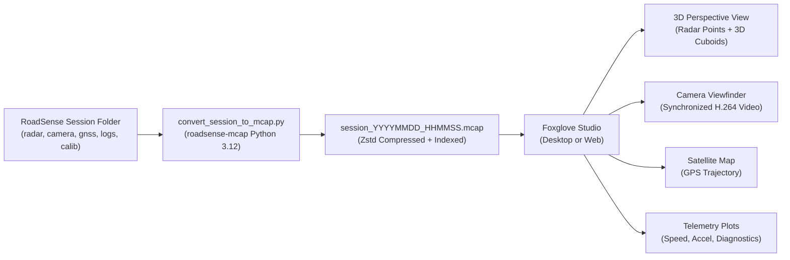

# RoadSense MCAP Conversion & Foxglove Studio Operational Guide

> **Document Name:** `MCAP_CONVERSION_AND_FOXGLOVE_GUIDE.md`  
> **Status:** Active Reference & User Guide  
> **Target Audience:** ADAS Engineers, Data Scientists, Autonomous Vehicle Researchers  
> **Updated:** September 22, 2026  

---

## 1. Overview

RoadSense provides native, end-to-end support for compiling multimodal recording sessions into **Foxglove MCAP (`.mcap`)** container files. 

MCAP is the modern, high-performance container standard for robotics and automotive data logging. Instead of managing separate directories with binary UART streams, MP4 videos, CSV timetables, and CAN files, a single `.mcap` container bundles every sensor modality with nanosecond synchronization, Zstandard chunk compression, and random-access seeking.



---

## 2. Quick-Start: 1-Click Conversion

### Method A: Interactive Windows Batch Script (Recommended)
Double-click `sync_and_process_logs.bat` in the project root:
```text
===============================================================================
         RoadSense - Log Sync, Visualizer & Foxglove MCAP Pipeline
===============================================================================
Python Interpreter: C:\Users\rakadu1.AHEAD\.conda\envs\roadsense-mcap\python.exe

Select an operation:

  [1] Full Pipeline: Sync from Device (ADB) and Process New Sessions
  [2] Sync Only: Pull sessions from Device without processing
  [3] Process Only: Process un-processed local sessions (skips up-to-date)
  [4] Force Re-process All: Re-generate all local session visualizer files
  [5] Process Specific Session: Choose a specific session to process
  [6] Export to Foxglove MCAP: Convert sessions into .mcap container
  [7] Exit
```
* Select **`[6]`** to export a specific session or press **ENTER** to batch-convert all sessions.
* The script automatically detects and activates the dedicated `roadsense-mcap` (Python 3.12) environment.

### Method B: Standalone Python CLI
Activate the conda environment and run the converter directly:
```powershell
conda activate roadsense-mcap

# Fast conversion with default layout rotation (1.9s, recommended)
python tools/convert_session_to_mcap.py logs/session_20260922_120145

# Physical 180° video flip (re-encodes video bitstream upright for external players)
python tools/convert_session_to_mcap.py logs/session_20260922_120145 --flip-video

# Ultra-compact conversion (radar, GPS, and telemetry only, excludes video)
python tools/convert_session_to_mcap.py logs/session_20260922_120145 --no-video
```

---

## 3. Opening and Visualizing in Foxglove Studio

### Step 1: Open Foxglove Studio
* **Desktop App:** Launch **Foxglove Studio** on Windows/Linux/macOS.
* **Web App:** Open [https://app.foxglove.dev/](https://app.foxglove.dev/) in Google Chrome or Microsoft Edge.

### Step 2: Load MCAP File
* Click **"Open local file"** or simply **drag and drop** the generated `session_YYYYMMDD_HHMMSS.mcap` directly into the window.

### Step 3: Import the Pre-Configured Cockpit Layout
RoadSense includes an optimized dashboard layout preset:
1. In Foxglove Studio, click the **Layout** menu (top menu bar) $\rightarrow$ **Import from file...**
2. Select:
   ```text
   tools/foxglove_layouts/RoadSense_Cockpit_Layout.json
   ```
3. Your screen will instantly configure into the **RoadSense Cockpit**:
   * **Top-Left (3D View):** 3D radar point clouds colored by Doppler velocity, 3D tracking cuboids with forward velocity vectors, and vehicle coordinate axes.
   * **Top-Right (Camera View):** Synchronized 720p HD video.
   * **Bottom-Left (Satellite Map):** Vehicle location tracked on real-world satellite imagery.
   * **Bottom-Right (Plots & Logs):** Vehicle speed, radar diagnostics, and flight recorder logs.

---

## 4. Channel Dictionary & Protobuf Schemas

| Topic | Schema Name | Encoding | Description |
|---|---|---|---|
| `/radar/points` | `foxglove.PointCloud` | `protobuf` | 3D point cloud (`x`, `y`, `z`, `velocity`, `snr`) in `radar_link`. |
| `/radar/tracks` | `foxglove.SceneUpdate` | `protobuf` | 3D oriented obstacle bounding boxes, velocity arrows, and labels. |
| `/camera/video` | `foxglove.CompressedVideo` | `protobuf` | H.264 Annex B bitstream packets synchronized to shutter nanoseconds. |
| `/camera/calib` | `foxglove.CameraCalibration` | `protobuf` | 720p pinhole intrinsics ($K$), distortion ($D$), and projection ($P$). |
| `/gnss/fix` | `foxglove.LocationFix` | `protobuf` | Latitude, longitude, altitude, GPS speed, and heading. |
| `/tf` | `foxglove.FrameTransforms` | `protobuf` | 6-DOF extrinsics (`base_link` $\rightarrow$ `radar_link` and `camera_optical`). |
| `/diagnostics/logs` | `foxglove.Log` | `protobuf` | Color-coded session logs from `session_debug.log`. |
| `/vehicle/telemetry` | `roadsense.VehicleTelemetry` | `jsonschema` | Speed, yaw rate, pitch rate, and longitudinal/lateral accelerations. |
| `/radar/diagnostics` | `roadsense.RadarDiagnostics` | `jsonschema` | Inliers count, RANSAC status, ego velocity, and road boundaries. |

---

## 5. Embedded Attachments
The MCAP file also embeds critical configuration and metadata files as native attachments:
* **`session_metadata.json`**: Device hardware info, sensor baud rates, session duration, and frame counts.
* **`radar_camera_calib.json`**: Physical vehicle mounting parameters (pitch tilt, yaw heading, radar height, setback).
