# RoadSense Automotive Perception Platform — Executive & Business Overview

> **Document Classification:** Autonomous Vehicle Research & Engineering Systems  
> **Target Audience:** Executive Leadership, Vice Presidents of R&D, Chief Engineers, Technical Directors  
> **Core Focus:** Genesis & Need-Based Rationale, Business ROI, Industry Benchmarking, Embedded Innovations & ADAS Roadmap  
> **Status:** Production Executive Reference  

---

## 1. Executive Summary & Genesis: A Need-Based Engineering Invention

### 1.1 The Operational Bottleneck in Field Testing
The development of Advanced Driver Assistance Systems (ADAS) for modern vehicles—and particularly **motorcycles and light commercial vehicles**—demands massive quantities of high-fidelity, time-synchronized multi-sensor data: 77 GHz mmWave radar point clouds, high-definition road imagery, 6-DOF inertial vehicle dynamics, GNSS telemetry, and vehicle CAN bus signals.

Prior to RoadSense, our on-road test instrumentation relied on an ad-hoc, stopgap paradigm: **a field laptop running custom Python scripts connected to sensors via external USB hubs and breakout cables**. 

During rigorous real-world test track rides, this laptop-based approach hit a severe operational wall:
* **The 30-Minute Endurance Wall:** Under the simultaneous load of USB polling, video capture, and high-frequency coordinate math, laptop batteries depleted within **20 to 30 minutes**. Test riders were forced to constantly abort test rides, return to base, and recharge equipment, crippling daily test throughput.
* **Ergonomic & Severe Rider Safety Hazards:** In motorcycle testing, there is no passenger seat. Carrying a running, heat-generating laptop in a rider's backpack or strapping it to a motorcycle tank bag introduced severe physical safety risks, rider fatigue, and cable entanglement hazards.
* **Vibration-Induced Disconnects & Data Loss:** High-vibration vehicular environments caused intermittent USB port disconnections. A single loose cable silently corrupted or crashed the Python script mid-run, discarding hours of track time.
* **Thermal Throttling & Non-Deterministic Latency:** Operating laptops under direct sunlight on hot asphalt caused aggressive CPU thermal throttling. The Python Global Interpreter Lock (GIL) and non-real-time OS thread scheduling introduced random multi-millisecond jitter, destroying timestamp correspondence across sensors.

```
┌────────────────────────────────────────────────────────────────────────────────────────┐
│                                 THE LEGACY CRISIS                                      │
│                                                                                        │
│   Laptop + Python Script         ❌ 20-30 min battery limit (aborted test runs)         │
│   in Backpack / Tank Bag         ❌ Severe safety hazard & physical rider fatigue      │
│                                  ❌ High-vibration USB dropouts & corrupted dumps       │
│                                  ❌ Thermal throttling & non-deterministic OS jitter   │
└───────────────────────────────────────────┬────────────────────────────────────────────┘
                                            │
                                  NEED-BASED INVENTION
                                            │
                                            ▼
┌────────────────────────────────────────────────────────────────────────────────────────┐
│                              ROADSENSE EDGE PLATFORM                                   │
│                                                                                        │
│   Palm-Sized Automotive          ✅ Multi-hour continuous endurance on internal battery │
│   Perception Edge Host           ✅ Zero cables to rider; rigid cockpit bar mount       │
│                                  ✅ 3.125 Mbps zero-drop hardware-buffered ingestion    │
│                                  ✅ Nanosecond-accurate deterministic monotonic sync    │
│                                  ✅ Autonomous Wi-Fi vehicle CAN bus staging            │
└────────────────────────────────────────────────────────────────────────────────────────┘
```

### 1.2 The RoadSense Breakthrough
RoadSense was born not as a generic mobile application, but as a **purpose-built, edge-compute automotive data acquisition platform**. By leveraging the integrated high-speed compute, native hardware video encoders, direct memory subsystems, and physical bus controllers of modern mobile silicon, RoadSense consolidates the entire multi-sensor acquisition stack into an ultra-compact, handlebar-mountable unit that delivers continuous, multi-hour logging with one-touch operation.

---

## 2. Business Value, Cost Benchmarks & Fleet Scalability

### 2.1 The Industry Benchmark: Vector & Intrepid Solutions
In the automotive Tier-1 and OEM ecosystem, the standard method for multi-bus vehicle logging involves dedicated commercial data acquisition systems from vendors such as **Vector Informatik** (e.g., VN1630A, CANoe.LOG, GL series loggers) or **Intrepid Control Systems** (e.g., neoVI FIRE 2, RAD-Galaxy):

| Dimension | Industry Commercial DAQs (Vector / Intrepid) | Legacy Laptop + Python Setup | RoadSense Automotive Edge Platform |
| :--- | :--- | :--- | :--- |
| **Hardware Capex per Rig** | **₹15,00,000 – ₹20,00,000+** ($18,000 – $25,000+) | ₹80,000 – ₹1,20,000 ($1,000 – $1,500) | **~₹40,000 – ₹60,000** ($500 – $750) |
| **Recurring Software Licenses** | Annual seat licenses (₹2L–₹5L/year for CANoe/Vehicle Spy) | Open-source libraries (unstable) | **Zero recurring license fees** (in-house IP) |
| **Integrated Camera Optics** | Requires external industrial GigE/USB3 cameras + frame grabbers | Low-res external webcam (unsynchronized) | **Integrated 1080p60 optics** with custom Road Auto-Exposure |
| **Spatial Calibration Engine** | None (requires offline CAD / laser alignment rigs) | None (manual post-processing scripts) | **Built-in 6-DOF Reverse Touch Solver** (60s in-situ calibration) |
| **Motorcycle Packaging** | Impractical (requires 12V inverter, bulky metal chassis) | Unsafe (laptop in backpack or tank bag) | **Ultra-compact, handlebar/cockpit mountable** |
| **Power Consumption** | 40W – 100W (rapidly drains motorcycle magneto/battery) | 45W – 65W (depletes battery in <30 mins) | **< 5W total system draw** (multi-hour runtime) |
| **Turnaround Velocity** | Vendor procurement cycles: 3 to 6 months | Ongoing maintenance headaches | **Designed, built & validated in < 1 month** |

### 2.2 Cost Reduction & ROI: The Fleet Multiplier
In high-performing automotive engineering organizations, capital efficiency and rapid iteration are paramount. RoadSense delivers a **>97% Capex reduction per instrumented vehicle**.

More importantly, this cost efficiency unlocks the **Fleet Multiplier**:
* **Traditional Budget Constraint:** A typical project budget of ₹50 Lakhs ($60,000) could procure at most **2 to 3** traditional industrial logger setups. Consequently, an entire R&D team was constrained to 2 prototype test mules, creating a severe bottleneck for on-road data collection.
* **The RoadSense Fleet Advantage:** With the same ₹50 Lakh budget, an OEM can instrument an entire fleet of **30 to 50 production test vehicles** across multiple test tracks, test facilities, and public road testing programs simultaneously.
* **Engineering Opex Savings:** Automated CANedge2 Wi-Fi staging and unified session indexing eliminate the need for technicians to manually extract SD cards, rename files, and manually align clock offsets in Excel or MATLAB, saving an estimated **3 to 5 engineering hours per test vehicle per day**.

```
CAPITAL EXPENDITURE TO INSTRUMENT A 20-VEHICLE TEST FLEET:

Industry Standard (Vector/Intrepid):  ████████████████████████████████████████ ₹3.50 Crores ($420k)
RoadSense Edge Architecture:         █ ₹0.10 Crores ($12k)  [>97% Direct Savings]
```

### 2.3 Execution Velocity: Zero to Production in Under One Month
While commercial procurement cycles take 3 to 6 months just for hardware delivery and purchase approvals, our internal engineering team architected, integrated, and field-validated RoadSense **in less than 30 days**. This agile execution immediately unblocked our active ADAS feature development milestones.

---

## 3. Executive Summary of What Was Solved

RoadSense addresses five fundamental technical challenges spanning embedded real-time systems, control engineering, and computer vision:

```mermaid
flowchart TD
    subgraph S1 ["1. Timing & Synchronization"]
        A["Problem: Multi-sensor clock drift & NTP jumps corrupt spatial fusion"]
        B["Breakthrough: Nanosecond hardware monotonic discipline (CNTVCT_EL0) latched at driver edge"]
        A --> B
    end

    subgraph S2 ["2. Real-Time High-Speed Ingestion"]
        C["Problem: 3.125 Mbps UART radar stream drops bytes on shared OS"]
        D["Breakthrough: Direct-to-disk unbuffered ring buffers with priority thread isolation"]
        C --> D
    end

    subgraph S3 ["3. Dynamic Automotive Optics"]
        E["Problem: Sky blowout overexposes camera, blinding road objects"]
        F["Breakthrough: Dual-zone photometric Road AE locking exposure on road surface"]
        E --> F
    end

    subgraph S4 ["4. In-Situ Spatial Calibration"]
        G["Problem: Multi-hour calibration rigs invalidating field test rides"]
        H["Breakthrough: Closed-form 6-DOF Reverse Touch Solver resolving pitch/yaw in seconds"]
        G --> H
    end

    subgraph S5 ["5. Automated Bus Ingestion"]
        I["Problem: Manual SD card pulling & wiring tap-in risks"]
        J["Breakthrough: Air-gapped Wi-Fi CAN staging bundling MF4 logs automatically"]
        I --> J
    end
```



### 1. Deterministic Multi-Modal Synchronization (No Hardware PPS Cables)
* **What was solved:** Synchronizing five fundamentally asynchronous sensors (20 Hz mmWave radar, 60 Hz camera, 100 Hz IMU, 5 Hz GNSS, and asynchronous CAN bus) without bulky, fragile hardware Pulse-Per-Second (PPS) sync harnesses.
* **How it works:** The system latches CPU hardware monotonic clock ticks (`CNTVCT_EL0` / `elapsedRealtimeNanos`) at the physical driver interrupt edge (Camera2 hardware shutter start, USB UART polling edge, IMU hardware event queue). All data streams share a single nanosecond-accurate timeline index (`session_timeline.csv`).

### 2. Zero-Drop Ingestion of 3.125 Mbps High-Speed Radar Telemetry
* **What was solved:** Ingesting ~312.5 KB/sec continuous binary radar telemetry at 20 Hz without overflowing hardware UART FIFOs or dropping packets when the CPU is under heavy UI or video encoding load.
* **How it works:** Implements a native 64 KB direct ring buffer on a dedicated high-priority worker thread (`NORM_PRIORITY + 1`), bypassing intermediate garbage-collected object allocations and streaming directly to disk with fixed 24-byte framing headers (`radar_frames.bin`).

### 3. Dynamic Photometry for Automotive Road Conditions (Autonomous Road AE)
* **What was solved:** Standard consumer cameras meter light across the entire scene, resulting in bright daytime skies blinding the camera to dark road surfaces, vehicles, and lane markings.
* **How it works:** A dual-zone real-time photometric analyzer samples a downsampled 32×24 luminance grid on background threads, measures sky-to-road contrast ratio, and dynamically applies exposure compensation bias (EV +1 to +3) to lock optimal road contrast.

### 4. 60-Second In-Situ Spatial Calibration (Reverse Touch Solver)
* **What was solved:** Eliminating the need for static optical calibration rooms, laser levels, and multi-hour checkerboard alignment whenever a sensor is nudged or remounted in the field.
* **How it works:** An on-device 6-DOF extrinsic transform engine ($[\mathbf{R} \mid \mathbf{T}]$) and pinhole camera intrinsics ($K$) project radar point clouds onto live video with Painter's Algorithm depth sorting. Technicians can perform a single touch tap or trackpad drag over a physical vehicle at known radar distance; closed-form inverse trigonometric equations instantly solve sensor mounting pitch ($\theta$) and yaw ($\psi$) misalignments in real time.

### 5. Automated Air-Gapped Vehicle CAN Telemetry Ingestion
* **What was solved:** Eliminating manual SD card extraction and wiring harness intrusion for CAN bus logging.
* **How it works:** Interfaces autonomously over local vehicle Wi-Fi with CSS Electronics CANedge2 loggers. Automatically detects active drives, stages split 1-minute standard binary MF4 files into a local staging pool, and bundles them into the unified session directory upon recording completion.

---

## 4. Product Development Lifecycle & ADAS Roadmap

RoadSense is architected not merely as a temporary logger, but as an **extensible automotive perception foundation** that directly accelerates our vehicle active safety roadmap:

```
┌────────────────────────────────────────────────────────────────────────────────────────┐
│                                 PRODUCT ROADMAP                                        │
│                                                                                        │
│   PHASE 1: Production Multi-Sensor Data Engine & In-Situ Calibrator (COMPLETED)        │
│   ├── Zero-drop 3.125 Mbps UART radar acquisition & binary framing                     │
│   ├── Camera2 1080p60 with deterministic shutter sync & autonomous Road AE             │
│   ├── 100 Hz fused IMU kinematics & 5 Hz GNSS tracking                                 │
│   ├── Autonomous CANedge2 dual CAN bus Wi-Fi staging & MF4 ingestion                   │
│   └── 6-DOF spatial calibration engine with interactive Reverse Touch Solver           │
│                                                                                        │
│   PHASE 2: On-Device Edge Perception & Active Safety Prototyping (NEAR-TERM)           │
│   ├── On-device target tracking: Extended Kalman Filter (EKF) & Hungarian association │
│   ├── Longitudinal dynamics: Time-to-Collision (TTC) & range-rate estimation           │
│   ├── Active Safety Warnings: Forward Collision Warning (FCW) audio-visual alerts      │
│   └── Blind Spot Detection (BSD) & Lane Change Assist (LCA) zone monitoring            │
│                                                                                        │
│   PHASE 3: Connected Fleet Data Engine & Autonomous Simulation (STRATEGIC)             │
│   ├── MCAP open-standard containerization for native ROS2 / Foxglove integration       │
│   ├── Automated cloud telemetry sync via 4G/5G when test vehicle enters Wi-Fi depot   │
│   ├── Shadow-mode validation: comparing on-vehicle edge perception against ground-truth│
│   └── Direct dataset ingestion into Software-in-the-Loop (SIL) simulation farms        │
└────────────────────────────────────────────────────────────────────────────────────────┘
```

### Strategic Milestones:
1. **Accelerated Dataset Generation for Perception ML:** Enables collecting thousands of kilometers of synchronized radar-camera driving datasets under Indian traffic conditions (two-wheelers, auto-rickshaws, pedestrians, cows, unlaned roads) at negligible infrastructure cost.
2. **Rapid Prototyping of ADAS Warning Features:** The high-frequency state estimation (radar range + Doppler + vehicle CAN speed) provides all mathematical inputs needed to prototype and tune FCW and BSD warning thresholds directly on test motorcycles.
3. **Seamless Transition to Production ECUs:** Because RoadSense records standard raw formats (TI TLVs, ISO 11898 CAN MF4, raw IMU kinematics), algorithms validated on this testbed can be ported directly to embedded automotive microcontrollers (Infineon AURIX, NXP S32K, TI Jacinto).

---

## 5. Executive Document Navigation

For deeper technical reviews, the handover suite is partitioned as follows:

* **For Systems Architects, Embedded & Control Leads:**
  * **[`01_EMBEDDED_SYSTEMS_AND_CONTROL_SOLUTIONS.md`](file:///C:/Users/rakadu1.AHEAD/AndroidStudioProjects/RoadSense/docs/handover/01_EMBEDDED_SYSTEMS_AND_CONTROL_SOLUTIONS.md)**: Deep dive into the control problems solved (clock discipline, UART buffer mechanics, 6-DOF spatial math, closed-form trigonometric solver, and vehicle bus staging).
  * **[`executive_business_and_systems_showcase.html`](file:///C:/Users/rakadu1.AHEAD/AndroidStudioProjects/RoadSense/docs/handover/executive_business_and_systems_showcase.html)**: Interactive presentation dashboard featuring a live ROI fleet calculator and interactive simulators for all 5 technical breakthroughs.

* **For Software Developers & Maintenance Engineers:**
  * **[`02_SYSTEM_ARCHITECTURE.md`](file:///C:/Users/rakadu1.AHEAD/AndroidStudioProjects/RoadSense/docs/handover/02_SYSTEM_ARCHITECTURE.md)**: Hardware bus topology, MVVM unidirectional data flow, storage layouts, and metadata schemas.
  * **[`03_MULTITHREADING_AND_CONCURRENCY.md`](file:///C:/Users/rakadu1.AHEAD/AndroidStudioProjects/RoadSense/docs/handover/03_MULTITHREADING_AND_CONCURRENCY.md)**: Linux thread priorities, looper workers, coroutines, and ring-buffer concurrency.
  * **[`04_SENSOR_PIPELINES_AND_SYNC_ENGINE.md`](file:///C:/Users/rakadu1.AHEAD/AndroidStudioProjects/RoadSense/docs/handover/04_SENSOR_PIPELINES_AND_SYNC_ENGINE.md)**: TLV framing, Camera2 HAL exposure hooks, 100 Hz IMU quaternions, and projection equations.
  * **[`05_CODEBASE_DICTIONARY_AND_FILE_GUIDE.md`](file:///C:/Users/rakadu1.AHEAD/AndroidStudioProjects/RoadSense/docs/handover/05_CODEBASE_DICTIONARY_AND_FILE_GUIDE.md)**: Class-by-class, file-by-file encyclopedia across all 12 application packages.
