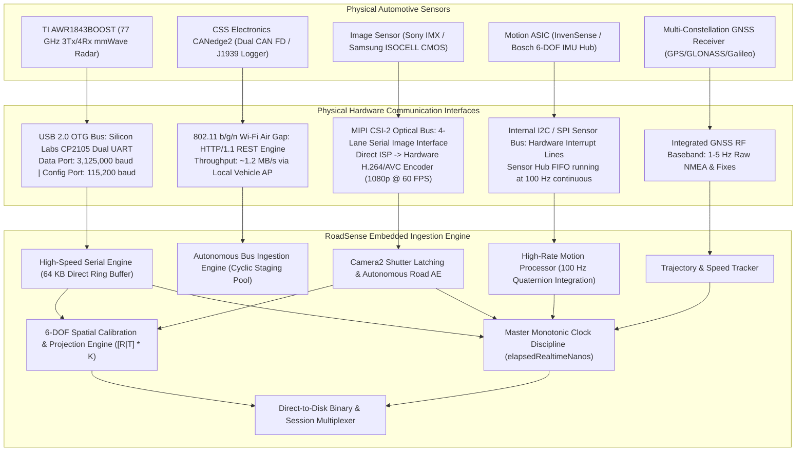
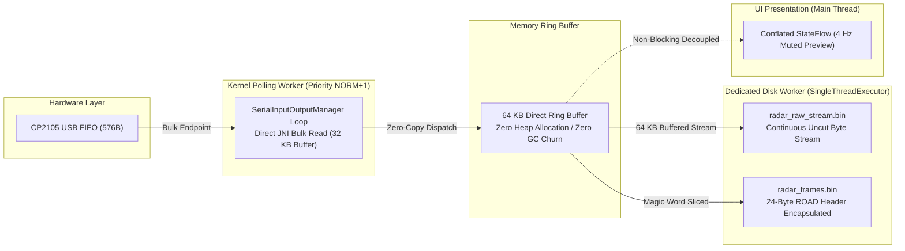
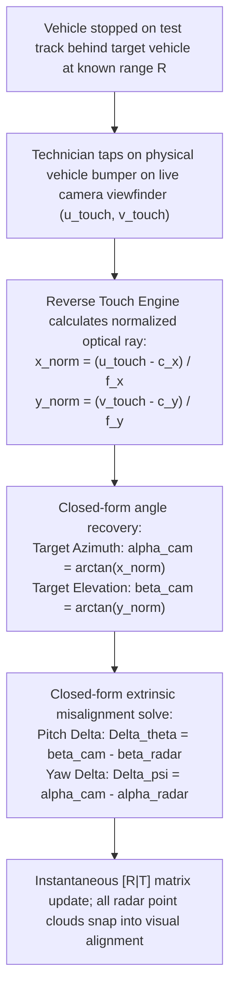
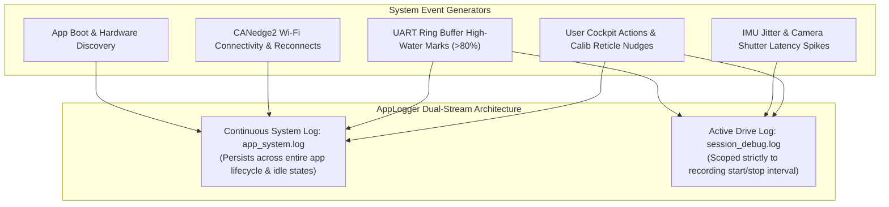

# RoadSense Embedded Systems, Control Engineering & Sensor Solutions

> **Document Classification:** Autonomous Vehicle Research & Engineering Systems  
> **Target Audience:** Embedded Systems Architects, Control Systems Engineers, Sensor Fusion Specialists, Chief Engineers  
> **Core Focus:** Hardware Bus Mechanics, Deterministic Timebase Discipline, 3.125 Mbps Serial Architecture, Closed-Loop Photometry, 6-DOF Spatial Projection & Reverse Touch Solver  
> **Status:** Production Technical Reference  

---

## 1. Physical Hardware Bus & Edge Compute Topology

From a systems engineering perspective, RoadSense does not treat the mobile host as a consumer telephone; it treats it as an **integrated industrial edge computer** powered by an ARM Cortex heterogeneous multi-core System-on-Chip (SoC) equipped with hardware video encoders, dedicated DSPs, internal sensor hubs, and high-speed serial transceivers.

The platform coordinates five concurrent hardware communication buses without requiring external multiplexers or secondary compute nodes:



---

## 2. Problem #1: Deterministic Multi-Modal Time Synchronization

### 2.1 The Control & Perception Problem: Spatial Parallax Error
In multi-sensor automotive perception, data streams arrive asynchronously at fundamentally incompatible sampling rates:
* **Radar Chirp Frames:** 20 Hz (~50 ms period)
* **Camera Video Frames:** 30 Hz or 60 Hz (~33.3 ms or ~16.6 ms period)
* **Vehicle Kinematics (IMU):** 100 Hz (~10 ms period)
* **Global Positioning (GNSS):** 1 Hz to 5 Hz (~1000 ms to ~200 ms period)
* **Vehicle CAN Bus:** Event-driven bursts / 60-second split log files

In high-speed automotive environments, **temporal misalignment directly causes spatial geometric error**. 

$$\Delta d = v_{\text{rel}} \cdot \Delta t$$

At highway speeds of $100 \text{ km/h}$ ($27.78 \text{ m/s}$):
* A **30 ms clock jitter** (common in non-real-time Python/Windows scripts) produces a spatial target displacement of **0.83 meters**.
* A **100 ms clock drift** (typical of uncalibrated system clocks) produces a **2.78-meter displacement**—exceeding half the length of a passenger car and causing radar point clouds to project onto empty roadway or oncoming lanes.

Furthermore, traditional Unix epoch time (`System.currentTimeMillis()`) is strictly prohibited in real-time control. Wall clocks are subject to Network Time Protocol (NTP) adjustments, cellular baseband updates, and daylight saving slewing. A single 10 ms negative backward step in time mathematically breaks state-space velocity derivations:

$$a(t) = \frac{v(t) - v(t - \Delta t)}{\Delta t} \quad \text{fails if } \Delta t \le 0$$

### 2.2 The Solution: Hardware Monotonic Clock Discipline without Hardware PPS
Traditional automotive instrumentation enforces synchronization by running physical Pulse-Per-Second (PPS) or PTP (IEEE 1588) wiring harnesses between all sensors. On motorcycles and compact test rigs, routing external hardware trigger lines to mobile camera sensors and USB radar modules is physically impossible or mechanically fragile.

RoadSense solves this by implementing **hardware monotonic clock discipline** anchored to the ARM Cortex CPU physical hardware counter:
1. **Clock Standard:** All sensor samples latch **`SystemClock.elapsedRealtimeNanos()`**, sourced from the CPU's invariant monotonic hardware counter (`CNTVCT_EL0`). This counter never ticks backward, is immune to NTP/GPS time slewing, and increments with nanosecond resolution continuously.
2. **Interrupt-Edge Latching:**
   * **Radar:** Timestamped in the native USB polling loop the instant the 8-byte sync magic word (`0x0102030405060708`) is assembled from the UART FIFO.
   * **Camera:** Hooked into the Camera2 Hardware Abstraction Layer (HAL) `onCaptureStarted()` hardware interrupt, which latches the exact moment the CMOS sensor rolling shutter opens at the silicon level—eliminating 30–80 ms of ISP pipe delay.
   * **IMU:** Hardware sensor event queues sampled at 100 Hz on a dedicated high-priority looper (`THREAD_PRIORITY_URGENT_DISPLAY`), achieving an inter-arrival jitter standard deviation of **$<1.5 \text{ ms}$**.
3. **Master Timeline Manifest:** Every recording session writes a consolidated `session_timeline.csv`. Every sensor sample shares this invariant index, enabling offline perception pipelines (Python, MATLAB, ROS2) to replay data with microsecond-level temporal correspondence.

```
TIMELINE CORRESPONDENCE (MONOTONIC TIMEBASE):

Radar 20Hz:  ──|───────────────|───────────────|───────────────|── [T_radar]
Camera 60Hz: ──|───|───|───|───|───|───|───|───|───|───|───|───|── [T_shutter]
IMU 100Hz:   ──|||||||||||||||||||||||||||||||||||||||||||||||||── [T_imu]
               ▲
               └─ Master Monotonic Timeline (nanosecond alignment, zero clock drift)
```

---

## 3. Problem #2: Zero-Drop 3.125 Mbps High-Speed Serial Ingestion

### 3.1 The Embedded Challenge: Hardware FIFO Overruns
The Texas Instruments AWR1843BOOST radar features an onboard C674x DSP and ARM Cortex-R4F. After running range FFT, Doppler FFT, and CFAR object detection, it streams structured Type-Length-Value (TLV) binary packets over a Silicon Labs CP2105 USB-UART bridge at **3,125,000 baud (3.125 Mbps)**.

This creates a continuous uncompressed binary stream of **~312.5 KB/sec**:
* Inter-packet arrival period: **50 ms (20 Hz)**.
* Average packet size: **8 KB to 24 KB** depending on target density and CFAR cluster count.
* Failure mode: The CP2105 hardware FIFO holds only 576 bytes. If the host CPU stalls for even **1.8 milliseconds** due to garbage collection (GC) or thread preemption, the hardware FIFO overflows, causing silent byte corruption and lost tracking packets.

### 3.2 The Ingestion Architecture: Zero-Copy Ring Buffering
RoadSense implements a dedicated, non-blocking serial acquisition engine:



1. **Priority Scheduling:** The polling loop runs on a dedicated native thread elevated to `Thread.NORM_PRIORITY + 1` (Linux niceness -1), guaranteeing the Linux scheduler preempts standard tasks to drain USB bulk endpoints.
2. **Double-Buffering & Zero GC Churn:** Instead of allocating new byte arrays per packet (which triggers Android Garbage Collection pauses), the driver uses fixed-capacity recycled byte buffers.
3. **Dual Disk Persistence:**
   * `radar_raw_stream.bin`: Exact raw byte-by-byte mirror of the UART stream for low-level protocol debugging.
   * `radar_frames.bin`: Self-indexing binary format. Each reconstructed packet is prepended with a fixed **24-byte synchronization header**:
     ```
     [0..3]   ROAD (Magic ASCII identifier)
     [4..11]  monotonicNs (64-bit nanosecond timestamp)
     [12..19] wallClockMs (64-bit reference epoch)
     [20..23] packetLength (32-bit payload size)
     [24..N]  Raw TI mmWave TLV Packet (starts with 8-byte sync word)
     ```
   This allows post-processing algorithms to instantly seek to any frame without scanning megabytes of raw stream for magic words.

---

## 4. Problem #3: Dynamic Automotive Photometry (Autonomous Road AE)

### 4.1 The Optical Challenge: Windshield Dynamic Range Mismatch
In automotive camera vision, mounting a sensor behind a vehicle windshield introduces extreme photometric variance:
* In bright daytime driving, the upper half of the visual field comprises high-luminance sky ($>10,000 \text{ cd/m}^2$).
* Standard camera auto-exposure algorithms meter across the whole frame, driving the global exposure down. This leaves the lower half of the frame—the asphalt road, vehicle chassis, and obstacles ($<500 \text{ cd/m}^2$)—completely underexposed, clipping road features to near-black.
* Conversely, entering a tunnel causes oncoming headlights to blind standard matrix metering.

```
SCENE LUMINANCE DISTRIBUTION (AUTOMOTIVE COCKPIT):

┌──────────────────────────────────────────────┐
│  BRIGHT SKY ZONE (Top 33%)                   │  Luminance: ~10,000 cd/m²
│  (Causes global exposure to darken)          │
├──────────────────────────────────────────────┤
│  HORIZON TRANSITION (Middle 25%)             │  Luminance: ~2,500 cd/m²
├──────────────────────────────────────────────┤
│  DARK ROAD SURFACE (Bottom 42%)              │  Luminance: ~300 cd/m²
│  Vehicles, Road Kill, Debris, Lane Markings  │  --> CRITICALLY CLIPPED IN STANDARD AE
└──────────────────────────────────────────────┘
```

### 4.2 The Solution: Dual-Zone Photometric Feedback Loop
RoadSense implements an autonomous closed-loop exposure controller:
1. **Zero-Allocation Sampling:** Every 400 ms, a lightweight worker on `Dispatchers.Default` samples a downsampled **$32 \times 24$ micro-grid (768 pixels)** directly from the preview pipeline without allocating extra hardware HAL streams.
2. **Photometric Zone Segmentation:**
   * **Sky Zone ($L_{\text{sky}}$):** Rows 0 to 7 (top 33% of frame).
   * **Road Zone ($L_{\text{road}}$):** Rows 14 to 23 (bottom 42% of frame).
3. **Contrast Ratio Calculation:**
   $$\text{Ratio} = \frac{\bar{L}_{\text{sky}}}{\max(\bar{L}_{\text{road}}, 1.0)}$$
4. **Closed-Loop Exposure Bias:**
   * **`SKY_BLOOM` ($\text{Ratio} \ge 1.8$):** The sky is overwhelming the road. RoadSense automatically commands the camera ISP to apply an Exposure Value bias of **$+1.0 \text{ to } +3.0 \text{ EV}$**, forcing the road surface to optimal mid-grey exposure while intentionally clipping the sky.
   * **`BALANCED` ($0.9 \le \text{Ratio} < 1.8$):** Neutral EV (0.0).
   * **`NIGHT_TUNNEL` ($\text{Ratio} < 0.9$):** Reverts to weighted matrix metering.

---

## 5. Problem #4: 6-DOF Spatial Calibration & Online Sensor Fusion

### 5.1 Coordinate Frame Transformations: Radar to Camera
Perception fusion requires projecting 3D radar point clouds into the 2D image plane of the camera. This is governed by a **6-DOF rigid body extrinsic transform** followed by a **pinhole camera intrinsic projection**.

```
[Radar Point: P_R]  ──►  [Rigid Body Extrinsics: [R|T]]  ──►  [Camera Point: P_C]  ──►  [Camera Intrinsics: K]  ──►  [Pixel: (u,v)]
```

Let a target detected by the mmWave radar have raw spherical coordinates $(r, \theta_{\text{az}}, \phi_{\text{el}})$. Its 3D position in the Radar Coordinate System $\{R\}$ is:

$$X_R = r \cdot \cos(\phi_{\text{el}}) \cdot \sin(\theta_{\text{az}})$$
$$Y_R = r \cdot \cos(\phi_{\text{el}}) \cdot \cos(\theta_{\text{az}})$$
$$Z_R = r \cdot \sin(\phi_{\text{el}})$$

The transformation to the Camera Coordinate System $\{C\}$ is defined by rotation matrix $\mathbf{R} \in SO(3)$ and translation vector $\mathbf{T} \in \mathbb{R}^3$:

$$\mathbf{P}_C = \mathbf{R} \cdot \mathbf{P}_R + \mathbf{T}$$

Where $\mathbf{T} = [\Delta X, \Delta Y, \Delta Z]^T$ represents physical mounting offsets (lateral shift, forward setback, vertical height), and $\mathbf{R}$ is the Euler rotation parameterized by yaw ($\psi$), pitch ($\theta$), and roll ($\phi$):

$$\mathbf{R} = \mathbf{R}_z(\psi) \cdot \mathbf{R}_x(\theta) \cdot \mathbf{R}_y(\phi)$$

### 5.2 Perspective Pinhole Projection
The 3D point $\mathbf{P}_C = [X_C, Y_C, Z_C]^T$ projects onto the image sensor via intrinsic calibration matrix $\mathbf{K}$:

$$\begin{bmatrix} u \cdot Z_C \\ v \cdot Z_C \\ Z_C \end{bmatrix} = \mathbf{K} \cdot \mathbf{P}_C = \begin{bmatrix} f_x & 0 & c_x \\ 0 & f_y & c_y \\ 0 & 0 & 1 \end{bmatrix} \begin{bmatrix} X_C \\ Y_C \\ Z_C \end{bmatrix}$$

$$u = \frac{f_x \cdot X_C}{Z_C} + c_x, \quad v = \frac{f_y \cdot Y_C}{Z_C} + c_y$$

*Where:*
* $(f_x, f_y)$ are camera focal lengths in pixels (queried dynamically at runtime from `CameraCharacteristics.LENS_INTRINSIC_CALIBRATION`).
* $(c_x, c_y)$ is the principal optical center (image center).
* $(u, v)$ are pixel coordinates on the camera viewfinder.

### 5.3 Painter's Algorithm Depth Sorting
If radar targets are rendered without depth awareness, a distant target at 100 meters might be drawn on top of a vehicle 10 meters away, occluding critical spatial cues. RoadSense enforces **Painter's Algorithm depth sorting**:

$$\text{Sort radar projections descending by } Z_C \text{ (forward depth)}$$

Targets at $Z_C = 120\text{m}$ are rendered first; close targets at $Z_C = 8\text{m}$ render last, guaranteeing correct foreground occlusion.

### 5.4 The Reverse Touch Solver: 60-Second In-Situ Field Calibration
Traditional camera-radar calibration requires parking the vehicle inside a controlled calibration laboratory with retroreflective corner reflectors, checkerboards, laser levels, and running multi-hour non-linear optimization routines (e.g., Levenberg-Marquardt). If a sensor bracket is nudged during an aggressive test ride, the entire test day's data is corrupted.

RoadSense introduces the **Reverse Touch Solver**—a closed-form $O(1)$ inverse trigonometric solution executed directly on the cockpit touchscreen:



**Mathematical Formulation:**
Given a touch coordinate $(u_{\text{touch}}, v_{\text{touch}})$ and radar target detection at range $r$:

$$\tan(\alpha_C) = \frac{u_{\text{touch}} - c_x}{f_x}, \quad \tan(\beta_C) = \frac{v_{\text{touch}} - c_y}{f_y}$$

The required mounting pitch ($\theta$) and yaw ($\psi$) corrections are obtained in closed form:

$$\theta_{\text{new}} = \theta_{\text{current}} + \Delta \theta, \quad \text{where } \Delta \theta = \beta_C - \arcsin\left(\frac{Z_R}{r}\right)$$
$$\psi_{\text{new}} = \psi_{\text{current}} + \Delta \psi, \quad \text{where } \Delta \psi = \alpha_C - \arctan2\left(X_R, Y_R\right)$$

This allows a track technician to recalibrate the entire multi-sensor perception rig in **under 60 seconds** on the pit lane without external equipment.

---

## 6. Problem #5: Autonomous Air-Gapped Vehicle Bus Telemetry Ingestion

### 6.1 The Fleet Challenge: Non-Intrusive CAN Bus Logging
Connecting test laptops directly into a vehicle's primary CAN/CAN-FD bus requires intrusive OBD-II/J1939 tapping harnesses that run into vehicle passenger compartments or handlebars, risking bus impedance faults or accidental ECU resets.

Furthermore, standard commercial CAN loggers require technicians to physically remove MicroSD cards at the end of each test drive, plug them into office PCs, and manually rename and cross-reference files.

### 6.2 The Solution: Autonomous Wi-Fi Ingestion Engine
RoadSense integrates with a **CSS Electronics CANedge2** dual-channel CAN/CAN-FD logger mounted inside the vehicle electrical harness:

```
┌──────────────────┐           Wi-Fi 802.11 b/g/n            ┌──────────────────────┐
│  CANedge2 Logger │ <─────────────────────────────────────> │  RoadSense Host      │
│  Dual CAN FD     │       HTTP/1.1 REST (Port 80)           │  (Handlebar Mounted) │
└────────┬─────────┘                                         └──────────┬───────────┘
         │                                                              │
         ├─ Records uncompressed MF4 logs (60s chunks)                  ├─ Polls SD directory structure
         └─ Cyclic storage (ring buffer on 32GB SD)                     ├─ Stages chunks into canedge_pool/
                                                                        └─ Bundles into session on drive stop
```

1. **Air-Gapped Local Network:** The CANedge2 broadcasts a local vehicle Wi-Fi Access Point (`M21`). The RoadSense host connects automatically.
2. **ESP32 Single-Connection Cooldown Architecture:** The CANedge2 operates an embedded ESP32 web server with a single-socket HTTP stack. RoadSense manages a strict sequential queue with 1.5-second backoff cooldowns, preventing server lockups.
3. **Two-Folder Cyclic Staging:**
   * Active 60-second MF4 chunks are transferred into a local cache (`canedge_pool/`).
   * When the user completes a drive and taps "Stop Recording", the ingestion engine identifies the relevant MF4 files matching the session's monotonic time interval, moves them into `sessions/session_YYYYMMDD_HHMMSS/can/`, and prunes stale chunks.
   * **Result:** Zero manual SD card extraction. The entire multi-sensor dataset (Radar, Camera, IMU, GNSS, CAN) is fully consolidated on the phone upon engine shutoff.

---

## 7. Problem #6: Dual-Stream Flight Recorder & Deterministic Diagnostics

Field test environments are inherently hostile: engine heat, severe chassis vibration, electrical transients, and weather exposure. To prevent silent failures, RoadSense implements a **Dual-Stream Flight Recorder** (`AppLogger`):



* **Deterministic Fault Isolation:** If a test run is aborted due to a loose radar USB cable or Wi-Fi disconnection, the flight recorder records the exact monotonic nanosecond timestamp and buffer watermark where the fault occurred.
* **SIL/HIL Replay Ready:** Engineering teams can ingest `session_debug.log` alongside `session_timeline.csv` into automated Software-in-the-Loop testbenches to verify algorithmic behavior against ground-truth vehicle dynamics.
