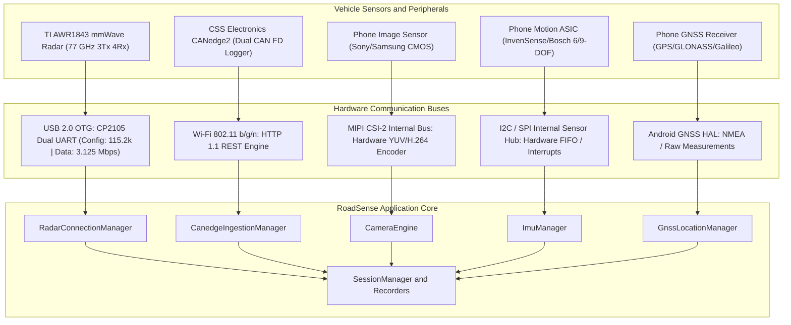
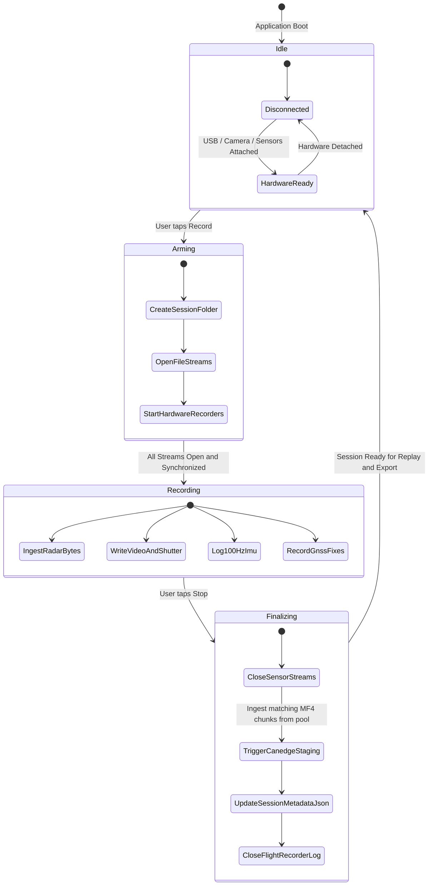

# RoadSense System Architecture & Storage Specification

> **Document Version:** 1.0.0  
> **Target Audience:** System Architects, Android Core Developers, Data Pipeline Engineers  
> **Status:** Authoritative Technical Handover Reference

---

## 1. System Overview & Physical Bus Topology

RoadSense transforms a consumer Android smartphone into an industrial-grade vehicular data acquisition node. The physical hardware interacts over four distinct communication buses:



---

## 2. Software Architecture: MVVM & Unidirectional Data Flow (UDF)

RoadSense strictly follows the Android Jetpack **Model-View-ViewModel (MVVM)** pattern with **Unidirectional Data Flow**. 

```mermaid
flowchart TD
    subgraph UILayer ["UI Layer (Jetpack Compose)"]
        Screen["RoadSenseCockpitScreen (HorizontalPager 7 Tabs)"]
        Cards["Dashboard Cards (Radar, Cam, IMU, GNSS, CAN, SBS, Storage)"]
        Overlay["ViewfinderRadarOverlay (6-DOF Projected Lollipops and Arcs)"]
    end

    subgraph ViewModelLayer ["ViewModel Layer (State and Coordination Layer)"]
        VM["RadarViewModel (StateFlow Aggregations and Tickers)"]
    end

    subgraph DriversLayer ["Domain and Hardware Drivers (Hardware Abstraction and Ingestion)"]
        RCM["RadarConnectionManager"]
        CE["CameraEngine"]
        IM["ImuManager"]
        GLM["GnssLocationManager"]
        CIM["CanedgeIngestionManager"]
        SPE["SpatialProjectionEngine"]
    end

    subgraph StorageLayer ["Persistence and Disk Layer (Storage Subsystem)"]
        SM["SessionManager"]
        RSR["RadarSessionRecorder"]
        CSR["CameraSessionRecorder"]
        ISR["ImuSessionRecorder"]
        GSR["GnssSessionRecorder"]
        STW["SessionTimelineWriter"]
        AL["AppLogger"]
    end

    %% State Flow downward
    VM -->|StateFlow Immutable States| Screen
    VM -->|StateFlow Immutable States| Cards
    VM -->|StateFlow Projected Targets| Overlay

    %% Events upward
    Screen -->|User Actions: Start/Stop/Config| VM
    Cards -->|Nudge / Touch / Calib Events| VM

    %% Driver coordination
    VM -->|Commands| RCM
    VM -->|Commands| CE
    VM -->|Commands| IM
    VM -->|Commands| GLM
    VM -->|Commands| CIM

    %% Driver callbacks to VM
    RCM -->|Raw Bytes and Decoded Frames| VM
    CE -->|Frame Shutter Timestamps| VM
    IM -->|100 Hz Fused Telemetry| VM
    GLM -->|Location Fixes| VM
    CIM -->|File Sync Stats| VM

    %% Driver logging to Disk
    VM -->|Session Control| SM
    RCM -->|Direct Byte Stream| RSR
    CE -->|MediaRecorder and Shutter| CSR
    IM -->|Fused Samples| ISR
    GLM -->|Fix Coordinates| GSR
    SM -->|Cross-Sensor Events| STW
    VM -->|Diagnostics Logs| AL
```



### Unidirectional Data Flow Principles
1. **Single Source of Truth:** Hardware drivers produce authoritative sensor measurements. The `RadarViewModel` exposes these as immutable `StateFlow<T>` streams.
2. **Immutable State Consumption:** UI components (`RoadSenseCockpitScreen`, `RadarBevPlot`, `ViewfinderRadarOverlay`) observe state flows and never alter driver state directly.
3. **Intent-Driven Dispatch:** User interactions (e.g., clicking "Start Recording", tweaking camera EV, or nudging pitch angles) dispatch explicit intents/methods to `RadarViewModel`, which validates prerequisites before modifying underlying engines.

---

## 3. Storage Hierarchy & Directory Specification

All data recorded by RoadSense is partitioned into structured, isolated directories under the application's external storage sandbox:

```
/sdcard/Android/data/com.bajajauto.roadsense/files/
 ├── calibration/
 │    └── radar_camera_calib.json              <-- Persistent 6-DOF extrinsics profile
 │
 ├── app_logs/                                 <-- App-wide continuous flight recorder
 │    └── app_run_YYYYMMDD_HHMMSS/
 │         └── app_system.log                  <-- Boot, Wi-Fi discovery, HAL events, UI breadcrumbs
 │
 └── sessions/
      ├── canedge_pool/                        <-- Multi-session staging pool for CANedge2 MF4 chunks
      │    ├── 00000045_00000001.MF4
      │    ├── 00000045_00000002.MF4
      │    └── 00000046_00000001.MF4
      │
      └── session_YYYYMMDD_HHMMSS/             <-- Individual multi-sensor recording drive
           ├── session_metadata.json           <-- High-level session manifest and summary metrics
           ├── session_timeline.csv            <-- Monotonic nanosecond cross-sensor event index
           ├── session_debug.log               <-- Session-specific flight recorder log
           │
           ├── radar/
           │    ├── radar_raw_stream.bin       <-- Unfiltered 3.125 Mbps raw UART byte stream
           │    └── radar_frames.bin           <-- Framed binary packets with 24-byte sync header
           │
           ├── camera/
           │    ├── camera_video.mp4           <-- Hardware H.264 encoded video (1080p/720p/480p)
           │    └── camera_frames.csv          <-- Sensor shutter start timestamps & exposure metadata
           │
           ├── gnss/
           │    └── gnss_track.csv             <-- Lat/Lon/Alt, speed, bearing, HDOP, satellites
           │
           ├── imu/
           │    └── imu_samples.csv            <-- 100 Hz Accel, Gyro, Mag, Euler angles, Quaternions
           │
           └── can/
                ├── 00000045_00000001.MF4      <-- Copied CANedge2 1-minute split MF4 logs
                └── 00000045_00000002.MF4
```

---

## 4. Metadata File Specifications

### 4.1 Session Metadata Schema: `session_metadata.json`
Written automatically at session start and updated upon session finalization:

```json
{
  "sessionId": "session_20260923_143015",
  "startTimeWallMs": 1790154615000,
  "startTimeMonotonicNs": 41289123847291,
  "endTimeWallMs": 1790154915000,
  "endTimeMonotonicNs": 41589123847291,
  "durationSeconds": 300.0,
  "sensors": {
    "radar": {
      "rawBytesRecorded": 93750000,
      "framesRecorded": 6000,
      "baudRate": 3125000,
      "files": ["radar/radar_raw_stream.bin", "radar/radar_frames.bin"]
    },
    "camera": {
      "framesLogged": 17998,
      "nominalFps": 60,
      "resolution": "1920x1080",
      "videoFile": "camera/camera_video.mp4",
      "metadataFile": "camera/camera_frames.csv"
    },
    "imu": {
      "samplesLogged": 30000,
      "nominalHz": 100.0,
      "dataFile": "imu/imu_samples.csv"
    },
    "gnss": {
      "fixesLogged": 300,
      "nominalHz": 1.0,
      "dataFile": "gnss/gnss_track.csv"
    },
    "can": {
      "filesAssigned": [
        "can/00000045_00000001.MF4",
        "can/00000045_00000002.MF4"
      ]
    }
  }
}
```

### 4.2 Cross-Sensor Master Index: `session_timeline.csv`
Unifies asynchronous sensor events along the common nanosecond monotonic timeline:

```csv
elapsed_realtime_ns,sensor,event,sequence_id,relative_path,summary
41289123847291,SESSION,START,0,session_metadata.json,Session initialized: session_20260923_143015
41289124100234,RADAR,FRAME,1,radar/radar_frames.bin,Packet size: 488 bytes, 14 detected objects
41289124210000,IMU,SAMPLE,1,imu/imu_samples.csv,Accel: 0.12 -9.81 0.05 m/s2
41289140500120,CAMERA,SHUTTER,1,camera/camera_video.mp4,Frame shutter exposure start
41289224100000,GNSS,FIX,1,gnss/gnss_track.csv,Lat: 18.5204 Lon: 73.8567 Speed: 12.4 m/s
41289540000000,CAN,CHUNK_STAGED,1,can/00000045_00000001.MF4,CANedge chunk staged to session
41589123847291,SESSION,STOP,6000,session_metadata.json,Session finalized
```

### 4.3 Calibration Extrinsics Schema: `calibration/radar_camera_calib.json`
Stores the rigid 6-DOF spatial transformation between the mmWave radar center-of-array and camera optical center:

```json
{
  "cameraLensId": "0",
  "deltaXMeters": 0.0,
  "deltaYMeters": 0.25,
  "deltaZMeters": -0.15,
  "pitchDeg": 1.5,
  "yawDeg": -0.8,
  "rollDeg": 0.0,
  "autoSavedTimestampMs": 1790154000000
}
```

---

## 5. Session Recording Lifecycle State Machine

The session recording engine transitions deterministically across five operational states:


