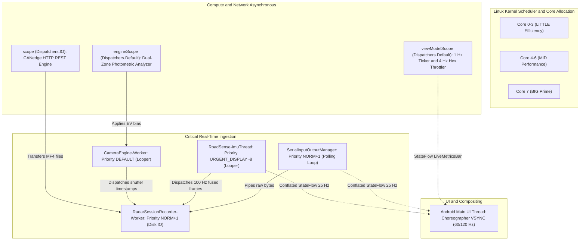
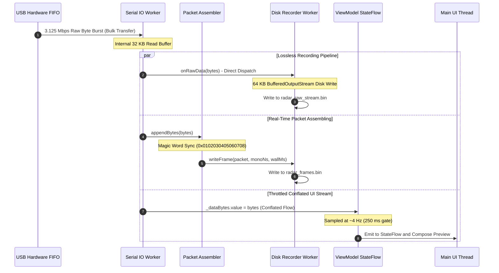

# In-Depth Multithreading, Concurrency & Thread Synchronization

> **Document Version:** 1.0.0  
> **Target Audience:** Real-Time Systems Engineers, Android Kernel/Platform Developers, Embedded Concurrency Specialists  
> **Status:** Authoritative Technical Handover Reference

---

## 1. The Real-Time Embedded Challenge

RoadSense operates in a high-contention, heterogeneous embedded environment. On a commercial mobile System-on-Chip (SoC) operating in an unventilated vehicle cabin, the application must simultaneously:

1. **Service a 3.125 Mbps mmWave Radar UART stream** (~312.5 KB/sec continuous binary data) with an inter-packet deadline of 50 ms (20 Hz) and zero dropped bytes.
2. **Drive Camera2 video encoding and preview** at up to 1080p @ 60 FPS while sampling sensor shutter exposure timestamps at the exact sub-millisecond hardware shutter trigger.
3. **Sample device IMU sensors at 100 Hz** (accelerometer, gyroscope, magnetometer, rotation vector) with minimal inter-arrival jitter (<1.5 ms standard deviation).
4. **Acquire GNSS fixes and NMEA sentences** at 1–5 Hz.
5. **Poll and stage dual-CAN bus MF4 files** over 802.11 b/g/n Wi-Fi from an external CANedge2 microcontroller.
6. **Render high-density Jetpack Compose UI** at 60 Hz or 120 Hz without dropped display frames or UI stutter.

If any of these workloads block the Android Main/UI thread, the system triggers an Application Not Responding (ANR) crash. If serial or sensor threads are starved by the Linux scheduler, UART hardware FIFOs overrun, resulting in corrupted radar packets and dropped vehicle tracking data.

---

## 2. Complete Thread Map & Priority Matrix

To guarantee strict isolation, RoadSense partitions its workload across **eight dedicated threads and coroutine dispatchers**, assigning Linux kernel scheduling priorities based on real-time urgency:



### Detailed Thread Specification Table

| Thread Identifier | Mechanism | Linux Priority / Nice | Execution Target | Responsibilities & Ingestion Flow |
| :--- | :--- | :--- | :--- | :--- |
| **`main` (UI Thread)** | Android Choreographer / Looper | `THREAD_PRIORITY_DEFAULT` (0) | Jetpack Compose Composables | Renders Cockpit UI, Canvas BEV plots, 6-DOF lollipop overlays, handles touch events. Never performs file I/O or decoding. |
| **`SerialInputOutputManager`** | Worker Thread | `Thread.NORM_PRIORITY + 1` (Nice -1) | Native USB Endpoint Polling | Continuously polls CP2105 USB endpoint using 32 KB internal buffer. Directly dispatches raw byte arrays to listeners without thread context switches. |
| **`RadarSessionRecorder-Worker`** | `SingleThreadExecutor` | `Thread.NORM_PRIORITY + 1` (Nice -1) | Sequential File Output Stream | Dumps raw UART bytes and framed binary packets (`radar_frames.bin`, `radar_raw_stream.bin`) using a 64 KB `BufferedOutputStream`. |
| **`CameraEngine-Worker`** | `HandlerThread` with `Looper` | `THREAD_PRIORITY_DEFAULT` (0) | Camera2 HAL Callback Handler | Receives CameraDevice state callbacks, CameraCaptureSession capture completions, and extracts sensor shutter exposure start nanoseconds. |
| **`RoadSense-ImuThread`** | `HandlerThread` with `Looper` | `THREAD_PRIORITY_URGENT_DISPLAY` (-8) | SensorEventListener Queue | Processes high-frequency accelerometer, gyroscope, and rotation vector interrupts. Calculates rotation matrices, quaternions, and updates jitter buffers. |
| **`engineScope` (Road AE)** | Coroutine on `Dispatchers.Default` | Background Worker Pool | Downsampled Bitmap Analysis | Samples 32x24 downsampled bitmaps from TextureView every 400ms. Computes luminance histogram and updates camera EV exposure compensation. |
| **`CanedgeIngestionScope`** | Coroutine on `Dispatchers.IO` | Unbounded I/O Worker Pool | OkHttp HTTP 1.1 Requests | Periodically polls CANedge2 SD directory, stages 1-minute split MF4 files into `canedge_pool/`, and transfers session files upon drive completion. |
| **`viewModelScope` (Ticker)** | Coroutine on `Dispatchers.Default` | Background Worker Pool | Periodic Math & Telemetry | 1-second hardware ticker (CPU %, Battery temp, multi-sensor Hz calculation) and 4 Hz throttled UI hex preview generation. |

---

## 3. High-Throughput Buffering & Memory Isolation

A foundational requirement of RoadSense is that high-throughput streams (3.125 Mbps UART) must never trigger memory allocations that invoke the Android Garbage Collector (GC), as GC "stop-the-world" pauses drop incoming serial bytes.



### 3.1 The 32 KB Native Serial Ring Buffer
The `SerialInputOutputManager` allocates a single, reusable `32768-byte` buffer (`readBufferSize = 32768`). Incoming USB packets are read into this native array and immediately dispatched to registered data listeners.

### 3.2 The 64 KB Buffered Output Streams
Disk I/O is notoriously bursty on flash storage (UFS 2.2 / 3.1) due to wear leveling and flash block erases. Both `RadarSessionRecorder` and `RawUartRecorder` wrap their file streams in a `64 KB` buffer (`BufferedOutputStream(..., 64 * 1024)`):
- This absorbs flash write stalls of up to 200 ms without back-pressuring the USB serial worker thread.
- Writes execute sequentially on a dedicated single-threaded executor (`Executors.newSingleThreadExecutor()`).

### 3.3 The 128-Entry IMU Circular Jitter Ring Buffer
To accurately benchmark sensor hardware timing jitter without dynamic heap growth:
```kotlin
private const val JITTER_WINDOW_SIZE = 128
private val intervalBuffer = FloatArray(JITTER_WINDOW_SIZE)
private var intervalHead = 0
private var intervalCount = 0
```
Every incoming sensor interrupt writes to this pre-allocated primitive array in $O(1)$ time, computing mean and standard deviation on-the-fly without allocating a single object.

---

## 4. Concurrency Primitives & Thread-Safety Patterns

RoadSense enforces strict rules regarding how state crosses thread boundaries:

### 4.1 Lock-Free Dispatch via `CopyOnWriteArrayList`
Listener registries (such as `dataListeners` in `RadarConnectionManager` and `frameListeners` in `CameraEngine`) are backed by `java.util.concurrent.CopyOnWriteArrayList`:
- Iteration during high-frequency dispatch (e.g., 20 Hz radar frames or 60 Hz camera shutters) requires **zero mutex locking**.
- Adding or removing listeners (e.g., when the user switches tabs or toggles recording) safely clones the array without risking `ConcurrentModificationException` or deadlocking worker threads.

### 4.2 Conflation vs. Unbuffered Queueing
A critical design distinction in RoadSense:

1. **Storage Pipelines are UNBUFFERED and LOSSLESS:**  
   Every byte received from UART or sensor HAL is dispatched via direct synchronous method calls on worker threads (`RawDataListener.onRawData()`, `onFrameListener()`). They bypass Kotlin Channel or Flow buffers to prevent backpressure drops.
2. **UI Pipelines are CONFLATED:**  
   The human eye and 60/120 Hz displays cannot process 100 Hz IMU updates or 3.125 Mbps hex streams. The UI consumes Kotlin `StateFlow<T>`, which **conflates intermediate updates**:
   ```kotlin
   // In RadarConnectionManager.kt (Serial Thread)
   _dataBytes.value = data // If UI is busy rendering, intermediate frames are dropped
   ```
   This guarantees that the Main thread is never swamped by sensor events.

### 4.3 Volatile State Flags for Hardware Engines
Critical lifecycle states that govern thread loops use the `@Volatile` JVM annotation:
```kotlin
@Volatile private var isRecordingActive = false
@Volatile private var isPreviewActive = false
@Volatile private var onFrameListener: ((ImuFrame) -> Unit)? = null
```
This forces the Java Virtual Machine and ARM CPU memory barrier registers to ensure cross-core cache coherency without requiring heavy synchronized monitor locks.

---

## 5. Workload Preemption & Starvation Prevention

During real-world drive testing, multi-core mobile processors aggressively throttle CPU frequencies as internal chassis temperatures approach 42°C. RoadSense employs three autonomous starvation-prevention mechanisms:

### 5.1 CANedge2 Preemption During Active Drives
Downloading 1-minute CAN bus log files (`.MF4`, ~1.5 MB each) over Wi-Fi consumes substantial Wi-Fi baseband power, CPU interrupt cycles, and flash write bandwidth.
- **The Rule:** When the driver presses **Record**, `CanedgeIngestionManager.onSessionStarted()` immediately cancels any active download job:
  ```kotlin
  syncJob?.cancel()
  syncJob = null
  ```
- All CAN copying is deferred until after the drive session is finalized. Radar and Camera maintain 100% of available SoC bandwidth during live capture.

### 5.2 Micro-Scale 32x24 Bitmaps for Autonomous Road AE
Under standard Camera2 implementations, capturing frames for computer vision requires allocating an additional `ImageReader` YUV stream from the camera HAL. However, midrange mobile image signal processors (ISPs) cannot handle two concurrent full-resolution YUV streams without dropping video frames.
- **RoadSense Solution:** The autonomous Road Auto-Exposure engine taps the active `TextureView` directly on `Dispatchers.Default`:
  ```kotlin
  val downsampled = Bitmap.createScaledBitmap(textureBitmap, 32, 24, false)
  ```
- Analyzing this tiny $32 \times 24$ luminance grid (768 pixels) executes in **under 1.2 milliseconds**, completely avoiding ISP frame buffer starvation.

### 5.3 4 Hz Throttled Hex UI Preview
Converting raw byte arrays into formatted hexadecimal strings (`"%02X".format(b)`) generates massive `String` and `StringBuilder` object churn, triggering aggressive garbage collection.
- The UI hex preview is gated to update at a maximum frequency of **4 Hz (250 ms interval)** and clamped to `4000 characters`.
- When the user collapses the hex preview card, generation is terminated completely.
