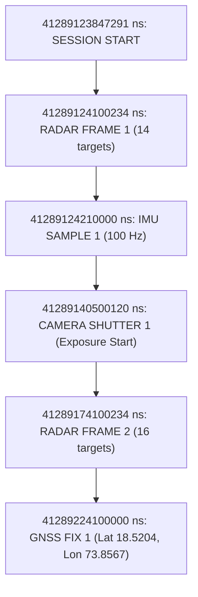
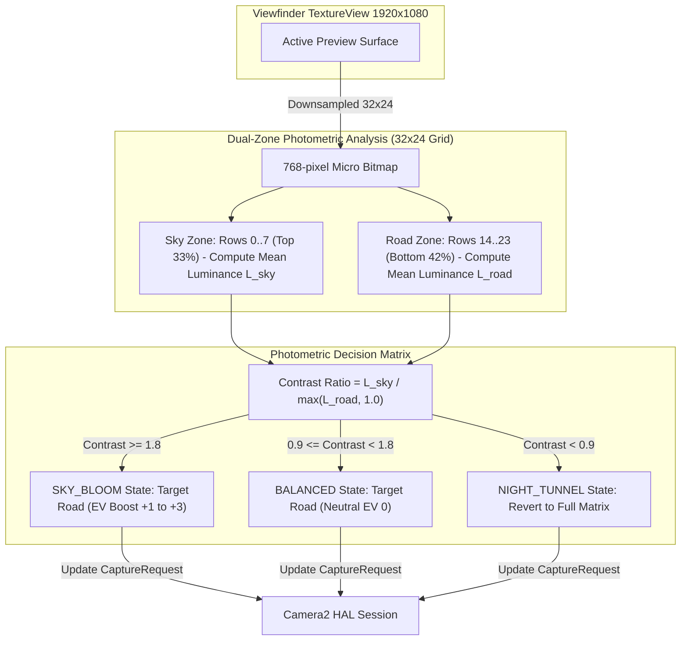
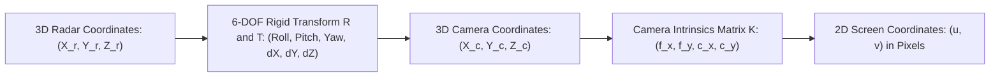

# Sensor Pipelines, Monotonic Synchronization & Spatial Fusion

> **Document Version:** 1.0.0  
> **Target Audience:** Perception Engineers, Sensor Fusion Specialists, Computer Vision Researchers  
> **Status:** Authoritative Technical Handover Reference

---

## 1. Master Monotonic Nanosecond Synchronization Engine

### 1.1 The Clock Synchronization Problem
In multi-modal sensor fusion, data streams operate at fundamentally different frequencies:
- **Radar:** 20 Hz (~50 ms period)
- **Camera:** 30 Hz or 60 Hz (~33.3 ms or ~16.6 ms period)
- **IMU:** 100 Hz (~10 ms period)
- **GNSS:** 1 Hz to 5 Hz (~1000 ms or ~200 ms period)
- **CAN Bus:** Asynchronous bursts / 1-minute logged chunks

Traditional Unix wall-clock timestamps (`System.currentTimeMillis()`) are unsuitable for sensor fusion. Wall clocks are subject to Network Time Protocol (NTP) adjustments, cellular network time updates, leap seconds, and daylight savings shifts. A single 10-millisecond backward NTP step corrupts inter-frame velocity calculations and breaks temporal correspondence.

### 1.2 The Monotonic Reference Standard
RoadSense enforces **`SystemClock.elapsedRealtimeNanos()`** as the authoritative timestamp standard across all sensors.
- Sourced directly from the ARM Cortex CPU hardware monotonic clock counter (`CNTVCT_EL0`).
- Guaranteed to never tick backward, never jump due to network synchronization, and increments continuously even when CPU cores enter low-power sleep states.
- All sensor records include this nanosecond timestamp. Wall-clock time is recorded strictly as an informational reference.



---

## 2. mmWave Radar Pipeline (AWR1843BOOST)

### 2.1 Hardware Chirp & DSP Processing
The Texas Instruments AWR1843BOOST operates in the 76–81 GHz band with 3 Transmitters (Tx) and 4 Receivers (Rx).
1. The radar frontend transmits Frequency Modulated Continuous Wave (FMCW) chirps.
2. The onboard C674x DSP executes a 1D Range FFT, 2D Doppler FFT, and CFAR (Constant False Alarm Rate) target detection algorithm.
3. Angle-of-Arrival (AoA) estimation determines azimuth and elevation angles.
4. The ARM Cortex-R4F packages results into structured Type-Length-Value (TLV) binary payloads and streams them out via UART at **3,125,000 baud**.

### 2.2 Binary Framing & Magic Word Synchronization
The binary stream emitted by the radar complies with the TI mmWave SDK standard:

```
┌────────────────────────────────────────────────────────┐
│  TI mmWave Sync Magic Word (8 Bytes)                   │
│  0x0102, 0x0304, 0x0506, 0x0708 (Little Endian)        │
├────────────────────────────────────────────────────────┤
│  Standard Header (32 Bytes)                            │
│  - Version (4B)          - Total Packet Len (4B)       │
│  - Platform ID (4B)      - Frame Number (4B)           │
│  - CPU Cycles (4B)       - Num Detected Obj (4B)       │
│  - Num TLVs (4B)         - Subframe Number (4B)        │
├────────────────────────────────────────────────────────┤
│  TLV 1: Detected Objects Header & Data Array           │
│  - Type = 0x0001 (4B)    - Length (4B)                 │
│  - Points: Range (4B), Azimuth (4B), Doppler (4B), Elev│
├────────────────────────────────────────────────────────┤
│  TLV 7: Side Information Array (SNR & Noise per Point) │
│  - Type = 0x0007 (4B)    - Length (4B)                 │
│  - Side Info: SNR (2B), Noise (2B)                     │
└────────────────────────────────────────────────────────┘
```

### 2.3 Coordinate Transformation (Spherical to Cartesian)
For every point in TLV Type 1, the `RadarTlvDecoder` transforms raw spherical radar coordinates $(r, \theta, \phi)$ into 3D Cartesian coordinates $(x, y, z)$ relative to the radar sensor origin:

$$x = r \cdot \cos(\phi) \cdot \sin(\theta)$$
$$y = r \cdot \cos(\phi) \cdot \cos(\theta)$$
$$z = r \cdot \sin(\phi)$$

*Where:*
- $r$ = Target distance along line of sight (meters)
- $\theta$ = Azimuth angle in horizontal plane (radians, $+ = \text{right}, - = \text{left}$)
- $\phi$ = Elevation angle in vertical plane (radians, $+ = \text{up}, - = \text{down}$)
- $x$ = Lateral distance (meters, $+ = \text{right}$)
- $y$ = Forward longitudinal distance (meters, $+ = \text{forward}$)
- $z$ = Vertical height (meters, $+ = \text{up}$)

### 2.4 Framed Binary Disk Storage Format (`radar_frames.bin`)
To allow instant random seeking and temporal playback without needing to re-parse magic words from a continuous stream, `RadarSessionRecorder` prepends a fixed **24-byte synchronization header** to each assembled packet:

| Offset (Bytes) | Field Name | Data Type | Value / Description |
| :---: | :---: | :---: | :--- |
| `0..3` | `FRAME_MAGIC` | 4-byte ASCII | String `"ROAD"` (`0x52, 0x4F, 0x41, 0x44`) |
| `4..11` | `monotonicNs` | 64-bit Int (Long) | Hardware `SystemClock.elapsedRealtimeNanos()` |
| `12..19` | `wallClockMs` | 64-bit Int (Long) | Host `System.currentTimeMillis()` |
| `20..23` | `packetLen` | 32-bit Int | Byte length of the encapsulated raw radar packet |
| `24..N` | `packetBytes` | Binary Array | Full TI mmWave packet starting with 8-byte magic word |

---

## 3. Camera2 Pipeline & Autonomous Road AE

### 3.1 Deterministic Shutter Timestamp Extraction
Standard Android camera APIs only report timestamps when image buffers arrive in user space, which can be delayed by 30–80 ms due to ISP processing and buffer queues. RoadSense hooks into the Camera2 HAL hardware capture callback:

```kotlin
override fun onCaptureStarted(
    session: CameraCaptureSession,
    request: CaptureRequest,
    timestamp: Long, // Hardware sensor exposure start (ns)
    frameNumber: Long
) {
    val hostMonoNs = SystemClock.elapsedRealtimeNanos()
    // Stored directly into camera_frames.csv
}
```

### 3.2 Autonomous Dual-Zone Road Auto-Exposure (Road AE)
In automotive driving scenes, vehicle dashboards mounted behind windshields face intense dynamic range challenges: bright sky overexposing road surfaces or dark tunnels causing headlights to blind the sensor.



- **Luminance Calculation:** Converted using the ITU-R BT.601 standard:
  $$L = 0.299 \cdot R + 0.587 \cdot G + 0.114 \cdot B$$
- **Hysteresis Smoothing:** An exponential moving average filter eliminates exposure flicker under tree canopies and street lights:
  $$C_{\text{smoothed}} = 0.7 \cdot C_{\text{previous}} + 0.3 \cdot C_{\text{instant}}$$

---

## 4. 100 Hz IMU Pipeline & Quaternion Math

### 4.1 Landscape Coordinate Remapping
Android phone sensor hardware is physically calibrated for portrait orientation (where $+Y$ points up along the long edge of the screen). Because vehicle cockpits mount smartphones in landscape mode, raw sensor readings must be mathematically remapped:

```kotlin
// In ImuManager.kt
SensorManager.remapCoordinateSystem(
    rotationMatrix,
    SensorManager.AXIS_X,
    SensorManager.AXIS_Z,
    remappedMatrix
)
```

### 4.2 Quaternion Formulation
Euler angles (Yaw, Pitch, Roll) suffer from mathematical singularities (Gimbal Lock) when the vehicle experiences steep inclines. RoadSense computes both Euler angles (for UI rendering) and **4-element normalized unit quaternions** ($q_x, q_y, q_z, q_w$) for 3D trajectory reconstruction:

$$q_w = \frac{1}{2}\sqrt{1 + R_{00} + R_{11} + R_{22}}$$
$$q_x = \frac{R_{21} - R_{12}}{4 q_w}, \quad q_y = \frac{R_{02} - R_{20}}{4 q_w}, \quad q_z = \frac{R_{10} - R_{01}}{4 q_w}$$

---

## 5. 6-DOF Spatial Calibration & Perspective Projection

To project 3D radar point clouds onto the 2D camera image plane, RoadSense applies a **6-DOF rigid extrinsic transformation** followed by **pinhole camera intrinsic projection**.



### 5.1 Extrinsic Transformation Matrix ($[\mathbf{R} \mid \mathbf{T}]$)
The point $(X_r, Y_r, Z_r)$ in radar coordinates is transformed to camera coordinate space $(X_c, Y_c, Z_c)$ using:

$$\begin{bmatrix} X_c \\ Y_c \\ Z_c \\ 1 \end{bmatrix} = \begin{bmatrix} \mathbf{R} & \mathbf{T} \\ \mathbf{0}^T & 1 \end{bmatrix} \begin{bmatrix} X_r \\ Y_r \\ Z_r \\ 1 \end{bmatrix}$$

*Where rotation matrix $\mathbf{R} = \mathbf{R}_z(\psi) \cdot \mathbf{R}_x(\theta) \cdot \mathbf{R}_y(\phi)$:*
- $\psi$ = Yaw angle (rotation around vertical $Z$ axis)
- $\theta$ = Pitch angle (rotation around lateral $X$ axis)
- $\phi$ = Roll angle (rotation around longitudinal $Y$ axis)
- $\mathbf{T} = [\Delta X, \Delta Y, \Delta Z]^T$ (Physical spatial offset between radar array center and camera lens center)

### 5.2 Pinhole Perspective Projection
Using the camera intrinsic matrix $\mathbf{K}$:

$$\begin{bmatrix} u \cdot Z_c \\ v \cdot Z_c \\ Z_c \end{bmatrix} = \begin{bmatrix} f_x & 0 & c_x \\ 0 & f_y & c_y \\ 0 & 0 & 1 \end{bmatrix} \begin{bmatrix} X_c \\ Y_c \\ Z_c \end{bmatrix}$$

Solving for screen pixel coordinates $(u, v)$:

$$u = \frac{f_x \cdot X_c}{Z_c} + c_x$$
$$v = \frac{f_y \cdot Y_c}{Z_c} + c_y$$

*Where:*
- $f_x, f_y$ = Focal lengths in pixels along horizontal and vertical axes
- $c_x, c_y$ = Principal point (optical center) in screen coordinates
- $Z_c$ = Forward depth distance (meters). Points with $Z_c \le 0.1\text{m}$ lie behind the camera lens and are clipped.

### 5.3 Painter's Algorithm Depth-Sorting
When multiple radar points project near the same pixel coordinates, distant points must not occlude foreground targets. `SpatialProjectionEngine` sorts all projected points descending by forward depth:

```kotlin
lollipops.sortByDescending { it.depthM }
```
Distant detections ($100\text{m}$) render first as small background targets; close targets ($10\text{m}$) render last on top with prominent lollipop stems and velocity vectors.

### 5.4 The Reverse Touch Solver Formulation
Calibrating extrinsics manually using 6 numeric sliders is tedious and error-prone in the field. RoadSense implements an instant **Reverse Touch Solver**:
1. The driver points the vehicle at a known physical target (e.g., a lead car stopped $25\text{m}$ directly ahead).
2. The radar detects a target cluster at depth $D = 25.0\text{m}$.
3. The technician taps the target vehicle's bumper directly on the touchscreen at pixel coordinate $(u_{\text{tap}}, v_{\text{tap}})$.
4. The solver recovers the angular mounting misalignments in closed form ($O(1)$):

$$\Delta \text{yaw} = \arctan\left(\frac{u_{\text{tap}} - c_x}{f_x}\right)$$
$$\Delta \text{pitch} = -\arctan\left(\frac{v_{\text{tap}} - c_y}{f_y}\right)$$

The calibration parameters update immediately, locking the radar projection onto the physical vehicle.
