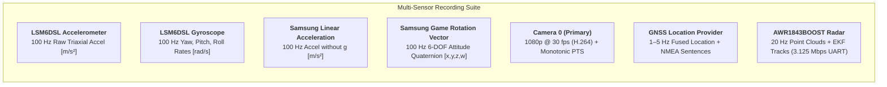

# Hardware Sensor & Camera Capabilities Audit: Samsung Galaxy M30s (SM-M305F)

> **Document Name:** `DEVICE_SENSOR_AND_CAMERA_CAPABILITIES.md`  
> **Location:** `intel/Implementations/Sensors/DEVICE_SENSOR_AND_CAMERA_CAPABILITIES.md`  
> **Extraction Method:** Live Hardware Query via ADB (`dumpsys sensorservice`, `dumpsys media.camera`, `getprop`)  
> **Device Profile:** Samsung Galaxy M30s / M21 family (`SM-M305F` / `m30lte` / Exynos 7904/9611)  
> **Operating System:** Android 10 (API level 29)  
> **Date of Audit:** 2026-09-23  

---

## 1. Executive Hardware Summary

| Subsystem | Primary Hardware Component | Vendor | Max Rate / Resolution | Automotive ADAS Utility |
|---|---|---|---|---|
| **6-DOF IMU** | **LSM6DSL** (Accel + Gyro) | STMicroelectronics | **100.00 Hz** (Hardware HAL cap) | Ego-motion compensation, vehicle pitch/roll, dynamic bump/vibration detection. |
| **Magnetometer** | **YAS539** (3-axis Compass) | Yamaha Corporation | **100.00 Hz** | Absolute heading reference (disturbed by in-cabin vehicle currents). |
| **6-DOF Fusion** | **Game Rotation Vector** | Samsung / Android HAL | **100.00 Hz** | **Highest value for ADAS**: Magnet-free orientation quaternion $[x,y,z,w]$. Immune to vehicle steel/currents. |
| **Linear Accel** | **Linear Acceleration** ("without $g$") | Samsung / Android HAL | **100.00 Hz** | Dynamic acceleration without gravity. Longitudinal braking/acceleration & lateral cornering forces. |
| **Primary Camera** | **Camera 0** (48 MP binned to 12.8 MP) | Samsung SLSI / Sony | **1080p @ 30 fps** ($64^\circ$ HFOV) | Primary forward vision, object detection, spatial radar-camera fusion. |
| **Ultra-Wide Camera**| **Camera 50** (5 MP Ultra-Wide) | Samsung SLSI | **$2576 \times 1932$** ($f=2.2\text{mm}$, $\approx 120^\circ$ DFOV) | Wide-angle situational awareness, intersection cross-traffic monitoring. |
| **Front Camera** | **Camera 1** (16 MP Selfie) | Samsung SLSI | **1080p @ 30 fps** ($66^\circ$ HFOV) | Driver Monitoring System (DMS), head pose, eye gaze tracking. |
| **GNSS Tracking** | Multi-Constellation Location Engine | Exynos / Broadcom GNSS | **1–5 Hz** (High-Accuracy Fused + NMEA) | Global trajectory, ground speed ($m/s$), course angle, WGS84 elevation. |
| **Barometer** | **None** (`TYPE_PRESSURE` absent) | N/A | N/A | Pressure sensor is not physically equipped on this device tier. |

---

## 2. Complete Device Motion & Environmental Sensor Catalog

The table below lists all 18 sensors queried directly from `dumpsys sensorservice`:

| Handle | Sensor Name | Vendor | Android Sensor Type | Mode | Min Rate | Max Rate (HAL Cap) | Batching | Automotive Value / Role |
|---|---|---|---|---|---|---|---|---|
| `0x00000000` | **LSM6DSL Accelerometer** | STMicroelectronics | `TYPE_ACCELEROMETER` (1) | Continuous | 5.00 Hz | **100.00 Hz** | No | **CRITICAL:** Raw triaxial vehicle dynamics + gravity tilt. |
| `0x00000001` | **LSM6DSL Gyroscope** | STMicroelectronics | `TYPE_GYROSCOPE` (4) | Continuous | 5.00 Hz | **100.00 Hz** | No | **CRITICAL:** Yaw rate (cornering/spin), pitch rate (braking dip), roll rate. |
| `0x0000000a` | **LSM6DSL Uncalibrated Gyro** | STMicroelectronics | `TYPE_GYROSCOPE_UNCALIBRATED` (16) | Continuous | 5.00 Hz | **100.00 Hz** | No | Raw angular velocity + estimated online drift bias. |
| `0x736c696e` | **Samsung Linear Acceleration** | Samsung Electronics | `TYPE_LINEAR_ACCELERATION` (10) | Continuous | — | **100.00 Hz** | No | **HIGH:** "Accelerometer without $g$". Direct vehicle surge & sway acceleration. |
| `0x73677276` | **Samsung Gravity** | Samsung Electronics | `TYPE_GRAVITY` (9) | Continuous | — | **100.00 Hz** | No | **HIGH:** Static gravity vector. Identifies road grade (%) and phone mounting pitch/roll. |
| `0x7367726f` | **Samsung Game Rotation Vector**| Samsung Electronics | `TYPE_GAME_ROTATION_VECTOR` (15) | Continuous | — | **100.00 Hz** | No | **MAXIMUM VALUE:** 6-DOF orientation quaternion. No magnetic interference from vehicle chassis. |
| `0x73726f76` | **Samsung Rotation Vector** | Samsung Electronics | `TYPE_ROTATION_VECTOR` (11) | Continuous | — | **100.00 Hz** | No | 9-DOF Earth-referenced orientation (subject to cabin magnetic distortion). |
| `0x73797072` | **Samsung Orientation** | Samsung Electronics | `TYPE_ORIENTATION` (3) | Continuous | — | **100.00 Hz** | No | Legacy Euler angles (Azimuth, Pitch, Roll). |
| `0x00000002` | **YAS539 Magnetometer** | Yamaha Corporation | `TYPE_MAGNETIC_FIELD` (2) | Continuous | 5.00 Hz | **100.00 Hz** | No | Ambient magnetic field ($\mu T$). Highly noisy near dashboard steel/wiring. |
| `0x00000005` | **YAS539 Uncalibrated Mag** | Yamaha Corporation | `TYPE_MAGNETIC_FIELD_UNCALIBRATED` (14) | Continuous | 5.00 Hz | **100.00 Hz** | No | Raw geomagnetic readings + estimated hard-iron offset. |
| `0x00000009` | **LSM6DSL Significant Motion** | STMicroelectronics | `TYPE_SIGNIFICANT_MOTION` (17) | One-shot | — | — | No | Low-power wakeup trigger. |
| `0x0000000b` | **LSM6DSL Tilt Detector** | STMicroelectronics | `TYPE_TILT_DETECTOR` (22) | Special-trigger| — | — | No | Phone orientation flip trigger. |
| `0x5f617273` | **Screen Orientation** | Samsung Electronics | `DEVICE_ORIENTATION` (27) | On-change | — | — | No | Screen display rotation tracking (Portrait/Landscape). |
| `0x5f6d7273` | **Motion Sensor** | Samsung Electronics | Proprietary (65559) | On-change | — | — | No | Internal Samsung gesture state machine. |
| `0x00000003` | **STK3031 Proximity** | SENSORTEK | `TYPE_PROXIMITY` (65592) | On-change | 5.00 Hz | — | No | Hardware optical proximity sensor. |
| `0x5f656172` | **Ear Hover Proximity Lite** | Samsung | `TYPE_PROXIMITY` (8) | On-change | — | — | No | Synthetic proximity detection. |
| `0x00000010` | **Hover Proximity** | Samsung | Proprietary (65599) | On-change | — | — | No | Touchscreen hover detection. |
| `0x00000014` | **Camera Light Sensor** | Samsung | `TYPE_LIGHT` (65604) | On-change | 5.00 Hz | **100.00 Hz** | No | Ambient lux from camera ISP. |
| `0x00000013` | **Power Key Detector** | Samsung | Proprietary (65603) | On-change | — | — | No | Hardware power key monitoring. |

---

## 3. In-Depth Analysis of Critical Sensors for RoadSense

### 3.1 Primary IMU Chip: STMicroelectronics LSM6DSL
* **Datasheet Capabilities:** The physical STMicroelectronics LSM6DSL silicon is capable of running its accelerometer and gyroscope up to **$6.66\,\text{kHz}$** natively.
* **Android HAL Implementation:** Samsung's HAL for Exynos 7904 / 9611 (`SM-M305F`) clamps the maximum callback rate to **$100.00\,\text{Hz}$** (`maxRate=100.00Hz`, `minDelay=10000us`).
* **Automotive Implication:**
  - $100\,\text{Hz}$ gives an exact timestamp every **$10.0\,\text{ms}$**.
  - Compared to Radar ($20\,\text{Hz} = 50\,\text{ms}$) and Camera ($30\,\text{fps} \approx 33.3\,\text{ms}$), $100\,\text{Hz}$ IMU provides **$5\times$ temporal oversampling** relative to radar frames!
  - This is optimal for vehicle dead-reckoning, Kalman filter prediction steps, and bump/vibration detection without causing thermal throttling or high CPU load.

### 3.2 Accelerometer vs Linear Acceleration (Without $g$)
* **Raw Accelerometer (`TYPE_ACCELEROMETER`):**
  - Measures total specific force: $\mathbf{a}_{\text{total}} = \mathbf{a}_{\text{dynamic}} - \mathbf{g}$.
  - When the phone is static in a car mount, the magnitude is $|\mathbf{a}| \approx 9.81\,\text{m/s}^2$.
  - Essential for computing static roll and pitch angles of the phone relative to the gravity vector.
* **Linear Acceleration (`TYPE_LINEAR_ACCELERATION`):**
  - Android HAL uses a low-pass filter / complementary filter to isolate the gravity vector and subtracts it:
    $$\mathbf{a}_{\text{linear}} = \mathbf{a}_{\text{total}} - \mathbf{g}_{\text{estimated}}$$
  - When the vehicle is stopped, $\mathbf{a}_{\text{linear}} \approx [0, 0, 0]\,\text{m/s}^2$.
  - When the driver brakes hard or accelerates, $\mathbf{a}_{\text{linear}}$ directly captures the longitudinal $G$-force (e.g. $-3.5\,\text{m/s}^2$ braking deceleration) and lateral cornering forces ($m/s^2$) without gravity bias!

### 3.3 Orientation: Why "Game Rotation Vector" is Crucial
* **The Problem with 9-DOF (`TYPE_ROTATION_VECTOR`):**
  - Standard 9-DOF fusion incorporates the magnetometer (`YAS539`) to align yaw with Magnetic North.
  - In a vehicle, the steel unibody chassis, alternator, electric power steering motors, and high-current 12V/48V wiring produce severe, dynamic **hard-iron and soft-iron distortions**.
  - This causes 9-DOF orientation to oscillate, snap erratically, or rotate by $20^\circ\text{–}60^\circ$ when the air conditioner turns on or the car passes near power lines.
* **The Solution: Game Rotation Vector (`TYPE_GAME_ROTATION_VECTOR`):**
  - 6-DOF fusion combining strictly **Accelerometer + Gyroscope**.
  - Completely ignores the magnetometer.
  - Zero heading yaw drift in short horizons; perfectly smooth pitch and roll tracking.
  - **Recommendation:** Use `TYPE_GAME_ROTATION_VECTOR` as the default vehicle orientation sensor in RoadSense.

---

## 4. Camera Subsystem Specifications & Configuration Limits

Queried from `dumpsys media.camera` on the target device:

### 4.1 Camera Device Directory

```text
Camera HAL 3.3 Exposed Devices:
 ├── Camera 0  (Back Primary - 48MP / 12MP Binned Wide)
 ├── Camera 1  (Front Selfie - 16MP)
 ├── Camera 50 (Back Ultra-Wide - 5MP, ~120° DFOV)
 └── Camera 52 (Back Depth Sensor - 5MP)
```

### 4.2 Camera 0 (Back Primary Wide-Angle)
* **Facing:** `BACK` | **Sensor Orientation:** $90^\circ$ (Landscape mount requires $90^\circ$ coordinate rotation)
* **Hardware Support Level:** `LIMITED` (`android.info.supportedHardwareLevel = LIMITED`)
* **Optics:**
  - Focal Length: $f = 3.58\,\text{mm}$ (35mm equivalent: $27\,\text{mm}$)
  - Aperture: $f/1.9$ (Fixed aperture)
  - Horizontal View Angle (HFOV): **$64^\circ$**
  - Vertical View Angle (VFOV): **$50^\circ$**
* **Sensor Array:**
  - Active Array Dimensions: $4128 \times 3096$ pixels
  - Physical Sensor Size: $4.624\,\text{mm} \times 3.468\,\text{mm}$
* **Supported Video Recording Stream Resolutions:**
  - $1920 \times 1080$ (1080p Full HD) @ 30 fps — **Recommended RoadSense Default**
  - $1280 \times 720$ (720p HD) @ 30 fps — Recommended for low-storage / thermal endurance
  - $960 \times 720$ @ 30 fps
  - $640 \times 480$ (VGA) @ 30 fps
* **Supported Target FPS Ranges:**
  - `[7, 7]`, `[10, 10]`, `[15, 15]`, `[15, 20]`, `[20, 20]`, `[15, 30]`, `[30, 30]`
* **Exposure & Focus Controls:**
  - Auto Exposure (AE) Lock: Supported (`auto-exposure-lock-supported = true`)
  - Auto White Balance (AWB) Lock: Supported (`auto-whitebalance-lock-supported = true`)
  - Exposure Compensation Range: $[-20 \text{ to } +20]$ with $0.1\,\text{EV}$ step ($\pm 2.0\,\text{EV}$)
  - Focus Modes: `OFF`, `AUTO`, `MACRO`, `CONTINUOUS_VIDEO`, `CONTINUOUS_PICTURE`
  - Infinity Focus Lock: Supported (`LENS_FOCUS_DISTANCE = 0.0f`)

### 4.3 Camera 50 (Back Ultra-Wide Angle)
* **Facing:** `BACK` | **Sensor Orientation:** $90^\circ$
* **Hardware Support Level:** `LIMITED`
* **Optics:**
  - Focal Length: $f = 2.20\,\text{mm}$
  - Aperture: $f/2.2$
  - Ultra-Wide Diagonal Field of View: **$\approx 120^\circ$** (Horizontal $\approx 72^\circ$)
* **Sensor Array:**
  - Active Array Dimensions: $2576 \times 1932$ pixels
  - Physical Sensor Size: $3.20\,\text{mm} \times 2.40\,\text{mm}$
* **ADAS Implication:**
  - An ultra-wide camera option can be toggled in RoadSense for urban intersections, pedestrian monitoring, or wide road sweeps where standard $64^\circ$ HFOV cuts off nearby lane boundaries.

---

## 5. Recommended Sensor Suite & Logging Configurations

Based on the empirical hardware capabilities verified on this Samsung device, here is the recommended configuration matrix:

### 5.1 Active Vehicle Recording Suite



### 5.2 Sampling Rate Configuration Profile
* **Sampling Rate Mode:** **`100.00 Hz` (`SENSOR_DELAY_FASTEST` / `10,000 µs`)**
  - This achieves the true hardware HAL maximum for all LSM6DSL and Samsung fused sensors.
* **Thread Priority:** Dedicated `HandlerThread` with `Process.THREAD_PRIORITY_URGENT_DISPLAY`.
* **UI Telemetry Refresh:** Conflated at **`25 Hz`** via Kotlin `StateFlow` (1 update per 4 sensor events), ensuring the Jetpack Compose UI stays at 60 fps without dropping frames.
* **Session Storage Format:**
  - `session_YYYYMMDD_HHMMSS/imu/imu_samples.csv`
  - Header: `elapsed_realtime_ns,sensor_type,ax,ay,az,gx,gy,gz,lin_ax,lin_ay,lin_az,qw,qx,qy,qz,accuracy`
  - Provides a single synchronized high-rate row every 10 ms.

---
