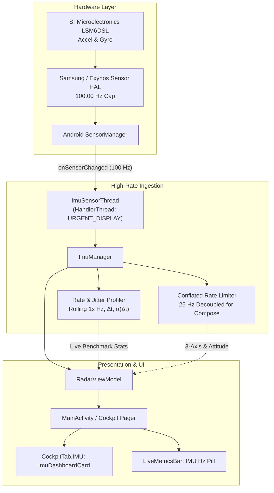

# RoadSense: Sensors & IMU Subsystem Documentation Index

> **Directory:** `intel/Implementations/Sensors/`  
> **Status:** Active / Production Ready  
> **Target Hardware:** Samsung Galaxy M30s / M21 family (`SM-M305F` / Exynos 7904/9611)  
> **Last Updated:** 2026-09-23  

---

## 1. Documentation Index

This directory centralizes all hardware audits, architectural plans, empirical benchmarks, and implementation walkthroughs for RoadSense's onboard motion and vision sensors:

| Document | Purpose | Key Content |
|---|---|---|
| [`DEVICE_SENSOR_AND_CAMERA_CAPABILITIES.md`](DEVICE_SENSOR_AND_CAMERA_CAPABILITIES.md) | **Hardware Audit & Register Analysis** | Live ADB extraction (`dumpsys sensorservice`, `dumpsys media.camera`) covering all 18 phone sensors, STMicroelectronics LSM6DSL 6-DOF IMU, 100 Hz HAL cap, and all 4 camera HAL devices (including Ultra-Wide). |
| [`imu_sensor_implementation_plan.md`](imu_sensor_implementation_plan.md) | **Subsystem Implementation Plan** | Phase 1 technical design, permissions, dedicated background `HandlerThread`, empirical rate profiler, and multi-sensor UI architecture. |
| [`walkthrough.md`](walkthrough.md) | **Walkthrough & Verification Runbook** | Detailed summary of implemented code, test results (38/38 unit tests passing), APK packaging, and step-by-step physical device test guide. |
| [`raw_dumps/`](raw_dumps/) | **Raw Diagnostic Artifacts** | Unprocessed ADB dumps (`raw_sensorservice_dump.txt`, `raw_camera_dump.txt`) and automated extraction parser (`parse_device_capabilities.py`). |

---

## 2. IMU Architecture Overview

---

## 3. Recommended Sensor Suite for In-Vehicle Logging

1. **`LSM6DSL Accelerometer` (100 Hz):** Raw specific force ($m/s^2$) with $1g$ gravity component.
2. **`LSM6DSL Gyroscope` (100 Hz):** Vehicle angular rates ($\omega_x, \omega_y, \omega_z$ in $^\circ/s$).
3. **`Samsung Linear Acceleration` (100 Hz):** "Accelerometer without $g$". Direct longitudinal braking/acceleration and lateral cornering forces.
4. **`Samsung Game Rotation Vector` (100 Hz):** 6-DOF orientation quaternion $[x,y,z,w]$ without magnetometer (**immune to vehicle chassis magnetic interference**).
