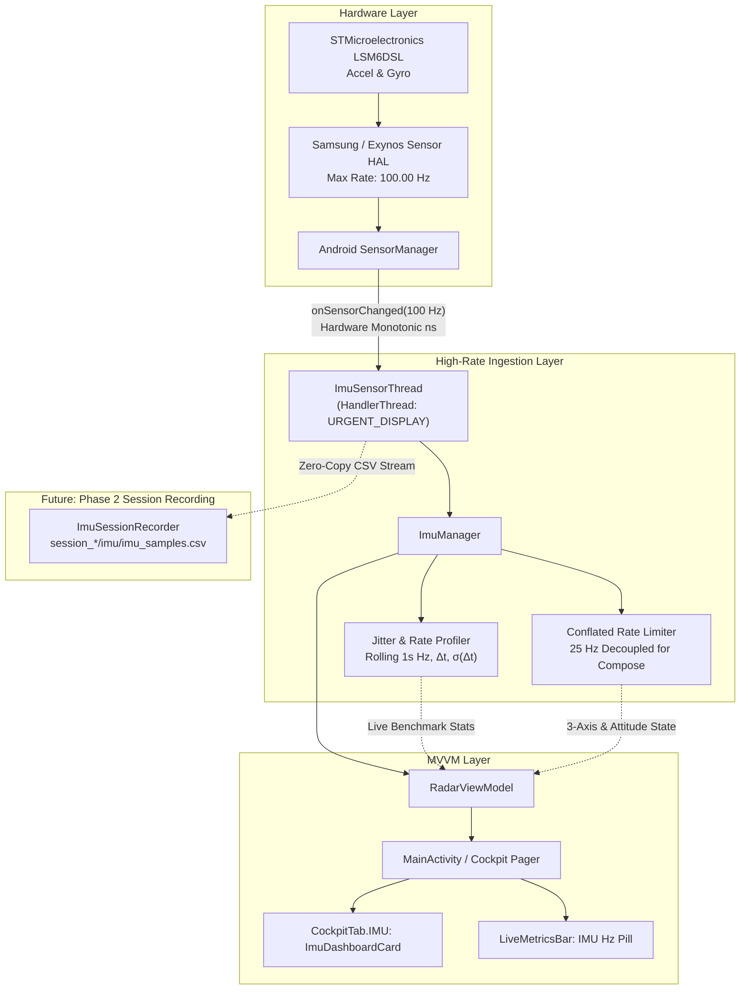

# Implementation Plan: IMU Subsystem Integration & Empirical Rate Discovery

> **Document Name:** `imu_sensor_implementation_plan.md`  
> **Workspace Location:** `intel/Implementations/Sensors/imu_sensor_implementation_plan.md`  
> **Subsystem:** Inertial Measurement Unit (IMU) Subsystem  
> **Hardware Target:** Samsung Galaxy M30s (`SM-M305F` / Exynos 7904/9611) — Verified via ADB Audit  
> **Status:** Proposed for User Review  

---

## 1. Goal Description

Following our live ADB hardware audit (`DEVICE_SENSOR_AND_CAMERA_CAPABILITIES.md`), we confirmed that the target device is equipped with the **STMicroelectronics LSM6DSL 6-DOF IMU** (Accelerometer & Gyroscope) and **Yamaha YAS539 Magnetometer**, with the Android HAL clamping continuous rate delivery to **100.00 Hz** ($10.0\,\text{ms}$ interval).

This plan establishes the complete Phase 1 IMU subsystem in RoadSense:
1. **Full Hardware Sensor Audit:** Automatically queries and exposes all 18 phone sensors (LSM6DSL Accelerometer/Gyro, Linear Acceleration without $g$, Gravity, Game Rotation Vector, etc.) with hardware specs, vendors, resolution, and HAL limits.
2. **Dedicated Background HandlerThread:** Acquires sensor callbacks off the Android main thread at high priority (`THREAD_PRIORITY_URGENT_DISPLAY`), guaranteeing zero UI frame drops.
3. **Empirical Sampling Rate Profiler & Jitter Analyzer:** Tests any sensor across standard delay presets (`FASTEST`, `100 Hz`, `50 Hz`, `20 Hz`), calculating real-time measured Hz, inter-arrival time ($\Delta t$), and timing jitter standard deviation ($\sigma_{\Delta t}$).
4. **Live Multi-Sensor Visualizer:** Side-by-side display of Raw Accel vs Linear Accel (without $g$), Gyroscope rates ($\omega_x, \omega_y, \omega_z$), and 6-DOF vehicle attitude (Pitch, Roll, Yaw) throttled at ~25 Hz for smooth UI.
5. **Cockpit Integration:** Adds a new **IMU Cockpit Card** between GNSS and Camera, plus a live `IMU: 100.0 Hz` pill in the top `LiveMetricsBar`.

---

## 2. Architecture & Data Flow



### Monotonic Nanosecond Synchronization
Android `SensorEvent.timestamp` reports hardware nanoseconds since boot (`SystemClock.elapsedRealtimeNanos()`).
- Matches RoadSense's core timeline (`session_timeline.csv`).
- Aligns directly with radar packet headers, camera PTS, and GNSS monotonic arrival times.

---

## 3. User Review Required

> [!IMPORTANT]
> **Cockpit Tab Reordering**  
> As confirmed, the new Cockpit tab sequence is:  
> `RADAR` (0) $\rightarrow$ `GNSS` (1) $\rightarrow$ **`IMU` (2)** $\rightarrow$ `CAMERA` (3) $\rightarrow$ `CANEDGE` (4) $\rightarrow$ `SBS` (5) $\rightarrow$ `SESSION` (6).  
> The swipe-lock (`userScrollEnabled = false`) is preserved so user gestures on calibration or sliders never cause accidental tab transitions.

> [!NOTE]
> **Dual Operation Modes in `ImuManager`**  
> 1. **Active Benchmark Mode:** Targets a single selected sensor (e.g. LSM6DSL Accel) to measure empirical rate stability and jitter over a testing window.  
> 2. **Low-Overhead Live Monitor Mode:** Concurrently listens to Accel, Linear Accel (without $g$), Gyro, and Game Rotation Vector, downsampled to 25 Hz for cockpit gauges with $<1.5\%$ CPU overhead.

---

## 4. Proposed Changes

### Component 1: Permissions & Manifest
#### [MODIFY] [AndroidManifest.xml](file:///C:/Users/rakadu1.AHEAD/AndroidStudioProjects/RoadSense/app/src/main/AndroidManifest.xml)
- Add `<uses-permission android:name="android.permission.HIGH_SAMPLING_RATE_SENSORS" />` so Android does not throttle sensor callbacks.

---

### Component 2: IMU Core Engine (`com.bajajauto.roadsense.imu`)
#### [NEW] [ImuSensorCapability.kt](file:///C:/Users/rakadu1.AHEAD/AndroidStudioProjects/RoadSense/app/src/main/java/com/bajajauto/roadsense/imu/ImuSensorCapability.kt)
- Represents detailed hardware specifications of any discovered sensor:
```kotlin
enum class SensorCategory { MOTION, ORIENTATION, UNCALIBRATED, AUXILIARY }

data class ImuSensorCapability(
    val sensorType: Int,
    val name: String,
    val vendor: String,
    val version: Int,
    val maxRange: Float,
    val resolution: Float,
    val powerMa: Float,
    val minDelayUs: Int,
    val maxDelayUs: Int,
    val maxRateHz: Float,
    val minRateHz: Float,
    val category: SensorCategory,
    val fifoMaxEventCount: Int
)
```

#### [NEW] [ImuSample.kt](file:///C:/Users/rakadu1.AHEAD/AndroidStudioProjects/RoadSense/app/src/main/java/com/bajajauto/roadsense/imu/ImuSample.kt)
- Represents a single high-precision sensor reading:
  - `elapsedRealtimeNs: Long`, `wallTimeMs: Long`, `sensorType: Int`, `values: FloatArray`, `accuracy: Int`
  - Getters: `x`, `y`, `z`, `magnitude`
  - Quaternion getters (for orientation): `qw`, `qx`, `qy`, `qz`, and computed Euler angles: `pitchDeg`, `rollDeg`, `yawDeg`
  - Formatted `toCsvRow()` for future recording.

#### [NEW] [ImuSamplingBenchmark.kt](file:///C:/Users/rakadu1.AHEAD/AndroidStudioProjects/RoadSense/app/src/main/java/com/bajajauto/roadsense/imu/ImuSamplingBenchmark.kt)
- Statistical model for empirical rate evaluation:
```kotlin
enum class ImuRatePreset(val label: String, val delayUs: Int, val targetHz: Float) {
    FASTEST("FASTEST (0 µs)", 0, 100f),
    RATE_100HZ("100 Hz (10,000 µs)", 10000, 100f),
    RATE_50HZ("50 Hz (20,000 µs)", 20000, 50f),
    RATE_20HZ("20 Hz (50,000 µs)", 50000, 20f)
}

data class ImuSamplingBenchmark(
    val sensorName: String = "",
    val sensorType: Int = 0,
    val preset: ImuRatePreset = ImuRatePreset.RATE_100HZ,
    val measuredHz: Float = 0f,
    val totalSamples: Long = 0L,
    val durationMs: Long = 0L,
    val meanIntervalMs: Float = 0f,
    val minIntervalMs: Float = 0f,
    val maxIntervalMs: Float = 0f,
    val jitterStdDevMs: Float = 0f,
    val isRunning: Boolean = false
)
```

#### [NEW] [ImuTelemetryState.kt](file:///C:/Users/rakadu1.AHEAD/AndroidStudioProjects/RoadSense/app/src/main/java/com/bajajauto/roadsense/imu/ImuTelemetryState.kt)
- Conflated 25 Hz state model for Compose UI:
  - `rawAccel: FloatArray` ($X, Y, Z, |a|$)
  - `linearAccel: FloatArray` ($X, Y, Z, |a|$ without $g$)
  - `gyroRates: FloatArray` ($\omega_x, \omega_y, \omega_z$ in $^\circ/s$)
  - `pitchDeg: Float`, `rollDeg: Float`, `yawDeg: Float`
  - `isMonitoring: Boolean`

#### [NEW] [ImuManager.kt](file:///C:/Users/rakadu1.AHEAD/AndroidStudioProjects/RoadSense/app/src/main/java/com/bajajauto/roadsense/imu/ImuManager.kt)
- High-rate acquisition manager:
  - Spawns background `HandlerThread("RoadSense-ImuThread", Process.THREAD_PRIORITY_URGENT_DISPLAY)`.
  - Discovers all sensors via `sensorManager.getSensorList(Sensor.TYPE_ALL)`.
  - Sliding circular buffer of the last 100 inter-arrival timestamps ($\Delta t = t_i - t_{i-1}$) for $O(1)$ mean and standard deviation ($\sigma$) computation with zero garbage-collection allocations.
  - Implements benchmark start/stop and continuous monitoring start/stop.

---

### Component 3: ViewModel & UI Integration
#### [MODIFY] [RadarViewModel.kt](file:///C:/Users/rakadu1.AHEAD/AndroidStudioProjects/RoadSense/app/src/main/java/com/bajajauto/roadsense/ui/RadarViewModel.kt)
- Instantiate `ImuManager(application)`.
- Expose StateFlows:
  - `imuCapabilities: StateFlow<List<ImuSensorCapability>>`
  - `imuBenchmarkStats: StateFlow<ImuSamplingBenchmark>`
  - `imuTelemetry: StateFlow<ImuTelemetryState>`
  - `imuHz: StateFlow<Float>`
  - `isImuBenchmarking: StateFlow<Boolean>`
  - `isImuMonitoring: StateFlow<Boolean>`
- Relay UI commands (`startImuBenchmark`, `stopImuBenchmark`, `startImuMonitoring`, `stopImuMonitoring`).

#### [NEW] [ImuDashboardCard.kt](file:///C:/Users/rakadu1.AHEAD/AndroidStudioProjects/RoadSense/app/src/main/java/com/bajajauto/roadsense/ui/screens/ImuDashboardCard.kt)
- Cockpit Card featuring 3 sub-tabs:
  1. **[Hardware Audit]:** Filterable catalog showing all 18 sensors, chip names, vendors, resolutions, power consumption, and HAL rate caps.
  2. **[Rate Profiler]:** Interactive test bench with sensor dropdown, preset buttons (`FASTEST`, `100 Hz`, `50 Hz`, `20 Hz`), Start/Stop button, live KPI cards (Measured Hz, Timing Jitter $\sigma$, Min/Max $\Delta t$, Total Samples).
  3. **[Live Telemetry]:** Live visualizers comparing Raw Accel vs Linear Accel (without $g$), Gyroscope angular velocities, and vehicle attitude (Pitch, Roll, Yaw).

#### [MODIFY] [LiveMetricsBar.kt](file:///C:/Users/rakadu1.AHEAD/AndroidStudioProjects/RoadSense/app/src/main/java/com/bajajauto/roadsense/ui/components/LiveMetricsBar.kt)
- Add `imuHz: Float` and render `IMU: 100.0 Hz` pill in both landscape and portrait layouts.

#### [MODIFY] [MainActivity.kt](file:///C:/Users/rakadu1.AHEAD/AndroidStudioProjects/RoadSense/app/src/main/java/com/bajajauto/roadsense/ui/MainActivity.kt)
- Insert `CockpitTab.IMU("IMU", Icons.Default.Explore)` between `GNSS` and `CAMERA`.
- Wire `ImuDashboardCard` into `HorizontalPager`.

---

## 5. Verification Plan

### Automated Tests
Run standard JVM unit tests via Gradle:
```powershell
$env:JAVA_HOME = "C:\Users\rakadu1.AHEAD\Android_Studio\android-studio-quail4-windows\android-studio\jbr"
./gradlew testDebugUnitTest
```

#### New Unit Tests:
- `ImuSensorCapabilityTest.kt`: Validate parsing and categorization of `Sensor` types, theoretical frequency conversions ($10^6 / \text{minDelayUs}$), and FIFO descriptions.
- `ImuSamplingBenchmarkTest.kt`: Feed synthetic nanosecond timestamp series (exact 100 Hz, 50 Hz, plus synthetic Gaussian timing jitter) into the statistical interval analyzer; verify measured Hz, average $\Delta t$, min/max, and standard deviation calculations match expected ground truth.
- `ImuSampleTest.kt`: Validate linear acceleration without $g$, magnitude calculations, Euler angle conversions from quaternions, and CSV row formatting.

### Manual Verification on Hardware (Runbook for User)
1. **Launch App:**
   - Confirm the new **IMU** tab appears directly between GNSS and Camera.
2. **Sensor Audit Sub-Tab:**
   - Tap **Sensor Audit**. Confirm the app lists the 18 sensors found in our ADB audit (`LSM6DSL Accelerometer`, `LSM6DSL Gyroscope`, `YAS539 Magnetometer`, `Samsung Linear Acceleration`, `Game Rotation Vector`).
3. **Rate Profiler Sub-Tab:**
   - Select `LSM6DSL Accelerometer` $\rightarrow$ Choose `100 Hz (10,000 µs)` $\rightarrow$ Tap **Start Benchmark**.
   - Confirm the empirical measured frequency stabilizes around **`100.0 Hz`** with small jitter ($\sigma < 1.0\,\text{ms}$).
   - Test `FASTEST` preset to observe hardware uncapped behavior.
4. **Live Telemetry Sub-Tab:**
   - Tap **Start Live Telemetry**.
   - Tilt and shake the device; confirm Accel $X/Y/Z$ and Gyro $\omega_x/\omega_y/\omega_z$ respond with zero UI lag.
   - Confirm the top `LiveMetricsBar` displays `IMU: 100.0 Hz` in green.

---
