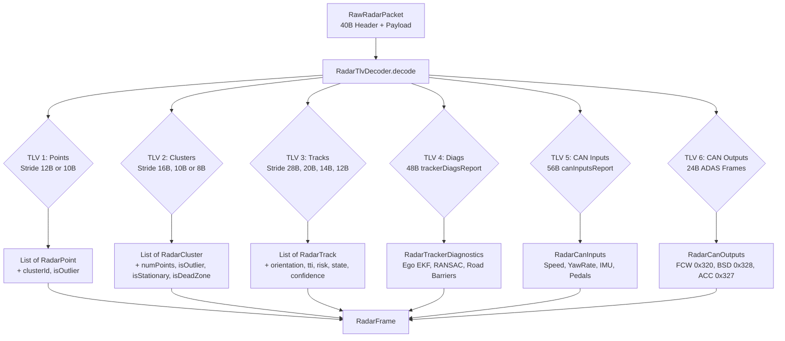

# Implementation Plan: TI AWR1843 Custom MRR v2.1/v2.2 Multi-TLV Decoder Pipeline

## Goal Description
Update RoadSense's radar acquisition and decoding engine to support the updated **TI AWR1843 Custom MRR (v2.1 / v2.2) Multi-TLV specification** recently committed to `D:\Gitea\CAN_unified_radar_tracker_py`.

This encompasses:
1. Updating our repository's specification guide: [`intel/radar_tlv_structure_and_decoding_guide.md`](file:///C:/Users/rakadu1.AHEAD/AndroidStudioProjects/RoadSense/intel/radar_tlv_structure_and_decoding_guide.md).
2. Updating domain data models in [`RadarFrame.kt`](file:///C:/Users/rakadu1.AHEAD/AndroidStudioProjects/RoadSense/app/src/main/java/com/bajajauto/roadsense/models/RadarFrame.kt) to support point clustering/outlier flags, extended cluster properties, 28-byte rich track properties (orientation heading, TTI, risk, stationary state, TTC category, confidence), and new models for Tracker Diagnostics (TLV 4), Vehicle CAN Inputs (TLV 5), and Safety ADAS Outputs (TLV 6).
3. Enhancing the binary decoder in [`RadarTlvDecoder.kt`](file:///C:/Users/rakadu1.AHEAD/AndroidStudioProjects/RoadSense/app/src/main/java/com/bajajauto/roadsense/decoding/RadarTlvDecoder.kt) with adaptive stride detection (12B vs 10B points, 16B vs 10B vs 8B clusters, 28B vs 20B vs 14B vs 12B tracks), proper 20B struct unpacking (`<7h3H`), and dedicated decoders for TLVs 4, 5, and 6.
4. Updating existing unit tests and adding comprehensive test vectors in [`RadarTlvDecoderTest.kt`](file:///C:/Users/rakadu1.AHEAD/AndroidStudioProjects/RoadSense/app/src/test/java/com/bajajauto/roadsense/decoding/RadarTlvDecoderTest.kt) to guarantee zero regressions.

---

## User Review Required

> [!IMPORTANT]
> **Full Backward Compatibility:** The new decoders will use adaptive stride detection (`actualStride = (tlvLength - 4) / numObjects`). If pre-recorded session files or legacy firmware streams are fed into RoadSense (e.g. 10B points, 8B clusters, 14B or 20B tracks), they will continue to decode seamlessly without errors.

> [!NOTE]
> **TLV 4 Divergence:** In older standard MRR firmware, TLV 4 was "Parking Assist" (32-bin radial distance array). In Custom MRR v2.1/v2.2, TLV 4 is "Tracker Diagnostics" (48-byte RANSAC, ego EKF, road barriers). Our decoder will inspect payload length: if $48\,\text{bytes}$, it decodes `RadarTrackerDiagnostics`; if $68\,\text{bytes}$ ($4 + 32 \times 2$), it decodes legacy parking assist.

---

## Architecture & Data Flow



---

## Proposed Changes

### Phase 1: Documentation & Technical Guide Update

#### [MODIFY] [`intel/radar_tlv_structure_and_decoding_guide.md`](file:///C:/Users/rakadu1.AHEAD/AndroidStudioProjects/RoadSense/intel/radar_tlv_structure_and_decoding_guide.md)
* Update reference repository link to `D:\Gitea\CAN_unified_radar_tracker_py`.
* Document the 12-byte Extended Point Cloud format (`<hHhhhBB`).
* Document the 16-byte Extended DBSCAN Cluster format (`<hhhhHHBBBB`).
* Document the 28-byte Extended Track v2.2 format (`<hhhhhhhHHHhBBBBH`) and clarify the 20-byte struct `<7h3H`.
* Document the new TLV Type 4 (Tracker Diagnostics, 48B), TLV Type 5 (Vehicle CAN Inputs, 56B), and TLV Type 6 (Safety ADAS Outputs, 24B: FCW `0x320`, BSD `0x328`, ACC `0x327`).

---

### Phase 2: Domain Data Models

#### [MODIFY] [`RadarFrame.kt`](file:///C:/Users/rakadu1.AHEAD/AndroidStudioProjects/RoadSense/app/src/main/java/com/bajajauto/roadsense/models/RadarFrame.kt)
1. **Extend `RadarPoint`** with default values for backward compatibility:
   ```kotlin
   data class RadarPoint(
       val x: Float,
       val y: Float,
       val z: Float,
       val doppler: Float,
       val snrDb: Float,
       val clusterId: Int = 0,
       val isOutlier: Boolean = false
   )
   ```
2. **Extend `RadarCluster`**:
   ```kotlin
   data class RadarCluster(
       val x: Float,
       val y: Float,
       val vx: Float = 0f,
       val vy: Float = 0f,
       val cid: Int = 0,
       val xSize: Float = 1.2f,
       val ySize: Float = 1.2f,
       val numPoints: Int = 0,
       val isOutlier: Boolean = false,
       val isStationary: Boolean = false,
       val isDeadZone: Boolean = false
   )
   ```
3. **Extend `RadarTrack`**:
   ```kotlin
   data class RadarTrack(
       val tid: Int,
       val x: Float,
       val y: Float,
       val vx: Float,
       val vy: Float,
       val xSize: Float,
       val ySize: Float,
       val majorSize: Float = xSize,
       val minorSize: Float = ySize,
       val orientationDeg: Float = 0f,
       val state: Int = 3, // 0: Free, 1: Tentative, 3: Confirmed, 4: Coasted, 5: Dead
       val clusterId: Int = 0,
       val ttiSec: Float = Float.POSITIVE_INFINITY,
       val risk: Int = 0, // 0: Safe, 1: Warning, 2: Critical
       val isStationary: Boolean = false,
       val ttcCategory: Int = 0,
       val confidencePct: Int = 100
   )
   ```
4. **Add New Diagnostic & CAN Telemetry Data Classes**:
   - `data class RadarTrackerDiagnostics(...)`: RANSAC convergence, motion state ($-2 \dots +2$), filtered velocities, ego EKF estimates ($V_x, V_y, A_x, A_y, \dot{\psi}$), road boundary markers ($X_{\text{left}}, X_{\text{right}}$), dynamic acceleration, processing latency.
   - `data class RadarCanInputs(...)`: Speed (km/h), yaw rate, pitch/roll rates, acceleration vectors, road grade, motor torque, gear, brake/throttle pedal statuses, VCU valid flag.
   - `data class RadarFcwOutput(...)`, `data class RadarBsdOutput(...)`, `data class RadarAccOutput(...)`, and wrapper `data class RadarCanOutputs(...)`.
5. **Update `RadarFrame`** to include the new nullable fields:
   ```kotlin
   data class RadarFrame(
       val header: RadarHeader,
       val points: List<RadarPoint> = emptyList(),
       val tracks: List<RadarTrack> = emptyList(),
       val clusters: List<RadarCluster> = emptyList(),
       val diagnostics: RadarTrackerDiagnostics? = null,
       val canInputs: RadarCanInputs? = null,
       val canOutputs: RadarCanOutputs? = null,
       val rawPacket: RawRadarPacket
   )
   ```

---

### Phase 3: Binary TLV Decoding Engine

#### [MODIFY] [`RadarTlvDecoder.kt`](file:///C:/Users/rakadu1.AHEAD/AndroidStudioProjects/RoadSense/app/src/main/java/com/bajajauto/roadsense/decoding/RadarTlvDecoder.kt)
1. **Constants**:
   - `TLV_TRACKER_DIAGS = 4`
   - `TLV_CAN_INPUTS = 5`
   - `TLV_CAN_OUTPUTS = 6`
2. **TLV 1 Parser (`parseDetectedPoints`)**:
   - Inspect `actualStride = (tlvLength - 4) / numPoints`.
   - If `actualStride >= 12`: read 12-byte structs (`doppler, peakVal, x, y, z, clusterID (u1), isOutlier (u1)`).
   - If `actualStride < 12`: read 10-byte structs (`doppler, peakVal, x, y, z`).
3. **TLV 2 Parser (`parseClusters`)**:
   - If `actualStride >= 16`: read 16-byte structs (`xCenter, yCenter, xSize, ySize, clusterID (u2), numPoints (u2), isOutlier (u1), isStationary (u1), isDeadZone (u1), reserved (u1)`).
   - If `actualStride == 10`: read 10-byte structs (`<4h2B`).
   - If `actualStride == 8`: read 8-byte structs (`<4h`).
4. **TLV 3 Parser (`parseTracks`)**:
   - If `actualStride >= 28`: read 28-byte v2.2 structs (`x, y, vx, vy, majorSize, minorSize, orientation (raw * 0.1), tid, state, clusterID, tti (raw * 0.01s), risk, isStationary, ttcCategory, confidence, reserved`).
   - If `actualStride >= 20`: read 20-byte structs (`<7h3H`: `x, y, vx, vy, majorSize, minorSize, orientation, tid, state, reserved`). Filter out inactive slots (`state == 0`).
   - If `actualStride >= 14`: read 14-byte structs (`x, y, vx, vy, xSize, ySize, tid`).
   - If `actualStride == 12`: read 12-byte structs (`x, y, vx, vy, xSize, ySize`).
5. **TLV 4 Parser (`parseTrackerDiagnostics`)**:
   - If length is 48 bytes: unpack `<HBb10fHBB`.
   - If length is 68 bytes: handle legacy parking assist.
6. **TLV 5 Parser (`parseCanInputs`)**:
   - Unpack 56 bytes (`<fffffffffffIBBbBB3s`).
7. **TLV 6 Parser (`parseCanOutputs`)**:
   - Unpack 24 bytes: 8B FCW (`0x320`), 8B BSD (`0x328`), 8B ACC (`0x327`).

---

### Phase 4: Unit Testing & Verification

#### [MODIFY] [`RadarTlvDecoderTest.kt`](file:///C:/Users/rakadu1.AHEAD/AndroidStudioProjects/RoadSense/app/src/test/java/com/bajajauto/roadsense/decoding/RadarTlvDecoderTest.kt)
1. Verify legacy test cases pass (`decode_realAwr1843HardwarePayload`, `decode_frame545`, `decode_20ByteTracksFrame6312`).
2. Add new test: `decode_customMrr12BytePoints_parsesClusterAndOutlierFlagsCorrectly()`.
3. Add new test: `decode_customMrr16ByteClusters_parsesExtendedFieldsCorrectly()`.
4. Add new test: `decode_customMrr28ByteTracks_parsesOrientationTtiRiskAndConfidence()`.
5. Add new test: `decode_customMrrTlv4Diagnostics_parsesRansacAndEgoEkfValues()`.
6. Add new test: `decode_customMrrTlv5CanInputs_parsesVehicleSpeedAndImu()`.
7. Add new test: `decode_customMrrTlv6CanOutputs_parsesFcwBsdAccAlerts()`.

---

## Verification Plan

### Automated Tests
Run full JVM test suite using Android Studio's bundled JBR:
```powershell
$env:JAVA_HOME = "C:\Users\rakadu1.AHEAD\Android_Studio\android-studio-quail4-windows\android-studio\jbr"
./gradlew testDebugUnitTest
```

### Build APK
Verify clean compile and packaging:
```powershell
$env:JAVA_HOME = "C:\Users\rakadu1.AHEAD\Android_Studio\android-studio-quail4-windows\android-studio\jbr"
./gradlew assembleDebug
```
