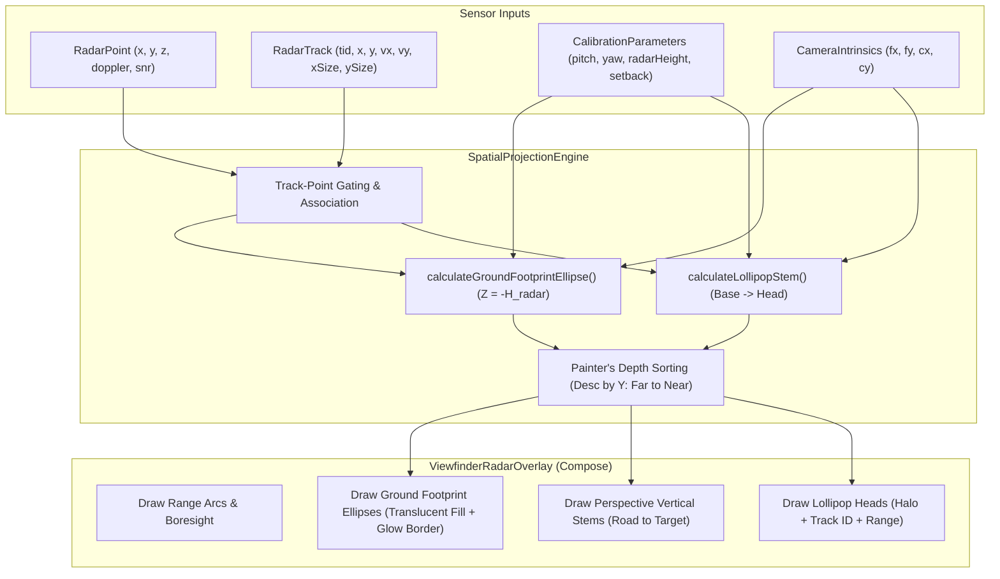

# Implementation Plan: Hybrid Radar Lollipop & Ground Plane Footprint Visualization

## Overview & Goal
This plan defines the step-by-step implementation for visualizing radar detections and tracks on top of the camera viewfinder using a **Hybrid RViz Lollipop + Ground Plane Footprint Ellipse** technique.

By projecting a 3D ground contact ellipse on the asphalt ($Z = -H_{\text{radar}}$), a vertical perspective tether stem, and a centroid head badge, we eliminate depth ambiguity and occlusion reversal (where distant objects appear to float on foreground vehicles).

---

## User Review Required

> [!IMPORTANT]
> **Track-Only vs. Hybrid Clutter Filtering:**
> The plan supports two modes:
> 1. **Full Hybrid:** Tracked targets receive the complete Footprint Ellipse + Vertical Stem + Head Badge. Untracked points receive a subtle, minimalist micro-stem/dot with distance alpha falloff so raw radar returns remain visible without cluttering.
> 2. **Tracked-Only View:** Untracked points can be toggled off or dimmed to 15% opacity so only verified tracked vehicles appear.

---

## Architecture & Mathematical Formulation



### 1. The Ground Contact Footprint (Base Ellipse)
For any target at $(X, Y)$:
- Road asphalt elevation relative to radar: $Z_{\text{road}} = -H_{\text{radar}}$ (e.g. $-0.95\,\text{m}$).
- Physical footprint dimensions:
  - Track: $r_x = \text{max}(0.8\,\text{m}, \frac{\text{track.xSize}}{2})$, $r_y = \text{max}(0.8\,\text{m}, \frac{\text{track.ySize}}{2})$
  - Point cluster: $r_x = 0.35\,\text{m}$, $r_y = 0.35\,\text{m}$
- Polygon vertices are generated in 3D ground space:
  $$X_i = X + r_x \cos\theta_i, \quad Y_i = Y + r_y \sin\theta_i, \quad Z = Z_{\text{road}}$$
- Projected through camera extrinsics and intrinsics to produce an authentic perspective-foreshortened ellipse flat on the road.

### 2. The Vertical Perspective Stem
- **Base (Road Anchor):** $P_{\text{base}} = (X, Y, Z_{\text{road}}) \xrightarrow{} (u_{\text{base}}, v_{\text{base}})$
- **Head (Centroid):** $P_{\text{head}} = (X, Y, Z_{\text{head}}) \xrightarrow{} (u_{\text{head}}, v_{\text{head}})$
  - Where $Z_{\text{head}} \approx Z_{\text{road}} + 0.70\,\text{m}$ (typical passenger car center of mass) or $Z_{\text{pt}}$ for 3D points.
- Connecting line: A vertical gradient or dashed tether between $(u_{\text{base}}, v_{\text{base}})$ and $(u_{\text{head}}, v_{\text{head}})$.

### 3. Depth Sorting (Painter's Algorithm) & Alpha Falloff
- Targets are sorted descending by distance $Y$ ($120\,\text{m} \rightarrow 0\,\text{m}$).
- Distance-based opacity:
  $$\alpha = \text{clamp}\left(1.0 - \frac{Y}{100\,\text{m}} \times 0.70,\; 0.20,\; 0.95\right)$$
- Far objects render with soft, translucent lines; near objects render fully opaque and naturally occlude distant stems.

---

## Phased Implementation Plan

```
Phase 1: Math Models & Projections in SpatialProjectionEngine.kt
    │
Phase 2: Track Association & Depth Sorting
    │
Phase 3: Canvas Rendering in ViewfinderRadarOverlay.kt
    │
Phase 4: JVM Unit Tests & Live APK Verification
```

---

### Phase 1: SpatialProjectionEngine Math & Models

#### [MODIFY] [`SpatialProjectionEngine.kt`](file:///C:/Users/rakadu1.AHEAD/AndroidStudioProjects/RoadSense/app/src/main/java/com/bajajauto/roadsense/fusion/engine/SpatialProjectionEngine.kt)
1. Add data structures:
   ```kotlin
   data class ProjectedFootprint(
       val center: ScreenPoint,
       val polygon: List<ScreenPoint>
   )

   data class ProjectedRadarLollipop(
       val basePt: ScreenPoint,
       val headPt: ScreenPoint,
       val footprint: ProjectedFootprint?,
       val depthM: Float,
       val rangeM: Float,
       val isTracked: Boolean,
       val trackId: Int?,
       val dopplerMps: Float,
       val snrDb: Float,
       val label: String
   )
   ```
2. Implement `calculateGroundFootprintEllipse(...)`:
   - Samples 12 radial points around $(X, Y, Z_{\text{road}})$.
   - Projects each point into screen space $(u, v)$.
3. Implement `calculateRadarLollipops(...)`:
   - Takes `RadarFrame`, `CalibrationParameters`, and `CameraIntrinsics`.
   - Associates points with nearby tracks (gating radius $\approx 1.8\,\text{m}$).
   - Computes base and head projections.
   - Sorts results descending by `depthM`.

---

### Phase 2: Canvas Rendering in ViewfinderRadarOverlay

#### [MODIFY] [`ViewfinderRadarOverlay.kt`](file:///C:/Users/rakadu1.AHEAD/AndroidStudioProjects/RoadSense/app/src/main/java/com/bajajauto/roadsense/ui/components/ViewfinderRadarOverlay.kt)
1. Call `SpatialProjectionEngine.calculateRadarLollipops(...)`.
2. For each lollipop (sorted far-to-near):
   - **Step A:** Draw ground ellipse footprint (`drawPath` with translucent fill and glowing border stroke).
   - **Step B:** Draw vertical perspective stem from `basePt` to `headPt`.
   - **Step C:** Draw lollipop head circle (radius scaled by distance).
   - **Step D (Tracks):** Draw Track ID badge (e.g. `#1 • 14m`) and Doppler speed indicator.

---

### Phase 3: Unit Testing & Verification

#### [MODIFY] [`SpatialProjectionEngineTest.kt`](file:///C:/Users/rakadu1.AHEAD/AndroidStudioProjects/RoadSense/app/src/test/java/com/bajajauto/roadsense/fusion/SpatialProjectionEngineTest.kt)
1. `testCalculateGroundFootprintProducesConvexPolygon()`:
   - Verifies 12-point ground ellipse generates valid screen coordinates within viewport.
2. `testLollipopBaseIsStrictlyLowerOnScreenThanHead()`:
   - Mathematically verifies that for any target on the road, $v_{\text{base}} > v_{\text{head}}$ (base is lower on screen / closer to road).
3. `testLollipopDepthSortingIsMonotonicDescending()`:
   - Verifies that targets are strictly ordered from farthest to nearest for Painter's algorithm.

---

## Verification Plan

### Automated JVM Tests
```powershell
$env:JAVA_HOME = "C:\Users\rakadu1.AHEAD\Android_Studio\android-studio-quail4-windows\android-studio\jbr"
./gradlew testDebugUnitTest
```

### Build & Deploy to Phone
```powershell
$env:JAVA_HOME = "C:\Users\rakadu1.AHEAD\Android_Studio\android-studio-quail4-windows\android-studio\jbr"
./gradlew assembleDebug
& "C:\Users\rakadu1.AHEAD\AppData\Local\Android\Sdk\platform-tools\adb.exe" install -r app\build\outputs\apk\debug\app-debug.apk
```

### Manual Verification
1. Open Calibration Studio with Simulated Point Cloud (car target at 10m).
2. Verify that the car target displays a ground ellipse resting on the asphalt with a vertical stem reaching up to the car's centroid.
3. Verify that distant points at 30m–60m appear as subtle, translucent pins and do not clutter or visually occlude near targets.
4. Verify smooth rendering at 30/60 FPS without frame drops.
