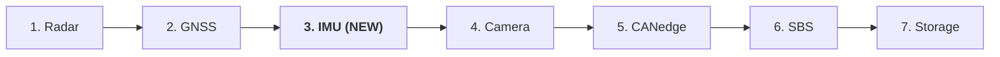
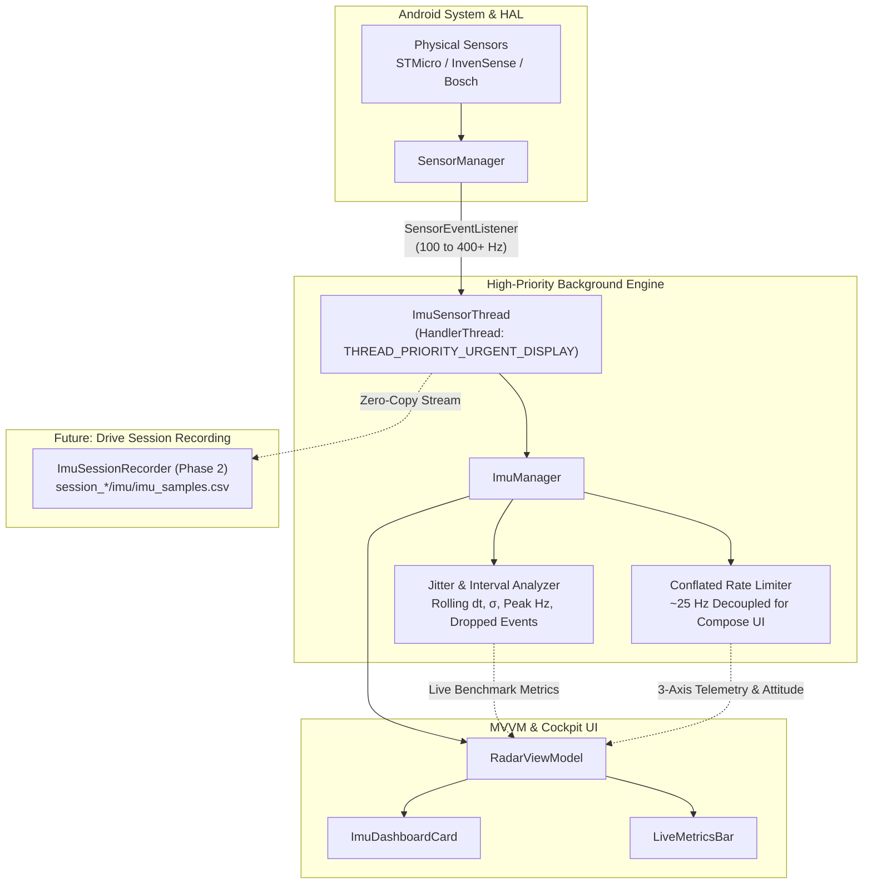

# Implementation Plan: IMU & Multi-Sensor Exploration & Empirical Rate Profiling

> **Document Name:** `imu_integration_and_sampling_rate_discovery.md`  
> **Workspace Location:** `intel/Implementations/imu_integration_and_sampling_rate_discovery.md`  
> **Subsystem:** Inertial Measurement Unit (IMU) Subsystem (Phase 1: Full Sensor Audit, Multi-Mode Profiling & Discovery)  
> **Target Hardware:** Android Sensor Framework (Samsung Galaxy M21 / Exynos 9611 / InvenSense or STMicroelectronics IMU)  
> **Status:** Updated with User Feedback — Ready for Implementation  

---

## 1. Goal Description

RoadSense currently records and synchronizes mmWave Radar (20 Hz), Camera2 video (30 fps), GNSS position/speed (1–5 Hz), and CAN bus telemetry. To equip RoadSense with full automotive ADAS and sensor fusion capability (ego-motion compensation, dead-reckoning during GNSS tunnels/occlusion, pitch/roll compensation for radar-camera extrinsics, and road surface vibration analysis), we are integrating the onboard **Inertial Measurement Unit (IMU)** and available hardware sensors.

Inspired by research and diagnostic tools like **phyphox**, Android phones offer a rich array of physical and synthetic fused sensors beyond just raw acceleration and rate of turn:
1. **Raw Accelerometer (`TYPE_ACCELEROMETER`):** Triaxial acceleration including the $1g$ ($9.81\,\text{m/s}^2$) gravitational component.
2. **Linear Acceleration (`TYPE_LINEAR_ACCELERATION`):** "Accelerometer without $g$". Android HAL computes and subtracts gravity dynamically, yielding pure vehicle translational acceleration (braking, acceleration, cornering).
3. **Gravity (`TYPE_GRAVITY`):** Extracted gravity direction vector, indicating device tilt and vehicle slope/pitch.
4. **Gyroscope (`TYPE_GYROSCOPE`):** Angular velocity ($\omega_x, \omega_y, \omega_z$) in $\text{rad/s}$ or $^\circ/\text{s}$.
5. **Uncalibrated Motion Sensors (`TYPE_ACCELEROMETER_UNCALIBRATED`, `TYPE_GYROSCOPE_UNCALIBRATED`):** Raw measurements without factory calibration or online bias estimation, plus separate estimated bias offsets per axis.
6. **Orientation & Fused Rotations:**
   - **Game Rotation Vector (`TYPE_GAME_ROTATION_VECTOR`):** 6-DOF fusion (Accel + Gyro) providing orientation quaternion $[x,y,z,w]$ **without** magnetometer. *Critical for automotive cabins where vehicle steel and high-voltage DC lines corrupt magnetic compass readings.*
   - **Rotation Vector (`TYPE_ROTATION_VECTOR`):** 9-DOF fusion (Accel + Gyro + Magnetometer) aligned with Earth's East-North-Up coordinate frame.
7. **Auxiliary Sensors:** Ambient Magnetic Field (`TYPE_MAGNETIC_FIELD`), Pressure/Barometer (`TYPE_PRESSURE`, if equipped, for vertical elevation and tunnel entry detection).

This plan establishes a **full sensor exploration cockpit** to audit all available sensors on the user's phone, benchmark their maximum achievable sampling rates, analyze timing jitter, and establish a high-efficiency background pipeline for production recording.

---

## 2. Cockpit Layout & Tab Ordering

Per user review, the Cockpit tab order is updated:
`RADAR` $\rightarrow$ `GNSS` $\rightarrow$ **`IMU`** $\rightarrow$ `CAMERA` $\rightarrow$ `CANEDGE` $\rightarrow$ `SBS` $\rightarrow$ `SESSION`.



### High-Density Live Metrics Ticker (`LiveMetricsBar.kt`)
In both landscape and portrait, the header ticker will now feature an **IMU** frequency pill:
`RADAR: 20.0 Hz` | `CAM: 30.0 fps` | `GPS: 1.0 Hz` | `IMU: 104.2 Hz` | `SVs: 14/18` | `BAT: 85% 31°C`

---

## 3. Subsystem Architecture & Threading Model



### 3.1 Clock Monotonicity & Hardware Timestamps
Android `SensorEvent.timestamp` reports hardware nanoseconds since boot (`SystemClock.elapsedRealtimeNanos()`).
- Zero drift against `session_timeline.csv`.
- Aligns directly with radar frame headers, camera PTS, and GNSS monotonic arrival times.

---

## 4. Operating Modes in `ImuDashboardCard`

The IMU Cockpit screen will provide 3 interactive operating modes:

### Mode 1: Comprehensive Sensor Audit (phyphox-style Explorer)
- Queries `SensorManager.getSensorList(Sensor.TYPE_ALL)` and groups sensors:
  - **Motion:** Accelerometer, Linear Accel (without $g$), Gyroscope, Gravity.
  - **Uncalibrated:** Accel Uncalibrated, Gyro Uncalibrated, Mag Uncalibrated.
  - **Orientation:** Game Rotation Vector (6-DOF), Rotation Vector (9-DOF).
  - **Auxiliary:** Pressure, Magnetic Field, Light.
- Displays for each:
  - Exact chip name, vendor, driver version.
  - Resolution ($m/s^2$, $rad/s$, $\mu T$), dynamic range, power consumption ($mA$).
  - **Hardware limits:** `minDelay` ($\mu s$) $\rightarrow$ Theoretical Max Rate ($f_{\max} = 10^6 / \text{minDelay}$), `fifoMaxEventCount`.

### Mode 2: Empirical Sampling Rate Profiler & Jitter Analyzer
- Select sensor to test (e.g. Accelerometer, Gyroscope, Linear Accel, Game Rotation Vector).
- Select requested delay preset:
  - `FASTEST` ($0\,\mu s$ — hardware uncapped rate)
  - `200 Hz` ($5,000\,\mu s$ — automotive dynamics standard)
  - `100 Hz` ($10,000\,\mu s$ — balanced telemetry)
  - `50 Hz` ($20,000\,\mu s$ — low power)
- **Live Empirical Readouts:**
  - Real-time frequency ($f_{\text{measured}}$ Hz) computed over a rolling 1-second window.
  - Inter-arrival interval statistics: mean $\Delta t$, min $\Delta t$, max $\Delta t$ (ms).
  - **Timing Jitter Standard Deviation ($\sigma_{\Delta t}$):** Quantifies OS scheduling variance and sensor driver jitter.
  - Cumulative sample count and elapsed benchmark duration.

### Mode 3: Live Multi-Sensor Telemetry & Attitude Visualizer
- Real-time 3-axis bars:
  - Raw Accel vs Linear Accel (without $g$) side-by-side (observe gravity cancellation in real time!).
  - Gyroscope angular velocities ($\omega_x, \omega_y, \omega_z$).
  - Vehicle attitude angles: Pitch ($^\circ$), Roll ($^\circ$), Yaw ($^\circ$) derived from `GameRotationVector`.
- Low-overhead UI throttling: Sensor updates stream at hardware speed on the background thread, but UI recomposition is strictly capped at ~25 Hz to eliminate GPU/CPU waste.

---

## 5. Proposed File Changes

### Component 1: Permissions & Manifest
#### [MODIFY] [AndroidManifest.xml](file:///C:/Users/rakadu1.AHEAD/AndroidStudioProjects/RoadSense/app/src/main/AndroidManifest.xml)
- Add `<uses-permission android:name="android.permission.HIGH_SAMPLING_RATE_SENSORS" />` so Android 12+ (API 31+) does not throttle sampling rates below 200 Hz.

---

### Component 2: IMU Core Engine & Models (`com.bajajauto.roadsense.imu`)
#### [NEW] [ImuSensorCapability.kt](file:///C:/Users/rakadu1.AHEAD/AndroidStudioProjects/RoadSense/app/src/main/java/com/bajajauto/roadsense/imu/ImuSensorCapability.kt)
- Represents detailed hardware specs of any discovered sensor:
  - `sensorType: Int`, `category: SensorCategory`, `name: String`, `vendor: String`, `version: Int`
  - `maxRange: Float`, `resolution: Float`, `powerMa: Float`
  - `minDelayUs: Int` $\rightarrow$ `theoreticalMaxHz: Float`
  - `maxDelayUs: Int` $\rightarrow$ `theoreticalMinHz: Float`
  - `fifoMaxEventCount: Int`, `fifoReservedEventCount: Int`
  - `isWakeUpSensor: Boolean`, `stringType: String`

#### [NEW] [ImuSample.kt](file:///C:/Users/rakadu1.AHEAD/AndroidStudioProjects/RoadSense/app/src/main/java/com/bajajauto/roadsense/imu/ImuSample.kt)
- Nanosecond timestamped data model:
  - `sensorType: Int`, `elapsedRealtimeNs: Long`, `wallTimeMs: Long`
  - `values: FloatArray` (3 to 5 elements depending on sensor)
  - Helper properties: `x`, `y`, `z`, `magnitude`, `pitchDeg`, `rollDeg`, `yawDeg`
  - `toCsvRow(): String` formatting for future session logging.

#### [NEW] [ImuSamplingBenchmark.kt](file:///C:/Users/rakadu1.AHEAD/AndroidStudioProjects/RoadSense/app/src/main/java/com/bajajauto/roadsense/imu/ImuSamplingBenchmark.kt)
- Statistical model for empirical rate evaluation:
  - `sensorName: String`, `requestedRatePreset: ImuRatePreset`, `targetFrequencyHz: Float`
  - `measuredFrequencyHz: Float`, `totalSamples: Long`, `durationMs: Long`
  - `meanIntervalMs: Float`, `minIntervalMs: Float`, `maxIntervalMs: Float`
  - `jitterStdDevMs: Float`
  - `isRunning: Boolean`

#### [NEW] [ImuManager.kt](file:///C:/Users/rakadu1.AHEAD/AndroidStudioProjects/RoadSense/app/src/main/java/com/bajajauto/roadsense/imu/ImuManager.kt)
- Central sensor controller:
  - Hardware discovery: audits all available sensors via `SensorManager.getSensorList(Sensor.TYPE_ALL)`.
  - Spawns high-priority `HandlerThread("ImuSensorThread")`.
  - Implements `SensorEventListener` with sliding circular timing buffer (100 samples) calculating instantaneous Hz and standard deviation $\sigma_{\Delta t}$.
  - Conflates telemetry for UI consumption at ~25 Hz (`StateFlow<ImuTelemetryState>`).
  - Implements start/stop methods for benchmarking specific sensors and delay presets.

---

### Component 3: ViewModel & UI Cockpit
#### [MODIFY] [RadarViewModel.kt](file:///C:/Users/rakadu1.AHEAD/AndroidStudioProjects/RoadSense/app/src/main/java/com/bajajauto/roadsense/ui/RadarViewModel.kt)
- Instantiate `ImuManager(application)`.
- Expose:
  - `imuCapabilities: StateFlow<List<ImuSensorCapability>>`
  - `imuBenchmarkStats: StateFlow<ImuSamplingBenchmark>`
  - `imuTelemetry: StateFlow<ImuTelemetryState>`
  - `imuHz: StateFlow<Float>`
- Relay benchmark control actions (`startBenchmark`, `stopBenchmark`, `selectSensorForBenchmark`).

#### [NEW] [ImuDashboardCard.kt](file:///C:/Users/rakadu1.AHEAD/AndroidStudioProjects/RoadSense/app/src/main/java/com/bajajauto/roadsense/ui/screens/ImuDashboardCard.kt)
- Cockpit Screen featuring:
  - **Sub-Tab Navigation:** `[Sensor Audit]`, `[Rate Profiler]`, `[Live Telemetry]`.
  - **Sensor Audit Sub-Tab:** Expandable cards displaying every detected physical and fused sensor, vendor details, and theoretical max Hz.
  - **Rate Profiler Sub-Tab:** Sensor dropdown, preset selector (`FASTEST`, `200 Hz`, `100 Hz`, `50 Hz`), Start/Stop button, live Hz counter, and $\Delta t$ jitter stats.
  - **Live Telemetry Sub-Tab:** Accel ($X,Y,Z$) vs Linear Accel comparison, Gyro rates, and Attitude (Pitch/Roll/Yaw) indicators.

#### [MODIFY] [LiveMetricsBar.kt](file:///C:/Users/rakadu1.AHEAD/AndroidStudioProjects/RoadSense/app/src/main/java/com/bajajauto/roadsense/ui/components/LiveMetricsBar.kt)
- Add `imuHz: Float` and render compact `IMU` pill in both landscape and portrait layouts.

#### [MODIFY] [MainActivity.kt](file:///C:/Users/rakadu1.AHEAD/AndroidStudioProjects/RoadSense/app/src/main/java/com/bajajauto/roadsense/ui/MainActivity.kt)
- Update `CockpitTab` enum to place `IMU` right after `GNSS` and before `CAMERA`:
  ```kotlin
  enum class CockpitTab(val title: String, val icon: ImageVector) {
      RADAR("Radar", Icons.Default.Sensors),
      GNSS("GNSS", Icons.Default.MyLocation),
      IMU("IMU", Icons.Default.Explore),
      CAMERA("Camera", Icons.Default.Videocam),
      CANEDGE("CANedge", Icons.Default.DirectionsCar),
      SBS("SBS", Icons.Default.Splitscreen),
      SESSION("Storage", Icons.Default.Folder)
  }
  ```
- Wire `CockpitTab.IMU` into `HorizontalPager`.

---

## 6. Verification Plan

### Automated Tests
Run standard JVM unit tests via Gradle:
```powershell
$env:JAVA_HOME = "C:\Users\rakadu1.AHEAD\Android_Studio\android-studio-quail4-windows\android-studio\jbr"
./gradlew testDebugUnitTest
```

#### New Unit Tests:
- `ImuSensorCapabilityTest.kt`: Validate parsing and categorization of `Sensor` types, theoretical frequency conversions ($10^6 / \text{minDelayUs}$), and FIFO descriptions.
- `ImuSamplingBenchmarkTest.kt`: Feed synthetic nanosecond timestamp series (e.g. 200 Hz with synthetic 0.5 ms Gaussian jitter) into the statistical interval analyzer; verify measured Hz, average $\Delta t$, min/max, and standard deviation calculations match expected ground truth.
- `ImuSampleTest.kt`: Validate linear acceleration without $g$, magnitude calculations, orientation conversions, and CSV row formatting.

### Manual Verification on Hardware (Runbook for User)
1. **Launch RoadSense on Phone:**
   - Confirm the new **IMU** tab appears between GNSS and Camera.
2. **Sensor Audit Mode:**
   - Tap **Sensor Audit**. Verify that the app lists all phone sensors (e.g. STMicroelectronics or InvenSense Accelerometer, Gyroscope, Linear Acceleration, Game Rotation Vector, etc.) with their vendors and theoretical max Hz.
3. **Sampling Rate Profiler Mode:**
   - Switch to **Rate Profiler**.
   - Select Accelerometer $\rightarrow$ Choose `FASTEST` $\rightarrow$ Tap **Start Benchmark**.
   - Record the actual empirical sampling rate delivered by the hardware (e.g. 416 Hz or 200 Hz) and observed jitter ($\sigma$).
   - Repeat for Gyroscope and Linear Acceleration (without $g$) across `200 Hz` and `100 Hz` presets.
4. **Live Telemetry & UI Verification:**
   - Switch to **Live Telemetry**. Tilt and shake the device. Observe raw Accel vs Linear Accel (without $g$) responding with zero UI lag.
   - Confirm the top `LiveMetricsBar` displays `IMU: XX.X Hz` in green.

---
