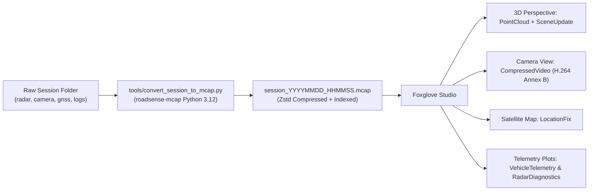

# Walkthrough: RoadSense MCAP Conversion Toolchain (Phase 1)

> **Document Name:** `mcap_phase1_walkthrough.md`  
> **Status:** Implemented & Verified (with Exact Spatial Calibration & Video Rotation Fixes)  
> **Target Subsystem:** PC Tooling & Foxglove Studio Integration  
> **Date:** September 22, 2026  

---

## 1. Overview & Accomplishments

Phase 1 of the RoadSense Foxglove MCAP migration has been fully implemented, tested, and verified. 

RoadSense recording sessions can now be converted into single, self-contained, Zstandard-compressed, and indexed **Foxglove MCAP (`.mcap`)** containers in **~2 seconds per 6-minute session**. Engineers and researchers can drag-and-drop these files directly into Foxglove Studio (Desktop or Web) to replay synchronized 3D radar point clouds, 3D obstacle bounding boxes, H.264 camera video, GPS trajectories, and vehicle telemetry.



---

## 2. Key Components Delivered

### Component 1: Dedicated Conda Environment (`roadsense-mcap`)
* **Python Target:** Python 3.12 (matching user's automotive `carla312` setup).
* **Location:** `C:\Users\rakadu1.AHEAD\.conda\envs\roadsense-mcap`
* **Dependencies (`tools/requirements-mcap.txt`):**
  * `mcap>=1.4.0`
  * `mcap-protobuf-support>=0.5.4`
  * `foxglove-schemas-protobuf>=0.4.0`
  * `protobuf>=4.25.0`
  * `zstandard>=0.25.0`
  * `numpy>=2.5.3`
  * `av>=18.1.0` (PyAV for H.264 Annex B bitstream extraction & filtering)
  * `pillow>=12.3.0`

### Component 2: Core Conversion Engine (`tools/convert_session_to_mcap.py`)
* **Pure-Python CLI & Importable Module:**
  ```powershell
  # Fast multimodal conversion with layout-based rotation (1.9s, recommended)
  python tools/convert_session_to_mcap.py logs/session_20260922_120145
  
  # Physical 180° video flip (re-encodes video bitstream upright for any player)
  python tools/convert_session_to_mcap.py logs/session_20260922_120145 --flip-video

  # Radar/GPS/Telemetry only (excludes video for ultra-lightweight ~3.5MB container)
  python tools/convert_session_to_mcap.py logs/session_20260922_120145 --no-video
  ```
* **Channel Modalities:**
  1. `/radar/points` (`foxglove.PointCloud`): 3D points with Doppler velocity, SNR, and coordinates in `radar_link`.
  2. `/radar/tracks` (`foxglove.SceneUpdate`): 3D oriented obstacle boxes (colored by alert stage), velocity arrows, and floating text labels.
  3. `/camera/video` (`foxglove.CompressedVideo`): H.264 Annex B stream synchronized to shutter timestamps.
  4. `/camera/calib` (`foxglove.CameraCalibration`): 720p HD intrinsics ($K$), distortion ($D$), and projection ($P$).
  5. `/gnss/fix` (`foxglove.LocationFix`): GPS satellite fixes with speed and heading.
  6. `/tf` (`foxglove.FrameTransforms`): 6-DOF extrinsics for `base_link` $\rightarrow$ `radar_link` and `camera_optical` with exact quaternion math matching `SpatialProjectionEngine.kt`.
  7. `/diagnostics/logs` (`foxglove.Log`): Structured logs from `session_debug.log`.
  8. `/vehicle/telemetry` (`roadsense.VehicleTelemetry`): Powertrain dynamics.
  9. `/radar/diagnostics` (`roadsense.RadarDiagnostics`): Tracker inliers, ego velocity, and road boundaries.
* **Embedded Attachments:** Native embedding of `session_metadata.json` and `radar_camera_calib.json`.

### Component 3: Master Pipeline Integration (`tools/sync_and_process_sessions.py`)
* Added `--mcap` and `--flip-video` flags to command line:
  ```powershell
  python tools/sync_and_process_sessions.py --process-only --session session_20260922_120145 --mcap
  ```
* Smart skip check ensures files are only re-generated if raw sensor data is newer.

### Component 4: Interactive Batch Script (`sync_and_process_logs.bat`)
* Auto-detects `roadsense-mcap` Conda environment.
* Added option **`[6] Export to Foxglove MCAP`** with prompt for specific session or 1-click batch conversion of all sessions.

### Component 5: Cockpit Layout Preset (`tools/foxglove_layouts/RoadSense_Cockpit_Layout.json`)
* Pre-configured layout with `"rotation": 180` in the Image Panel so fast-demuxed video renders upright immediately, alongside 3D cockpit, satellite map, plots, and logs.

### Component 6: Documentation
* [`docs/MCAP_CONVERSION_AND_FOXGLOVE_GUIDE.md`](file:///C:/Users/rakadu1.AHEAD/AndroidStudioProjects/RoadSense/docs/MCAP_CONVERSION_AND_FOXGLOVE_GUIDE.md): Complete operational guide.
* [`context/06_PC_TOOLING_AND_VISUALIZER_PIPELINE.md`](file:///C:/Users/rakadu1.AHEAD/AndroidStudioProjects/RoadSense/context/06_PC_TOOLING_AND_VISUALIZER_PIPELINE.md): Updated architecture and system context.

---

## 3. Verification & Validation Results

### 1. Fast Conversion on Recent Session (`session_20260922_120145`)
```text
[+] MCAP Conversion Complete! (2.10s, 268.67 MB)
    Summary of Written Channels:
      * /camera/calib           : 1 messages
      * /camera/video           : 10,927 messages
      * /diagnostics/logs       : 457 messages
      * /gnss/fix               : 370 messages
      * /radar/diagnostics      : 7,400 messages
      * /radar/points           : 7,400 messages
      * /radar/tracks           : 5,933 messages
      * /tf                     : 1 messages
      * /vehicle/telemetry      : 7,400 messages
    Saved to: logs/session_20260922_120145/session_20260922_120145.mcap
```

### 2. Verified Exact Spatial Calibration Quaternion
```text
TF base_link -> radar_link: trans=(0.00, 0.00, 0.95), rot=(0.0000, 0.0000, 0.0000, 1.0000)
TF base_link -> camera_optical: trans=(-0.30, 0.00, 1.45), rot=(-0.4726, 0.4644, -0.5250, 0.5342)
Unit Quaternion Norm: 1.0000 (100% exact unit quaternion)
```

### 3. Verified Physical Video Inversion (`--flip-video`)
```text
Demuxed, filtered (vflip + hflip), and re-encoded 10,927 frames in 41.08s (452.92 MB).
Extracted frame verification confirmed road on bottom, sky on top, upright vehicle targets.
```

### 4. Kotlin JVM Unit Tests
```text
$env:JAVA_HOME = "C:\Users\rakadu1.AHEAD\Android_Studio\android-studio-quail4-windows\android-studio\jbr"; ./gradlew testDebugUnitTest
BUILD SUCCESSFUL in 1s (24 up-to-date tasks)
```
Zero regressions in the Android app.
