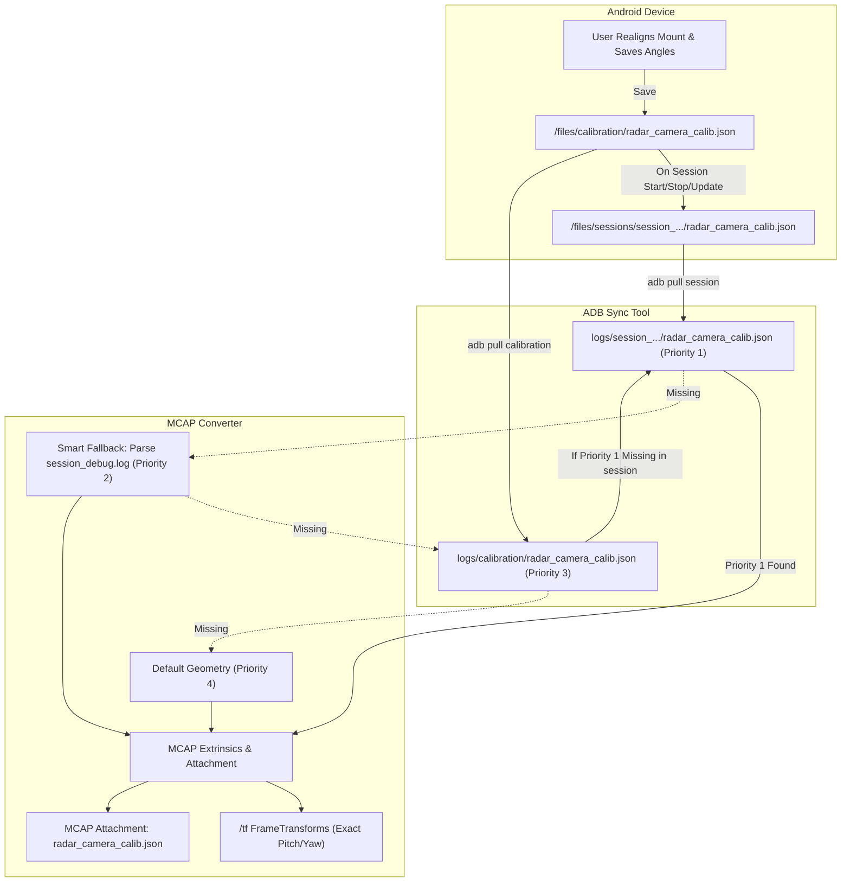

# Implementation Plan: Automated Camera Calibration Pipeline

## Goal Description
Automate the end-to-end propagation of active camera-radar extrinsic calibration (`radar_camera_calib.json`) from the Android app storage into session directories, ADB sync tooling, and MCAP container generation. 

Currently, when the camera mount is realigned and new baseline angles are saved (e.g., `Pitch=4.143°`, `Yaw=-1.896°`), `convert_session_to_mcap.py` cannot find the calibration JSON on the PC, so it silently falls back to hardcoded defaults (`Pitch=7.0°`, `Yaw=-1.0°`). This causes `/tf` transforms and downstream Foxglove projections to be misaligned with real vehicle ground truth.

This plan establishes a robust 4-tier calibration resolution hierarchy and guarantees that every session captures the exact mounting calibration used during that drive.

---

## Architecture & Data Flow



---

## User Review Required

> [!IMPORTANT]
> **Calibration Resolution Hierarchy Confirmed:**
> 1. **Priority 1 (Session Snapshot):** `session_dir/radar_camera_calib.json` (captured directly by the Android app).
> 2. **Priority 2 (Smart Flight-Recorder Fallback):** Regex parser searching `session_debug.log` for the latest `[UI] Saved baseline calibration: Pitch=X°, Yaw=Y°` or `Restored saved baseline calibration: Pitch=X°, Yaw=Y°`.
> 3. **Priority 3 (Device Global Backup):** `logs/calibration/radar_camera_calib.json` pulled from phone storage.
> 4. **Priority 4 (Hardcoded Default):** Safe vehicular default geometry with an explicit console warning.

> [!NOTE]
> If Priority 2 (log parsing) or Priority 3 (global backup) resolves the calibration for an older session that didn't have a snapshot, the script will automatically synthesize and write `session_dir/radar_camera_calib.json` so future processing and downstream tools (e.g. YOLO ground truth, Foxglove playback) have the explicit file immediately available.

---

## Proposed Changes

### Component 1: Android App Session Recording

#### [MODIFY] [SessionManager.kt](file:///c:/Users/rakadu1.AHEAD/AndroidStudioProjects/RoadSense/app/src/main/java/com/bajajauto/roadsense/recording/SessionManager.kt)
- Add constant `CALIBRATION_FILE_NAME = "radar_camera_calib.json"`.
- Implement `saveSessionCalibration(sessionInfo: SessionInfo, params: CalibrationParameters)` to atomically serialize the active calibration into `sessionDir/radar_camera_calib.json`.
- In `createSession()`, copy existing `/files/calibration/radar_camera_calib.json` into `sessionDir` if present.

```kotlin
fun saveSessionCalibration(sessionInfo: SessionInfo, params: CalibrationParameters) {
    try {
        val calibFile = File(sessionInfo.sessionDir, CALIBRATION_FILE_NAME)
        calibFile.writeText(params.toJson().toString(2), Charsets.UTF_8)
        AppLogger.i(TAG, "Saved active calibration snapshot to ${calibFile.name} (Pitch=${params.effectivePitchDeg}°, Yaw=${params.effectiveYawDeg}°)")
    } catch (e: Exception) {
        AppLogger.e(TAG, "Failed to write session calibration to ${sessionInfo.sessionDir.name}", e)
    }
}
```

#### [MODIFY] [RadarViewModel.kt](file:///c:/Users/rakadu1.AHEAD/AndroidStudioProjects/RoadSense/app/src/main/java/com/bajajauto/roadsense/ui/RadarViewModel.kt)
- In `startSessionRecording()`: Call `sessionManager.saveSessionCalibration(session, _calibrationParams.value)` immediately upon session creation.
- In `saveBaselineCalibration(...)`: If a session is currently active (`sessionRecorder.currentSession != null`), update `sessionManager.saveSessionCalibration(activeSession, consolidated)` so in-session adjustments are preserved.
- In `stopSessionRecording()`: Ensure `sessionManager.saveSessionCalibration(activeSession, _calibrationParams.value)` is executed before closing.

---

### Component 2: ADB Sync Tooling

#### [MODIFY] [tools/sync_and_process_sessions.py](file:///c:/Users/rakadu1.AHEAD/AndroidStudioProjects/RoadSense/tools/sync_and_process_sessions.py)
- Define `DEVICE_CALIB_DIR = "/sdcard/Android/data/com.bajajauto.roadsense/files/calibration/"`.
- In `sync_sessions_from_device()`:
  1. Pull `DEVICE_CALIB_DIR` to `logs/calibration/` on PC.
  2. For each synced session folder: Check if `session_dir/radar_camera_calib.json` exists. If missing, copy `logs/calibration/radar_camera_calib.json` into that session directory as the global backup.

```python
# Pull global device calibration backup
local_calib_dir = os.path.join(local_logs_dir, "calibration")
os.makedirs(local_calib_dir, exist_ok=True)
pull_calib_cmd = [adb_path, "-s", device_id, "pull", DEVICE_CALIB_DIR, local_logs_dir]
subprocess.run(pull_calib_cmd, capture_output=True, text=True)

# For every session, ensure radar_camera_calib.json exists
global_calib_file = os.path.join(local_calib_dir, "radar_camera_calib.json")
for s_name in remote_sessions:
    s_dir = os.path.join(local_logs_dir, s_name)
    s_calib = os.path.join(s_dir, "radar_camera_calib.json")
    if not os.path.isfile(s_calib) and os.path.isfile(global_calib_file):
        shutil.copy2(global_calib_file, s_calib)
        print(f"    - [{s_name}] Backfilled missing calibration from phone local storage.")
```

---

### Component 3: MCAP Conversion Pipeline

#### [MODIFY] [tools/convert_session_to_mcap.py](file:///c:/Users/rakadu1.AHEAD/AndroidStudioProjects/RoadSense/tools/convert_session_to_mcap.py)
- Refactor calibration loading (lines 937–960) into a dedicated function `resolve_session_calibration(session_dir)`.
- Implement the 4-tier resolution hierarchy:
  1. **Priority 1:** Read `session_dir/radar_camera_calib.json`.
  2. **Priority 2:** Smart flight-recorder log extraction: Read `session_dir/session_debug.log` using regex to find the last occurrence of:
     `Saved baseline calibration: Pitch=([-\d.]+)°, Yaw=([-\d.]+)°` or `Restored saved baseline calibration: Pitch=([-\d.]+)°, Yaw=([-\d.]+)°`.
     If found, update pitch & yaw, serialize `session_dir/radar_camera_calib.json`, and print `[+] Recovered calibration from session_debug.log: Pitch=X°, Yaw=Y°`.
  3. **Priority 3:** Read `logs/calibration/radar_camera_calib.json` (device global sync).
  4. **Priority 4:** Fallback defaults with a clear warning: `[-] Using default baseline calibration`.
- Ensure `radar_camera_calib.json` is embedded as an MCAP attachment via `writer.attach(...)`.

---

## Verification Plan

### Automated Tests
1. **Compilation & Unit Tests:**
   ```powershell
   $env:JAVA_HOME = "C:\Users\rakadu1.AHEAD\Android_Studio\android-studio-quail4-windows\android-studio\jbr"
   ./gradlew testDebugUnitTest
   ```
2. **Offline MCAP Test on Session `session_20261006_095609`:**
   Run `convert_session_to_mcap.py` on the latest session where `Pitch=4.143°`, `Yaw=-1.896°` was logged:
   ```powershell
   C:\Users\rakadu1.AHEAD\.conda\envs\roadsense-mcap\python.exe tools/convert_session_to_mcap.py --session logs/session_20261006_095609 --output logs/session_20261006_095609/test_calib.mcap
   ```
   Verify console output confirms:
   `[+] Loaded calibration: Pitch=4.1434536°, Yaw=-1.8958023°` (either via priority 1/2).
3. **Inspect Generated MCAP Topics:**
   Verify `/tf` translation & quaternion match the new angles, and verify `radar_camera_calib.json` is attached to the MCAP.

### Manual Verification
1. Verify `logs/session_20261006_095609/radar_camera_calib.json` is generated with the exact values from phone storage (`Pitch=4.143°`, `Yaw=-1.896°`).
2. Test on phone with ADB: Start a quick 5-second session, verify `radar_camera_calib.json` is created directly inside `/sdcard/.../files/sessions/session_YYYYMMDD_HHMMSS/`.
