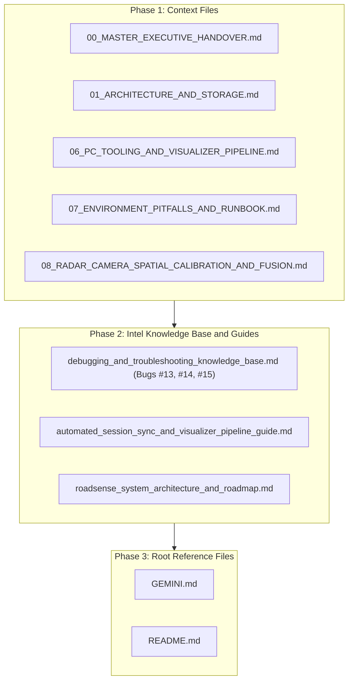

# Implementation Plan: Comprehensive Documentation Sync for PC Tooling, Web Dashboard & Zero-Cost MCAP Pipeline

> **Document Name:** `plan_documentation_sync_mcap_and_web_dashboard.md`  
> **Workspace:** `C:\Users\rakadu1.AHEAD\AndroidStudioProjects\RoadSense`  
> **Target Date:** September 2026  
> **Author:** Antigravity (AI Assistant)  

---

## 1. Goal Description

Across the two recent commits (`2b12dcb` and `b6a87b1`), the RoadSense PC processing and visualizer toolchain underwent major architectural upgrades:
1. **Interactive Web Dashboard & Server** (`tools/roadsense_web_server.py`, `tools/web_dashboard/index.html`): Zero-dependency local server (`http://localhost:8088`), SSE progress bar, device telemetry polling, Foxglove Studio 1-click launcher.
2. **Zero-Latency NVENC Video Transcoding & Seeking Keyframe Fix**: Hardware NVDEC + NVENC pipeline (`h264_cuvid` / `h264_nvenc`) with auto-fallback to CPU, closed GOP size 30, and in-band SPS/PPS repetition before IDR frames.
3. **Foxglove Ghost Track Fix**: Replaced dynamic per-frame entity IDs with a static `"radar_tracks"` entity ID for atomic state updates in Foxglove 3D space.
4. **Zero-Cost Mathematical Orientation Alignment**: $O(1)$ MP4 `tkhd` matrix inspection, dynamic fold of 180° into `camera_optical` `/tf` frame roll, achieving >11,500 FPS conversion in ~3.4s with 0% GPU load.
5. **Embedded Foxglove Layout**: Bundled `RoadSense_Cockpit_Layout.json` directly into the `.mcap` container as attachments, paired with 2D client-side WebGL rotation.

This plan details how to systematically update all files in `context/`, `intel/`, `README.md`, and `GEMINI.md` to establish complete documentation integrity without leaving any architectural gaps.

---

## 2. User Review Required

> [!NOTE]
> All changes in this plan are strictly **documentation and specification updates**. No production code (`app/src/`, `tools/`) will be modified.

> [!IMPORTANT]
> The updates will record three new post-mortem entries in `intel/debugging_and_troubleshooting_knowledge_base.md`:
> - **Bug #13**: Foxglove Ghost / Duplicate Track Accumulation via Dynamic Entity IDs.
> - **Bug #14**: Timeline Seek Blank Screen & "Waiting for Keyframe" in Replay Players.
> - **Bug #15**: Dual-Orientation Video Inversion & Mathematical Coordinate Frame Alignment in MCAP.

---

## 3. Work Breakdown Structure (Phased Execution)



---

## 4. Proposed Changes

### Phase 1: `context/` Directory Updates

#### [MODIFY] [`context/00_MASTER_EXECUTIVE_HANDOVER.md`](file:///C:/Users/rakadu1.AHEAD/AndroidStudioProjects/RoadSense/context/00_MASTER_EXECUTIVE_HANDOVER.md)
- Update "Recent Major Milestones Achieved" table:
  - Add **Interactive Web Dashboard** (`tools/roadsense_web_server.py`, `tools/web_dashboard/index.html`).
  - Add **Foxglove MCAP Container Toolchain** (`convert_session_to_mcap.py`, embedded layouts).
  - Add **Zero-Cost Video Orientation & /tf Optical Alignment** (11,800+ FPS, 0% GPU).
  - Add **Zero-Latency NVENC Transcoder & Seeking Keyframe Fix** (GOP 30, SPS/PPS headers).
  - Add **Foxglove Ghost Track Elimination** (Static entity ID scene graph update).
- Update handover date to September 29, 2026.

#### [MODIFY] [`context/01_ARCHITECTURE_AND_STORAGE.md`](file:///C:/Users/rakadu1.AHEAD/AndroidStudioProjects/RoadSense/context/01_ARCHITECTURE_AND_STORAGE.md)
- Update PC Storage and Artifact Directory layout to reflect:
  - `session_YYYYMMDD_HHMMSS.mcap` single-container archive with embedded attachments (`session_metadata.json`, `radar_camera_calib.json`, `RoadSense_Cockpit_Layout.json`).
  - `track_history.json` and `frame_mapping.json` legacy artifacts.

#### [MODIFY] [`context/06_PC_TOOLING_AND_VISUALIZER_PIPELINE.md`](file:///C:/Users/rakadu1.AHEAD/AndroidStudioProjects/RoadSense/context/06_PC_TOOLING_AND_VISUALIZER_PIPELINE.md)
- Expand Section 5 ("Foxglove MCAP Container Toolchain"):
  - Architecture of `convert_session_to_mcap.py`.
  - Zero-cost pass-through demuxing vs NVENC GPU transcoding modes.
  - Server-Sent Events (SSE) progress protocol schema (`[PROGRESS] {"step": ..., "pct": ..., "fps": ..., "eta_s": ...}`).
  - Embedded layout attachments (`RoadSense_Cockpit_Layout.json`, `foxglove.layout`).
- Add Section 6 ("RoadSense Web Dashboard"):
  - Architecture of `tools/roadsense_web_server.py` and `tools/web_dashboard/index.html`.
  - REST endpoints table (`/api/sessions`, `/api/device/status`, `/api/sync`, `/api/process`, `/api/mcap`, `/api/progress`).
  - Browser UI capabilities: real-time battery/disk gauges, session table, live progress bar, Foxglove Studio launcher.

#### [MODIFY] [`context/07_ENVIRONMENT_PITFALLS_AND_RUNBOOK.md`](file:///C:/Users/rakadu1.AHEAD/AndroidStudioProjects/RoadSense/context/07_ENVIRONMENT_PITFALLS_AND_RUNBOOK.md)
- Add Section 4.4: Web Dashboard & MCAP Toolchain Runbook:
  - Command to launch Web Dashboard: `python tools/roadsense_web_server.py` (`http://localhost:8088`).
  - Conda environment activation: `conda activate roadsense-mcap`.
  - Batch launcher usage: `sync_and_process_logs.bat`.
  - Command-line MCAP options (`--flip-video`, `--no-video`, `--output`).

#### [MODIFY] [`context/08_RADAR_CAMERA_SPATIAL_CALIBRATION_AND_FUSION.md`](file:///C:/Users/rakadu1.AHEAD/AndroidStudioProjects/RoadSense/context/08_RADAR_CAMERA_SPATIAL_CALIBRATION_AND_FUSION.md)
- Add Section 6: Mathematical Mount Inversion & Optical Roll Alignment:
  - Explain how reverse landscape smartphone mounting (`Surface.ROTATION_270`) generates an inverted pixel buffer.
  - Formulate why adjusting the `/tf` optical roll angle by $+180^\circ$ maps the image texture-mapping $v = H$ (sky) to $+Y_c = +Z_b$ (world sky), projecting 100% upright in 3D without altering video bytes.

---

### Phase 2: `intel/` Knowledge Base & Guides

#### [MODIFY] [`intel/debugging_and_troubleshooting_knowledge_base.md`](file:///C:/Users/rakadu1.AHEAD/AndroidStudioProjects/RoadSense/intel/debugging_and_troubleshooting_knowledge_base.md)
- Add **Bug #13**: Foxglove Ghost / Duplicate Track Accumulation via Dynamic Entity IDs.
  - Symptoms, root cause in Foxglove scene graph, solution with static entity ID `"radar_tracks"`.
- Add **Bug #14**: Timeline Seek Blank Screen & "Waiting for Keyframe" in Replay Players.
  - Symptoms, root cause in sparse NVENC IDRs & missing in-band SPS/PPS, solution with GOP 30, `forced-idr=1`, and `repeat-headers=1`.
- Add **Bug #15**: Dual-Orientation Video Inversion & Mathematical Coordinate Frame Alignment in MCAP.
  - Symptoms, root cause in MP4 container `tkhd` metadata vs raw NAL stream, mathematical `/tf` coordinate solution.
- Update "Summary of Core Engineering Rules" with Rules 11, 12, and 13.

#### [MODIFY] [`intel/automated_session_sync_and_visualizer_pipeline_guide.md`](file:///C:/Users/rakadu1.AHEAD/AndroidStudioProjects/RoadSense/intel/automated_session_sync_and_visualizer_pipeline_guide.md)
- Update data flow diagram to include Web Dashboard and MCAP single-container output.
- Document Web Dashboard architecture, REST endpoints, and UI features.
- Document NVENC zero-latency profile vs zero-cost bitstream demux performance benchmarks.

#### [MODIFY] [`intel/roadsense_system_architecture_and_roadmap.md`](file:///C:/Users/rakadu1.AHEAD/AndroidStudioProjects/RoadSense/intel/roadsense_system_architecture_and_roadmap.md)
- Update Roadmap status: Mark PC Tooling, Web Dashboard, and Foxglove MCAP single-container archiving as **Completed & Production Ready**.
- Include updated system dataflow diagram reflecting the Web Dashboard and MCAP container.

---

### Phase 3: Root Reference Files (`GEMINI.md` & `README.md`)

#### [MODIFY] [`GEMINI.md`](file:///C:/Users/rakadu1.AHEAD/AndroidStudioProjects/RoadSense/GEMINI.md)
- Update Section 1 documentation index to reference newly added bugs and features.
- Update Section 5 with multi-sensor parameters including Web Dashboard (`localhost:8088`), MCAP Conda environment (`roadsense-mcap`), and optical frame roll alignment.
- Update Section 6 storage directory structure to reflect `.mcap` container with embedded layout.

#### [MODIFY] [`README.md`](file:///C:/Users/rakadu1.AHEAD/AndroidStudioProjects/RoadSense/README.md)
- Update Section 1 & 2 to highlight:
  - Zero-dependency Web Dashboard (`http://localhost:8088`).
  - Foxglove MCAP export (~3.4s, >11,500 FPS, zero GPU load).
  - 100 Hz IMU telemetry.
- Update Section 4 UI architecture & quick-start guide to describe the Web Dashboard.

---

## 5. Verification Plan

### Automated Verification
1. **JVM Unit Tests**:
   ```powershell
   $env:JAVA_HOME = "C:\Users\rakadu1.AHEAD\Android_Studio\android-studio-quail4-windows\android-studio\jbr"; ./gradlew testDebugUnitTest
   ```
2. **Git Status & Markdown Link Validation**:
   - Verify that all relative links between `context/`, `intel/`, `README.md`, and `GEMINI.md` resolve to valid file paths.

### Manual Verification
- Review diff of all updated documents to ensure technical accuracy, formatting consistency, and complete alignment with the implemented code.
