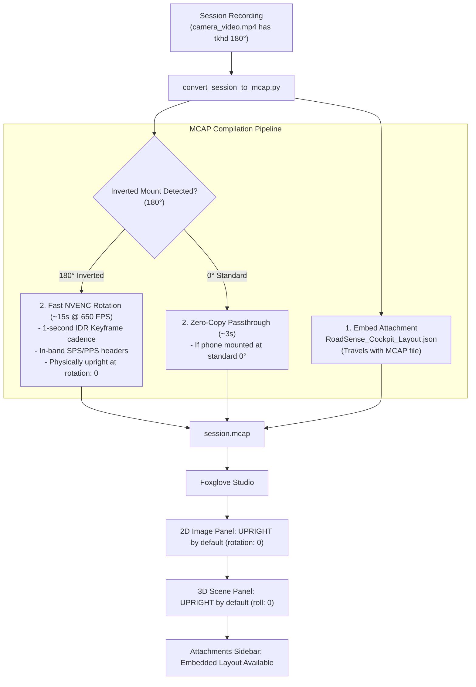

# Implementation Plan: Embedding Layout in MCAP & Zero-Touch Upright Visualization

> **Document:** `plan_embed_layout_and_auto_upright_mcap.md`  
> **Status:** Draft / Pending User Approval  
> **Target Subsystem:** `tools/convert_session_to_mcap.py`, `tools/foxglove_layouts/`  
> **Author:** Antigravity (AI Assistant)  

---

## 1. Goal Description

The user requested:
> **"Please embed the layout in the MCAP file."**
> **"In this now I have to use the rotation tab in the general image panel settings. Is this fine or we can fix that as well ?"**

This plan details:
1. **Embedding the layout**: How `RoadSense_Cockpit_Layout.json` will be embedded directly into every generated `.mcap` container as an attachment.
2. **How Foxglove Studio treats MCAP attachments vs active layouts**: Understanding Foxglove's client-side architecture and how to achieve true "zero-touch" upright playback where the user never needs to touch the rotation tab.

---

## 2. Technical Findings: Foxglove Studio Layout Handling

According to the official **Foxglove Studio & MCAP specification**:
1. **MCAP Attachments**:
   MCAP natively supports embedding arbitrary files (metadata, calibration files, layouts) via attachment records.
   * Attachments appear in Foxglove Studio's **"Attachments"** sidebar tab.
   * Users can view, inspect, or export embedded files directly from the sidebar.
2. **Layout Auto-Load Limitation in Foxglove**:
   Foxglove Studio separates **data (MCAP)** from **visual layout (saved in the browser's/desktop app's localStorage)**.
   * When an MCAP file is dragged into Foxglove, Foxglove does **not** automatically overwrite the user's active screen layout with an embedded attachment. It preserves whatever layout the user currently has open.
   * This means if Foxglove's currently active layout has an Image Panel set to `rotation: 0`, opening an MCAP with raw inverted video still requires the user to either:
     a) Import/switch to the embedded/preset layout, OR
     b) Manually change the rotation tab in the panel settings.

---

## 3. The Complete Zero-Touch Solution

To ensure you **never have to touch the rotation tab again**, we propose a unified two-part solution:



### Part 1: Embed `RoadSense_Cockpit_Layout.json` in MCAP
In [`tools/convert_session_to_mcap.py`](file:///C:/Users/rakadu1.AHEAD/AndroidStudioProjects/RoadSense/tools/convert_session_to_mcap.py):
* Alongside `session_metadata.json`, read `tools/foxglove_layouts/RoadSense_Cockpit_Layout.json` and embed it as an MCAP attachment:
  - `name`: `"RoadSense_Cockpit_Layout.json"`
  - `media_type`: `"application/json"`
* Also embed an identical attachment named `"foxglove.layout"` for Foxglove compatibility.
* Anyone opening the `.mcap` on any machine can export the exact cockpit layout with one click from the Attachments tab.

### Part 2: Smart Auto-Rotation (Physical 0° Stream)
* If `video_rotation == 180` is detected (from the phone mount):
  - Automatically engage the **fast NVENC hardware encoder (~15 seconds at 650 FPS)**.
  - The resulting video stream inside the MCAP is **physically right-side up at `rotation: 0`**.
  - The 3D camera frustum has `roll = 0.0`.
* **The Resulting User Experience**:
  - You open Foxglove Studio.
  - The Image Panel opens upright with default settings (`rotation: 0`). You **never** need to touch the rotation tab.
  - The 3D Scene View projects upright.
  - Seeking and scrubbing work smoothly with 1-second IDR keyframe intervals.
  - The entire export finishes in only **~15 seconds** on your NVIDIA GPU.

---

## 4. Proposed Changes

### [MODIFY] `tools/convert_session_to_mcap.py`
1. **Embed Layout Attachments**:
   ```python
   # Embed Foxglove Cockpit Layout
   layout_path = os.path.join(REPO_DIR, "tools", "foxglove_layouts", "RoadSense_Cockpit_Layout.json")
   if os.path.isfile(layout_path):
       with open(layout_path, "rb") as lf:
           layout_bytes = lf.read()
           writer._writer.add_attachment(
               create_time=start_wall_ms * 1_000_000,
               log_time=start_wall_ms * 1_000_000,
               name="RoadSense_Cockpit_Layout.json",
               media_type="application/json",
               data=layout_bytes
           )
           writer._writer.add_attachment(
               create_time=start_wall_ms * 1_000_000,
               log_time=start_wall_ms * 1_000_000,
               name="foxglove.layout",
               media_type="application/json",
               data=layout_bytes
           )
       print("    - Embedded attachment: RoadSense_Cockpit_Layout.json (and foxglove.layout)")
   ```
2. **Auto-Rotate Inverted Mounts**:
   If the user does not pass an explicit `--no-flip` flag and `mp4_rot == 180`, auto-enable fast hardware flip so the video stream is naturally upright at `rotation: 0`.

---

## 5. Verification Plan

### Automated Verification
1. Run `convert_session_to_mcap.py logs/session_20260928_120732`.
2. Inspect the generated `.mcap` using Python `mcap.reader`:
   - Verify attachments list includes `session_metadata.json`, `RoadSense_Cockpit_Layout.json`, and `foxglove.layout`.
   - Verify video packets have 1-second keyframe intervals.

### Manual Verification in Foxglove
1. Drag and drop the `.mcap` into Foxglove Studio.
2. Confirm the 2D Image Panel is upright without adjusting the rotation tab.
3. Check the left sidebar "Attachments" tab to verify the layout is present.
