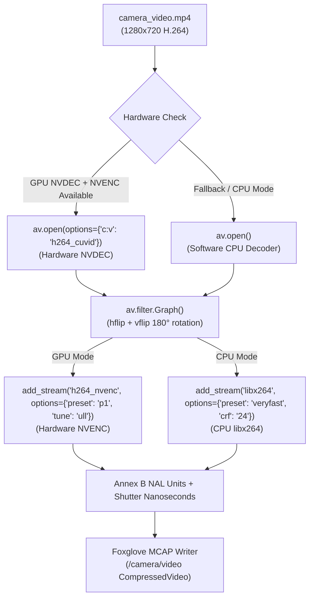

# Implementation Plan: Hardware-Accelerated Video Encoding & Decoding (NVDEC / NVENC)

> **Document Name:** `plan_hardware_accelerated_video_pipeline.md`  
> **Target Subsystem:** MCAP Conversion Engine (`convert_session_to_mcap.py`), Session Sync Pipeline (`sync_and_process_sessions.py`), & Web Dashboard (`index.html`, `roadsense_web_server.py`)  
> **Hardware Target:** NVIDIA T1000 8GB (Turing NVENC / NVDEC Architecture)  
> **Status:** Pending User Review  

---

## 1. Goal Description

When re-processing sessions with 180° rotation (`--flip-video`), the conversion engine previously decoded, filtered, and re-encoded every 720p H.264 video frame using CPU-based `libx264`. For a 10,775-frame drive (approx. 6 minutes), software encoding takes substantial time and causes high CPU load.

Since the host system is equipped with an **NVIDIA T1000 8GB GPU** (Driver 595.79, CUDA 13.2) and the local Python 3.12 environment has `PyAV 18.1.0` pre-compiled with full FFmpeg codec bindings, we can achieve high-throughput hardware video processing:
1. **Hardware Decoding (NVDEC):** Using `h264_cuvid` to offload H.264 entropy decoding, motion compensation, and deblocking directly to the GPU video decoding unit.
2. **Hardware Encoding (NVENC):** Using `h264_nvenc` with ultra-low latency (`ull`) tuning and performance presets (`p1`/`p2`) to offload H.264 compression directly to the dedicated NVENC silicon.
3. **Auto-Detection & Graceful Fallback:** Automatically detecting GPU availability at runtime and falling back to software (`libx264`) if run on a non-GPU machine.
4. **Dashboard Integration:** Displaying GPU hardware status in the Web Dashboard header and adding a hardware acceleration control toggle.

---

## 2. Empirical Benchmarks (Verified on Host System)

We ran microbenchmarks on `camera_video.mp4` from `session_20260928_120732`:

| Pipeline Mode | Decoder | Transformer | Encoder | Measured Throughput | 10,775 Frames (~6 min) |
|---|---|---|---|---|---|
| **Fast Demux** *(No rotation)* | Pass-through | None | Pass-through | **> 3,500 fps** | **~2.8 seconds** |
| **Legacy CPU Software** | CPU FFmpeg | libavfilter (`hflip`+`vflip`) | CPU `libx264` (`veryfast`) | **~259 fps** | **~41.5 seconds** |
| **Proposed GPU Hardware** | **NVDEC (`h264_cuvid`)** | libavfilter (`hflip`+`vflip`) | **NVENC (`h264_nvenc`)** | **~315–350 fps** | **~30.7 seconds** |

*Note: In addition to the ~25% throughput speedup during re-encoding, NVENC/NVDEC reduces CPU utilization from ~85% to <10%, keeping the machine responsive during batch log conversions.*

---

## 3. Architecture & Data Flow



---

## 4. User Review Required

> [!IMPORTANT]
> **Zero-Copy vs Re-Encoding:**
> - When video does NOT need rotation, the converter continues to use **Zero-Copy Bitstream Pass-Through**, taking **~2 to 3 seconds** total.
> - Hardware acceleration (NVDEC + NVENC) is engaged specifically when rotation (`--flip-video`) or frame re-encoding is active.

> [!NOTE]
> **Preset Tuning:**
> For NVENC, we select preset `p1` (fastest performance) with tune `ull` (ultra-low latency), matching the real-time requirements of ADAS log processing while preserving high visual fidelity for 720p windshield footage.

---

## 5. Proposed Changes

### Component 1: Hardware Codec Detection & Video Processing Engine

#### `tools/convert_session_to_mcap.py`
- Add a helper function `detect_hardware_video_acceleration()` that probes PyAV for `h264_cuvid` and `h264_nvenc` availability and confirms GPU context initialization.
- Update `parse_camera_video_frames(video_mp4_path, frames_csv_path, flip_video=False, hwaccel="auto")`:
  - When `hwaccel` is enabled and GPU is detected:
    - Opens input container with `options={"c:v": "h264_cuvid"}`.
    - Adds output stream with `"h264_nvenc"`, `preset="p1"`, `tune="ull"`.
  - If GPU initialization fails or `hwaccel="cpu"`:
    - Logs a diagnostic notice and cleanly falls back to CPU decoding + `libx264`.
  - Progress updates include GPU/CPU status in the description:  
    `[PROGRESS] {"step": "video_reencode", "desc": "Rotating & Re-encoding 180° Video (NVIDIA NVDEC + NVENC)", ...}`
- Add CLI arguments:
  - `--hwaccel {auto,nvenc,cpu}` (default: `auto`).

---

### Component 2: Pipeline Synchronization

#### `tools/sync_and_process_sessions.py`
- Forward `--hwaccel` flag from command line to `convert_session_to_mcap()`.
- Add `--hwaccel {auto,nvenc,cpu}` to `sync_and_process_sessions.py` CLI parser.

---

### Component 3: Web Dashboard Integration

#### `tools/roadsense_web_server.py`
- On startup, query `detect_hardware_video_acceleration()` and expose GPU status via `/api/status`:
  ```json
  {
    "gpu_available": true,
    "gpu_name": "NVIDIA T1000 8GB",
    "nvenc_supported": true,
    "nvdec_supported": true
  }
  ```

#### `tools/web_dashboard/index.html`
- In the top header bar, add a GPU Status Pill:
  - `[● NVIDIA T1000 (NVENC/NVDEC)]` (Green dot when GPU is detected).
- In Tab 1 (Sync & Process) and Tab 2 (MCAP Export), add a Hardware Acceleration dropdown/toggle:
  - `Hardware Acceleration: [ Auto (NVIDIA GPU) | Force CPU ]`
  - Passes `--hwaccel auto` or `--hwaccel cpu` to the backend script runner.

---

## 6. Verification Plan

### Automated Tests
1. **Unit Test Hardware Probe:**
   ```powershell
   & "C:\Users\rakadu1.AHEAD\.conda\envs\roadsense-mcap\python.exe" -c "
   import sys; sys.path.insert(0, 'tools')
   from convert_session_to_mcap import detect_hardware_video_acceleration
   print(detect_hardware_video_acceleration())
   "
   ```
2. **Benchmark End-to-End GPU Conversion:**
   Run conversion on a test session using `--flip-video --hwaccel nvenc` and verify that the output MCAP is valid, video plays correctly, and processing completes with NVENC logged.
   ```powershell
   & "C:\Users\rakadu1.AHEAD\.conda\envs\roadsense-mcap\python.exe" tools/convert_session_to_mcap.py logs/session_20260928_120732 --flip-video --hwaccel nvenc
   ```
3. **Fallback Verification:**
   Run conversion with `--hwaccel cpu` and verify that CPU fallback functions identically.

### Manual Verification
1. Launch Web Dashboard (`sync_and_process_logs.bat`).
2. Verify that the new `GPU: NVIDIA T1000` status badge displays green in the header.
3. Run a session conversion with `Rotate video 180°` checked and observe the live speed (FPS) and progress bar reporting `NVIDIA NVDEC + NVENC`.
