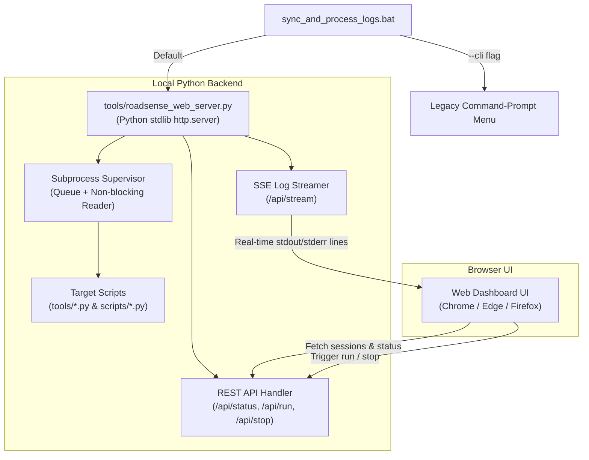

# RoadSense Web Dashboard & Visual Script Runner (Approach 2)

> **Plan Name:** `plan_roadsense_gui_dashboard.md`  
> **Workspace Mirror:** `intel/Implementations/plan_roadsense_gui_dashboard.md`  
> **Status:** Revised per User Feedback (Approach 2 Selected) — Ready for Approval  
> **Author:** Antigravity AI  

---

## 1. Goal Description

Transition `sync_and_process_logs.bat` and all offline RoadSense diagnostic/processing scripts from fragmented CLI tools into an intuitive, modern, web-based visual dashboard. 

The user selected **Approach 2 (Local Web Dashboard)**. The server will run locally via Python's standard library (`http.server` / `threading` / `subprocess`), open automatically in the default browser, and provide:
- A clean, modern UI (dark automotive theme) to configure and execute any of the 12+ RoadSense scripts.
- Checkboxes, dropdowns, and file selectors for all script parameters.
- Real-time log streaming using Server-Sent Events (SSE).
- Robust mitigations for all known failure modes of local web servers (port conflicts, zombie processes, browser disconnects).
- Preservation of the legacy CLI menu via `sync_and_process_logs.bat --cli`.

---

## 2. Failure Modes Analysis & Hardening Strategy

Because local web servers introduce potential failure modes compared to desktop binaries, the following protections are explicitly designed into the architecture:

| Failure Mode | Root Cause | Architectural Mitigation |
| :--- | :--- | :--- |
| **Port Conflict** | Port `8088` is already occupied by another service or stale instance | **Dynamic Port Auto-Hunting:** The server probes ports `8088..8100`. If occupied, it automatically increments and binds to the first free port. If all fail, it binds to port `0` (OS-assigned ephemeral port). |
| **Zombie / Orphaned Subprocesses** | User kills the browser or starts another script before previous finishes | **Process Supervisor with Process Grouping:** Uses Windows `CREATE_NEW_PROCESS_GROUP` / `psutil` or `subprocess.Popen.terminate()` with child process tree cleanup. The server maintains exactly one active child process and cleanly reaps it on server shutdown or when a "Stop" command is issued. |
| **Browser Fails to Open** | OS default browser handler fails or runs in headless environment | **Clickable Console Banner:** The terminal displays an ASCII banner and clickable URL (`http://127.0.0.1:<PORT>`), while attempting `webbrowser.open_new_tab()`. |
| **Missing Dependencies** | Python environment lacks third-party web frameworks (Flask, FastAPI) | **Zero External Dependencies:** Built 100% on Python standard library (`http.server`, `urllib`, `json`, `subprocess`, `threading`, `queue`). Works out-of-the-box in `roadsense-mcap` and system Python. |
| **Headless / Remote SSH Fallback** | User wants quick terminal operation without opening browser | **Dual Mode Launch:** `sync_and_process_logs.bat --cli` bypasses the web server entirely and runs the classic command-line menu. |

---

## 3. System Architecture & Component Diagram



---

## 4. UI Layout & Functional Sections

The dashboard is structured into a responsive dark-mode cockpit layout:

### 4.1 Header Bar
- **Logo & Title:** `RoadSense Telemetry & Script Automation Hub`
- **ADB Connection Status Badge:** Dynamic query via `adb devices` (`🟢 Connected: <device_id>` or `⚪ No Device Detected`).
- **Session Count Badge:** `📁 26 Local Sessions`.
- **Global Actions:** `🔄 Refresh Sessions & ADB`, `🛑 Stop Active Run`, `🚪 Shutdown Server`.

### 4.2 Script Launcher Panel (Categorized Accordions / Tabs)

1. **🔄 Log Sync & Processing (`tools/sync_and_process_sessions.py`)**
   - **Mode:** Full Pipeline (Sync + Process), Sync Only, Process Only.
   - **Session Scope:** All Sessions vs Specific Session (auto-populated dropdown).
   - **Checkboxes:**
     - `[x] Export to Foxglove MCAP (--mcap)`
     - `[ ] Force Re-process All (--force-all / --force)`
     - `[ ] Physically rotate video 180° (--flip-video)`

2. **📦 Foxglove MCAP Export (`tools/convert_session_to_mcap.py`)**
   - **Target Session:** Dropdown list of sessions in `logs/`.
   - **Checkboxes:**
     - `[ ] Exclude Video for compact MCAP (--no-video)`
     - `[ ] Rotate Video 180° (--flip-video)`
   - **Custom Output Path:** Optional text input.

3. **🩺 Sensor Health & Diagnostics (`scripts/`)**
   - **Tool Selector (Dropdown):**
     - Master 7-Point Session Health Check (`session_health_check.py`)
     - Monotonic Cross-Sensor Sync Audit (`audit_cross_sensor_sync.py`)
     - Radar Binary Stream Validator (`validate_radar_stream.py`)
     - Camera Video & Frame Timing Validator (`validate_camera_video.py`)
     - GNSS Location & CEP Accuracy Validator (`validate_gnss_fixes.py`)
     - CANedge Staging & MDF4 Validator (`validate_canedge_staging.py`)
   - **Target:** Radio button: `[x] Latest Session (--latest)` or `[ ] Pick Session from dropdown`.
   - **CANedge Specific:** `[ ] Audit Staging Cache Pool Directly (--pool)`.

4. **🔍 Flight Recorder Search (`scripts/search_flight_recorder.py`)**
   - **Search Keyword:** Text input (`-q / --query`).
   - **Filters:** `[ ] Errors & Exceptions Only (-e)`, Session filter dropdown, Max results input.

5. **🔬 Deep Inspection Utilities (`tools/`)**
   - `inspect_session.py` (Session metadata & radar frames).
   - `inspect_raw_uart.py` (Raw binary UART dumps).
   - `analyze_gnss_trajectory.py` (Haversine trajectory & distance).

### 4.3 Live Console & Process Controls
- **Monospace Terminal Window:** Dark slate background (`#0d0e11`), font `Consolas / 'Cascadia Code'`.
- **Real-Time Colorized Streaming:**
  - Success `[+]` -> Cyan/Green (`#4ec9b0` / `#6a9955`)
  - Warning `[-]` -> Amber/Yellow (`#ce9178` / `#dcdcaa`)
  - Error `[!]` / Traceback -> Bright Red (`#f44747`)
  - Header / Separators -> Blue (`#569cd6`)
- **Console Toolbar:**
  - `▶ Run Script` (Primary green action button)
  - `⏹ Stop` (Red button, enabled during active run)
  - `📋 Copy Logs`
  - `🗑 Clear`
  - `Auto-scroll` toggle checkbox

---

## 5. Proposed File Changes

### Component: Web Dashboard Backend & Frontend

#### [NEW] `tools/roadsense_web_server.py`
Single, self-contained Python script implementing the zero-dependency backend:
- Custom `http.server.BaseHTTPRequestHandler` subclass.
- REST endpoints:
  - `GET /` -> Serves embedded or adjacent HTML dashboard.
  - `GET /api/status` -> Returns ADB device status, local session list from `logs/`, active process status.
  - `POST /api/run` -> Validates requested script and arguments, spawns `subprocess.Popen`, connects pipe to log queue.
  - `GET /api/stream` -> Real-time Server-Sent Events (`text/event-stream`) streaming console lines to browser.
  - `POST /api/stop` -> Kills the active subprocess.
  - `POST /api/shutdown` -> Cleanly terminates server and open processes.
- Port auto-hunter: attempts ports 8088..8100 before falling back to port 0.

#### [NEW] `tools/web_dashboard/index.html` (or embedded in `roadsense_web_server.py`)
Modern, responsive single-page web app with:
- Pure CSS dark cockpit theme (no CDN dependencies required, completely offline-compatible).
- Clean JavaScript with SSE `EventSource` handling, dynamic DOM updates, and form serialization.

#### [MODIFY] `sync_and_process_logs.bat`
- Checks for `--cli` flag. If present, runs the classic batch menu.
- Otherwise, runs `%PYTHON_CMD% tools\roadsense_web_server.py` and opens the dashboard.

---

## 6. Verification Plan

### Automated / Backend Verification
1. **Server Initialization & Port Auto-Hunt:**
   ```powershell
   & "$env:USERPROFILE\.conda\envs\roadsense-mcap\python.exe" tools\roadsense_web_server.py --port 8088 --test-init
   ```
2. **REST API Endpoint Testing:**
   Test `GET /api/status` using PowerShell `Invoke-RestMethod` to ensure session list and ADB status are returned as valid JSON.

### Manual Verification
1. Run `sync_and_process_logs.bat` -> Default browser opens to `http://127.0.0.1:8088/`.
2. Verify Sessions Dropdown -> Lists all `session_*` folders from `logs/`.
3. Verify ADB Status -> Shows connected Android device or clear disconnected notice.
4. Execute `session_health_check.py --latest` from Dashboard -> Console streams the 7-point health check scorecard line-by-line with color coding.
5. Execute `sync_and_process_sessions.py` with `--process-only` -> Verify process finishes and status returns to `IDLE`.
6. Test Process Cancellation -> Start a run and click "Stop" -> Process terminates immediately without hanging.
7. Test CLI Fallback -> Run `sync_and_process_logs.bat --cli` -> Classic batch menu displays as before.
