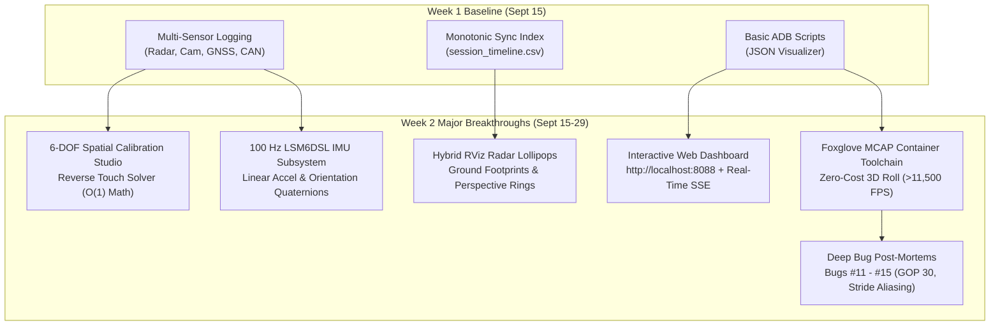

# Implementation Plan: RoadSense Week 2 Executive & Technical Progress Presentation

> **Document Name:** `plan_roadsense_week2_presentation.md`  
> **Workspace:** `C:\Users\rakadu1.AHEAD\AndroidStudioProjects\RoadSense`  
> **Target Date:** September 29, 2026  
> **Author:** Antigravity (AI Assistant)  
> **Output Artifact:** `intel/presentations/decks/RoadSense_Week2_Executive_Progress.pptx`  

---

## 1. Goal Description

Following the foundational **Week 1 Progress Presentation** (generated on September 15, 2026), the RoadSense platform underwent rapid, intensive development over the subsequent two-week sprint (September 15–29, 2026). The project evolved from an on-device multi-sensor logger into an **end-to-end perception, spatial calibration, and high-throughput desktop visualizer platform**.

This plan details the design, content inventory, slide architecture, and programmatic generation of **Presentation 2 (Week 2 Executive & Technical Progress)**. The presentation will be generated as a 100% native vector PowerPoint deck (`.pptx`) using `pptxgenjs` in `intel/presentations/`, matching the corporate visual standards established in Week 1 while highlighting all major technical breakthroughs.

---

## 2. Analysis: Week 1 Baseline vs. Week 2 Sprint Deliverables

### 2.1 What Was Covered in Presentation 1 (Week 1 — Sept 15 Baseline)
1. **Title & Vision**: Need-based mobile ADAS logger replacing bulky laptops.
2. **System Architecture**: 4-stream acquisition (Radar, Camera, GNSS, CANedge2).
3. **Core Timing Innovation**: Monotonic hardware clock synchronization (`CNTVCT_EL0`).
4. **Perception**: 3.125 Mbps UART serial driver and binary framing (`radar_frames.bin`).
5. **Vision**: Camera2 HAL integration, optical infinity lock, and dual-zone Road AE.
6. **Vehicle Bus**: CANedge2 Wi-Fi AP ingestion, 60s split MF4 handling, and single-connection safety.
7. **Cockpit UX**: Early 6-tab Jetpack Compose interface and continuous flight recorder (`app_system.log`).
8. **Initial Toolchain**: Early ADB extraction scripts and basic 2D web visualizer.
9. **Future Roadmap**: Identified **Radar-Camera Spatial Calibration & Fusion** as "The Next Frontier".
10. **Executive Summary**: Phase 1 foundation complete, passing tests.

---

### 2.2 What Was Built & Solved in Week 2 (Sept 15–29 Sprint)



| Subsystem / Innovation | Status in Week 1 Deck | Status in Week 2 Deck | Key Metrics & Achievements |
| :--- | :--- | :--- | :--- |
| **Radar-Camera Calibration** | "Roadmap / Next Frontier" | **Production Ready** | Full 6-DOF transform ($[\mathbf{R}\mid\mathbf{T}]$), Camera2 intrinsics ($K$), closed-form Reverse Touch Solver ($O(1)$), trackpad delta drag. |
| **Visualizer Overlays** | Not Implemented | **Production Ready** | 12-segment road footprints, vertical perspective stems, depth fall-off, Painter's depth-sorting (`sortByDescending`), range rings. |
| **Inertial Kinematics (IMU)** | Future Spec | **Production Ready** | ST LSM6DSL 100 Hz accelerometer/gyroscope, gravity-removed linear acceleration, 6-DOF Game Rotation Vector, Jitter Profiler. |
| **PC Operations & Control** | Python CLI scripts | **Production Ready** | Zero-dependency local Web Dashboard (`localhost:8088`), live SSE progress streaming, device battery/storage monitoring. |
| **Container Archiving** | Future Phase 3 | **Production Ready** | Single-container Foxglove `.mcap` archive, Protobuf schemas, embedded `RoadSense_Cockpit_Layout.json`. |
| **Video Demux & Orientation** | Not Started | **Production Ready** | **Zero-cost pass-through demuxing at >11,500 FPS** (~3.4s, 0% GPU load); auto-detected $180^\circ$ `/tf` optical roll; NVENC ~650 FPS. |
| **Playback & Seeking Stability** | Unaddressed | **Production Ready** | Enforced 1-second closed GOPs (`-g 30`, `-forced-idr 1`), in-band SPS/PPS headers; eliminated Foxglove ghost tracks via static entity ID. |
| **Field Hardening & Post-Mortems** | Bugs #1 through #10 | **Bugs #1 through #15** | Resolved 28-byte stride aliasing (#11), Exynos AUX camera (#12), Foxglove ghost tracks (#13), seek freeze (#14), video inversion (#15). |

---

## 3. Slide Architecture for Presentation 2 (11 Slides)

The deck will adhere to the **Autonomous Native Vector PPTX Generator Standards** (`SCREEN16x9_FULL`, pure white glassmorphic cards, Segoe UI typography, high-contrast automotive color palette, native vector tables and shapes):

### Palette Constants:
- `COLOR_BG`: `#FFFFFF` (Solid crisp white)
- `COLOR_CARD_BG`: `#F8FAFC` (Light slate fill)
- `COLOR_CARD_BORDER`: `#CBD5E1` (Clean subtle border)
- `COLOR_PRIMARY`: `#1D4ED8` (Deep cobalt blue)
- `COLOR_SECONDARY`: `#0284C7` (Cyan blue)
- `COLOR_SUCCESS`: `#15803D` (Forest green)
- `COLOR_WARNING`: `#D97706` (Amber / gold)
- `COLOR_TEXT_MAIN`: `#0F172A` (Deep slate heading)
- `COLOR_TEXT_MUTED`: `#334155` (Body text)
- `COLOR_TEXT_SUBTLE`: `#64748B` (Sub-headers & metadata)

---

### Detailed Slide Outline:

```
SLIDE 01: Title Slide
          Category: Executive Sprint Briefing
          Title: RoadSense: Week 2 Progress
          Subtitle: Spatial Fusion, 100 Hz Kinematics & High-Throughput MCAP Perception Cockpit
          Visual: Hero project badge, metadata card (Date, Author, Platform API 34, Clean Unit Tests).

SLIDE 02: Sprint Executive Summary
          Category: Executive Overview
          Title: Week 2 Sprint Deliverables: From Logger to Perception Platform
          Subtitle: Consolidating on-device calibration, high-rate kinematics, and desktop analytics
          Visual: 3-column milestone summary cards (On-Device Fusion, 100 Hz IMU, PC Toolchain & MCAP).

SLIDE 03: 6-DOF Spatial Calibration & Reverse Touch Solver
          Category: Spatial Fusion
          Title: 60-Second In-Situ Extrinsic Calibration Engine
          Subtitle: Solving mounting pitch and yaw in closed form (O(1)) without calibration rigs
          Visual: 2-column layout: Math Formulation Card (Pinhole K, [R|T], inverse trig formulas) + 
                  Interactive Calibration Studio features (Drag-to-snap, Trackpad delta, Nudge bar).

SLIDE 04: Real-Time Viewfinder Radar Overlays
          Category: Perception Visualization
          Title: RViz-Inspired Hybrid Radar Lollipops & Perspective Range Rings
          Subtitle: Overcoming 3D-to-2D depth ambiguity with ground footprints and Painter's sorting
          Visual: 2-column layout: Visual Architecture Card (Footprints, stems, color palette, alpha falloff) + 
                  Screenshot placeholder slot for ViewfinderRadarOverlay in action.

SLIDE 05: High-Rate 100 Hz IMU Subsystem & Kinematics
          Category: Vehicle Dynamics
          Title: 100 Hz LSM6DSL IMU Integration & Real-Time Jitter Profiler
          Subtitle: Capturing vehicle chassis dynamics, pitch/roll, and magnetic-immune orientation
          Visual: 3-column layout: Hardware ASIC & HAL isolation, Kinematic streams (Linear Accel & Quaternions), 
                  Live Metrics Bar & Jitter Analyzer benchmarks.

SLIDE 06: PC Operations & Interactive Web Dashboard
          Category: Desktop Toolchain
          Title: Zero-Dependency Local Web Dashboard & ADB Automation
          Subtitle: Complete test-session management, live telemetry gauges, and 1-click execution
          Visual: 2-column layout: Server Architecture Card (Python ThreadingHTTPServer, REST API, SSE streaming) + 
                  Web Dashboard Cockpit features (device battery/storage gauges, Foxglove 1-click launcher).

SLIDE 07: Foxglove MCAP Archiving & Zero-Cost 3D Orientation
          Category: Data Architecture
          Title: High-Throughput Foxglove MCAP Pipeline (>11,500 FPS)
          Subtitle: Mathematical coordinate alignment eliminating GPU transcoding overhead
          Visual: Benchmark comparison table: Zero-Cost Demux (>11,500 FPS, 3.4s, 0% GPU) vs. Hardware NVENC (~650 FPS) +
                  Mathematical /tf optical frame roll formulation (100% upright in 3D).

SLIDE 08: Critical Engineering Resolutions & Bug Post-Mortems
          Category: System Hardening
          Title: Root Cause Analysis: Bugs #11 Through #15 Resolved
          Subtitle: Overcoming hardware quirks, codec bottlenecks, and scene-graph memory leaks
          Visual: 2x2 grid card: Bug #11 (Stride aliasing), Bug #12 (Exynos AUX camera), 
                  Bug #13 (Foxglove ghost tracks), Bug #14 (Keyframe seeking freeze).

SLIDE 09: System Performance & Verification Benchmark Matrix
          Category: Quality Engineering
          Title: Quantitative Benchmarks & Automated Test Coverage
          Subtitle: Subsystem throughput, latency, memory consumption, and unit test invariants
          Visual: Comprehensive 5-row metrics table (Radar 3.125M, Video 1080p, IMU 100 Hz, MCAP 11.5k FPS, JVM Unit Tests).

SLIDE 10: ADAS Roadmap: Week 3 & Beyond
          Category: Strategic Direction
          Title: The Road Ahead: On-Device Edge Perception & Active Safety Alerts
          Subtitle: Transitioning from multimodal dataset logging to real-time collision warning
          Visual: 3-pillar roadmap cards: On-Device TFLite Object Detection, Multimodal EKF Fusion Tracker, 
                  Active Safety Warnings (FCW & BSD audio-visual alerts).

SLIDE 11: Executive Conclusion & Next Steps
          Category: Project Handover
          Title: Consolidated Milestones & Immediate Action Items
          Subtitle: Summary of Week 2 deliverables and execution plan for Week 3
          Visual: 2-column layout: Key Accomplishments Summary Card + Immediate Next Steps & Deployment Checklist.
```

---

## 4. Implementation Steps

1. **Create Node.js Generation Script**:
   - Create `intel/presentations/generate_roadsense_week2_deck.js` using ESM syntax (`import pptxgen from "pptxgenjs"`).
   - Implement the complete 11-slide deck with exact coordinates, native vector cards, tables, category badges, and text runs.
2. **Update `package.json`**:
   - Add `"build:week2": "node generate_roadsense_week2_deck.js"` to `intel/presentations/package.json`.
3. **Create Windows Batch Runner**:
   - Create `intel/presentations/generate_week2_deck.bat` for 1-click execution.
4. **Execute & Generate Deck**:
   - Run `node generate_roadsense_week2_deck.js` to create `intel/presentations/decks/RoadSense_Week2_Executive_Progress.pptx`.
5. **Verify Output**:
   - Check file presence, size (~350–500 KB), and structural integrity.

---

## 5. Verification Plan

### Automated Verification
```powershell
# In intel/presentations directory:
node generate_roadsense_week2_deck.js

# Verify file existence and non-zero size:
Get-Item intel\presentations\decks\RoadSense_Week2_Executive_Progress.pptx | Select-Object Name, Length, LastWriteTime
```

### Manual Verification
- Inspect the generated `.pptx` file in Microsoft PowerPoint to verify:
  - 16:9 widescreen layout without clipping.
  - Proper text run wrapping with no vertical centering voids.
  - Clean card borders and high-contrast color scheme.
  - Pixel-perfect table column alignments.
