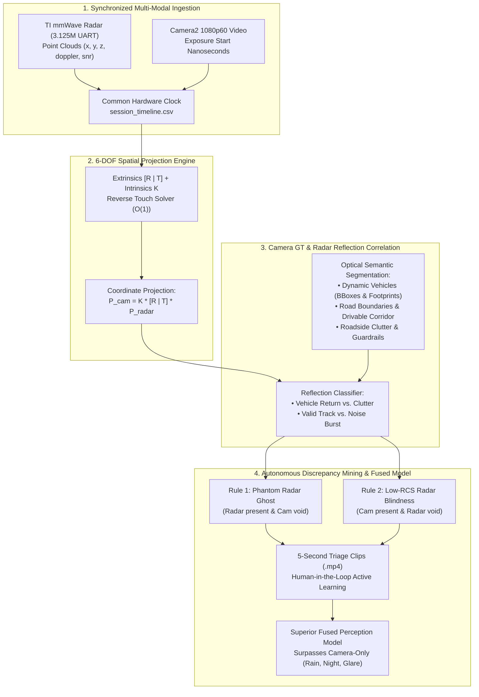

# Implementation Plan: Enhancing Week 2 Presentation with Phase 3 ML Validation, Point-Cloud Correlation & Visual Showcases

> **Document Name:** `plan_roadsense_week2_presentation_validation_pivot.md`  
> **Workspace:** `C:\Users\rakadu1.AHEAD\AndroidStudioProjects\RoadSense`  
> **Target Date:** September 30, 2026  
> **Target Presentation:** [`intel/presentations/decks/RoadSense_Week2_Executive_Progress.pptx`](file:///C:/Users/rakadu1.AHEAD/AndroidStudioProjects/RoadSense/intel/presentations/decks/RoadSense_Week2_Executive_Progress.pptx)  
> **Target Script:** [`intel/presentations/generate_roadsense_week2_deck.js`](file:///C:/Users/rakadu1.AHEAD/AndroidStudioProjects/RoadSense/intel/presentations/generate_roadsense_week2_deck.js)  
> **Foundational Intelligence:** `intel/Validation/` (Files 00–08) & Week 1 Slide 13 (`15_09_2026_ANDROID_LOGGER_Rushil_OG.pptx`)  

---

## 1. Goal Description

This plan incorporates the executive feedback from Week 1 (Slide 13) and the engineering specifications in `intel/Validation/`:
1. **Explicit 3-Pillar Optical-to-Radar Correlation Formulation (Slide 10)**:
   - Use camera vision models to segment **dynamic vehicles** (cars, two-wheelers, rickshaws, pedestrians) and **static road boundaries / clutter** (guardrails, signs, road plane).
   - Leverage spatial alignment ($[\mathbf{R} \mid \mathbf{T}], \mathbf{K}$) to **correlate radar reflections against visual detections**, verifying whether point clouds and tracks originate from actual physical vehicles, multipath ground bounces (ghosts), or stationary roadside clutter.
   - Train a superior **Multimodal Sensor Fusion Model** on validated cross-modal datasets that surpasses camera-only limits (rain, glare, night, long-range pitch errors) and automates fleet QA.
2. **Phase Handover & Roadmap (Slide 11)**:
   - Formally document the **100% completion of Phase 1 (6-DOF Calibration)** and **Phase 2 (Live Viewfinder Overlay)**.
   - Detail the **Phase 3 Sprint Action Plan** for automated validation.
3. **Visual Showcase & Architecture Diagram Integration**:
   - For test-track / meeting presentation where a live desktop cannot be connected:
     - **Slide 6 (Web Dashboard Showcase)**: Enhanced with an authentic dark-mode UI mockup card + designated screenshot slot for `http://localhost:8088`.
     - **Slide 7 (Foxglove Studio Perception Showcase)**: Enhanced with a 3D perception viewport mockup + designated screenshot slot for `RoadSense_Cockpit_Layout.json`.
     - **Slide 10 (System Architecture Diagram)**: Native vector dataflow diagram illustrating the Optical Ground Truth $\rightarrow$ Spatial Correlation $\rightarrow$ Anomaly Mining $\rightarrow$ Multimodal Model pipeline.

---

## 2. Best Architectural Diagrams Identified from `intel/`

From our audit of all documentation in `intel/`, the following 3 high-impact architectural formulations are selected to be represented visually in the deck:



* **Diagram 1 (Multi-Pillar Synergy from `intel/Validation/04_...`):** Triangulates Camera, Radar, CAN, and IMU to cross-validate detections without single points of failure.
* **Diagram 2 (Autonomous Anomaly Classifier from `intel/Validation/07_...`):** 4 rules isolating ghost tracks, target blindness, and kinematic spikes into 5-second video triage clips.
* **Diagram 3 (Optical 3D Ground-Truth Raycasting from `intel/Validation/01_...`):** Inverted pinhole raycasting ($Z_{\text{road}} = 0$) establishing metric 3D ground coordinates from 2D bounding boxes.

---

## 3. Detailed Proposed Slide Architecture

### Slide 06: Local Web Dashboard & ADB Automation
* **Header:** `DESKTOP TOOLCHAIN` • `Zero-Dependency Local Web Dashboard & ADB Automation`
* **Layout:** 2 Columns:
  * **Left Column (Text Card):** Pure Python 3 `ThreadingHTTPServer` (:8088), `/api/stream` Server-Sent Events, background ADB health poller, and 1-click execution.
  * **Right Column (Visual Dashboard Showcase):** High-contrast dark-mode vector mockup of the Web Dashboard (header status bar, live telemetry pills: Battery 55% 36.2°C, Storage 42GB free, ADB Connected, 1-Click Foxglove launch button, and designated screenshot slot).

---

### Slide 07: Foxglove MCAP Archiving & Perception Cockpit
* **Header:** `DATA ARCHITECTURE` • `High-Throughput Foxglove MCAP Pipeline (>11,500 FPS)`
* **Layout:** 2 Columns / Split:
  * **Left Column (Text Card + Benchmark Table):** Zero-Cost H.264 bitstream demuxing with $180^\circ$ `/tf` optical roll fold, embedded `RoadSense_Cockpit_Layout.json`, and the quantitative speed benchmark table (>11,500 FPS vs. 650 FPS NVENC vs. 85 FPS CPU).
  * **Right Column (Visual Perception Cockpit Showcase):** Widescreen mockup slot showing the 3D perception canvas with upright video, 3D radar point cloud, and live timeline scrubber.

---

### Slide 10: Phase 3 — Automated ML Validation & Sensor Fusion
* **Header:** `STRATEGIC DIRECTION • PHASE 3` • `Automated ML Validation & Multi-Modal Sensor Fusion Engine`
* **Subtitle:** `Correlating camera-generated ground truth with radar point clouds to train superior perception models`
* **Layout:** 3 Distinct Architectural Pillars:
  1. **Pillar 1: Optical Ground Truth & Road Boundary Segmentation**:
     - YOLOv8x/v11 detects dynamic vehicles (cars, motorcycles, auto-rickshaws, pedestrians).
     - Segments road boundaries, drivable corridor, and roadside clutter (guardrails, trees, signboards).
     - Inverted pinhole raycasting ($Z_{\text{road}} = 0$) calculates exact metric 3D ground coordinates $(X_C, Y_C, Z_C)$ in camera frame, replacing ₹35L RTK-DGPS beacons.
  2. **Pillar 2: Spatial Point-Cloud Correlation & Anomaly Mining**:
     - Using calibrated 6-DOF transform $[\mathbf{R} \mid \mathbf{T}]$ and microsecond sync (`session_timeline.csv`), projects radar reflections into camera space.
     - **Noise vs. Vehicle Discrimination:** Correlates radar point clouds and clusters against visual objects to determine if reflections are genuine targets, multipath ground bounces (ghosts), or stationary clutter.
     - **Autonomous Discrepancy Mining:** Rule 1 isolates phantom radar targets; Rule 2 catches low-RCS radar blindness.
     - Extracts automated **5-second video triage clips** for human-assisted active learning.
  3. **Pillar 3: Superior Fused Multimodal Model (Camera + Radar)**:
     - Fuses radar Doppler velocity and metric depth with camera visual semantics.
     - **Surpasses Camera-Only Baseline:** Operates flawlessly in heavy rain, optical glare, nighttime, and eliminates long-range camera pitch errors.
     - Automates fleet validation and generates standardized CLEAR MOT (MOTA, MOTP) scorecards.

---

### Slide 11: Milestone Handover & Phase 3 Sprint Plan
* **Header:** `PROJECT HANDOVER & ROADMAP` • `Milestone Handover: Phases 1 & 2 Complete, Phase 3 Launch`
* **Subtitle:** `Consolidating on-device perception breakthroughs and launching the validation pipeline`
* **Layout:** 2 Columns:
  * **Left Column (Delivered Milestones):**
    - ✅ **Phase 1 Complete:** 6-DOF Spatial Extrinsics & Reverse Touch Solver ($O(1)$ pitch/yaw snap).
    - ✅ **Phase 2 Complete:** Live Viewfinder Overlays (RViz hybrid lollipops with 12-segment road footprints, vertical perspective stems, Painter's depth sorting, range rings).
    - ✅ **100 Hz LSM6DSL Kinematics:** Linear accel & magnetic-immune 6-DOF quaternions.
    - ✅ **Desktop Toolchain:** Local Web Dashboard (:8088) and >11,500 FPS MCAP archiver.
    - ✅ **System Hardening:** Bugs #11 through #15 diagnosed and eliminated.
  * **Right Column (Phase 3 Immediate Action Items):**
    - **Step 1:** Implement offline camera 3D raycaster producing `vision_gt.json` (bounding boxes & ground contact patches).
    - **Step 2:** Deploy radar reflection correlation script matching points/tracks to optical targets and classifying noise vs. real vehicles.
    - **Step 3:** Implement automated discrepancy mining rules producing 5-second triage clips for human-in-the-loop review.
    - **Step 4:** Integrate active learning verification interface in the Web Dashboard for 1-click human triage.
    - **Step 5:** Train fused multimodal model for automated fleet CLEAR MOT benchmarking.

---

## 4. Verification Plan

### Automated Verification
```powershell
# 1. Compile Presentation Deck
cd intel/presentations
node generate_roadsense_week2_deck.js

# 2. Check File Output Size
Get-Item intel\presentations\decks\RoadSense_Week2_Executive_Progress.pptx | Select-Object Name, Length, LastWriteTime

# 3. Verify JVM Unit Tests Remain 100% Clean
$env:JAVA_HOME = "C:\Users\rakadu1.AHEAD\Android_Studio\android-studio-quail4-windows\android-studio\jbr"
./gradlew testDebugUnitTest
```

### Manual Verification
- Verify in Microsoft PowerPoint:
  - Slide 6 and Slide 7 provide visual showcase cards/placeholders ready for meetings without a desktop.
  - Slide 10 accurately describes the camera-radar reflection correlation and 3-pillar validation architecture.
  - Slide 11 clearly presents Phase 1 & 2 as 100% complete and Phase 3 as the active sprint plan.
