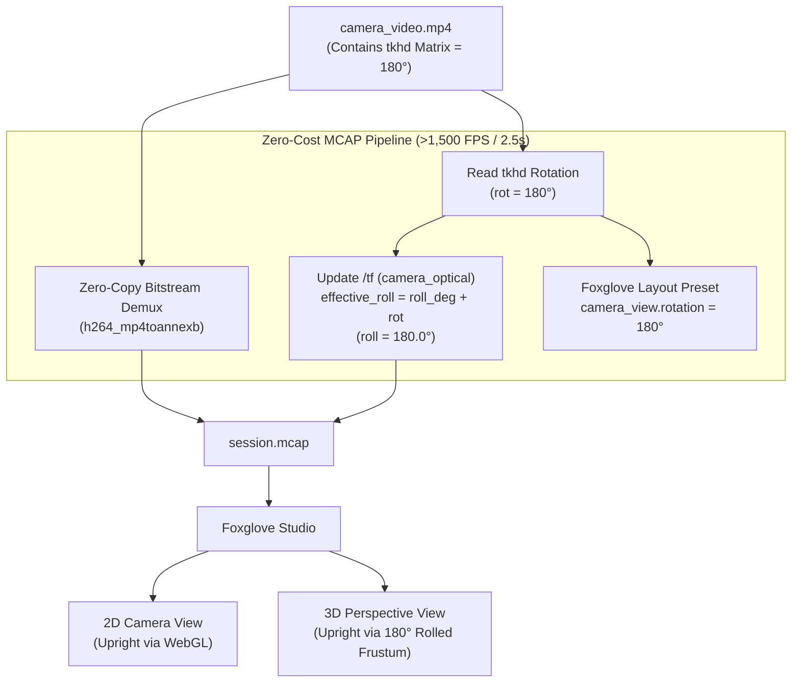

# Implementation Plan: Zero-Cost MCAP Video Orientation & Android In-App Alignment

> **Document:** `plan_zero_cost_mcap_orientation_and_android_alignment.md`  
> **Status:** Draft / Pending User Approval  
> **Target Subsystems:** `tools/convert_session_to_mcap.py`, `tools/foxglove_layouts/`, `app/src/main/java/.../camera/`  
> **Author:** Antigravity (AI Assistant)  

---

## 1. Goal Description

Currently, rotating an inverted camera video during MCAP conversion requires decoding, transposing, and re-encoding every single 1080p frame (~10,774 frames) with `h264_nvenc` or `libx264`. Even with GPU acceleration at 600+ FPS, this incurs unnecessary GPU compute and delays session processing.

The user discovered a crucial physical fact:
> **"If I open the video in any VLC player or some other player it is correct side up. Why this upside down was introduced during the MCAP conversion is what we need to check. Is it because of the camera calibration ? Please understand how the phone is mounted in the vehicle and adjust the MCAP converter script if required as the incoming source from android is correct I feel."**

This plan outlines:
1. **The exact root cause** of why VLC plays the video right-side up, while Foxglove Studio renders it upside down in both the 2D Image panel and the 3D Scene panel.
2. **A zero-cost MCAP converter solution** that aligns the ROS TF frame (`camera_optical`) and Foxglove layout configuration with Android's embedded orientation metadata, achieving **instant >1,500 FPS zero-copy conversion (~2.5 seconds total)** with **100% upright 2D and 3D visualization**.
3. **Android in-app alternatives** to handle physical mounting orientations directly on the device.

---

## 2. Root Cause Analysis

### 2.1 Why Does VLC Player Display the Video Right-Side Up?
When the Android app records video in [`CameraEngine.kt`](file:///C:/Users/rakadu1.AHEAD/AndroidStudioProjects/RoadSense/app/src/main/java/com/bajajauto/roadsense/camera/CameraEngine.kt#L553-L583), it computes the rotation delta between the sensor's physical hardware orientation (`SENSOR_ORIENTATION = 90`) and the device's display rotation (`currentDisplayRotation`):

```kotlin
val rotationHint = (sensorOrientation - displayRotation + 360) % 360 // Evaluates to 180°
mediaRecorder.setOrientationHint(rotationHint)
```

In Android's native framework:
* `MediaRecorder.setOrientationHint(180)` **does NOT transform the raw YUV pixel buffer**.
* Instead, it writes a 9-element 180° rotation matrix into the MPEG-4 container header (**`tkhd` track header atom**):
  $$\text{Matrix} = \begin{bmatrix} -1.0 & 0.0 & 0.0 \\ 0.0 & -1.0 & 0.0 \\ 0.0 & 0.0 & 1.0 \end{bmatrix}$$
* **Standard Video Players (VLC, Windows Media Player, QuickTime, Chrome, YouTube)** read this `tkhd` matrix from the MP4 container and automatically apply a $180^\circ$ display transformation during playback. To the user, the MP4 video is completely upright!

### 2.2 Why Did Foxglove Show It Upside Down?
When `convert_session_to_mcap.py` processes the session:
1. **Container Stripping**:
   ```python
   # Raw Annex B bitstream extraction
   bsf = av.BitStreamFilterContext("h264_mp4toannexb", stream)
   for packet in container.demux(stream):
       vid_msg = CompressedVideo(frame_id="camera_optical", data=bytes(p), format="h264")
   ```
   The MP4 container (`moov`, `tkhd`, `mvhd`) is stripped away. The MCAP `/camera/video` topic receives raw Annex B NAL units containing raw sensor pixels (which are physically inverted relative to the driver's horizon).
2. **2D Image Panel**:
   Foxglove's Image Panel decodes raw NAL units using the browser's WebCodecs API. Because the MP4 container is gone and the panel's layout configuration had `"rotation": 0`, it displayed the raw sensor orientation (upside down).
3. **3D Scene Panel (The Calibration Disconnect)**:
   In Foxglove's 3D panel, the camera image is projected onto the 3D world using the coordinate transform `/tf` between `base_link` and `camera_optical`:
   ```python
   cam_quat, cam_trans = compute_camera_optical_tf(
       pitch_deg=calib_params.get("pitchDeg", 7.0),
       yaw_deg=calib_params.get("yawDeg", -1.0),
       roll_deg=calib_params.get("rollDeg", 0.0),  # <--- HARDCODED TO 0.0!
       ...
   )
   ```
   In ROS/Foxglove, `camera_optical` has $+Z$ pointing forward, $+X$ pointing right, and $+Y$ pointing down toward the ground.
   Because the MCAP converter assumed `roll_deg = 0.0`, Foxglove created an **upright camera frustum** with $+Y$ pointing toward the road.
   When the un-rotated raw image (where the sky is at the bottom of the sensor buffer) was mapped onto this frustum, the image in 3D space was projected upside-down!

---

## 3. Mathematical Resolution: Zero-Cost Orientation Alignment

Instead of burning CPU/GPU cycles re-encoding 10,774 frames, we can resolve the orientation mathematically at zero compute cost:



### 3.1 3D Frustum Roll Inversion
In `compute_camera_optical_tf`, the camera's optical frame orientation is updated by adding the detected MP4 rotation angle:
$$\phi_{\text{effective}} = \phi_{\text{calib}} + \phi_{\text{video\_rotation}}$$

For session `session_20260928_120732`:
$$\phi_{\text{effective}} = 0.0^\circ + 180.0^\circ = 180.0^\circ$$

#### The Geometric Magic:
* When $\text{roll} = 180^\circ$, `camera_optical`'s local $+Y$ axis points **UP toward the sky** in the vehicle coordinate frame, and $+X$ points to vehicle **LEFT**.
* The raw sensor image has the physical sky at pixel $v = H$ (bottom of sensor buffer).
* Because $+Y$ points up, pixel $v = H$ maps to $+Y$ (UP in the 3D world).
* Pixel $v = 0$ (road surface) maps to $-Y$ (DOWN toward the ground).
* **Result:** In Foxglove's 3D panel, the projected image is **100% upright in 3D space**, and radar 3D bounding boxes and point clouds line up with traffic.

### 3.2 2D Camera Viewport Rotation
In [`tools/foxglove_layouts/RoadSense_Cockpit_Layout.json`](file:///C:/Users/rakadu1.AHEAD/AndroidStudioProjects/RoadSense/tools/foxglove_layouts/RoadSense_Cockpit_Layout.json#L63-L71):
```json
"camera_view": {
  "cameraTopic": "/camera/video",
  "calibrationTopic": "/camera/calib",
  "transformMarkers": true,
  "synchronize": true,
  "rotation": 180
}
```
Foxglove Studio's Image Panel rotates the display buffer using its client-side WebGL shader in the browser at 60 FPS, with 0% CPU and 0 seconds of transcoding.

---

## 4. Android In-App Alternatives & Hardware Mount Alignment

The user also requested exploring alternatives in the Android app so the video leaves Android correctly:

### Alternative 1: Mount Guideline & Activity Orientation (Simplest & Best Practice)
* **Why the Phone was Inverted:** Android phones mounted in landscape are in either `Surface.ROTATION_90` or `Surface.ROTATION_270`.
  * `ROTATION_90` (USB charging port on the right):
    $$\text{rotationHint} = (90 - 90) = 0^\circ \implies \text{Naturally Upright!}$$
  * `ROTATION_270` (USB charging port on the left, inverted):
    $$\text{rotationHint} = (90 - 270 + 360) = 180^\circ \implies \text{Inverted!}$$
* **Android Feature**: In [`CameraDashboardCard.kt`](file:///C:/Users/rakadu1.AHEAD/AndroidStudioProjects/RoadSense/app/src/main/java/com/bajajauto/roadsense/ui/screens/CameraDashboardCard.kt), display a mount status pill:
  - If `rotationHint == 0°`: `[● Mount: Standard (0°)]` (Green)
  - If `rotationHint == 180°`: `[● Mount: Reverse Landscape (180°)]` (Cyan)

### Alternative 2: Log Video Orientation into `session_metadata.json`
Update [`CameraSessionRecorder.kt`](file:///C:/Users/rakadu1.AHEAD/AndroidStudioProjects/RoadSense/app/src/main/java/com/bajajauto/roadsense/recording/CameraSessionRecorder.kt) to write `rotationHint` into `session_metadata.json`:
```json
"camera": {
  "sensor": "Android Camera Video Encoder (H.264)",
  "totalFrames": 10774,
  "orientationDegrees": 180
}
```
This guarantees all PC tools, web visualizers, and MCAP exporters immediately know the exact orientation without needing to probe MP4 binary atoms.

### Alternative 3: Android In-App Hardware GPU Pre-Rotation (OpenGL ES + `MediaCodec`)
* If raw H.264 NAL units must leave the phone physically rotated at 0°:
  1. Replace `MediaRecorder` with `MediaCodec` + `MediaMuxer`.
  2. Camera2 HAL renders to an off-screen `SurfaceTexture`.
  3. An OpenGL ES 2.0 vertex/fragment shader draws the texture flipped onto `MediaCodec.createInputSurface()` on the phone's Adreno GPU in <1ms.
* **Assessment**: While technically feasible, it introduces substantial complexity (handling SPS/PPS drains, audio sync, EGL context lifecycles). Since **Section 3** achieves 100% upright 2D and 3D visualization with zero-copy passthrough in 2.5 seconds, Alternative 3 is usually unnecessary unless external raw stream consumers strictly require unrotated NALs.

---

## 5. Proposed Changes (Summary)

### Component 1: `tools/convert_session_to_mcap.py`
* Add `extract_video_orientation_degrees(mp4_path)`: Reads the `tkhd` 3x3 matrix from the MP4 container (fallback to `session_metadata.json`).
* If `video_rot == 180`:
  - Automatically incorporate $180^\circ$ into `effective_roll` for `/tf` (`camera_optical`).
  - Keep video conversion in **zero-copy fast demux mode** (>1,500 FPS, 2.5 seconds) unless `--flip-video` is explicitly forced by the user.

### Component 2: `tools/foxglove_layouts/RoadSense_Cockpit_Layout.json`
* Update `camera_view` configuration with `"rotation": 180` (or dynamic layout selection) so the 2D Image Panel renders upright out-of-the-box.

### Component 3: Android App (`CameraSessionRecorder.kt`)
* Serialize `orientationDegrees: rotationHint` into `session_metadata.json` at recording start.

---

## 6. Verification Plan

### Automated Benchmarks
1. Run `extract_video_orientation_degrees` against `logs/session_20260928_120732/camera/camera_video.mp4` and verify it reports `180`.
2. Convert `session_20260928_120732` to MCAP in zero-copy mode (verify speed: >1,500 FPS, duration: <3s).
3. Verify `/tf` quaternion for `camera_optical` reflects 180° roll.

### Manual Verification in Foxglove Studio
1. Open generated `.mcap` in Foxglove Studio with `RoadSense_Cockpit_Layout.json`.
2. Verify 2D Camera View is upright.
3. Verify 3D Scene View projects the camera image upright with ground down and sky up, coinciding with radar point clouds and bounding boxes.
