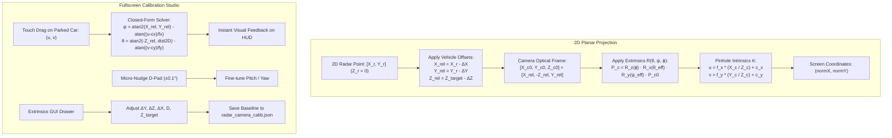

# Implementation Plan: Radar-Camera Spatial Calibration & Fullscreen Calibration Studio

## Goal Description
Implement **Phase 1: Radar-Camera Spatial Projection Engine & Fullscreen Calibration Studio** for RoadSense. This establishes the geometric, mathematical, and user interface pipeline required to map TI AWR1843 mmWave radar 2D planar metric detections ($X, Y$ with $Z \equiv 0$) directly onto the smartphone camera viewfinder pixels $(u, v)$.

### Key Architecture Updates from User Guidance:
1. **2D Planar Radar Detections ($Z_{\text{radar}} \equiv 0$):** TI AWR1843 radar point clouds and tracks currently operate in the horizontal vehicle plane. Anchor all radar projections to the road/radar plane with target height $Z_{\text{target}}$ (e.g. bumper height relative to radar), simplifying projection math and preventing false vertical elevation floating.
2. **100% GUI-Adjustable Extrinsics:** All 6-DOF extrinsic parameters ($\Delta X, \Delta Y, \Delta Z, \theta, \psi, \phi$) and target geometry ($D, Z_{\text{target}}$) are fully exposed and adjustable via sliders, text fields, and micro-nudge buttons in the UI.
3. **Dedicated Calibration Card:** Add `CameraCalibrationCard` into the camera controls hierarchy displaying current profile status, active offsets, and launching the calibration flow.
4. **Immersive Fullscreen Calibration Studio:** Upon tapping `[Calibrate Viewfinder]`, the UI transitions into an edge-to-edge full screen mode, hiding cockpit tabs and telemetry headers to maximize the viewfinder area for precise marker alignment over the target vehicle.

---

## User Review Required

> [!IMPORTANT]
> **2D Point Cloud Ground Anchor:** With $Z_{\text{radar}} \equiv 0$, the elevation offset relative to the camera is strictly determined by the difference between phone camera height and radar mounting plane ($Z_{\text{rel}} = Z_{\text{target}} - \Delta Z$). This guarantees deterministic ray intersections with zero out-of-plane distortion.

> [!NOTE]
> **Fullscreen Experience:** The Fullscreen Calibration Studio uses a full-screen Compose overlay (`Box(Modifier.fillMaxSize())` at `MainActivity` root), presenting an unobstructed 100% viewfinder view with floating, translucent HUD controls that can be minimized or repositioned during alignment.

---

## Architecture & Mathematical Formulation



### 1. Planar Forward Projection Equation
Given 2D radar point $(X_r, Y_r)$ and target height $Z_{\text{target}}$:
$$\mathbf{P}_{\text{rel}} = \begin{bmatrix} X_r - \Delta X \\ Y_r - \Delta Y \\ Z_{\text{target}} - \Delta Z \end{bmatrix}, \quad \mathbf{P}_{c0} = \begin{bmatrix} X_{\text{rel}} \\ -Z_{\text{rel}} \\ Y_{\text{rel}} \end{bmatrix}$$

Applying camera orientation angles:
$$\mathbf{P}_c = \mathbf{R}_z(\phi) \cdot \mathbf{R}_x(\theta_{\text{eff}}) \cdot \mathbf{R}_y(\psi_{\text{eff}}) \cdot \mathbf{P}_{c0}$$
$$u = f_x \frac{X_c}{Z_c} + c_x, \quad v = f_y \frac{Y_c}{Z_c} + c_y$$

### 2. Closed-Form Inverse Extrinsics Solver
When dragging the marker to screen position $(u, v)$ over a parked car at known distance $D$:
$$\text{dist}_{2D} = \sqrt{(0 - \Delta X)^2 + (D - \Delta Y)^2}$$
$$\psi = \arctan2(-\Delta X, D - \Delta Y) - \arctan\left(\frac{u - c_x}{f_x}\right)$$
$$\theta = \arctan2(\Delta Z - Z_{\text{target}}, \text{dist}_{2D}) - \arctan\left(\frac{v - c_y}{f_y}\right)$$

---

## Proposed Changes

### Component 1: Sensor Fusion Core Engine (`com.bajajauto.roadsense.fusion`)

#### [NEW] `fusion/model/CalibrationParameters.kt`
* Data class encapsulating:
  * `setbackM: Float` (Longitudinal setback $\Delta Y$, default `1.80f`, range `0.0f .. 4.0f`)
  * `heightOffsetM: Float` (Elevation offset $\Delta Z$, default `0.60f`, range `-0.5f .. 1.5f`)
  * `lateralOffsetM: Float` (Lateral offset $\Delta X$, default `0.00f`, range `-0.5f .. 0.5f`)
  * `targetDistanceM: Float` (Target vehicle distance $D$, default `10.0f`, range `2.0f .. 30.0f`)
  * `targetHeightM: Float` (Target height $Z_{\text{target}}$, default `0.50f`, range `-0.5f .. 1.5f`)
  * `pitchDeg: Float` (Baseline camera pitch $\theta$, range `-30.0f .. 30.0f`)
  * `yawDeg: Float` (Baseline camera yaw $\psi$, range `-30.0f .. 30.0f`)
  * `rollDeg: Float` (Mount roll $\phi$, range `-15.0f .. 15.0f`)
  * `nudgePitchDeg: Float` (Active session nudge $\Delta\theta$)
  * `nudgeYawDeg: Float` (Active session nudge $\Delta\psi$)
* Helper properties: `effectivePitchDeg = pitchDeg + nudgePitchDeg`, `effectiveYawDeg = yawDeg + nudgeYawDeg`.
* JSON serialization / deserialization methods.

#### [NEW] `fusion/engine/CameraIntrinsicsProvider.kt`
* Queries `CameraCharacteristics.LENS_INTRINSIC_CALIBRATION`.
* Fallback calculation from `SENSOR_INFO_ACTIVE_ARRAY_SIZE`, `SENSOR_INFO_PHYSICAL_SIZE`, and `LENS_INFO_AVAILABLE_FOCAL_LENGTHS`.
* Computes normalized focal lengths ($f_x, f_y$) and principal point ($c_x, c_y$) adjusted for orientation and viewfinder aspect ratio.

#### [NEW] `fusion/engine/SpatialProjectionEngine.kt`
* `project2DRadarToScreen(x: Float, y: Float, params: CalibrationParameters, intrinsics: CameraIntrinsics, viewWidth: Int, viewHeight: Int): ScreenPoint?`
* `solveExtrinsicsFromTouch(normX: Float, normY: Float, params: CalibrationParameters, intrinsics: CameraIntrinsics, viewWidth: Int, viewHeight: Int): Pair<Float, Float>`
* `calculateHorizonLine(params: CalibrationParameters, intrinsics: CameraIntrinsics, viewWidth: Int, viewHeight: Int): Pair<ScreenPoint, ScreenPoint>?`

#### [NEW] `fusion/storage/CalibrationStorageManager.kt`
* File target: `/sdcard/Android/data/com.bajajauto.roadsense/files/calibration/radar_camera_calib.json`.
* Non-blocking IO with coroutines on `Dispatchers.IO`.
* Safe defaults fallback if file does not exist.

---

### Component 2: ViewModel Integration (`com.bajajauto.roadsense.ui.RadarViewModel`)

#### [MODIFY] `ui/RadarViewModel.kt`
* Add state flows:
  * `val calibrationParams: StateFlow<CalibrationParameters>`
  * `val isCalibrationFullScreen: StateFlow<Boolean>`
  * `val isRadarOverlayEnabled: StateFlow<Boolean>`
* Add control functions:
  * `setCalibrationFullScreen(enabled: Boolean)`
  * `toggleRadarOverlay()`
  * `updateExtrinsics(setbackM: Float, heightOffsetM: Float, lateralOffsetM: Float, targetDistanceM: Float, targetHeightM: Float, rollDeg: Float)`
  * `applyCalibrationDrag(normX: Float, normY: Float, viewWidth: Int, viewHeight: Int)`
  * `nudgePitch(deltaDeg: Float)`
  * `nudgeYaw(deltaDeg: Float)`
  * `saveBaselineCalibration(profileName: String)`
  * `revertNudges()`
  * `resetCalibrationToDefaults()`

---

### Component 3: UI Cards & Fullscreen Studio (`com.bajajauto.roadsense.ui`)

#### [NEW] `ui/components/CameraCalibrationCard.kt`
* Rendered in the Camera dashboard controls panel.
* Shows calibration status: `CALIBRATED (Default Mount)` or `UNCALIBRATED`.
* Displays chips with current values: `Pitch: -2.3°`, `Yaw: +0.4°`, `Setback: 1.8m`.
* Buttons:
  * **`[Calibrate Viewfinder (Fullscreen)]`** (Opens immersive calibration studio).
  * **`[Toggle Radar HUD Overlay]`** (Enable/disable projected radar boxes on preview).
  * **`[Reset Baseline]`**

#### [NEW] `ui/components/FullscreenCalibrationStudio.kt`
* Fullscreen Compose overlay covering 100% of the screen:
  1. **Edge-to-Edge Viewfinder:** Maximizes the camera preview to full screen.
  2. **Top Translucent Floating Bar:**
     * `[✕ Exit Fullscreen]` button.
     * Profile indicator: `🎯 CALIBRATION STUDIO`.
     * Horizon line toggle (`[Show Horizon]`).
  3. **Interactive Target Reticle:**
     * Yellow crosshair over the parked vehicle at distance $D$.
     * Touch-draggable across the screen.
  4. **Bottom Translucent HUD & Micro-Nudge Deck:**
     * Micro-Nudge buttons: `[▲] [▼]` (Pitch $\pm 0.1^\circ$), `[◄] [►]` (Yaw $\pm 0.1^\circ$).
     * Large live readouts for `Pitch: -2.3°` and `Yaw: +0.4°`.
     * `[Adjust Parameters ⚙️]` button expanding a translucent drawer with sliders for Setback ($\Delta Y$), Height ($\Delta Z$), Lateral ($\Delta X$), Target Distance ($D$), and Target Height ($Z_{\text{target}}$).
     * `[Save as Baseline]` action button.

#### [NEW] `ui/components/QuickNudgeBar.kt`
* Compact collapsible floating nudge bar on the standard viewfinder for in-field fine-tuning.

#### [MODIFY] `ui/screens/CameraDashboardCard.kt`
* Include `CameraCalibrationCard` in the controls column.
* Render projected radar point cloud & tracks on the viewfinder when `isRadarOverlayEnabled` is true.

#### [MODIFY] `ui/MainActivity.kt`
* Add root-level conditional rendering for `FullscreenCalibrationStudio` when `isCalibrationFullScreen` is active.

---

## Verification Plan

### Automated Tests
1. **`SpatialProjectionEngineTest.kt` (JVM Unit Tests):**
   * Validate 2D planar projection at $(0, 10)$ with $\theta=0, \psi=0$ maps to screen optical center.
   * Validate reverse solver: dragging to $(u, v)$ recovers exact $(\theta, \psi)$ within $< 0.001\text{ px}$.
   * Validate all GUI-adjustable parameters ($\Delta X, \Delta Y, \Delta Z, D, Z_{\text{target}}$) shift screen coordinates predictably.
2. **`CalibrationStorageTest.kt`:**
   * Validate JSON serialization, loading, and recovery on empty/corrupted files.

Command:
```powershell
$env:JAVA_HOME = "C:\Users\rakadu1.AHEAD\Android_Studio\android-studio-quail4-windows\android-studio\jbr"
./gradlew testDebugUnitTest
```

### Manual Verification
1. **Compilation & Assembly:**
   ```powershell
   $env:JAVA_HOME = "C:\Users\rakadu1.AHEAD\Android_Studio\android-studio-quail4-windows\android-studio\jbr"
   ./gradlew assembleDebug
   ```
2. **Studio Verification:**
   * Open app $\to$ Camera tab $\to$ tap **`[Calibrate Viewfinder]`**.
   * Verify screen goes into full 100% immersive mode, hiding tabs and header bars.
   * Drag reticle across screen: verify smooth, jitter-free movement and live Pitch/Yaw updates.
   * Open parameters drawer: adjust Setback slider from 1.5m to 2.5m; verify reticle shifts according to perspective.
   * Tap micro-nudge arrow buttons: verify $0.1^\circ$ precision increments.
   * Tap `[Save as Baseline]`, exit fullscreen, restart app: verify saved baseline persists.
