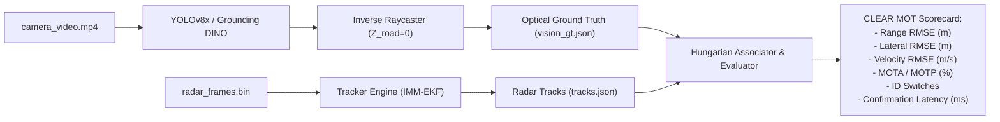

# Staged Progression Plan: Real-World Multi-Sensor ADAS Algorithm Validation

## Goal Description
To establish a rigorous, repeatable, and staged engineering pipeline for validating the RoadSense perception algorithms (Point Cloud Processing, IMM-EKF Multi-Target Tracking, Forward Collision Warning [FCW], and Blind Spot Detection [BSD]) using real-world driving data collected with the RoadSense multi-sensor logger (Radar + Camera + CANedge2 + IMU + GNSS).

This plan bridges the gap between raw hardware recording in the vehicle and quantitative algorithm verification, providing:
1. An actionable **Real-World Drive Capture Protocol** for the user's upcoming test runs.
2. A **5-Stage Progressive Validation Workflow** decoupling testing into Point Cloud, Tracker, and Application layers.
3. Concrete scripts and benchmarking tools to measure CLEAR MOT metrics, kinematic RMSE, TTC accuracy, and cross-modal anomalies.

```
┌────────────────────────────────────────────────────────────────────────────────────────┐
│                        THE 5-STAGE VALIDATION PROGRESSION                              │
│                                                                                        │
│   STAGE 0: Real-World Multi-Scenario Capture & In-Situ Calibration (Vehicle Drive)     │
│   STAGE 1: Ingestion & Multi-Stream Synchrony Verification (Integrity & Health)       │
│   STAGE 2: Layer 1 — Point Cloud & Kinematic Consistency (Doppler Invariance)         │
│   STAGE 3: Layer 2 — IMM-EKF Tracker Benchmarking (Optical Ground Truth & CLEAR MOT)  │
│   STAGE 4: Layer 3 — Active Safety Application Validation (FCW & BSD Verification)    │
│   STAGE 5: Continuous Anomaly Mining & Edge-Case Regression Loop                       │
└────────────────────────────────────────────────────────────────────────────────────────┘
```

---

## User Review Required

> [!IMPORTANT]
> **Key Decisions & Pre-Drive Preparations for the User:**
> 1. **Calibration Check Before Driving (Stage 0):**
>    - Ensure spatial calibration (`radar_camera_calib.json`) is locked prior to recording. If using the mobile mount, verify pitch inclination $\theta$ via the IMU Level-Ground helper or snap the reverse touch reticle to a known parked vehicle at $10\text{m}$.
> 2. **Target Scenarios During Drive:**
>    - To validate all layers effectively, the capture drive should include:
>      * **Scenario A (Steady Car Following):** Following a lead vehicle at 30–60 km/h with varying headway (10m to 50m).
>      * **Scenario B (Cut-Ins & Urban Density):** Two-wheelers or auto-rickshaws cutting across the ego path.
>      * **Scenario C (Curved Road / Turning):** Negotiating curves with roadside guardrails/poles to test CIPV path bending.
>      * **Scenario D (Overtaking & Being Overtaken):** Slower parked cars passed on the side (for BSD suppression) and faster vehicles passing in the adjacent lane (for BSD activation).
> 3. **Tracker Implementation Reference:**
>    - Clarify whether tracker benchmarking will evaluate the **TI On-Chip DSP EKF** (output directly in `radar_frames.bin` TLV 7/10), the **Python tracker from `CANenbl_unifiedRadarTracker`**, or an upcoming on-device Kotlin tracker. (The offline validation pipeline supports all three).

---

## Open Questions

> [!NOTE]
> 1. **CAN Signal Logging:** Will the test vehicle have CANedge2 connected to log live vehicle wheel speed and steering/yaw? *(If yes, kinematic Doppler consistency $V_r + V_{ego}\cos\theta = 0$ and CIPV path bending can be validated with sub-percent precision).*
> 2. **Target Vehicles:** Will the test drive involve a dedicated companion vehicle (for controlled braking/gap tests) or uncontrolled real-world traffic?

---

## Detailed Step-by-Step Staged Progression

---

### STAGE 0: Real-World Capture Protocol (Pre-Drive Checklist)
Before turning the vehicle ignition on, execute this standardized field procedure:

1. **Physical Rigidity & Optical Alignment:**
   - Mount Android phone in windshield cradle; verify lens has an unobstructed view through the wiper sweep area.
   - Verify TI AWR1843BOOST radar bracket is rigid with zero mechanical wobble.
2. **App Pre-Flight Configuration:**
   - Launch **RoadSense** (`feature/3125000-baud`).
   - Radar Tab: Connect 3.125 Mbps serial port; verify active point cloud streaming at 20 Hz.
   - Camera Tab: Enable Viewfinder; verify **Road AE** is active (`ROAD AE` pill visible) and lens focus is set to **Infinity Mode** (diopters = 0.0f).
   - IMU Tab: Verify 100 Hz LSM6DSL accelerometer and gyroscope stream.
   - CAN Tab: Verify CANedge2 Wi-Fi connected to AP (`M21`) and staged pool shows active device status.
3. **In-Situ Calibration Verification:**
   - Perform quick IMU Level-Ground pitch alignment or confirm `radar_camera_calib.json` matches the vehicle mount geometry ($\Delta X, \Delta Y, \Delta Z, \theta, \psi, \phi$).
4. **Recording Execution:**
   - Tap **START RECORDING** in the Cockpit.
   - Drive the target scenarios (15–30 minutes total recommended for an initial golden dataset).
   - Tap **STOP RECORDING**; allow the CANedge post-recording finalizer to pull the latest 60s MF4 chunks into `can/` and close `session_timeline.csv`.

---

### STAGE 1: Session Ingestion & Multi-Sensor Integrity Audit
Once logs are transferred to the workstation (`python tools/sync_and_process_sessions.py` or manual copy), perform the multi-sensor health audit before any algorithm testing:

#### Tasks:
1. **Run Master Health Check:**
   ```powershell
   python scripts/session_health_check.py --latest
   ```
   - Verify zero radar UART buffer overruns.
   - Verify camera frame drop rate $< 0.1\%$ and mean frame interval $\approx 33.3\text{ ms}$ (30 FPS) or $16.6\text{ ms}$ (60 FPS).
   - Verify CAN MF4 chunks are intact with valid headers (`MDF ` / `UnFinMF `).
2. **Audit Cross-Sensor Monotonic Synchronization:**
   ```powershell
   python scripts/audit_cross_sensor_sync.py --latest
   ```
   - Confirm radar-to-camera timestamp delta satisfies Nyquist criteria ($\Delta t_{sync} < 16.67\text{ ms}$).
3. **Generate MCAP Archive for Foxglove Visual Inspection:**
   ```powershell
   conda activate roadsense-mcap
   python tools/convert_session_to_mcap.py logs/session_YYYYMMDD_HHMMSS
   ```
   - Open `.mcap` in Foxglove Studio; scrub through the timeline to confirm point clouds, 3D radar lollipops, IMU trajectories, and video are visually aligned in space and time.

---

### STAGE 2: Layer 1 — Point Cloud & Sensor-Level Kinematic Consistency
Validate the raw sensor returns before testing multi-target tracking.

```
KINEMATIC CONSISTENCY EQUATION (STATIONARY CLUTTER):
   V_radial + V_ego * cos(θ_azimuth) ≡ 0.00 m/s
```

#### Tasks:
1. **Stationary Clutter Doppler Validation:**
   - Filter point clouds for stationary targets (guardrails, signs, road surface reflections).
   - Correlate measured Doppler radial velocity $V_r$ with CAN vehicle ground speed $V_{ego}$ and target azimuth $\theta$.
   - Any residual $\epsilon = |V_r + V_{ego} \cos \theta| > 0.35\text{ m/s}$ indicates mounting yaw misalignment ($\Delta \psi$) or CAN speed scaling errors.
2. **Point Cloud Density & SNR Profile:**
   - Measure detection probability $P_d$ as a function of range $R \in [5\text{m}, 80\text{m}]$.
   - Verify CFAR detection stability: low-RCS targets (motorcycles, bicycles) maintain $\ge 1$ point return at $\le 25\text{m}$.
3. **Deliverable:**
   - Create `tools/validation/validate_layer1_pointcloud.py` outputting a kinematic consistency report and SNR falloff curves.

---

### STAGE 3: Layer 2 — State Estimation & Tracking Benchmarking
Evaluate the tracking filter's accuracy, stability, and latency against an optical reference.



#### Tasks:
1. **Generate Optical 3D Ground Truth (`vision_gt.json`):**
   - Run 2D vehicle detection on `camera_video.mp4` using calibrated camera intrinsics $K$ and extrinsics $[\mathbf{R} \mid \mathbf{T}]$.
   - Project bounding box road-contact points $(u, v_{\max})$ to 3D vehicle coordinates $(X_C, Y_C, 0)$ via ground plane raycasting.
2. **Headless SIL Tracker Replay Harness:**
   - Build `tools/validation/replay_tracker_sil.py` to feed `radar_frames.bin` into the candidate tracking pipeline at 100x real-time speed.
3. **Hungarian Spatial Association & Metrics Calculation:**
   - Match radar tracks to optical ground-truth objects at each timestamp using Mahalanobis distance gating.
   - Compute CLEAR MOT metrics:
     * **MOTA (Multi-Object Tracking Accuracy):** Penalizing false positives, misses, and ID switches.
     * **MOTP (Multi-Object Tracking Precision):** Spatial distance error.
     * **Kinematic RMSE:** Range error ($e_Y \le 0.5\text{m}$ target), Lateral error ($e_X \le 0.35\text{m}$ target), Velocity error ($e_V \le 0.4\text{ m/s}$ target).
     * **Track Initiation Latency:** Time from first detection to confirmed track state (target $\le 150\text{ ms}$).

---

### STAGE 4: Layer 3 — Active Safety Application Validation (FCW & BSD)
Validate the decision logic and warning thresholds that act upon the tracked objects.

#### 1. Forward Collision Warning (FCW) Validation:
* **Closest In-Path Vehicle (CIPV) Selection:**
  - Verify lateral corridor gating ($X \in [-1.8\text{m}, +1.8\text{m}]$ on straights).
  - Verify **Curvature Path Compensation** using IMU yaw rate $\omega_z$ and CAN speed $V_{ego}$:
    $$R = \frac{V_{ego}}{\omega_z}, \quad X_{path}(Y) = \frac{Y^2}{2R}$$
  - Confirm vehicles in adjacent lanes on curves do NOT falsely trigger in-path status.
* **Time-to-Collision (TTC) Dynamic Verification:**
  - Compare measured $\text{TTC} = \frac{Y_{rel}}{|V_{rel}|}$ against optical ground-truth TTC.
  - Verify alert categorization transitions:
    * Category 1 (Informative): $10\text{s} < \text{TTC} \le 30\text{s}$
    * Category 2 (Warning): $5\text{s} < \text{TTC} \le 10\text{s}$
    * Category 3 (Critical Alert): $\text{TTC} \le 5\text{s}$

#### 2. Blind Spot Detection (BSD) Validation:
* **Spatial Zone Containment:**
  - Longitudinal: $Y \in [-3.0\text{m}, +3.0\text{m}]$ relative to rear axle.
  - Lateral: $X \in [0.5\text{m}, 3.0\text{m}]$ (left and right adjacent lanes).
* **Relative Speed Gating:**
  - Approaching vehicle ($V_{rel} > +5\text{ km/h}$): BSD active.
  - Overtaking stationary roadside object ($V_{rel} < -15\text{ km/h}$): BSD suppressed to prevent strobe flashing when passing parked cars.
* **Deliverable:**
  - `tools/validation/validate_fcw_bsd.py` parsing session tracks, evaluating TTC / BSD triggers, and outputting warning logs.

---

### STAGE 5: Autonomous Anomaly Mining & Edge-Case Extraction
Automate the discovery of algorithm failure modes across all captured logs without manual video scrubbing.

#### Tasks:
1. **Build `tools/validation/mine_session_anomalies.py`:**
   - **Phantom FCW Alerts (Ghost Targets):** FCW alert generated, but vision model detects no object along that vector $\rightarrow$ clips 5s video for radar multipath/clutter analysis.
   - **Missed Targets (Radar Blindness):** Optical vision detects clear lead car ($R < 30\text{m}$), but radar reports 0 tracks $\rightarrow$ clips 5s video for low-RCS / angle dropout analysis.
   - **Kinematic Paradoxes:** Track acceleration $> 1.5g$ or velocity discontinuity $> 15\text{ km/h}$ $\rightarrow$ flags track swap or centroid jump.
2. **Generate Interactive HTML Anomaly Summary:**
   - Compile discovered edge-case clips into an interactive HTML scorecard for engineering review.

---

## Proposed Changes to the Repository

### Component: Validation Scripts & Tools (`tools/validation/`)

#### [NEW] `tools/validation/replay_tracker_sil.py`
- Headless Python SIL replay harness reading `radar_frames.bin` and generating continuous track states.

#### [NEW] `tools/validation/extract_vision_gt.py`
- Runs YOLOv8/11 and inverse ground plane raycaster on `camera_video.mp4` using `radar_camera_calib.json` to generate `vision_gt.json`.

#### [NEW] `tools/validation/evaluate_tracker_metrics.py`
- Hungarian data association and CLEAR MOT / RMSE benchmark calculation.

#### [NEW] `tools/validation/validate_fcw_bsd.py`
- CIPV corridor, TTC categorization, and BSD zone rule validation script.

#### [NEW] `tools/validation/mine_session_anomalies.py`
- Automated discrepancy detector scanning for ghosts, drops, and kinematic jumps.

### Component: Documentation & Playbooks (`intel/Validation/`)

#### [NEW] `intel/Validation/09_REAL_WORLD_DATA_COLLECTION_AND_VALIDATION_PLAYBOOK.md`
- Field operator guide with mount instructions, pre-drive checklist, test scenario scripts, and handover steps.

---

## Verification Plan

### Automated Verification
1. Run `./gradlew testDebugUnitTest` to ensure Android project integrity.
2. Run `scripts/session_health_check.py` and `scripts/audit_cross_sensor_sync.py` on existing session logs to establish baseline health scorecards.
3. Validate Python script syntax and dependencies with `python -m py_compile tools/validation/*.py`.

### Manual Verification
1. User executes the **Stage 0 Pre-Drive Protocol** during upcoming real-world data collection.
2. Transfer session to workstation and run Stage 1 integrity audit.
3. Review generated metrics and Foxglove replay.
