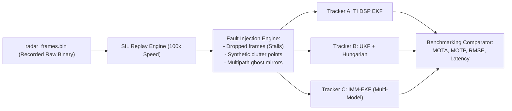

# Plan: Multi-Pillar ADAS Validation Ramp-Up Strategy & Strategic Brainstorming

## Goal Description
We have previously established the mathematical and architectural blueprint for **Approach 1: Optical Monocular 3D Ground-Truth Generation** (using inverted camera raycasting to benchmark radar tracks). 

However, relying solely on optical vision has inherent physical boundaries (e.g., lens flare, heavy rain/fog, nighttime illumination limits, and pitch sensitivity at long ranges $>60\text{m}$). To build a world-class, automotive-grade ADAS validation framework for motorcycle and passenger vehicle perception, we must diversify and scale our validation methodologies across multiple orthogonal vectors.

This plan brainstorms and defines **five additional validation pillars** to ramp up our testing ecosystem, transforming RoadSense from a standalone data logger into an automated **End-to-End Perception Validation & Continuous Testing Engine**:

```
┌────────────────────────────────────────────────────────────────────────────────────────┐
│                   THE 6-PILLAR ADAS VALIDATION ECOSYSTEM                               │
│                                                                                        │
│  [PILLAR 1] Optical 3D Ground Truth (Vision-to-Radar Inversion) [ESTABLISHED]          │
│  [PILLAR 2] Ego-Motion Kinematic Consistency (CAN Bus + IMU Cross-Validation) [NEW]    │
│  [PILLAR 3] Ground-Truth Physical Target & Track Testing Protocols (NCAP/ISO) [NEW]    │
│  [PILLAR 4] Software-in-the-Loop (SIL) Digital-Twin Replay & Stress Testing [NEW]      │
│  [PILLAR 5] Cross-Modal Discrepancy & Autonomous Anomaly Detection [NEW]               │
│  [PILLAR 6] Automated Fleet Depot CI/CD Pipeline & Regression Engine [NEW]             │
└────────────────────────────────────────────────────────────────────────────────────────┘
```

---

## User Review Required

> [!IMPORTANT]
> **Key Strategic Decisions for User Feedback:**
> 1. **Prioritization of Validation Pillars:**
>    - Which pillars should be prioritized for near-term implementation?
>      - **Pillar 2 (CAN + IMU Kinematic Validation):** Highly recommended as immediate next priority since CANedge2 and 100 Hz IMU data are already captured synchronously in every session.
>      - **Pillar 4 (SIL Digital-Twin Replay):** Essential for tuning tracker parameters on host PCs without needing to ride the motorcycle for every code change.
>      - **Pillar 5 (Cross-Modal Anomaly Mining):** Crucial for finding edge cases across hundreds of hours of road testing without manual video scrubbing.
> 2. **Physical Test Track Scenarios (Pillar 3):**
>    - Alignment with specific regulatory or OEM test procedures: Euro NCAP Car-to-Car Rear Stationary (CCRs), Car-to-Car Rear Moving (CCRm), and specialized Two-Wheeler Cut-In protocols.
> 3. **Validation Folder Deliverables:**
>    - Add the strategic specifications to [`intel/Validation`](file:///C:/Users/rakadu1.AHEAD/AndroidStudioProjects/RoadSense/intel/Validation) under:
>      - `04_MULTI_PILLAR_VALIDATION_STRATEGY_AND_BRAINSTORMING.md`
>      - `05_KINEMATIC_CONSISTENCY_AND_CAN_IMU_VALIDATION.md`
>      - `06_SIL_REPLAY_SIMULATION_AND_STRESS_TESTING.md`
>      - `07_CROSS_MODAL_ANOMALY_DETECTION_AND_EDGE_CASE_MINING.md`

---

## Open Questions

> [!NOTE]
> 1. **CAN Signal Availability:** For Pillar 2, do our current vehicle CAN logs contain individual 4-wheel speeds (`WheelSpeed_FL`, `WheelSpeed_FR`, `WheelSpeed_RL`, `WheelSpeed_RR`) or a single composite vehicle speed? *(4-wheel speeds allow detecting wheel slip and computing exact yaw rates during hard braking).*
> 2. **Physical Testing Assets:** Do we have access to static trihedral corner reflectors or a dedicated test track/runway for controlled distance calibration runs?

---

## The 6 Validation Pillars (Detailed Brainstorming & Architecture)

---

### Pillar 1: Optical 3D Ground Truth (Vision-to-Radar Inversion) [Baseline]
* **Method:** Run high-capacity 2D/3D vision models (YOLOv8x/v11, Metric3D) on recorded 1080p60 video.
* **Mechanism:** Inverse raycasting of vehicle road contact patches $(u_{\text{contact}}, v_{\max})$ onto the flat-earth plane ($Z_{\text{road}} = 0$) using calibrated intrinsics $K$ and extrinsics $[\mathbf{R} \mid \mathbf{T}]^{-1}$.
* **Primary Role:** High-volume reference for multi-target traffic in urban and highway environments.

---

### Pillar 2: Ego-Motion & Kinematic Consistency (CAN Bus + IMU Cross-Validation) [NEW]
* **The Core Concept:** In mobile robotics and automotive perception, the vehicle's own kinematics provide an absolute, self-contained physical constraint that requires **zero external sensors**.
* **Methodology 1: Stationary Clutter & Landmark Invariance:**
  * When driving past stationary roadside objects (guard rails, parked cars, road signs, lamp posts, tunnel pillars), their measured radial Doppler velocity must strictly obey:
    $$V_{\text{radial}} = - V_{\text{ego}} \cdot \cos(\theta_{\text{azimuth}})$$
  * Where $V_{\text{ego}}$ is sourced directly from vehicle CAN bus wheel speed sensors, and $\theta_{\text{azimuth}}$ is the radar's measured angle of arrival.
  * **What this validates:**
    1. If the radar Doppler velocity deviates from $-V_{\text{ego}} \cos(\theta)$, it exposes radar clock frequency drift or CAN wheel speed calibration scaling errors.
    2. If the stationary points do not project to zero velocity in world coordinates, it exposes mounting yaw misalignment ($\Delta \psi$).
* **Methodology 2: Dead-Reckoning Landmark Stability (Ego-SLAM Constraint):**
  * Integrate vehicle CAN speed and IMU 100 Hz yaw rate ($\omega_z$) to build the vehicle's ego-motion trajectory:
    $$X_{\text{ego}}(t) = \int_0^t V_{\text{ego}}(\tau) \cos(\psi(\tau)) d\tau, \quad Y_{\text{ego}}(t) = \int_0^t V_{\text{ego}}(\tau) \sin(\psi(\tau)) d\tau$$
  * Stationary landmarks detected by the radar at time $t_1$ must project to the identical spatial coordinate $(X_W, Y_W)$ when re-observed at time $t_2$.
  * Any drift or divergence between radar landmark tracking and IMU/CAN dead-reckoning directly isolates radar tracking noise and mounting bracket vibration.

```
KINEMATIC CONSISTENCY EQUALITY (STATIONARY CLUTTER):

   Radar Radial Velocity:  V_radial
   Vehicle CAN Speed:      V_ego
   Target Azimuth Angle:   θ_azimuth

   Physical Invariant:     V_radial + V_ego * cos(θ_azimuth) ≡ 0.00 m/s
   (Any residual ε > 0.3 m/s flags sensor misalignment or wheel-slip!)
```

---

### Pillar 3: Ground-Truth Physical Target Protocols (NCAP / ISO Testbed) [NEW]
* **The Core Concept:** Optical models can have edge ambiguities at extreme ranges ($>60\text{m}$) or under low light. Controlled physical test setups provide **sub-centimeter absolute metric ground truth**.
* **Methodology 1: Calibrated Trihedral Corner Reflectors:**
  * Deploy triangular trihedral metallic reflectors with known Radar Cross Section (RCS, e.g. $+20\text{ dBsm}$ for two-wheelers, $+30\text{ dBsm}$ for cars) at physically surveyed laser-measured distances ($10\text{m}, 25\text{m}, 50\text{m}, 75\text{m}$).
  * Ground truth is established by fixed surveyor stakes, completely eliminating vision errors.
  * Evaluates radar point-cloud SNR, elevation beamwidth roll-off, and range resolution when two reflectors are placed close together ($1\text{m}$ apart).
* **Methodology 2: Standardized ADAS Active Safety Scenarios (Euro NCAP / ISO 15623):**
  * **Scenario A: Car-to-Car Rear Stationary (CCRs):** Ego vehicle approaches a parked target vehicle at $30, 50, 70\text{ km/h}$. Tests forward collision warning (TTC) accuracy and track initiation distance.
  * **Scenario B: Car-to-Car Rear Moving (CCRm):** Lead vehicle travels at constant speed ($20\text{ km/h}$), ego vehicle approaches at $50\text{ km/h}$. Tests relative velocity and range-rate tracking.
  * **Scenario C: Two-Wheeler Cut-In / Cut-Out:** Motorcycle cuts across the ego path from an adjacent lane with high lateral velocity ($2\text{ m/s}$). Evaluates radar azimuth tracking and track initiation latency under sudden cross-traffic movement.

---

### Pillar 4: Software-in-the-Loop (SIL) Digital-Twin Replay & Stress Testing [NEW]
* **The Core Concept:** Road testing is expensive, dangerous, and non-repeatable (traffic conditions change constantly). RoadSense's raw framed binary dumps (`radar_raw_stream.bin`, `radar_frames.bin`) enable a **deterministic digital-twin replay environment** on PC workstations.
* **Methodology 1: 100x Accelerated Algorithm Benchmarking:**
  * Replay identical raw radar chirps through different candidate tracking filters (e.g. TI On-Chip DSP EKF vs. Extended Kalman Filter with Constant Turn Rate & Acceleration [CTRA] vs. Unscented Kalman Filter [UKF] vs. Joint Probabilistic Data Association Filter [JPDAF]).
  * Evaluate candidate trackers against the identical optical ground truth to scientifically select optimal algorithms.
* **Methodology 2: Synthetic Fault Injection & Stress Testing:**
  * **Hardware Stall Simulation:** Artificially drop 2 to 5 consecutive radar chirps (simulating USB bus contention or RF interference) to verify tracker coasting stability.
  * **Clutter Injection:** Artificially inject random Poisson-distributed false points into the point cloud to evaluate CFAR gating and false track rejection.
  * **Multipath Ghost Reflection Injection:** Mirror lead vehicle detections behind the vehicle to verify ghost-rejection algorithms.
  * **Sensor Noise Sweeps:** Add synthetic Gaussian noise to test covariance parameter tuning.



---

### Pillar 5: Cross-Modal Discrepancy & Autonomous Anomaly Detection [NEW]
* **The Core Concept:** When recording hundreds of hours of fleet data across multiple cities, human engineers cannot manually watch every minute of video. We implement an **autonomous edge-case mining engine** that automatically flags sensor discrepancies:
* **The Anomaly Rules Engine:**
  1. **Phantom Target Detection (Ghost Flag):** Radar reports a high-confidence target ($R < 30\text{m}$, closing speed $> 20\text{ km/h}$), but the Vision Model detects zero objects along that optical projection line. $\rightarrow$ *Automated clip extraction for false-alarm analysis (guardrail/bridge reflections).*
  2. **Radar Blindness Detection (Missed Target Flag):** Vision Model detects a clearly visible two-wheeler or pedestrian directly ahead with high optical confidence ($>0.92$), but Radar reports zero point-cloud returns for $>3$ consecutive frames. $\rightarrow$ *Automated clip extraction for low-RCS radar failure analysis.*
  3. **Kinematic Violation Detection (Physics Paradox):** Radar track exhibits an instantaneous acceleration $> 1.5g$ or velocity step $> 15\text{ km/h}$ between frames. $\rightarrow$ *Automated clip extraction for track ID switching or association corruption.*
  4. **Multi-Modal Sync Loss Detection:** Timestamp difference between camera frame shutter and radar chirp exceeds $50\text{ ms}$. $\rightarrow$ *Automated flag for hardware scheduler degradation.*
* **Automated Output:** The engine generates an **Anomaly Highlight Reel** and JSON manifest, clipping the exact 5-second video and radar chunks surrounding each anomaly for instant engineering review.

---

### Pillar 6: Automated Fleet Depot CI/CD Pipeline & Regression Engine [NEW]
* **The Core Concept:** Transform validation from a manual post-processing task into a **continuous autonomous background service**.
* **Depot Workflow:**
  1. **Automatic Ingestion:** When a test vehicle returns to the garage and connects to the workshop Wi-Fi, logs are pulled via ADB / Wi-Fi automatically.
  2. **Automated Pipeline Execution:** An on-premise server or cloud instance triggers the full validation suite:
     * Generates Optical Ground Truth (`vision_gt.json`)
     * Computes Kinematic Consistency against CAN bus speed
     * Executes CLEAR MOT tracking metrics
     * Mines anomalies and discrepancies
  3. **Automated Executive Notification:** Posts a session summary scorecard directly to the engineering team's collaboration platform (Slack / Microsoft Teams) and updates a continuous fleet-wide tracking performance dashboard.
  4. **Regression Gate:** If any tracking algorithm update drops the fleet MOTA score below $80\%$, the pull request / firmware build is automatically blocked.

---

## Comparative Matrix: The 6 Validation Pillars

| Dimension | Pillar 1: Optical 3D Ground Truth | Pillar 2: CAN/IMU Kinematic Consistency | Pillar 3: Physical Corner Reflectors | Pillar 4: SIL Digital-Twin Replay | Pillar 5: Cross-Modal Anomaly Mining | Pillar 6: Fleet Depot CI/CD Pipeline |
| :--- | :--- | :--- | :--- | :--- | :--- | :--- |
| **Primary Goal** | Multi-target traffic tracking | Sensor physical calibration & Doppler check | Absolute metric range & angular precision | Tracker algorithm comparison & tuning | Edge-case & failure discovery | Continuous regression testing |
| **Ground Truth Source** | YOLO + Inverted Pinhole Raycasting | Wheel speed sensors + 100 Hz Gyroscope | Surveyed laser markers + Calibrated targets | Recorded raw binary telemetry | Cross-sensor consensus | Accumulated historical baseline |
| **Hardware Needed** | Standard RoadSense unit | Vehicle CAN bus + Internal IMU | Trihedral reflectors + Laser tape | Host PC / Workstation | Host PC / Server | Workshop Wi-Fi + Processing server |
| **Operational Setting** | Public road driving | Any driving scenario | Dedicated test track / Runway | Pure offline simulation | Automated batch processing | Automated overnight execution |
| **Key Failure Mode Detected** | Tracking loss, ID switches | Wheel slip, mounting yaw drift | Near-field resolution limits, SNR degradation | Algorithmic stalls, filter divergence | Radar ghost tracks, optical blindness | Performance regressions across builds |

---

## Proposed Validation Suite Additions in `intel/Validation`

To formalize these pillars into production engineering specifications, we propose adding four authoritative documents:

1. **[`04_MULTI_PILLAR_VALIDATION_STRATEGY_AND_BRAINSTORMING.md`](file:///C:/Users/rakadu1.AHEAD/AndroidStudioProjects/RoadSense/intel/Validation/04_MULTI_PILLAR_VALIDATION_STRATEGY_AND_BRAINSTORMING.md)**: Master architectural guide for the 6-pillar validation ecosystem.
2. **[`05_KINEMATIC_CONSISTENCY_AND_CAN_IMU_VALIDATION.md`](file:///C:/Users/rakadu1.AHEAD/AndroidStudioProjects/RoadSense/intel/Validation/05_KINEMATIC_CONSISTENCY_AND_CAN_IMU_VALIDATION.md)**: Mathematical formulations for stationary clutter Doppler invariance, dead-reckoning landmark stability, and CAN wheel-speed fusion.
3. **[`06_SIL_REPLAY_SIMULATION_AND_STRESS_TESTING.md`](file:///C:/Users/rakadu1.AHEAD/AndroidStudioProjects/RoadSense/intel/Validation/06_SIL_REPLAY_SIMULATION_AND_STRESS_TESTING.md)**: Digital-twin replay pipeline, candidate tracker comparison harness (EKF vs UKF vs JPDAF), and synthetic fault injection mechanics.
4. **[`07_CROSS_MODAL_ANOMALY_DETECTION_AND_EDGE_CASE_MINING.md`](file:///C:/Users/rakadu1.AHEAD/AndroidStudioProjects/RoadSense/intel/Validation/07_CROSS_MODAL_ANOMALY_DETECTION_AND_EDGE_CASE_MINING.md)**: Autonomous edge-case mining rules, ghost target filters, radar blindness detectors, and automated video clip extraction.

---

## Verification Plan

### Automated Verification
1. **Mathematical Consistency Audit:** Verify equations for Doppler stationary invariance ($V_r = -V_{\text{ego}} \cos \theta$) and dead-reckoning trajectory integration.
2. **Cross-Link Integrity Check:** Ensure all internal references across `intel/Validation/` and existing documentation resolve cleanly.
3. **JVM Unit Tests:** Run `./gradlew testDebugUnitTest` to guarantee zero regressions.

### Manual Verification
1. Review the brainstorming pillars with the user to align on near-term priorities and implementation sequencing.
