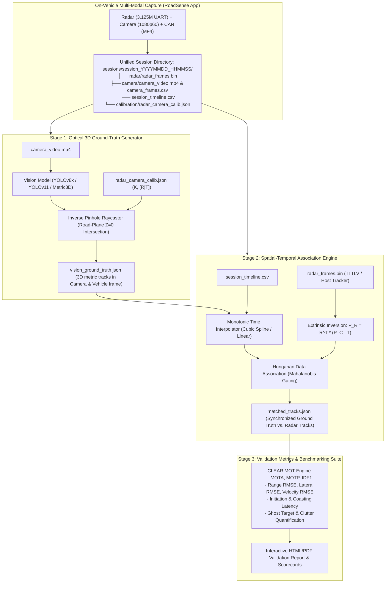

# RoadSense Automated Vision Ground-Truth & Radar Validation Framework — Master Roadmap

> **Document Classification:** Autonomous Vehicle Research & Engineering Systems  
> **Target Audience:** Perception Engineers, Control Systems Architects, Validation Leads, Chief Engineers  
> **Location:** `intel/Validation/00_VALIDATION_ROADMAP_AND_ARCHITECTURE.md`  
> **Status:** Authoritative Architectural Specification & Roadmap  

---

## 1. Executive Mission & Strategic Rationale

### 1.1 The High Cost & Operational Limits of Traditional Validation
In traditional automotive Advanced Driver Assistance Systems (ADAS) development, validating radar target tracking algorithms (e.g., TI DSP on-chip Extended Kalman Filters, host-side multi-target trackers, or neural association pipelines) requires establishing a high-accuracy spatial **ground truth**.

Historically, Tier-1 automotive suppliers and OEMs achieve this by outfitting target vehicles with differential GPS and Real-Time Kinematic positioning systems (RTK-DGPS / IMU beacons, such as Oxford Technical Solutions RT3000 or GeneSys ADMA):
* **Prohibitive Equipment Cost:** RTK-DGPS base stations and dual-antenna vehicle beacons cost upwards of **₹20,00,000 to ₹35,00,000 ($25,000 – $40,000+) per target vehicle**.
* **Operational Inflexibility:** Only a single, dedicated instrumented "target mule" can be tracked at a time. The system cannot establish ground truth for random civilian vehicles, motorcycles, auto-rickshaws, pedestrians, or animals encountered during uncontrolled road testing.
* **Complex Multi-Vehicle Logistics:** Testing requires constant wireless RF synchronization between the ego-vehicle and target-vehicle transceivers, which suffers dropped packets, line-of-sight dropouts, and multi-path satellite occlusions in urban canyons and tunnels.

```
┌────────────────────────────────────────────────────────────────────────────────────────┐
│                              TRADITIONAL VALIDATION BOTTLENECK                         │
│                                                                                        │
│   RTK-DGPS Target Beacons        ❌ ₹20–35 Lakhs ($25k–$40k) per target vehicle         │
│   (Oxford RT / GeneSys ADMA)     ❌ Can only validate 1 dedicated target car at a time │
│                                  ❌ Fails completely on random civilian traffic & bikes│
│                                  ❌ RF telemetry packet drops in urban environments     │
└───────────────────────────────────────────┬────────────────────────────────────────────┘
                                            │
                                  THE ROADSENSE PARADIGM
                                            │
                                            ▼
┌────────────────────────────────────────────────────────────────────────────────────────┐
│                      AUTOMATED OPTICAL 3D GROUND-TRUTH ENGINE                          │
│                                                                                        │
│   Calibrated Camera Sensor       ✅ Zero incremental hardware cost (utilizes onboard)  │
│   + 6-DOF Inverted Projection    ✅ Validates ALL visible vehicles, bikes & rickshaws   │
│                                  ✅ Sub-millisecond hardware monotonic time alignment  │
│                                  ✅ Fully automated offline batch processing pipeline   │
└────────────────────────────────────────────────────────────────────────────────────────┘
```

### 1.2 The RoadSense Optical Ground-Truth Breakthrough
RoadSense transforms our already synchronized and calibrated multi-sensor platform into an **automated reference laboratory**:
1. **Deterministic Nanosecond Synchronization:** The 1080p60 camera exposure start interrupts and 3.125 Mbps mmWave radar chirps are already latched to the CPU invariant monotonic hardware clock counter (`elapsedRealtimeNanos`) in `session_timeline.csv`.
2. **Pre-Calibrated Spatial Extrinsics & Intrinsics:** The pinhole camera matrix $\mathbf{K}$ and the 6-DOF extrinsic transform $[\mathbf{R} \mid \mathbf{T}]$ between the camera and radar are known to high precision via the in-situ **Reverse Touch Solver**.
3. **Inverting the Optical Projection Pipeline:** Instead of only projecting radar points forward onto video pixels, **we invert the pipeline**:
   * We run state-of-the-art computer vision models (YOLOv8x / YOLOv11 / Grounding DINO / 3D Bounding Box estimators) on the recorded video.
   * By projecting the optical bounding box road-contact patch onto the ground plane ($Z_{\text{road}} = 0$) using inverse raycasting, we calculate the exact metric 3D position $(X_C, Y_C, Z_C)$ of every surrounding vehicle.
   * Transforming these coordinates into the radar frame $\{R\}$ yields an instantaneous, frame-by-frame **Optical Ground-Truth (OGT)** trajectory.
4. **Automated Tracking Benchmarking:** Every radar track state (range, azimuth, Doppler velocity, initiation latency, track lifetime) can be mathematically benchmarked against this optical reference with microsecond correspondence.

---

## 2. End-to-End System Architecture

The validation framework decouples into an on-vehicle data capture stage and an offline PC-side automated benchmarking engine:



---

## 3. Four-Stage Progressive Validation Roadmap

The implementation of the validation framework is organized into four sequential engineering phases:

```
┌────────────────────────────────────────────────────────────────────────────────────────┐
│                           VALIDATION FRAMEWORK PROGRESSION                             │
│                                                                                        │
│   STAGE 1: Optical 3D Ground-Truth Generation Engine (NEAR-TERM)                       │
│   ├── Automated YOLOv8x/v11 2D detection & road contact patch extraction               │
│   ├── Closed-form inverse raycasting to ground plane (Z_road = 0)                      │
│   ├── Monotonic timestamp indexing matching camera_frames.csv                          │
│   └── Output schema: vision_ground_truth.json (3D positions in {C} and {V})            │
│                                                                                        │
│   STAGE 2: Spatial-Temporal Association & Coordinate Transformation (NEAR-TERM)        │
│   ├── Cross-sensor time interpolation via session_timeline.csv                         │
│   ├── Frame transformation: P_R = R^T * (P_C - T) into Radar Coordinate Frame          │
│   ├── GNN & Hungarian data association with Mahalanobis distance gating                │
│   └── Output schema: matched_tracks.json                                               │
│                                                                                        │
│   STAGE 3: Automated Validation Metrics & Executive Report Generator (MID-TERM)        │
│   ├── Kinematic error suite: Range RMSE, Lateral RMSE, Radial error across 4 bins      │
│   ├── CLEAR MOT evaluation: MOTA, MOTP, IDF1, Mostly Tracked (MT) / Mostly Lost (ML)   │
│   ├── Track initiation latency, track coasting persistence, and clutter rejection      │
│   └── Automated standalone HTML validation report with interactive Plotly curves       │
│                                                                                        │
│   STAGE 4: Fleet-Scale Continuous Validation & Tracker Parameter Optimization (FUTURE) │
│   ├── Batch multi-session execution across test vehicle fleets                         │
│   ├── Automated tuning sweeps for Kalman/EKF parameters (Q, R, chi^2 gating)           │
│   └── Direct export to MCAP / ROS2 / Foxglove for 3D trajectory playback               │
└────────────────────────────────────────────────────────────────────────────────────────┘
```

---

### Stage 1: Optical 3D Ground-Truth Generation Engine
* **Objective:** Automatically extract metric 3D position trajectories for all traffic participants from the front-facing camera video.
* **Core Technical Elements:**
  1. **Object Detection:** Uses a high-capacity offline vision backbone (YOLOv8x / YOLOv11x / Grounding DINO) to detect 2D bounding boxes $[u_{\min}, v_{\min}, u_{\max}, v_{\max}]$ across vehicle classes: cars, trucks, motorcycles, scooters, auto-rickshaws, and pedestrians.
  2. **Road Contact Point Extraction:** The bottom center of the bounding box:
     $$u_{\text{bottom}} = \frac{u_{\min} + u_{\max}}{2}, \quad v_{\text{bottom}} = v_{\max}$$
     represents the physical tire-to-road contact patch.
  3. **Flat-Earth Raycasting ($Z_{\text{road}} = 0$):** Using the calibrated camera height $h_{\text{cam}}$, mounting pitch $\theta_{\text{mount}}$, and intrinsic matrix $\mathbf{K}$, the optical ray is projected onto the road surface to derive exact metric longitudinal distance $Y$ and lateral offset $X$.
  4. **Output Artifact:** `vision_ground_truth.json` associating each target detection with its bounding box, class label, confidence, 3D metric coordinates $(X_C, Y_C, Z_C)$, and hardware monotonic timestamp.

---

### Stage 2: Spatial-Temporal Association Engine
* **Objective:** Establish unambiguous one-to-one temporal and spatial correspondences between radar tracks and optical ground truth.
* **Core Technical Elements:**
  1. **Temporal Alignment:** Radar chirps (20 Hz) and camera frames (60 Hz) arrive at distinct time instants. Using `session_timeline.csv`, each radar timestamp is matched to optical ground-truth states using linear or cubic spline interpolation, bounding temporal error to $< 8\text{ ms}$.
  2. **Coordinate Transformation:** Ground truth points are transformed from camera coordinates $\{C\}$ into radar coordinates $\{R\}$ using the inverse rigid extrinsic matrix:
     $$\mathbf{P}_R = \mathbf{R}^T \cdot (\mathbf{P}_C - \mathbf{T})$$
  3. **Hungarian Data Association:** Uses the Hungarian (Kuhn-Munkres) assignment algorithm over a cost matrix combining 2D Euclidean distance and radial velocity:
     $$C_{ij} = \sqrt{(X_{R,i} - X_{\text{gt},j})^2 + (Y_{R,i} - Y_{\text{gt},j})^2} + \lambda \cdot |V_{R,i} - V_{\text{gt},j}|$$
     Gated by a dynamic spatial threshold (e.g., $d_{\max} = 3.0\text{ m}$ at $50\text{ m}$).
  4. **Output Artifact:** `matched_tracks.json` containing pairs of matched radar-optical trajectories alongside unmatched radar detections (clutter/false alarms) and unmatched optical targets (radar misses).

---

### Stage 3: Automated Validation Metrics & Benchmarking Suite
* **Objective:** Quantify radar tracking performance against standardized automotive safety criteria (Euro NCAP / ISO 15623).
* **Core Technical Elements:**
  1. **Kinematic Accuracy Metrics:**
     * Longitudinal Range Error: $e_Y = Y_{\text{radar}} - Y_{\text{gt}}$ (RMSE and percentage error).
     * Lateral Position Error: $e_X = X_{\text{radar}} - X_{\text{gt}}$ (lane assignment precision).
     * Velocity Accuracy: $e_V = \dot{Y}_{\text{radar}} - \dot{Y}_{\text{gt}}$.
     * **4-Zone Distance Bins:** Statistics are segregated into Near-Field ($0\text{--}15\text{m}$), Mid-Range ($15\text{--}40\text{m}$), Long-Range ($40\text{--}80\text{m}$), and Far-Field ($>80\text{m}$).
  2. **CLEAR MOT Metrics:**
     * **MOTA (Multiple Object Tracking Accuracy):** Evaluates overall tracking reliability by penalizing misses, false positives (ghosts), and identity switches.
     * **MOTP (Multiple Object Tracking Precision):** Measures spatial localization tightness.
     * **IDF1 Score:** Measures track ID consistency over time.
  3. **ADAS System-Level Latency & Reliability:**
     * Track confirmation latency ($T_{\text{confirm}}$ in frames and milliseconds).
     * Track coasting persistence under brief occlusions.
     * False positive / clutter rejection rate (overhead bridges, guardrails).
  4. **Output Artifact:** Self-contained, interactive HTML validation report (`validation_report.html`) complete with time-series error plots, trajectory overlays, and pass/fail scorecards.

---

### Stage 4: Fleet-Scale Continuous Regression & Algorithm Optimization
* **Objective:** Scale validation across hundreds of hours of fleet data and automate tracking filter parameter tuning.
* **Core Technical Elements:**
  1. **Batch Execution Pipeline:** Automates ingestion and evaluation across dozens of test vehicle drives with a single CLI command.
  2. **Tracking Filter Tuning Harness:** Evaluates candidate radar tracking algorithms (e.g., Extended Kalman Filter vs. Unscented Kalman Filter vs. Interacting Multiple Model EKF) by replaying raw radar point clouds (`radar_raw_stream.bin`) against the optical ground-truth dataset.
  3. **Parameter Optimization Sweeps:** Automatically optimizes Kalman filter process noise covariance $\mathbf{Q}$, measurement noise covariance $\mathbf{R}$, and $\chi^2$ gating thresholds to maximize the MOTA score.
  4. **MCAP / Foxglove Integration:** Exports validated trajectories to standardized MCAP container files for interactive 3D web-based visualization.

---

## 4. Documentation Suite Roadmap & Sitemap

All specifications, mathematical formulations, and runbooks supporting this validation framework are maintained inside [`intel/Validation`](file:///C:/Users/rakadu1.AHEAD/AndroidStudioProjects/RoadSense/intel/Validation):

| Document / Tool | Scope & Focus | Primary Takeaways |
| :--- | :--- | :--- |
| **[`00_VALIDATION_ROADMAP_AND_ARCHITECTURE.md`](file:///C:/Users/rakadu1.AHEAD/AndroidStudioProjects/RoadSense/intel/Validation/00_VALIDATION_ROADMAP_AND_ARCHITECTURE.md)** | Master Roadmap & System Architecture | 4-stage progressive roadmap, economic comparison against RTK-DGPS, system topology, and milestones |
| **[`01_CAMERA_TO_3D_GROUND_TRUTH_MATHEMATICS.md`](file:///C:/Users/rakadu1.AHEAD/AndroidStudioProjects/RoadSense/intel/Validation/01_CAMERA_TO_3D_GROUND_TRUTH_MATHEMATICS.md)** | Mathematical Formulation | Inverse pinhole raycasting, flat-earth road plane intersection, pitch sensitivity propagation, coordinate transform $[\mathbf{R}\mid\mathbf{T}]^{-1}$ |
| **[`02_RADAR_TRACKING_VALIDATION_METRICS_SPEC.md`](file:///C:/Users/rakadu1.AHEAD/AndroidStudioProjects/RoadSense/intel/Validation/02_RADAR_TRACKING_VALIDATION_METRICS_SPEC.md)** | Evaluation Metrics & Pass/Fail Criteria | CLEAR MOT formulas, 4-zone distance binning, kinematics RMSE, latency bounds, and ISO 15623 compliance thresholds |
| **[`03_AUTOMATED_TOOLCHAIN_AND_EXECUTION_RUNBOOK.md`](file:///C:/Users/rakadu1.AHEAD/AndroidStudioProjects/RoadSense/intel/Validation/03_AUTOMATED_TOOLCHAIN_AND_EXECUTION_RUNBOOK.md)** | Python Toolchain & Developer Runbook | Python pipeline architecture, data schemas (`vision_gt.json`, `matched_tracks.json`), CLI runbook, batch fleet automation |
| **[`interactive_validation_explorer.html`](file:///C:/Users/rakadu1.AHEAD/AndroidStudioProjects/RoadSense/intel/Validation/interactive_validation_explorer.html)** | Interactive Web Simulator | Live ground-truth raycasting canvas, synthetic tracking noise/ghost injection, Hungarian association matching, real-time MOTA/RMSE calculator |
