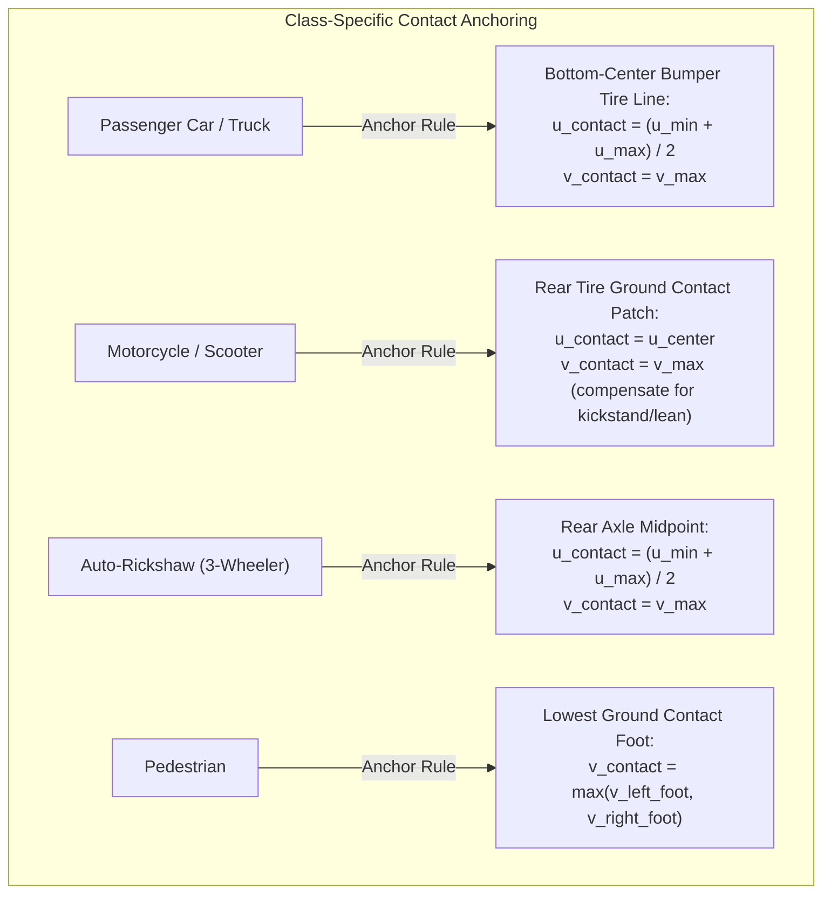

# Optical 3D Ground-Truth Mathematics: Inverse Projection, Road-Plane Raycasting & Extrinsic Transformations

> **Document Classification:** Autonomous Vehicle Research & Engineering Systems  
> **Target Audience:** Perception Engineers, Computer Vision Scientists, Sensor Fusion Specialists  
> **Location:** `intel/Validation/01_CAMERA_TO_3D_GROUND_TRUTH_MATHEMATICS.md`  
> **Status:** Authoritative Mathematical Specification  

---

## 1. Pinhole Camera Geometry & Optical Ray Formulation

### 1.1 Forward Projection Recap
In a standard calibrated pinhole camera model, a 3D point $\mathbf{P}_C = [X_C, Y_C, Z_C]^T$ expressed in the Camera Coordinate System $\{C\}$ (where $X_C$ is right, $Y_C$ is down, and $Z_C$ is forward optical axis) projects onto pixel coordinates $(u, v)$ on the image plane via the intrinsic calibration matrix $\mathbf{K}$:

$$\begin{bmatrix} u \cdot Z_C \\ v \cdot Z_C \\ Z_C \end{bmatrix} = \mathbf{K} \cdot \mathbf{P}_C = \begin{bmatrix} f_x & 0 & c_x \\ 0 & f_y & c_y \\ 0 & 0 & 1 \end{bmatrix} \begin{bmatrix} X_C \\ Y_C \\ Z_C \end{bmatrix}$$

Expanding into Cartesian pixel coordinates:

$$u = f_x \frac{X_C}{Z_C} + c_x, \quad v = f_y \frac{Y_C}{Z_C} + c_y$$

*Where:*
* $f_x, f_y$ are the focal lengths expressed in pixel units (derived from Camera2 `CameraCharacteristics.LENS_INTRINSIC_CALIBRATION` or computed from sensor active array size and horizontal field of view).
* $(c_x, c_y)$ is the principal optical center (approximately half the image width and height: $W/2, H/2$).

### 1.2 Inverse Normalized Optical Ray
Forward projection discards depth information: any 3D point along the ray passing through the optical center projects to the identical pixel $(u, v)$. 

To invert this projection, we define the **normalized optical direction vector** $\mathbf{d}_C$ in camera space by multiplying the homogeneous pixel coordinate by the inverse intrinsic matrix $\mathbf{K}^{-1}$:

$$\mathbf{d}_C = \mathbf{K}^{-1} \begin{bmatrix} u \\ v \\ 1 \end{bmatrix} = \begin{bmatrix} 1/f_x & 0 & -c_x/f_x \\ 0 & 1/f_y & -c_y/f_y \\ 0 & 0 & 1 \end{bmatrix} \begin{bmatrix} u \\ v \\ 1 \end{bmatrix} = \begin{bmatrix} \frac{u - c_x}{f_x} \\ \frac{v - c_y}{f_y} \\ 1 \end{bmatrix} = \begin{bmatrix} x_n \\ y_n \\ 1 \end{bmatrix}$$

Any physical 3D point $\mathbf{P}_C$ corresponding to pixel $(u, v)$ must lie along the parametric ray:

$$\mathbf{P}_C(\lambda) = \lambda \cdot \mathbf{d}_C = \lambda \begin{bmatrix} x_n \\ y_n \\ 1 \end{bmatrix} = \begin{bmatrix} \lambda \cdot x_n \\ \lambda \cdot y_n \\ \lambda \end{bmatrix}, \quad \lambda > 0$$

Where the scalar scale factor $\lambda \equiv Z_C$ represents the forward metric depth along the optical axis.

---

## 2. Flat-Earth Road-Plane Raycasting ($Z_{\text{road}} = 0$)

### 2.1 The Physical Ground Constraint
To resolve the depth ambiguity $\lambda$ without requiring an active range sensor or stereo camera baseline, we enforce the **automotive road-plane constraint**:
* Vehicles, motorcycles, auto-rickshaws, and pedestrians maintain continuous physical contact with the tarmac road surface.
* Let the bounding box of a detected target vehicle on the image plane be $[u_{\min}, v_{\min}, u_{\max}, v_{\max}]$.
* The bottom-center coordinate of this bounding box:
  $$u_{\text{contact}} = \frac{u_{\min} + u_{\max}}{2}, \quad v_{\text{contact}} = v_{\max}$$
  corresponds to the physical contact patch where the vehicle's rear tires meet the road.

```
VIEWFINDER IMAGE PLANE (1080p):

┌──────────────────────────────────────────────┐
│                                              │
│               [ Lead Vehicle ]               │
│               ┌──────────────┐ (u_min, v_min)│
│               │   🚘 🚘 🚘   │               │
│               │   🚘 🚘 🚘   │               │
│               └──────┬───────┘               │
│                      ▲                       │
│                      └─ Road Contact Point:  │
│                         (u_contact, v_max)   │
│                         Tire-Tarmac Patch    │
└──────────────────────────────────────────────┘
```

### 2.2 Derivation of Closed-Form Metric Position
Let the Vehicle Body Coordinate Frame $\{V\}$ be defined as:
* $X_V$: Lateral axis (positive to the right)
* $Y_V$: Longitudinal forward axis (positive forward along vehicle heading)
* $Z_V$: Vertical axis (positive upward, perpendicular to road surface)
* Ground plane equation in $\{V\}$: $Z_V \equiv 0$.

The camera is mounted at physical height $h_{\text{cam}}$ above the road surface ($Z_V = h_{\text{cam}}$) with an intentional downward pitch tilt $\theta_{\text{mount}}$ (radians) to capture the roadway ahead. For forward-facing cameras, mount roll ($\phi$) and yaw ($\psi$) are approximately zero ($\phi \approx 0, \psi \approx 0$).

```
LONGITUDINAL ELEVATION GEOMETRY (SIDE VIEW):

Camera Lens (Height h_cam)
    ● ─── Horizontal Reference (Zero Pitch)
    │ \ 
    │  \   Pitch Angle θ_mount
    │   \ 
    │    \   Optical Center Axis
    │     \ 
    │      \   Ray to Tire Contact: Angle (θ_mount + β_contact)
    │       \ 
────┴────────\─────────────────────────────────── Road Plane (Z_V = 0)
    ◄─────── Y_ground ──────────────────────────►
```

1. **Angular Elevation of Pixel from Optical Axis ($\beta$):**
   The vertical normalized pixel offset from optical center $c_y$ corresponds to an angular depression angle $\beta$ relative to the camera boresight:
   $$\tan(\beta) = \frac{v_{\text{contact}} - c_y}{f_y} = y_n$$
   $$\beta = \arctan(y_n)$$

2. **Total Angle Below Horizontal Reference ($\alpha_{\text{total}}$):**
   The total depression angle of the optical ray relative to the horizontal world horizon is:
   $$\alpha_{\text{total}} = \theta_{\text{mount}} + \beta = \theta_{\text{mount}} + \arctan\left(\frac{v_{\text{contact}} - c_y}{f_y}\right)$$

3. **Closed-Form Metric Longitudinal Distance ($Y_{\text{ground}}$):**
   From simple right-triangle trigonometry on the road elevation plane:
   $$\tan(\alpha_{\text{total}}) = \frac{h_{\text{cam}}}{Y_{\text{ground}}}$$

   $$Y_{\text{ground}} = \frac{h_{\text{cam}}}{\tan\left(\theta_{\text{mount}} + \arctan\left(\frac{v_{\text{contact}} - c_y}{f_y}\right)\right)}$$

4. **Closed-Form Metric Lateral Offset ($X_{\text{ground}}$):**
   The lateral displacement is computed directly by scaling the horizontal normalized pixel coordinate by the recovered forward depth:
   $$X_{\text{ground}} = Y_{\text{ground}} \cdot \frac{u_{\text{contact}} - c_x}{f_x} \cdot \cos(\theta_{\text{mount}})$$

5. **Forward Optical Metric Depth ($\lambda \equiv Z_C$):**
   In the camera coordinate system $\{C\}$, the metric forward depth along the optical axis is:
   $$Z_C = Y_{\text{ground}} \cdot \cos(\theta_{\text{mount}}) + (h_{\text{cam}} - Z_{\text{target}}) \cdot \sin(\theta_{\text{mount}})$$

---

## 3. Sensitivity & Error Propagation Analysis

Because the distance formulation relies on trigonometric tangents, **depth estimation sensitivity increases quadratically with distance**. 

Differentiating $Y_{\text{ground}}$ with respect to the mounting pitch angle $\theta$:

$$\frac{\partial Y_{\text{ground}}}{\partial \theta} = - \frac{h_{\text{cam}}}{\sin^2(\alpha_{\text{total}})} \approx - \frac{Y_{\text{ground}}^2}{h_{\text{cam}}}$$

### Numerical Error Table (for $h_{\text{cam}} = 1.2\text{ m}$, $\theta = 3.0^\circ$):

| Target Distance ($Y$) | Total Elevation Angle ($\alpha$) | Vertical Pixel Offset ($v - c_y$) | Error for $0.1^\circ$ Pitch Shift ($\Delta Y$) | Error for $0.5^\circ$ Pitch Shift ($\Delta Y$) |
| :---: | :---: | :---: | :---: | :---: |
| **$10\text{ m}$** | $6.84^\circ$ | $+116\text{ px}$ | **$\pm 0.15\text{ m}$** ($1.5\%$) | **$\pm 0.74\text{ m}$** ($7.4\%$) |
| **$25\text{ m}$** | $2.75^\circ$ | $-7\text{ px}$ | **$\pm 0.91\text{ m}$** ($3.6\%$) | **$\pm 4.52\text{ m}$** ($18.1\%$) |
| **$50\text{ m}$** | $1.37^\circ$ | $-48\text{ px}$ | **$\pm 3.63\text{ m}$** ($7.3\%$) | **$\pm 18.2\text{ m}$** ($36.4\%$) |
| **$80\text{ m}$** | $0.86^\circ$ | $-63\text{ px}$ | **$\pm 9.31\text{ m}$** ($11.6\%$) | **$\pm 46.5\text{ m}$** ($58.1\%$) |

### Engineering Takeaways:
1. **Criticality of In-Situ Pitch Calibration:** At $50\text{ m}$, an uncalibrated pitch error of just $0.5^\circ$ produces an unacceptable $18.2\text{ m}$ range discrepancy. This mathematically proves why RoadSense's **Reverse Touch Solver** and IMU-based level ground calibration ($\pm 0.03^\circ$ accuracy) are mandatory prerequisites for using vision as a ground-truth reference.
2. **Sub-Pixel Contact Localization:** The bottom-most pixel of the vehicle bounding box must be extracted accurately. Using high-resolution models (YOLOv8x/v11 at 1080p native input) ensures contact boundary localization within $\pm 2$ pixels.

---

## 4. Coordinate Transformation: Camera to Radar Reference Frame

To directly benchmark radar tracks against optical ground truth, the optical 3D coordinates must be transformed into the **Radar Coordinate System $\{R\}$**:

```
[Optical 3D Position: P_C]  ──►  [Inverse Extrinsic Transform: [R|T]^-1]  ──►  [Radar Frame Ground Truth: P_R]
```

### 4.1 Rigid Body Extrinsic Inversion
In forward calibration, the transformation from radar $\{R\}$ to camera $\{C\}$ is parameterized by rotation matrix $\mathbf{R} \in SO(3)$ and translation vector $\mathbf{T} \in \mathbb{R}^3$:

$$\mathbf{P}_C = \mathbf{R} \cdot \mathbf{P}_R + \mathbf{T}$$

Since rotation matrices are orthogonal ($\mathbf{R}^{-1} = \mathbf{R}^T$), inverting this relationship yields the exact transformation from camera coordinates to radar coordinates:

$$\mathbf{P}_R = \mathbf{R}^T \cdot (\mathbf{P}_C - \mathbf{T})$$

Where:
* $\mathbf{T} = [\Delta X, \Delta Y, \Delta Z]^T$ is the physical spatial offset between the radar phase center and the camera optical center.
* $\mathbf{R}$ is the composite 3D rotation matrix parameterized by yaw ($\psi$), pitch ($\theta$), and roll ($\phi$):
  $$\mathbf{R} = \mathbf{R}_z(\psi) \cdot \mathbf{R}_x(\theta) \cdot \mathbf{R}_y(\phi)$$
  $$\mathbf{R}^T = \mathbf{R}_y(-\phi) \cdot \mathbf{R}_x(-\theta) \cdot \mathbf{R}_z(-\psi)$$

### 4.2 Transforming Target Velocity
If the target vehicle's velocity is derived optically from sequential video frames ($t_k$ and $t_{k-1}$):

$$\mathbf{V}_C = \frac{\mathbf{P}_C(t_k) - \mathbf{P}_C(t_{k-1})}{t_k - t_{k-1}}$$

The velocity vector in the radar frame $\{R\}$ is transformed purely by the rotation matrix (translations do not affect differential velocities):

$$\mathbf{V}_R = \mathbf{R}^T \cdot \mathbf{V}_C$$

The expected **radial Doppler velocity** ($V_{\text{doppler}}$) that the radar should measure is the projection of $\mathbf{V}_R$ along the line-of-sight unit vector $\hat{\mathbf{r}}$:

$$V_{\text{doppler, expected}} = \mathbf{V}_R \cdot \frac{\mathbf{P}_R}{\|\mathbf{P}_R\|}$$

This provides a direct, independent benchmark to validate the radar's Doppler FFT measurements and tracking velocity filters.

---

## 5. Vehicle Class-Specific Ground Contact Anchoring

Different vehicle types have different contact geometries. To maximize ground-truth accuracy under Indian traffic conditions, the raycasting engine applies class-specific geometric anchoring rules:



1. **Passenger Vehicles & Trucks:** The contact patch is the midpoint of the rear bumper width at $v_{\max}$. Width $W_{\text{metric}}$ can be cross-verified:
   $$W_{\text{metric}} = \frac{(u_{\max} - u_{\min}) \cdot Z_C}{f_x} \approx 1.7\text{m to } 2.5\text{m}$$
2. **Two-Wheelers (Motorcycles & Scooters):** Critical for Indian ADAS. The narrow tire contact patch ($W_{\text{metric}} \approx 0.6\text{m}$) is anchored to the rear tire base.
3. **Auto-Rickshaws:** Three-wheeled triangular geometry. The rear track width ($\approx 1.3\text{m}$) provides the ground baseline.
4. **Pedestrians:** The contact point is taken as the lowest foot on the ground plane ($v_{\max}$).

---

## 6. Stage 2 Enhancement: Monocular 3D Deep Learning

While flat-earth raycasting ($Z_{\text{road}} = 0$) provides a deterministic, zero-hallucination baseline for flat roads, real-world roads exhibit crests, dips, and inclinations.

In Stage 2 of the roadmap, the ground-truth engine integrates **Metric Monocular 3D Depth Estimation**:
1. **Metric3D / Depth Anything v2:** Produces dense metric depth maps $\mathcal{D}(u, v)$ directly from single images, trained on millions of diverse outdoor driving scenes.
2. **Bayesian Multi-Hypothesis Fusion:**
   $$\hat{Z}_C = \frac{\sigma_{\text{metric}}^2 \cdot Z_{\text{raycast}} + \sigma_{\text{raycast}}^2 \cdot Z_{\text{metric3d}}}{\sigma_{\text{metric}}^2 + \sigma_{\text{raycast}}^2}$$
   * At close range ($<25\text{m}$), flat-earth raycasting has extremely low variance ($\sigma_{\text{raycast}} < 0.3\text{m}$) and dominates the estimate.
   * At long range ($>50\text{m}$), Metric3D depth provides an independent constraint that prevents vertical pitch deviations from causing runaway range errors.
