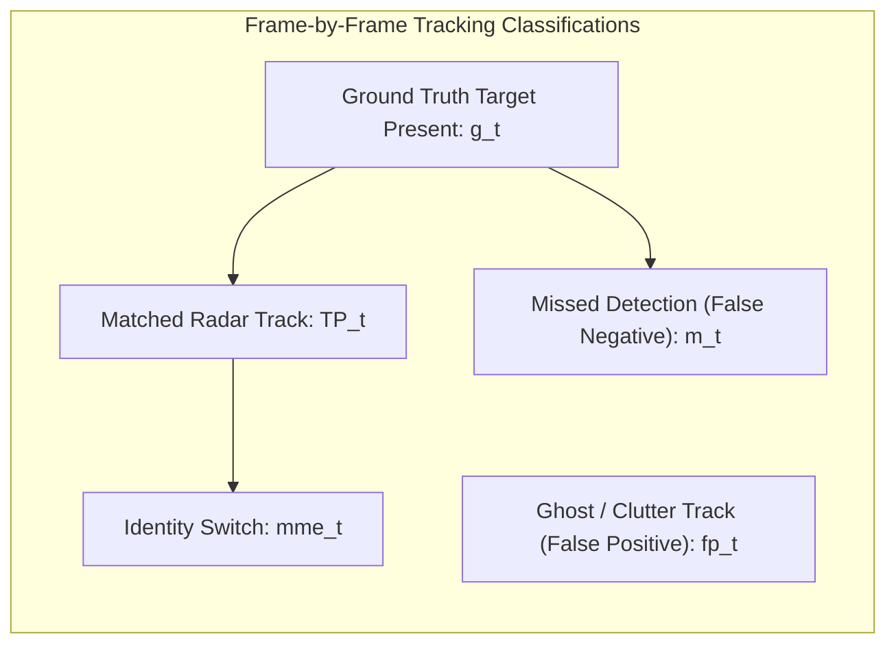

# Radar Tracking Validation Metrics Specification & Benchmarking Standards

> **Document Classification:** Autonomous Vehicle Research & Engineering Systems  
> **Target Audience:** Perception Engineers, ADAS Algorithm Developers, Systems Safety Architects  
> **Location:** `intel/Validation/02_RADAR_TRACKING_VALIDATION_METRICS_SPEC.md`  
> **Status:** Authoritative Benchmarking Specification  

---

## 1. Overview & Evaluation Philosophy

Validating an automotive radar tracking algorithm requires evaluating two fundamentally distinct dimensions of tracking performance:
1. **Spatial Kinematic Accuracy (Precision):** When a target is actively tracked, how closely do its estimated range, lateral offset, azimuth angle, and radial Doppler velocity match physical reality?
2. **Temporal Tracking Continuity & Completeness (Integrity):** Does the tracker reliably initiate tracks on real obstacles without delay? Does it drop tracks prematurely? Does it confuse target identities (ID switching)? And does it aggressively reject non-target clutter and multipath ghost reflections?

This specification establishes the formal mathematical definitions for all evaluation metrics and defines standardized **Automotive Pass/Fail Compliance Thresholds** aligned with **ISO 15623** (Forward Vehicle Collision Warning Systems) and **Euro NCAP** test protocols.

---

## 2. Spatial Kinematic Accuracy Metrics

Let $N_k$ be the number of matched radar-optical target pairs at time step $t_k$. For a matched pair $(i, j)$ where $i$ is the radar track and $j$ is the optical ground truth:

### 2.1 Longitudinal Range Error ($e_Y$)
Longitudinal forward distance is the primary input to Time-to-Collision (TTC) calculations and emergency braking logic:

$$e_Y(k) = Y_{\text{radar}}(k) - Y_{\text{gt}}(k)$$

* **Longitudinal Mean Absolute Error (MAE):**
  $$\text{MAE}_Y = \frac{1}{N} \sum_{k=1}^N |Y_{\text{radar}}(k) - Y_{\text{gt}}(k)|$$
* **Longitudinal Root Mean Square Error (RMSE):**
  $$\text{RMSE}_Y = \sqrt{\frac{1}{N} \sum_{k=1}^N (Y_{\text{radar}}(k) - Y_{\text{gt}}(k))^2}$$
* **Mean Absolute Percentage Error (MAPE):**
  $$\text{MAPE}_Y = \frac{1}{N} \sum_{k=1}^N \frac{|Y_{\text{radar}}(k) - Y_{\text{gt}}(k)|}{Y_{\text{gt}}(k)} \times 100\%$$

### 2.2 Lateral Position Error ($e_X$)
Lateral displacement determines lane assignment, cut-in detection, and whether a lead vehicle is in the ego-path or an adjacent lane:

$$e_X(k) = X_{\text{radar}}(k) - X_{\text{gt}}(k)$$

* **Lateral Root Mean Square Error (RMSE):**
  $$\text{RMSE}_X = \sqrt{\frac{1}{N} \sum_{k=1}^N (X_{\text{radar}}(k) - X_{\text{gt}}(k))^2}$$

### 2.3 Euclidean Spatial Error ($e_{2D}$)
The total planar 2D position error on the road surface:

$$e_{2D}(k) = \sqrt{(X_{\text{radar}}(k) - X_{\text{gt}}(k))^2 + (Y_{\text{radar}}(k) - Y_{\text{gt}}(k))^2}$$

$$\text{RMSE}_{2D} = \sqrt{\frac{1}{N} \sum_{k=1}^N e_{2D}^2(k)}$$

### 2.4 Radial Doppler Velocity Error ($e_V$)
The mmWave radar directly measures radial Doppler velocity $V_{\text{radar}}$ via the 2D Doppler FFT, whereas the tracking filter estimates range-rate $\dot{Y}$. Both are compared against the optical ground-truth finite-difference velocity projected along the line of sight:

$$e_V(k) = V_{\text{radar}}(k) - V_{\text{gt, projected}}(k)$$

$$\text{RMSE}_V = \sqrt{\frac{1}{N} \sum_{k=1}^N (V_{\text{radar}}(k) - V_{\text{gt, projected}}(k))^2}$$

---

## 3. Four-Zone Operational Distance Partitioning

Because radar angular resolution and camera pixel density both degrade with distance, aggregate metrics over an entire drive hide critical near-field performance. RoadSense mandates segregating all kinematic metrics into **four standardized distance zones**:

```
OPERATIONAL DISTANCE ZONES (ADAS VEHICLE HORIZON):

┌───────────────────┬───────────────────┬───────────────────┬───────────────────┐
│ Zone 1: NEAR-FIELD│ Zone 2: MID-RANGE │ Zone 3: LONG-RANGE│ Zone 4: FAR-FIELD │
│     0m – 15m      │     15m – 40m     │     40m – 80m     │      > 80m        │
│ Urban / Stop-Go   │ City / Cut-ins    │ Highway Cruising  │ High-Speed Telemetry│
└───────────────────┴───────────────────┴───────────────────┴───────────────────┘
```

| Operational Zone | Metric Range | Primary ADAS Functions | Critical Failure Modes to Detect |
| :--- | :--- | :--- | :--- |
| **Zone 1: Near-Field** | **$0\text{ m} - 15\text{ m}$** | Autonomous Emergency Braking (AEB), Stop-and-Go ACC, Motorcycle Lane Filtering | Radar near-field saturation, multi-point bumper centroid shifts, bumper height occlusion |
| **Zone 2: Mid-Range** | **$15\text{ m} - 40\text{ m}$** | Forward Collision Warning (FCW), Cut-In Detection, Urban Cruise Control | Angular azimuth error causing incorrect lane assignment, target merging |
| **Zone 3: Long-Range** | **$40\text{ m} - 80\text{ m}$** | Highway Adaptive Cruise Control (ACC), Speed Harmonization | Low SNR detections, track initiation latency, optical pixel resolution degradation |
| **Zone 4: Far-Field** | **$> 80\text{ m}$** | Early Warning, Roadside Clutter Mapping | Multipath reflections, ground bounce, dropped track frames |

---

## 4. Tracking Continuity & Temporal Metrics (CLEAR MOT Standard)

To evaluate tracking continuity, RoadSense implements the international **CLEAR MOT (Classification of Events, Activities and Relationships - Multiple Object Tracking)** benchmark standard:



### 4.1 Multiple Object Tracking Accuracy (MOTA)
MOTA is the single most comprehensive index of tracking quality. It integrates false negatives (misses), false positives (ghosts/clutter), and identity switches into a single normalized percentage:

$$\text{MOTA} = 1 - \frac{\sum_{t=1}^T (m_t + fp_t + mme_t)}{\sum_{t=1}^T g_t}$$

*Where:*
* $m_t$ = Number of missed ground-truth objects at frame $t$ (ground truth present, but no radar track).
* $fp_t$ = Number of false positive radar tracks at frame $t$ (radar track present, but no physical vehicle).
* $mme_t$ = Number of mismatch errors / identity switches at frame $t$ (tracker swapped target IDs).
* $g_t$ = Total number of ground-truth objects present at frame $t$.

*Interpretation:*
* $\text{MOTA} = 1.0$ ($100\%$): Perfect tracking with zero misses, zero false positives, and zero ID switches.
* $\text{MOTA} < 0$: The tracker produces more false alarms and errors than actual physical objects in the scene.

### 4.2 Multiple Object Tracking Precision (MOTP)
MOTP measures the average spatial localization tightness among all successfully matched targets, completely decoupled from misses and false alarms:

$$\text{MOTP} = \frac{\sum_{t=1}^T \sum_{i=1}^{c_t} d_{t,i}}{\sum_{t=1}^T c_t}$$

*Where:*
* $c_t$ = Number of successfully matched radar-optical pairs at frame $t$.
* $d_{t,i}$ = Euclidean distance error $e_{2D}$ for the $i$-th matched pair at frame $t$.

### 4.3 Identification F1 Score (IDF1)
While MOTA heavily penalizes instantaneous detection errors, **IDF1** measures how well the tracker preserves unique target identities over extended trajectories:

$$\text{IDF1} = \frac{2 \cdot \text{IDTP}}{2 \cdot \text{IDTP} + \text{IDFP} + \text{IDFN}}$$

*Where $\text{IDTP}$ is the count of correctly identified true positive trajectory segments.*

### 4.4 Trajectory Completeness Classifications
Every unique ground-truth vehicle trajectory is classified based on the percentage of its lifetime that the radar tracker successfully maintained a locked track:
* **Mostly Tracked (MT):** Successfully tracked for $\ge 80\%$ of its physical ground-truth duration.
* **Partially Tracked (PT):** Successfully tracked for $20\% \le \text{Duration} < 80\%$.
* **Mostly Lost (ML):** Tracked for $< 20\%$ of its physical ground-truth duration.
* **Track Fragmentation Count:** The number of times an ongoing ground-truth track transitions from "tracked" to "lost" and back to "tracked".

---

## 5. System-Level Latency & Reliability Metrics

Beyond spatial and identity accuracy, real-time vehicle control loops (e.g. Autonomous Emergency Braking) impose strict temporal deadlines:

```
TARGET ENTRY & INITIATION TIMELINE:

Physical Target Enters Camera FOV (T_entry)
       │
       ▼
Optical Ground Truth Validated
       │
       ├─► Frame 1: Radar Point Cloud Detected (Point Confirmation)
       ├─► Frame 2: Association & State Prediction (Tentative Track)
       ├─► Frame 3: Confirmation (Active Validated Track)
       │
       ▼
Radar Track Formally Confirmed (T_confirm)
◄───── T_latency (Confirmation Latency) ─────►
```

### 5.1 Track Initiation & Confirmation Latency ($T_{\text{confirm}}$)
The time elapsed from the first moment a physical vehicle enters the sensor field of view until the radar tracking filter outputs a stable, confirmed track state:

$$T_{\text{confirm}} = t_{\text{track\_confirmed}} - t_{\text{gt\_first\_visible}}$$

* Expressed in **frames** (at 20 Hz, each frame is 50 ms) and **milliseconds**.
* Standard M-of-N track confirmation logic (e.g. 3 detections in 5 consecutive chirps) should achieve $T_{\text{confirm}} \le 150\text{ ms}$ (3 frames).

### 5.2 Track Coasting Persistence ($T_{\text{coast}}$)
When a target vehicle is briefly occluded (e.g., passing behind a street sign or momentarily lost in radar multipath nulls), the tracking filter must "coast" forward using its state-space transition model:

$$T_{\text{coast}} = t_{\text{track\_dropped}} - t_{\text{radar\_last\_detection}}$$

* If $T_{\text{coast}}$ is too short ($< 100\text{ ms}$), tracks fragment unnecessarily.
* If $T_{\text{coast}}$ is too long ($> 1000\text{ ms}$), the tracker hallucinates "ghost" vehicles long after an obstacle has turned or stopped.

### 5.3 Clutter & Ghost Target Rejection Rate
Quantifies false radar tracks per kilometer or per hour in scenes containing stationary roadside infrastructure (guardrails, overhead metal road signs, bridges, tunnel walls):

$$\text{False Track Density} = \frac{\sum fp_t}{\text{Total Drive Duration (Hours)}} \quad \text{[False Tracks / Hour]}$$

---

## 6. Automotive Pass/Fail Compliance Thresholds

To guide engineering sign-off for active ADAS feature development (Forward Collision Warning and Adaptive Cruise Control), RoadSense establishes the following target benchmark matrix:

| Metric Category | Specific Parameter | Target Benchmark | Pass/Fail Acceptance Threshold | Governing Standard |
| :--- | :--- | :--- | :--- | :--- |
| **Kinematics (Zone 1: 0–15m)** | Longitudinal Range RMSE | $\le 0.35\text{ m}$ | **$< 0.50\text{ m}$** | ISO 15623 Class II |
| **Kinematics (Zone 2: 15–40m)** | Longitudinal Range RMSE | $\le 0.80\text{ m}$ | **$< 1.20\text{ m}$** | ISO 15623 Class II |
| **Kinematics (Zone 3: 40–80m)** | Longitudinal Range MAPE | $\le 2.5\%$ | **$< 4.0\%$** | Euro NCAP AEB |
| **Kinematics (All Zones)** | Lateral Offset RMSE | $\le 0.30\text{ m}$ | **$< 0.50\text{ m}$** | Lane Boundary Assign |
| **Kinematics (All Zones)** | Radial Velocity RMSE | $\le 0.35\text{ m/s}$ ($1.2\text{ km/h}$) | **$< 0.60\text{ m/s}$** ($2.1\text{ km/h}$) | TTC Calculation |
| **Tracking Continuity** | Multiple Object Tracking Accuracy (MOTA) | $\ge 88\%$ | **$\ge 80\%$** | CLEAR MOT Standard |
| **Tracking Continuity** | Multiple Object Tracking Precision (MOTP) | $\le 0.60\text{ m}$ | **$\le 0.90\text{ m}$** | CLEAR MOT Standard |
| **Tracking Continuity** | Mostly Tracked (MT) Targets | $\ge 85\%$ | **$\ge 75\%$** | Trajectory Completeness |
| **Tracking Continuity** | Identity Switches (IDSW) | $\le 2\text{ per drive hour}$ | **$< 5\text{ per drive hour}$** | Track Stability |
| **Temporal Latency** | Track Initiation Latency ($T_{\text{confirm}}$) | $\le 100\text{ ms}$ (2 frames) | **$\le 150\text{ ms}$** (3 frames) | ISO 15623 Warning |
| **Temporal Latency** | Coasting Persistence ($T_{\text{coast}}$) | $400\text{ ms} - 600\text{ ms}$ | **$250\text{ ms} - 800\text{ ms}$** | State-Space Model |
| **False Alarm Rate** | Ghost Track Frequency | $\le 1\text{ per 10 km}$ | **$< 3\text{ per 10 km}$** | Nuisance Alarm Budget |
