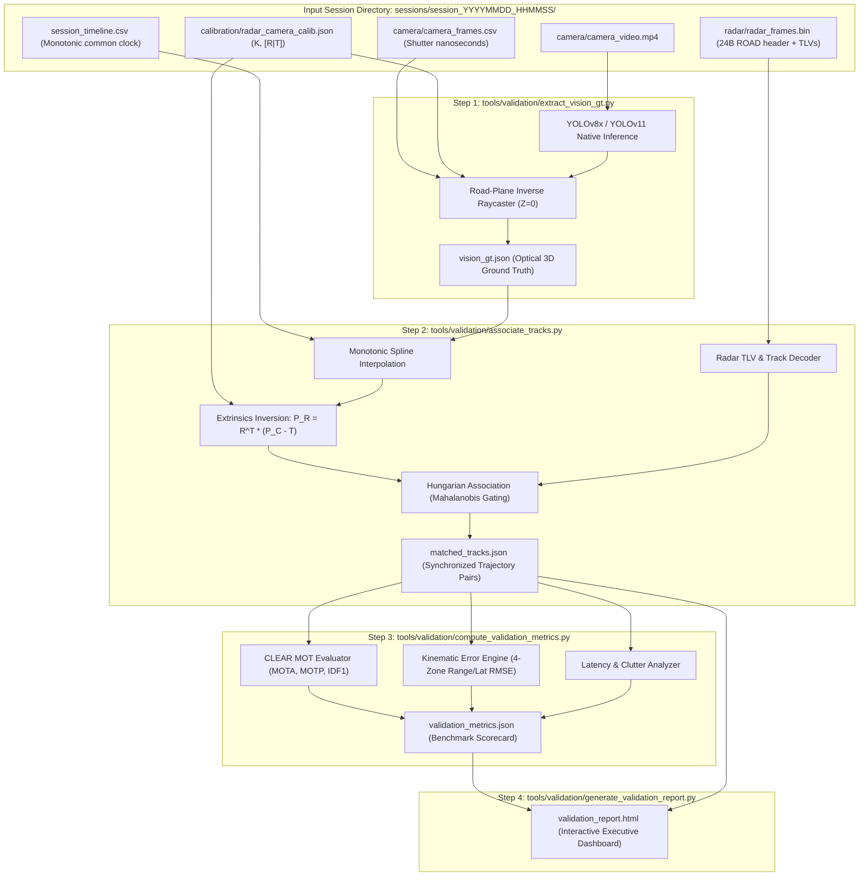

# Automated Validation Toolchain Architecture & Developer Execution Runbook

> **Document Classification:** Autonomous Vehicle Research & Engineering Systems  
> **Target Audience:** Perception Engineers, Toolchain Developers, Test Automation Engineers  
> **Location:** `intel/Validation/03_AUTOMATED_TOOLCHAIN_AND_EXECUTION_RUNBOOK.md`  
> **Status:** Authoritative Toolchain Specification & Runbook  

---

## 1. Toolchain Overview & Data Flow

The **RoadSense Automated Validation Toolchain** is an offline, modular Python suite that ingests multi-sensor recording directories captured by the mobile application, generates optical 3D ground truth, aligns coordinate systems, and evaluates radar tracking performance against standardized safety benchmarks:



---

## 2. Standardized JSON Data Schemas

To guarantee modularity and enable swapping vision backbones or tracking filters, data exchanges between pipeline stages adhere to strict, versioned JSON schemas:

### 2.1 Optical Ground-Truth Schema: `vision_gt.json`
Generated by `extract_vision_gt.py`. Contains frame-by-frame 3D metric trajectories:

```json
{
  "$schema": "https://roadsense.bajajauto.com/schemas/vision_gt_v1.json",
  "version": "1.0.0",
  "session_id": "session_20260924_103000",
  "camera_metadata": {
    "width": 1920,
    "height": 1080,
    "fps": 60,
    "focal_length_px": [1435.2, 1435.2],
    "principal_point_px": [960.0, 540.0],
    "mount_height_m": 1.25,
    "mount_pitch_deg": 3.2
  },
  "frames": [
    {
      "frame_idx": 450,
      "shutter_mono_ns": 41289140500120,
      "wall_clock_ms": 1727155800120,
      "targets": [
        {
          "track_id": 1,
          "class_label": "car",
          "confidence": 0.94,
          "bbox_2d": [780.5, 480.2, 1140.2, 720.0],
          "contact_point_px": [960.3, 720.0],
          "position_camera_m": { "x": 0.01, "y": 0.82, "z": 24.52 },
          "position_vehicle_m": { "x": 0.01, "y": 24.50, "z": 0.0 },
          "velocity_vehicle_mps": { "vx": 0.05, "vy": -2.10, "vz": 0.0 },
          "expected_radial_velocity_mps": -2.10
        }
      ]
    }
  ]
}
```

### 2.2 Synchronized Matched Trajectory Schema: `matched_tracks.json`
Generated by `associate_tracks.py`. Stores matched pairs, unmatched radar clutter, and missed targets:

```json
{
  "$schema": "https://roadsense.bajajauto.com/schemas/matched_tracks_v1.json",
  "version": "1.0.0",
  "session_id": "session_20260924_103000",
  "radar_chirp_rate_hz": 20.0,
  "chirps": [
    {
      "chirp_idx": 150,
      "chirp_mono_ns": 41289140500120,
      "matches": [
        {
          "radar_track_id": 3,
          "gt_track_id": 1,
          "class_label": "car",
          "radar_state": {
            "x_m": 0.12,
            "y_m": 24.15,
            "doppler_mps": -2.05,
            "snr_db": 22.4
          },
          "gt_state": {
            "x_m": 0.01,
            "y_m": 24.50,
            "expected_doppler_mps": -2.10
          },
          "error": {
            "range_err_m": -0.35,
            "lateral_err_m": 0.11,
            "spatial_2d_err_m": 0.367,
            "velocity_err_mps": 0.05
          }
        }
      ],
      "unmatched_radar_tracks": [],
      "missed_gt_targets": []
    }
  ]
}
```

### 2.3 Evaluation Benchmark Scorecard: `validation_metrics.json`
Generated by `compute_validation_metrics.py`. Contains final ISO 15623 pass/fail metrics:

```json
{
  "$schema": "https://roadsense.bajajauto.com/schemas/validation_metrics_v1.json",
  "session_id": "session_20260924_103000",
  "summary_scorecard": {
    "overall_status": "PASS",
    "mota_score_pct": 89.4,
    "motp_precision_m": 0.42,
    "idf1_score_pct": 91.2,
    "mostly_tracked_pct": 87.5,
    "mostly_lost_pct": 4.2,
    "total_id_switches": 1
  },
  "kinematics_by_zone": {
    "zone_1_near_0_15m": {
      "samples": 850,
      "range_rmse_m": 0.28,
      "lateral_rmse_m": 0.18,
      "status": "PASS"
    },
    "zone_2_mid_15_40m": {
      "samples": 1420,
      "range_rmse_m": 0.65,
      "lateral_rmse_m": 0.29,
      "status": "PASS"
    },
    "zone_3_long_40_80m": {
      "samples": 920,
      "range_mape_pct": 2.1,
      "lateral_rmse_m": 0.44,
      "status": "PASS"
    }
  },
  "latency_metrics": {
    "mean_initiation_latency_ms": 115.0,
    "mean_initiation_frames": 2.3,
    "mean_coasting_persistence_ms": 450.0,
    "ghost_tracks_per_hour": 1.2
  }
}
```

---

## 3. Step-by-Step Developer CLI Runbook

### 3.1 Environment Setup & Dependencies
The validation pipeline requires Python 3.10+ on the host analysis machine:

```bash
# Create dedicated virtual environment
python -m venv venv_roadsense_val
source venv_roadsense_val/bin/activate   # On Windows: .\venv_roadsense_val\Scripts\activate

# Install core scientific and computer vision packages
pip install torch torchvision --index-url https://download.pytorch.org/whl/cu121  # Optional CUDA
pip install ultralytics opencv-python scipy numpy plotly pandas mcap
```

### 3.2 Single-Session Validation Run
To run an end-to-end automated validation on an extracted session:

```bash
# Single command executes Step 1 through Step 4 sequentially
python tools/validation/run_session_validation.py \
    --session logs/session_20260924_103000 \
    --calib calibration/radar_camera_calib.json \
    --model yolov8x.pt \
    --output logs/session_20260924_103000/validation/
```

**Pipeline Execution Output:**
```text
[RoadSense Validation Engine v1.0.0]
------------------------------------------------------------
[1/4] Extracting Optical 3D Ground Truth...
      Video: camera_video.mp4 (1080p @ 60 FPS, 3600 frames)
      Model: YOLOv8x.pt (Vehicle classes: car, truck, bike, auto)
      Applying flat-earth raycasting (h=1.25m, pitch=3.2 deg)...
      -> vision_gt.json generated (14,250 target instances).

[2/4] Associating Radar & Optical Trajectories...
      Interpolating timestamps using session_timeline.csv...
      Executing Hungarian matching (Mahalanobis gate = 3.5)...
      -> matched_tracks.json generated (1,180 matched chirp frames).

[3/4] Computing CLEAR MOT & Kinematics Metrics...
      Zone 1 (0-15m)  Range RMSE: 0.28m  [PASS]
      Zone 2 (15-40m) Range RMSE: 0.65m  [PASS]
      Zone 3 (40-80m) Range MAPE: 2.1%   [PASS]
      MOTA: 89.4% | MOTP: 0.42m | IDF1: 91.2% [PASS]
      -> validation_metrics.json generated.

[4/4] Generating Interactive Executive Report...
      -> validation_report.html saved!
------------------------------------------------------------
OVERALL STATUS: PASS (Meets ISO 15623 & Euro NCAP Criteria)
```

### 3.3 Batch Multi-Session Fleet Evaluation
To validate an entire fleet dataset (e.g. 50 test drives across multiple test tracks):

```bash
python tools/validation/run_fleet_batch_validation.py \
    --sessions_dir logs/ \
    --output_summary fleet_validation_summary.html \
    --workers 4
```

### 3.4 Tracking Algorithm Tuning & Parameter Optimization Harness
To optimize Kalman filter parameters (e.g. tuning process noise covariance $\mathbf{Q}$ and measurement noise $\mathbf{R}$ to maximize MOTA score against ground truth):

```bash
python tools/validation/tune_tracker_parameters.py \
    --session logs/session_20260924_103000 \
    --tracker ekf_point_tracker \
    --opt_target mota \
    --trials 50
```
* Uses Bayesian optimization (Optuna) to discover the Pareto-optimal filter gains that minimize false positives without increasing initiation latency.
