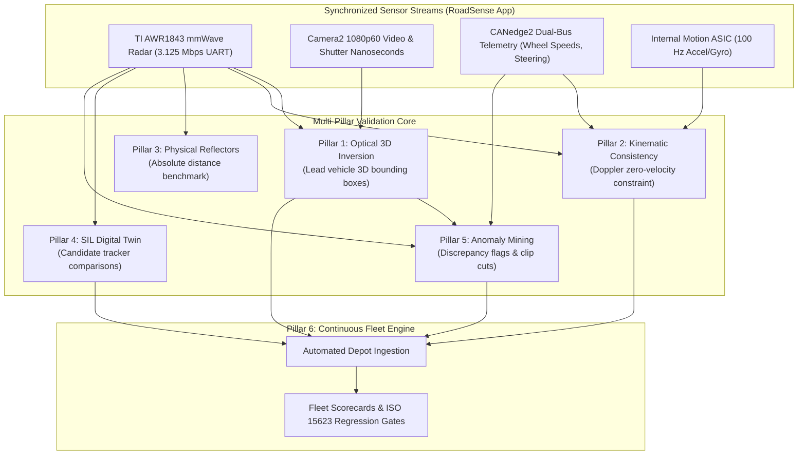

# Multi-Pillar ADAS Validation Strategy & Ecosystem Architecture

> **Document Classification:** Autonomous Vehicle Research & Engineering Systems  
> **Target Audience:** Perception Engineers, Control Systems Architects, Validation Leads, Chief Engineers  
> **Location:** `intel/Validation/04_MULTI_PILLAR_VALIDATION_STRATEGY_AND_BRAINSTORMING.md`  
> **Status:** Authoritative Architectural Specification  

---

## 1. Executive Vision: Beyond Single-Sensor Ground Truth

In early perception research, validation is often framed narrowly: *compare radar detections against camera bounding boxes*. While **Pillar 1: Optical 3D Ground Truth** (via inverted pinhole raycasting) provides a high-volume, automated baseline for public road traffic, relying solely on camera vision creates fundamental single-point failure modes:
* **Optical Degradation:** Heavy rain, night driving, lens glare, direct low-angle sunset, and windshield wiper smear degrade optical detection reliability.
* **Long-Range Pitch Sensitivity:** At distances $>60\text{ m}$, camera pitch errors ($\pm 0.5^\circ$) induce metric distance uncertainties of $\pm 18\text{ m}$ (as proven in `01_CAMERA_TO_3D_GROUND_TRUTH_MATHEMATICS.md`).
* **Unobserved Dynamics:** Cameras measure apparent pixel motion, but cannot directly measure true vehicle tire-slip, yaw dynamics, or physical radar cross-section (RCS) signatures.

To build a **production-grade, automotive ADAS validation framework** for two-wheelers and passenger vehicles, RoadSense deploys a **6-Pillar Validation Ecosystem**. Each pillar provides an orthogonal, independent verification vector:

```
┌────────────────────────────────────────────────────────────────────────────────────────┐
│                   THE 6-PILLAR ADAS VALIDATION ECOSYSTEM                               │
│                                                                                        │
│  [PILLAR 1] Optical 3D Ground Truth (Vision-to-Radar Inversion)                        │
│             Dense multi-target semantic classification & contact raycasting.           │
│                                                                                        │
│  [PILLAR 2] Ego-Motion Kinematic Consistency (CAN Bus + IMU Cross-Validation)          │
│             Zero-sensor ground truth: Doppler invariance of stationary clutter.         │
│                                                                                        │
│  [PILLAR 3] Ground-Truth Physical Target Protocols (Euro NCAP / ISO 15623)             │
│             Sub-centimeter range & RCS benchmark via trihedral corner reflectors.      │
│                                                                                        │
│  [PILLAR 4] Software-in-the-Loop (SIL) Digital-Twin Replay & Stress Testing            │
│             100x accelerated replay of raw binary data with synthetic fault injection. │
│                                                                                        │
│  [PILLAR 5] Cross-Modal Discrepancy & Autonomous Anomaly Detection                     │
│             Autonomous edge-case mining (ghost target flags, radar blindness alerts).  │
│                                                                                        │
│  [PILLAR 6] Automated Fleet Depot CI/CD Pipeline & Regression Engine                   │
│             Continuous regression testing, automated Wi-Fi offloading & gating.        │
└────────────────────────────────────────────────────────────────────────────────────────┘
```

---

## 2. Comparative Matrix: The 6 Validation Pillars

| Dimension | Pillar 1: Optical 3D Ground Truth | Pillar 2: CAN/IMU Kinematic Consistency | Pillar 3: Physical Corner Reflectors | Pillar 4: SIL Digital-Twin Replay | Pillar 5: Cross-Modal Anomaly Mining | Pillar 6: Fleet Depot CI/CD Pipeline |
| :--- | :--- | :--- | :--- | :--- | :--- | :--- |
| **Primary Focus** | Multi-target traffic tracking | Sensor physical calibration & Doppler check | Absolute metric range & angular precision | Tracker algorithm comparison & tuning | Edge-case & failure discovery | Continuous regression testing |
| **Ground Truth Source** | YOLO + Inverted Pinhole Raycasting | Wheel speed sensors + 100 Hz Gyroscope | Surveyed laser markers + Calibrated targets | Recorded raw binary telemetry | Cross-sensor consensus | Accumulated historical baseline |
| **Hardware Required** | Standard RoadSense unit | Vehicle CAN bus + Internal IMU | Trihedral reflectors + Laser tape | Host PC / Workstation | Host PC / Server | Workshop Wi-Fi + Processing server |
| **Operational Setting** | Public road driving | Any driving scenario | Dedicated test track / Runway | Pure offline simulation | Automated batch processing | Automated overnight execution |
| **Target Entities** | Cars, bikes, auto-rickshaws | Stationary roadside clutter | Calibrated metallic reflectors | Virtual tracked targets | Discrepant target candidates | Fleet session logs |
| **Key Failure Mode Detected** | Tracking loss, ID switches | Wheel slip, mounting yaw drift | Near-field resolution limits, SNR degradation | Algorithmic stalls, filter divergence | Radar ghost tracks, optical blindness | Performance regressions across builds |

---

## 3. Synergy & Cross-Validation Architecture

The true power of the 6-pillar framework emerges when pillars cross-validate one another. No single sensor or algorithm is treated as infallible; instead, the validation engine operates via **triangulated consensus**:



### Triangulation Scenarios:
1. **Radar Ghost Rejection (Pillar 1 + Pillar 5):**
   * If the radar detects a target with $-30\text{ km/h}$ closing speed at $18\text{m}$, but Pillar 1 (Vision) shows open road, Pillar 5 flags a **Ghost Anomaly**. The clip is archived for radar CFAR multipath tuning.
2. **Mounting Yaw Drift Detection (Pillar 2):**
   * If stationary guardrails consistently show a non-zero lateral velocity residual ($V_{\text{residual}} = V_{\text{radial}} + V_{\text{ego}} \cos \theta \ne 0$), Pillar 2 flags that the radar mounting bracket has physically shifted or vibrated loose.
3. **Algorithm Benchmark & Selection (Pillar 4):**
   * When evaluating whether to run an Extended Kalman Filter (EKF) or an Unscented Kalman Filter (UKF) on the motorcycle ECU, Pillar 4 replays identical raw binaries through both algorithms and scores their MOTA against Pillar 1's optical ground truth.

---

## 4. Progressive Implementation Timeline

The rollout of the remaining validation pillars is structured into three execution waves:

```
┌────────────────────────────────────────────────────────────────────────────────────────┐
│                        VALIDATION IMPLEMENTATION TIMELINE                              │
│                                                                                        │
│   WAVE 1: Kinematic Consistency & Stationary Clutter Validation (IMMEDIATE)            │
│   ├── Implement Doppler zero-velocity invariant validator (V_r + V_ego * cos(θ) == 0)   │
│   ├── Parse CAN wheel speeds and integrate with 100 Hz IMU yaw rate                     │
│   └── Deliverable: intel/Validation/05_KINEMATIC_CONSISTENCY_AND_CAN_IMU_VALIDATION.md │
│                                                                                        │
│   WAVE 2: SIL Replay Simulation & Cross-Modal Anomaly Mining (NEAR-TERM)               │
│   ├── Python-based 100x digital-twin binary replayer (radar_frames.bin -> EKF/UKF)     │
│   ├── Rule-based discrepancy mining engine (Ghost targets, radar blindness clips)      │
│   ├── Deliverables: 06_SIL_REPLAY_SIMULATION_AND_STRESS_TESTING.md                    │
│   │                 07_CROSS_MODAL_ANOMALY_DETECTION_AND_EDGE_CASE_MINING.md           │
│                                                                                        │
│   WAVE 3: Controlled Track Protocols & Fleet Depot CI/CD (STRATEGIC)                   │
│   ├── Standardized Euro NCAP CCRs/CCRm/Cut-in test track execution protocols           │
│   ├── Automated depot Wi-Fi log extraction and overnight regression reporting          │
│   └── Executive dashboard integration with Slack / Teams webhooks                      │
└────────────────────────────────────────────────────────────────────────────────────────┘
```
