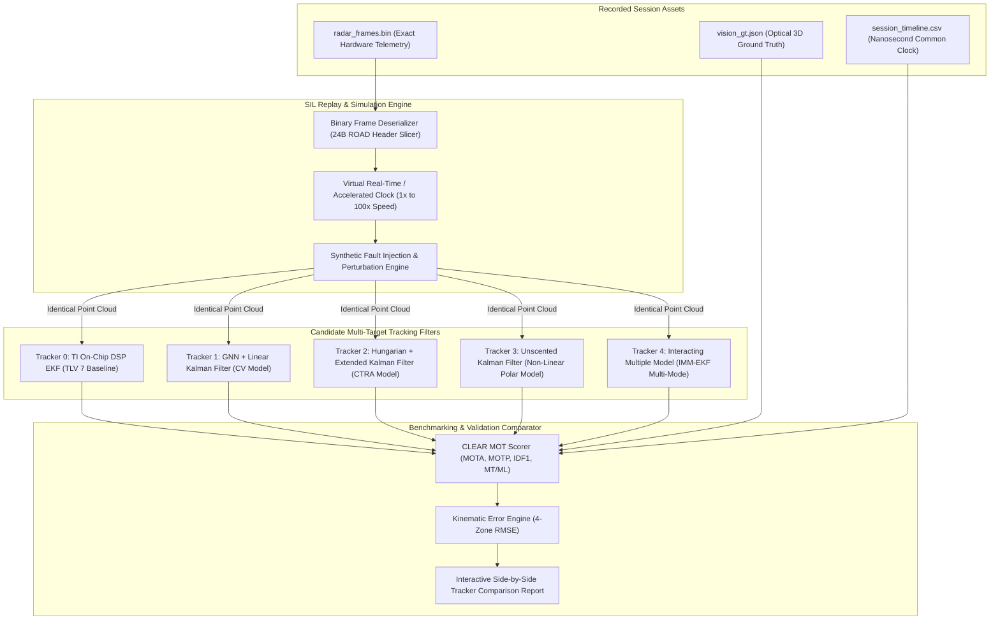

# Software-in-the-Loop (SIL) Digital-Twin Replay & Stress Testing

> **Document Classification:** Autonomous Vehicle Research & Engineering Systems  
> **Target Audience:** ADAS Algorithm Developers, Simulation Engineers, Verification Specialists  
> **Location:** `intel/Validation/06_SIL_REPLAY_SIMULATION_AND_STRESS_TESTING.md`  
> **Status:** Authoritative Architectural Specification  

---

## 1. Overview & Motivation: The Digital-Twin Paradigm

Validating perception algorithms directly in live vehicles on public roads is inherently limited:
* **Non-Repeatability:** Traffic conditions, vehicle trajectories, pedestrian actions, and weather are non-deterministic. A bug that appears on one test ride cannot be reliably recreated.
* **Safety Risks in Critical Edge Cases:** Validating forward collision warnings (FCW) or autonomous emergency braking (AEB) near collision thresholds ($TTC < 1.5\text{ s}$) poses severe physical hazards to test riders and vehicles.
* **Slow Engineering Iteration:** Modifying a tracking filter parameter (such as Kalman process noise $\mathbf{Q}$) requires re-flashing software, mounting the hardware, and riding for hours to observe subtle effects.

**Software-in-the-Loop (SIL) Digital-Twin Replay (Pillar 4)** overcomes these limitations by utilizing RoadSense's uncorrupted raw binary disk dumps (`radar_raw_stream.bin` and `radar_frames.bin`). 

By replaying these exact bitstreams into a deterministic software simulation harness on a PC workstation, algorithms can be evaluated at **$10\times$ to $100\times$ real-time speed**, subjected to **synthetic fault injections**, and compared objectively against optical ground truth across thousands of simulated kilometers.

---

## 2. Digital-Twin Replay Pipeline Architecture



---

## 3. Candidate Tracker Benchmarking Framework

A primary advantage of SIL simulation is the ability to feed the **identical, microsecond-accurate point-cloud stream** simultaneously to multiple competing tracking architectures:

| Tracker Architecture | Motion Model | Data Association | Computational Load | Primary Strengths & Trade-offs |
| :--- | :--- | :--- | :--- | :--- |
| **Tracker 0: TI DSP EKF** | Constant Velocity (CV) | Hardware GNN on C674x DSP | Embedded Silicon ($0\text{ W}$ host CPU) | Baseline firmware tracker. Highly conservative; drops targets during fast lateral maneuvers. |
| **Tracker 1: GNN + Linear KF** | Constant Velocity (CV) | Global Nearest Neighbor | Extremely Low ($< 1\text{ ms/frame}$) | Fast and deterministic; prone to track fragmentation during vehicle turns. |
| **Tracker 2: Hungarian + EKF** | Constant Turn Rate & Accel (CTRA) | Hungarian (Kuhn-Munkres) | Low ($< 3\text{ ms/frame}$) | Excellent tracking during high-speed highway curves and motorcycle leaning. |
| **Tracker 3: Unscented KF (UKF)** | Non-Linear Kinematics | Mahalanobis Gated Hungarian | Moderate ($< 8\text{ ms/frame}$) | Handles non-linear polar radar measurements $(r, \theta, \dot{r})$ without Jacobian linearizations. |
| **Tracker 4: IMM-EKF** | Multi-Model (CV + CTRA + Brake) | Joint Probabilistic Association | High ($< 15\text{ ms/frame}$) | Dynamically switches between steady cruising and emergency braking modes. Highest MOTA. |

---

## 4. Synthetic Fault Injection & Stress Testing

Real-world edge cases occur rarely. The SIL harness incorporates a **Synthetic Fault Injection Engine** to stress-test tracking algorithms under extreme degraded operating conditions:

```
┌────────────────────────────────────────────────────────────────────────────────────────┐
│                        SYNTHETIC FAULT INJECTION TAXONOMY                              │
│                                                                                        │
│  [FAULT 1: FRAME DROPPING]   Simulates USB bus contention, OS stalls, or RF interference│
│                              Randomly drops 1 to 5 consecutive frames (50–250ms).      │
│                              Tests: Track coasting persistence without state collapse.  │
│                                                                                        │
│  [FAULT 2: CLUTTER BURSTS]   Simulates heavy rain, road spray, or metal bridge reflections│
│                              Injects Poisson-distributed random false points (5–20/fr). │
│                              Tests: CFAR Mahalanobis gating & false track rejection.    │
│                                                                                        │
│  [FAULT 3: GHOST TARGETS]    Simulates under-vehicle multipath ground-bounce reflections │
│                              Clones real targets with delayed range & mirrored azimuth. │
│                              Tests: Doppler-consistency filters and ghost identification│
│                                                                                        │
│  [FAULT 4: NOISE CORRUPTION] Simulates low-SNR distant targets or sensor temperature drift│
│                              Adds Gaussian noise: range (+-1.5m), azimuth (+-3.0 deg).  │
│                              Tests: Kalman filter covariance adaptation (Q and R gains).│
└────────────────────────────────────────────────────────────────────────────────────────┘
```

### 4.1 Frame Dropping & Coasting Persistence Test
When radar packets are dropped (e.g. during an unbuffered USB bus stall):
* The tracking filter must transition into **Coasting State** (predicting target position using its state-space transition matrix $\mathbf{F}$ without measurement updates $\mathbf{z}_k$).
* **Stress Criteria:** When subjected to a 3-frame drop ($150\text{ ms}$ blind interval), the tracker must maintain the target ID and recover position lock within 1 frame after packet resumption, without creating a duplicate track ID.

### 4.2 Poisson Clutter Injection & Gating Robustness
To verify that the tracker does not spawn "ghost" vehicles in clutter:
* The injector generates $N_{\text{clutter}} \sim \text{Poisson}(\lambda = 15)$ false points uniformly distributed across the radar FoV ($r \in [5\text{m}, 80\text{m}]$, $\theta \in [-60^\circ, +60^\circ]$).
* **Stress Criteria:** The tracker must maintain a False Positive Track Rate $< 0.5\text{ tracks/minute}$ despite the heavy clutter envelope.

---

## 5. Automated Bayesian Tracker Parameter Optimization

Manually tuning the dozens of scalar coefficients inside a Kalman filter (process noise $\mathbf{Q}$, measurement noise $\mathbf{R}$, gating distance $\gamma_{\text{gate}}$, initiation threshold $M/N$) is inefficient.

The SIL harness interfaces with **Optuna / Bayesian Optimization** to automatically discover the Pareto-optimal parameter set:

$$\max_{\mathbf{Q}, \mathbf{R}, \gamma} \quad \text{MOTA}(\mathbf{Q}, \mathbf{R}, \gamma) - \lambda \cdot \text{RMSE}_Y(\mathbf{Q}, \mathbf{R}, \gamma)$$

```bash
# Execute automated 100-trial Bayesian tuning sweep over a 1-hour session
python tools/validation/tune_tracker_parameters.py \
    --session logs/session_20260924_103000 \
    --tracker hungarian_ctra_ekf \
    --trials 100 \
    --opt_metric mota
```

* **Result:** Generates an optimized `tracker_config.json` ready for deployment into the on-vehicle RoadSense perception engine.
