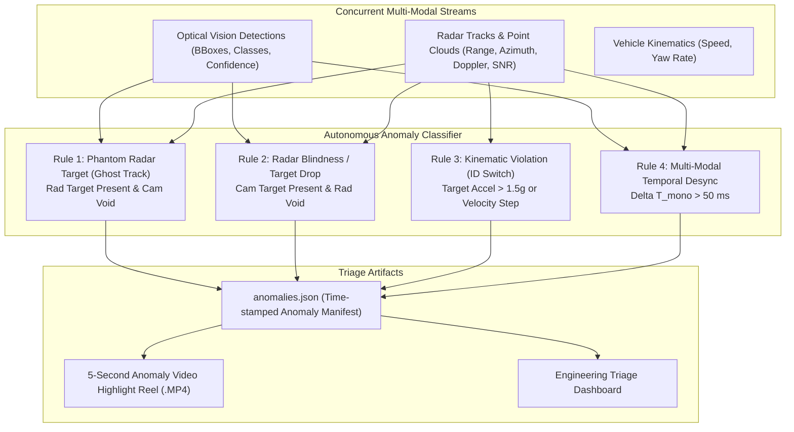

# Cross-Modal Discrepancy & Autonomous Anomaly Detection

> **Document Classification:** Autonomous Vehicle Research & Engineering Systems  
> **Target Audience:** Perception Engineers, Edge-Case Mining Specialists, Systems Safety Leads  
> **Location:** `intel/Validation/07_CROSS_MODAL_ANOMALY_DETECTION_AND_EDGE_CASE_MINING.md`  
> **Status:** Authoritative Algorithmic Specification  

---

## 1. Overview & Motivation: The Scalability Problem

In large-scale automotive ADAS development, a test fleet of 10 to 20 vehicles running daily test rides generates **hundreds of gigabytes and dozens of hours of multi-modal data every day**:
* 1 hour of recording produces **216,000 video frames (at 60 FPS)** and **72,000 radar chirps (at 20 Hz)**.
* Human test engineers cannot manually watch hundreds of hours of video or inspect millions of radar point clouds to spot occasional tracking glitches.
* Over 98% of recorded driving consists of uninteresting, nominal cruising on empty or flowing roads. The critical events that matter for safety validation—ghost targets, track drops, cut-in tracking failures, and sensor occlusions—occur in less than 2% of the driving dataset.

**Cross-Modal Discrepancy & Autonomous Anomaly Detection (Pillar 5)** solves this through **Self-Supervised Disagreement Mining**:

$$\text{Validate by Discrepancy: Wherever Camera and Radar Disagree, an Edge Case Exists}$$

Instead of evaluating everything, the engine automatically mines the dataset for moments where the optical camera and the mmWave radar reach conflicting conclusions about physical reality, automatically extracting targeted **5-second video clips** and telemetry manifests for engineering review.

---

## 2. The Four Anomaly Mining Rules



---

### Rule 1: Phantom Radar Target (Ghost Track Detection)
* **The Physical Anomaly:** The radar reports a persistent, high-confidence obstacle with closing velocity, but the camera sees empty road.
* **Algorithmic Trigger:**
  1. A radar track is active with:
     $$\text{Status} = \text{CONFIRMED}, \quad Y_{\text{radar}} < 35.0\text{ m}, \quad V_{\text{doppler}} < -3.0\text{ m/s}, \quad \text{Lifetime} \ge 5\text{ frames}$$
  2. The radar point projects onto camera pixel coordinates $(u, v)$ via $[\mathbf{R} \mid \mathbf{T}]$ and $\mathbf{K}$.
  3. The optical object detector (YOLOv8x/v11) reports **zero detected bounding boxes** within an angular tolerance window of $\pm 50\text{ pixels}$ around $(u, v)$.
* **Root Causes Isolated:**
  * Multipath ground-bounce reflections under lead trucks or metallic road plates.
  * Side-lobe reflections from roadside metal guardrails or bridge overhead gantries.
* **Output Classification:** `ANOMALY_GHOST_TRACK` (Priority: High).

---

### Rule 2: Radar Blindness / Target Drop (Low-RCS Vulnerability)
* **The Physical Anomaly:** The camera clearly sees a vehicle or vulnerable road user directly in the vehicle path, but the radar produces zero detections.
* **Algorithmic Trigger:**
  1. The optical detector identifies a high-confidence target:
     $$\text{Class} \in \{\text{car}, \text{truck}, \text{motorcycle}, \text{auto\_rickshaw}, \text{pedestrian}\}$$
     $$\text{Confidence} \ge 0.90, \quad \text{Estimated Distance } Y_{\text{vision}} < 25.0\text{ m}$$
  2. The optical ray direction projects into radar azimuth/elevation space $(\theta_{\text{ray}}, \phi_{\text{ray}})$.
  3. For $\ge 5$ consecutive radar chirps ($250\text{ ms}$), the radar point cloud contains **zero points** within the spatial cone:
     $$\Delta \theta \le 3.5^\circ, \quad |R_{\text{radar}} - Y_{\text{vision}}| \le 3.0\text{ m}$$
* **Root Causes Isolated:**
  * Low Radar Cross Section (RCS) targets (e.g. fiberglass scooter body panels, plastic motorcycle fairings, pedestrians).
  * Destructive multi-path interference (phase cancellation).
  * Extreme target angular aspect where radar reflections scatter away from the receiver array.
* **Output Classification:** `ANOMALY_RADAR_BLINDNESS` (Priority: Critical).

---

### Rule 3: Kinematic Violation (ID Switch & Association Paradox)
* **The Physical Anomaly:** A tracked target exhibits physically impossible kinematics, indicating that the tracking filter swapped identities between two adjacent vehicles or jumped from a vehicle to roadside clutter.
* **Algorithmic Trigger:**
  1. For consecutive radar chirps $t_k$ and $t_{k-1}$ ($\Delta t \approx 50\text{ ms}$) sharing the identical `track_id`:
     $$\text{Derived Acceleration: } a_{\text{long}} = \frac{V_Y(t_k) - V_Y(t_{k-1})}{\Delta t}$$
     $$\text{Derived Lateral Velocity: } V_X = \frac{X(t_k) - X(t_{k-1})}{\Delta t}$$
  2. Anomaly condition:
     $$|a_{\text{long}}| > 1.5g \quad (14.71\text{ m/s}^2) \quad \lor \quad |V_X| > 15.0\text{ m/s} \quad (54\text{ km/h})$$
* **Root Causes Isolated:**
  * Tracking association collapse during vehicle overtaking.
  * Kalman filter covariance explosion.
* **Output Classification:** `ANOMALY_KINEMATIC_VIOLATION` (Priority: Medium).

---

### Rule 4: Multi-Modal Temporal Desynchronization
* **The Physical Anomaly:** Hardware thread preemption or buffer starvation causes the monotonic timestamp alignment between camera video frames and radar chirps to drift outside deterministic boundaries.
* **Algorithmic Trigger:**
  1. Interpolating the master `session_timeline.csv`:
     $$\Delta t_{\text{sync}} = |t_{\text{radar\_mono}} - t_{\text{camera\_shutter\_mono}}|$$
  2. Anomaly condition:
     $$\Delta t_{\text{sync}} > 50\text{ ms} \quad (\text{Exceeds one full radar frame period})$$
* **Root Causes Isolated:**
  * Linux kernel task preemption on the Android host.
  * USB UART ring buffer watermark overrun.
* **Output Classification:** `ANOMALY_TEMPORAL_DESYNC` (Priority: High).

---

## 3. Automated Anomaly Manifest & Video Highlight Reel

The anomaly mining engine (`tools/validation/mine_session_anomalies.py`) processes the session directory and outputs two primary triage artifacts:

### 3.1 Time-Stamped Manifest: `anomalies.json`
```json
{
  "session_id": "session_20260924_103000",
  "total_drive_duration_s": 1800.0,
  "total_anomalies_detected": 3,
  "anomalies": [
    {
      "anomaly_id": "ANOM_001",
      "type": "ANOMALY_GHOST_TRACK",
      "severity": "HIGH",
      "start_mono_ns": 41289140500120,
      "end_mono_ns": 41289145500120,
      "duration_s": 5.0,
      "video_timestamp_s": 142.5,
      "radar_track_id": 7,
      "radar_state": { "range_m": 16.4, "azimuth_deg": 2.1, "doppler_mps": -5.2 },
      "vision_state": { "objects_detected_in_cone": 0 },
      "description": "High-confidence radar target detected with no corresponding optical obstacle."
    }
  ]
}
```

### 3.2 Automated 5-Second Video Highlight Reel
* The tool automatically invokes `ffmpeg` to extract a 5-second video snippet $[T_{\text{anomaly}} - 2.5\text{s}, T_{\text{anomaly}} + 2.5\text{s}]$ centered on each detected anomaly.
* A semi-transparent side-by-side radar BEV overlay and 6-DOF projected lollipops are burned directly into the clip with a prominent **red bounding box and warning banner** highlighting the exact discrepancy.
* **Result:** Rather than watching 1 hour of video, an engineer can review the entire session's edge cases in **under 30 seconds**.
