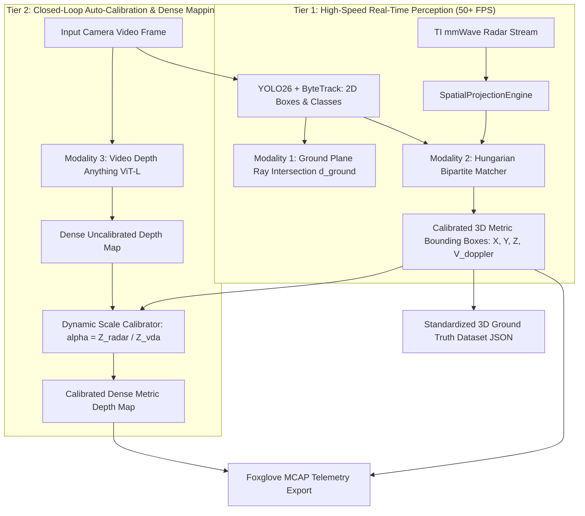

# Pixel-to-World Coordinate Transformations & Depth Resolution Guide

> **Document Name:** `Pixel_to_World_Coordinate_Transformations_and_Depth_Resolution_Guide.md`  
> **Location:** `intel/Vision/Pixel_to_World_Coordinate_Transformations_and_Depth_Resolution_Guide.md`  
> **Purpose:** Comprehensive mathematical, geometric, and sensory guide explaining how 2D bounding box pixel coordinates $(u, v)$ translate to real-world metric coordinates $(X, Y, Z)$, evaluating monocular projective ambiguity, and comparing the three depth resolution strategies in RoadSense.  
> **Target Audience:** Perception Engineers, Computer Vision Developers, Sensor Fusion Architects  
> **Date:** October 2026  

---

## Executive Summary: Direct Engineering Answers

> [!NOTE]
> **Can $(u, v)$ pixel coordinates directly resolve real-world $(X, Y, Z)$?**  
> * **Pure Math Answer:** **No.** In projective geometry, a single $(u, v)$ pixel represents an infinite 3D ray projecting outwards from the camera lens. You cannot determine if an object along that ray is a toy car 1 meter away or a real semi-truck 50 meters away without depth ($Z$).
> * **Automotive Reality Answer:** **YES, with Ground Plane Geometry.** Because vehicles, two-wheelers, and pedestrians contact the asphalt ($Z_{\text{road}} = 0$), the bottom-center of the bounding box $(c_x, y_2)$ intersects the ground plane at an exact closed-form metric distance $(X, Y)$ using the camera mount height $H_{\text{cam}}$ and downward pitch angle $\theta$.

> [!TIP]
> **Do we need the Deep Neural Depth Model (Video Depth Anything) to continue?**  
> * **For Obstacle Tracking & Collision Warning:** **NO.** You do NOT need heavy neural depth models. You have two orders-of-magnitude faster alternatives:
>   1. **Modality 1 (Ground Plane Trigonometry):** $0.01\text{ ms}$, $0\text{ MB}$ VRAM, runs at **50+ FPS**.
>   2. **Modality 2 (RoadSense mmWave Radar Fusion):** Directly measures physical metric range ($R$), azimuth ($\alpha$), and Doppler velocity ($V$) with $\pm 4\text{ cm}$ physical ground truth, running at **50+ FPS**.
> * **When is Video Depth Anything actually useful?**
>   - Only when you need **dense 3D point clouds** of non-flat scenery (curbs, overhead signs, undulating potholes, road debris, foliage, or vehicle chassis surfaces) or when running on vehicle setups lacking radar hardware.

---

## Table of Contents
1. [Executive Summary: Direct Engineering Answers](#executive-summary-direct-engineering-answers)
2. [The Fundamental Problem: The Lost Dimension](#1-the-fundamental-problem-the-lost-dimension)
3. [Coordinate Frames & Projective Geometry](#2-coordinate-frames--projective-geometry)
4. [Modality 1: Closed-Form Ground-Plane Ray Intersection (Pure Geometry)](#3-modality-1-closed-form-ground-plane-ray-intersection-pure-geometry)
5. [Modality 2: Physical Metric Sensor Fusion (The mmWave Radar "Cheat Code")](#4-modality-2-physical-metric-sensor-fusion-the-mmwave-radar-cheat-code)
6. [Modality 3: Deep Neural Monocular Depth Estimation (Video Depth Anything)](#5-modality-3-deep-neural-monocular-depth-estimation-video-depth-anything)
7. [Comparative Evaluation: Which Approach to Use?](#6-comparative-evaluation-which-approach-to-use)
8. [The Unified RoadSense Multi-Tiered Perception Architecture](#7-the-unified-roadsense-multi-tiered-perception-architecture)
9. [Reference Python Implementation](#8-reference-python-implementation)

---

## 1. The Fundamental Problem: The Lost Dimension

When a camera sensor captures a frame, it performs a **projective mapping** from 3D physical space $\mathbb{R}^3$ onto a 2D planar grid $\mathbb{R}^2$. In doing so, the forward distance dimension ($Z$) is completely compressed.

```
       3D REAL WORLD (X, Y, Z)                        2D CAMERA SENSOR (u, v)
                                                        ┌───────────────────────┐
   Object A (Toy car, 1m away)       ──┐                │                       │
                                       │                │                       │
   Object B (Real sedan, 25m away)   ──┼──────────────► │    [ Bounding Box ]   │
                                       │  Viewing Ray   │     (u, v) in pixels  │
   Object C (Huge truck, 70m away)   ──┘                │                       │
                                                        └───────────────────────┘
```

### The "Laser Pointer" Analogy
* A pixel coordinate $(u, v)$ does **not** represent a unique point in space. It represents an **infinite 3D ray of light** emanating from the camera's optical center out into the world.
* Camera intrinsics ($K$) tell us the precise **bearing/angle** of that ray.
* However, any object along that line of sight—whether it is a toy car 1 meter away, a real vehicle 25 meters away, or a massive billboard 200 meters away—can project onto the **exact same pixel $(u, v)$**.

To convert a pixel $(u, v)$ back into metric camera coordinates $(X_c, Y_c)$, we use the classic pinhole back-projection formulas:
$$X_c = \frac{u - c_x}{f_x} \times \mathbf{Z_c}$$
$$Y_c = \frac{v - c_y}{f_y} \times \mathbf{Z_c}$$

> [!IMPORTANT]
> **The Mathematical Reality:**
> Notice that both $X_c$ and $Y_c$ depend directly on $\mathbf{Z_c}$. A 2D detection gives $(u, v)$, but leaves 1 equation with 2 unknowns. **You cannot calculate real-world $(X, Y, Z)$ without obtaining $Z$ (depth) through an external constraint or physical sensor.**

---

## 2. Coordinate Frames & Projective Geometry

To resolve 3D positions accurately, we must strictly distinguish between the two primary coordinate frames:

```
      Camera Optical Frame (RDF)                   Vehicle Body / Radar Frame (ISO 8855)
            +Z_c (Optical Forward)                         +Y_v (Heading Forward)
                   ▲                                               ▲
                  /                                                │
                 /                                                 │
                ┌───────► +X_c (Right)                   -X_v ◄────┼────► +X_v (Right)
                │                                                  │
                │                                                  │
                ▼ +Y_c (Down)                                      ▼ -Y_v
            (+Z_c = Optical Depth)                             (+Z_v = Up from Asphalt)
```

1. **Camera Optical Frame ($\mathcal{F}_c$):** Standard OpenCV/Computer Vision convention. $+X_c$ points right, $+Y_c$ points down, and $+Z_c$ points forward along the optical axis.
2. **Vehicle Ground Frame ($\mathcal{F}_v$):** Standard automotive ISO 8855 convention. $+X_v$ points right (lateral), $+Y_v$ points forward along vehicle heading (longitudinal), and $+Z_v$ points upward perpendicular to the road surface ($Z_v = 0$ is the road asphalt).

### Extrinsic Transformation Matrix ($[R|T]$)
A 3D point in vehicle space $\mathbf{P}_v = [X_v, Y_v, Z_v]^T$ transforms into camera space $\mathbf{P}_c = [X_c, Y_c, Z_c]^T$ via:
$$\mathbf{P}_c = \mathbf{R} \cdot (\mathbf{P}_v - \mathbf{T})$$
$$\mathbf{P}_v = \mathbf{R}^T \cdot \mathbf{P}_c + \mathbf{T}$$

Where:
* **$\mathbf{T} = [\Delta X, \Delta Y, H_{\text{cam}}]^T$**: Lateral offset, longitudinal setback, and camera mounting height above the road asphalt.
* **$\mathbf{R} = \mathbf{R}_z(\phi) \cdot \mathbf{R}_x(\theta) \cdot \mathbf{R}_y(\psi) \cdot \mathbf{R}_0$**: 3D rotation accounting for camera mount Pitch ($\theta$), Yaw ($\psi$), and Roll ($\phi$).

---

## 3. Modality 1: Closed-Form Ground-Plane Ray Intersection (Pure Geometry)

Can we resolve $(X_v, Y_v, Z_v)$ **without** running a neural depth model?  
**Yes, by using the Flat Ground-Plane Assumption.**

### 3.1 Physical Foundation: The Asphalt Contact Patch
Vehicles, two-wheelers, and pedestrians are ground-supported obstacles. They do not float in the air.
* In the 2D bounding box $(x_1, y_1, x_2, y_2)$, the geometric center $\frac{y_1 + y_2}{2}$ lands on the vehicle cabin or windshield (floating ~1 meter above the ground).
* However, the **bottom-center point $(c_x, y_2)$** represents the tire contact patch where the vehicle touches the asphalt!
* Since the tires touch the road surface, we know a physical boundary condition: **$Z_v = 0$**.

```
  Camera Optical Center
       (Height H_cam)
             ●
             │ \ 
             │   \ 
             │     \  Viewing Ray through bottom pixel (cx, y2)
      H_cam  │       \ 
             │   Pitch θ\ 
             │           \ 
  ───────────┴─────────────●──────────────────────── Road Surface (Z_v = 0)
         Vehicle Origin    Tire Contact Patch
                           Distance Y_v
```

### 3.2 Mathematical Derivation
Let the camera be mounted at height $H_{\text{cam}}$ above the road with downward tilt angle (Pitch $\theta$).
1. The optical elevation angle $\alpha$ of the pixel ray relative to the camera optical axis is:
   $$\alpha = \arctan\left(\frac{y_2 - c_y}{f_y}\right)$$
   *(When $y_2 > c_y$, the ray points below the optical center).*
2. The total angle of depression $\beta$ from the horizontal horizon down to the tire contact patch is:
   $$\beta = \theta + \alpha = \theta + \arctan\left(\frac{y_2 - c_y}{f_y}\right)$$
3. By basic trigonometry on the right triangle formed by the camera height $H_{\text{cam}}$ and the road plane:
   $$\tan(\beta) = \frac{H_{\text{cam}}}{Y_v} \implies Y_v = \frac{H_{\text{cam}}}{\tan(\beta)}$$

$$Y_v = \frac{H_{\text{cam}}}{\tan\left(\theta + \arctan\left(\frac{y_2 - c_y}{f_y}\right)\right)}$$

Once the longitudinal distance $Y_v$ is solved, the lateral distance $X_v$ is directly resolved from the horizontal pixel ray:
$$X_v = \frac{c_x - c_x^{\text{principal}}}{f_x} \times Y_v + \Delta X$$

### 3.3 Concrete Numerical Example
Using real RoadSense parameters:
* Camera Height $H_{\text{cam}} = 1.45\text{ m}$
* Downward Pitch $\theta = 7.0^\circ = 0.1222\text{ rad}$
* Focal Length $f_y = 1420\text{ px}$, $c_y = 540\text{ px}$
* Detected car bounding box bottom edge: $y_2 = 620\text{ px}$ (80 pixels below center)

**Step-by-step computation:**
1. Pixel ray angle: $\alpha = \arctan\left(\frac{620 - 540}{1420}\right) = \arctan(0.05634) \approx 3.225^\circ$
2. Total depression angle: $\beta = 7.0^\circ + 3.225^\circ = 10.225^\circ$
3. Longitudinal Distance:
   $$Y_v = \frac{1.45\text{ m}}{\tan(10.225^\circ)} = \frac{1.45}{0.1804} \approx \mathbf{8.04\text{ meters}}$$

### 3.4 Strengths & Limitations of Modality 1
* ✅ **Zero Compute Overhead:** Computes in under **$0.01\text{ milliseconds}$** per object using simple closed-form arithmetic.
* ✅ **No Heavy Weights:** Requires zero neural networks or VRAM.
* ⚠️ **Flat Road Assumption:** Assumes the road ahead is a flat plane. On steep uphill/downhill grades, speed bumps, or undulating roads, calculated distance will drift.
* ⚠️ **Occlusion Vulnerability:** If a car's tires are occluded by a guardrail or another vehicle, $y_2$ will represent the occlusion boundary rather than ground contact, leading to overestimated distance.

---

## 4. Modality 2: Physical Metric Sensor Fusion (The mmWave Radar "Cheat Code")

This is RoadSense's core architectural advantage. Rather than estimating or inferring depth from images, we directly measure it using electromagnetic physics.

```
┌────────────────────────────────────────────────────────────────────────┐
│                          CAMERA VIEW (2D)                              │
│                                                                        │
│                    ┌──────────────────────┐                            │
│                    │  YOLO BOUNDING BOX   │                            │
│                    │   Class: "car" (94%) │                            │
│                    │   Pixel: (cx, cy)    │                            │
│                    │          ● ◄─────────┼── [Projected Radar Track]  │
│                    └──────────────────────┘   Distance: 18.42m         │
│                                               Velocity: -12.4 km/h     │
│                                                                        │
└────────────────────────────────────────────────────────────────────────┘
```

### 4.1 How It Works
1. **Radar Transmission & Echo:** The TI AWR1843 mmWave radar emits frequency-modulated continuous wave (FMCW) radio chirps at $77\text{ GHz}$. Reflections from solid targets return microsecond-accurate time-of-flight measurements:
   * **Radial Range ($R$)** with $\pm 4\text{ cm}$ accuracy up to $150\text{ m}$.
   * **Doppler Radial Velocity ($V_{\text{doppler}}$)** directly from phase shift.
   * **Azimuth Angle ($\alpha$)** from receiver antenna array phase differences.
2. **Forward Perspective Projection:** RoadSense's [`SpatialProjectionEngine.kt`](file:///c:/Users/rakadu1.AHEAD/AndroidStudioProjects/RoadSense/app/src/main/java/com/bajajauto/roadsense/fusion/engine/SpatialProjectionEngine.kt) projects the radar track $(X_r, Y_r)$ onto screen pixels:
   $$\begin{bmatrix} u_r \\ v_r \\ 1 \end{bmatrix} \sim K \cdot \begin{bmatrix} \mathbf{R} & \mathbf{T} \end{bmatrix} \begin{bmatrix} X_r \\ Y_r \\ 0 \\ 1 \end{bmatrix}$$
3. **2D-to-3D Bipartite Association:**
   * YOLO provides the 2D bounding box and semantic classification (`"car"`).
   * Radar provides the ground-truth physical metric distance ($Y_{\text{radar}} = 18.42\text{ m}$) and velocity.
   * If $(u_r, v_r)$ falls inside YOLO's box, they are paired!

### 4.2 The Mathematical Result
We substitute the radar's physical range directly into the pinhole back-projection:
$$Z_c = Y_{\text{radar}} - \text{setbackM}$$
$$X_v = X_{\text{radar}} + \text{lateralOffsetM}$$
$$Y_v = Y_{\text{radar}}$$
$$Z_v = \text{targetHeightM} \approx 0.8\text{ m (center of vehicle body)}$$

* ✅ **Absolute Ground Truth:** Immune to lighting, glare, darkness, rain, fog, and visual scale drift.
* ✅ **Instant Runtime:** Association runs in $< 0.1\text{ ms}$ (Hungarian algorithm over ~10-20 tracks).
* ✅ **Rich Kinematics:** Delivers real-time relative speed and Time-To-Collision (TTC).

---

## 5. Modality 3: Deep Neural Monocular Depth Estimation (Video Depth Anything)

If ground plane geometry and radar both work without heavy models, why did the `D:\Work\CV` project introduce **Video Depth Anything (VDA)**?


### 5.1 The Distinct Purpose of Dense Depth
1. **Dense vs. Sparse:**
   * Radar only returns reflections from dense metallic/reflective obstacles. It cannot detect road boundaries, lane surfaces, curbs, foliage, walls, or fallen non-metallic debris.
   * VDA estimates a depth value for **every single pixel** in the image (millions of points).
2. **Standalone Camera Workflows:**
   * When testing on third-party dashcam footage or vehicles lacking an installed mmWave radar, VDA provides an autonomous depth estimate directly from video alone.

### 5.2 Mechanics of Video Depth Anything
* **Temporal Hidden State Streaming (`infer_video_depth_one`):** Unlike static per-frame models (Depth Anything V2), VDA retains internal attention feature caches across sequential frames. This eliminates high-frequency depth flicker between consecutive frames.
* **The Cost:**
  * High computational load: ~1.6 FPS on an NVIDIA T1000 GPU (~600 ms per frame).
  * High VRAM requirements: ~4.5 GB for ViT-L.
  * Subject to neural scale drift: predictions can warp or drift depending on focal length and camera aspect ratio.

---

## 6. Comparative Evaluation: Which Approach to Use?

| Evaluation Dimension | Modality 1: Ground-Plane Geometry | Modality 2: Radar-Vision Fusion | Modality 3: Video Depth Anything (VDA) |
|---|---|---|---|
| **Needs Deep Learning Depth Model?** | ❌ **No** | ❌ **No** | ✅ **Yes** (ViT-S / ViT-L weights) |
| **Processing Speed (FPS)** | **50+ FPS** (Real-Time) | **50+ FPS** (Real-Time) | **1.6 to 4 FPS** (Heavy Workstation) |
| **GPU / VRAM Consumption** | **0 MB** (Pure math) | **0 MB** (Pure math) | **1.5 GB to 4.5 GB** |
| **Metric Accuracy** | High on flat highways; Degrades on slopes/undulations | **Highest ($\pm 4\text{ cm}$ Physical Ground Truth)** | Medium (Learned visual estimate, scale-drifts) |
| **Object Speed / Doppler Velocity?** | ❌ No (requires optical flow differencing) | ✅ **Yes (Direct Doppler measurement)** | ❌ No (depth only) |
| **Non-Metallic / General Scene Depth?** | ❌ No (ground-standing objects only) | ❌ No (reflective radar targets only) | ✅ **Yes (Full dense depth map)** |
| **Best Used For:** | Ultra-fast lightweight edge verification | **Automotive ADAS ground-truth generation & benchmarking** | Offline dense 3D point cloud mapping without radar |

---

## 7. The Unified RoadSense Multi-Tiered Perception Architecture

Instead of choosing only one modality, RoadSense unifies all three into an adaptive hierarchy:



### The Closed-Loop "Eureka" Connection
1. **Fast Path:** Runs YOLO26 + Radar Association at **50+ FPS**. Every vehicle has exact $(X, Y, Z)$ and Doppler velocity with zero deep depth overhead.
2. **Self-Calibrating Dense Path:** When dense point clouds are needed, radar tracks act as **anchor calibration pins** ($\alpha = Z_{\text{radar}} / Z_{\text{VDA}}$). The sparse, accurate radar points automatically calibrate the dense neural depth map, eliminating neural scale drift!

---

## 8. Reference Python Implementation

Below is a self-contained Python module demonstrating both closed-form geometric depth calculation and radar-to-pixel projection:

```python
import math
import numpy as np


def compute_ground_plane_distance(v_bottom, cy, fy, pitch_deg, h_cam_m):
    """
    Computes longitudinal real-world distance (Y in meters) using the Flat Ground-Plane Assumption.
    
    Args:
        v_bottom (float): Vertical pixel coordinate of the bottom edge of the bounding box (y2).
        cy (float): Optical center vertical pixel coordinate (typically imageHeight / 2).
        fy (float): Vertical focal length in pixel units.
        pitch_deg (float): Camera downward tilt angle in degrees (positive = tilted toward asphalt).
        h_cam_m (float): Camera lens elevation above the road surface in meters.
        
    Returns:
        float: Longitudinal distance ahead in meters (Y_v).
    """
    pitch_rad = math.radians(pitch_deg)
    
    # Optical angle of depression for the bottom-edge ray
    alpha_rad = math.atan((v_bottom - cy) / fy)
    
    # Total angle of depression relative to the horizon
    total_depression_rad = pitch_rad + alpha_rad
    
    if total_depression_rad <= 0.01:
        return float('inf')  # Ray is pointing at or above the horizon
        
    y_forward_m = h_cam_m / math.tan(total_depression_rad)
    return y_forward_m


def project_pixel_to_vehicle_3d(u_center, v_bottom, cx, cy, fx, fy, pitch_deg, h_cam_m, delta_x_m=0.0):
    """
    Converts 2D bounding box ground-contact pixel (u_center, v_bottom) into full
    ISO vehicle ground coordinates (X_v, Y_v, Z_v).
    """
    y_v = compute_ground_plane_distance(v_bottom, cy, fy, pitch_deg, h_cam_m)
    x_v = ((u_center - cx) / fx) * y_v + delta_x_m
    z_v = 0.0  # By definition, the tire contact patch is on the asphalt plane
    
    return {"x_lat_m": round(x_v, 3), "y_long_m": round(y_v, 3), "z_elev_m": round(z_v, 3)}


# --- Verification Example ---
if __name__ == "__main__":
    # RoadSense standard windshield mount parameters
    H_CAM = 1.45       # 1.45m above asphalt
    PITCH = 7.0        # 7.0° downward tilt
    FX = FY = 1420.5   # 1080p sensor focal length
    CX = 960.0
    CY = 540.0
    
    # Example: Detected car bumper touching road at pixel v = 645 px, u = 1080 px
    coords_3d = project_pixel_to_vehicle_3d(
        u_center=1080.0,
        v_bottom=645.0,
        cx=CX,
        cy=CY,
        fx=FX,
        fy=FY,
        pitch_deg=PITCH,
        h_cam_m=H_CAM
    )
    
    print("Projected 3D Vehicle Coordinates:")
    print(f"  Longitudinal Range (Y): {coords_3d['y_long_m']} meters forward")
    print(f"  Lateral Offset     (X): {coords_3d['x_lat_m']} meters right")
    print(f"  Road Elevation     (Z): {coords_3d['z_elev_m']} meters (Asphalt Surface)")
```
