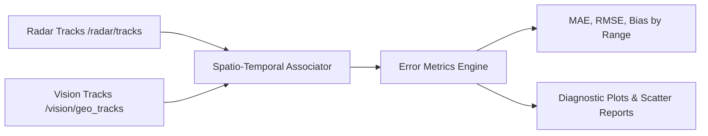

# RoadSense Vision: Phase 1 to Phase 3 Engineering Guide

> **Document Name:** `phase1_to_phase3_guide.md`  
> **Location:** `intel/Vision/phase1_to_phase3_guide.md`  
> **Purpose:** Detailed modular architecture, mathematical foundation, and implementation roadmap for offline geometric depth perception, non-destructive Foxglove MCAP topic injection, and programmatic radar-vs-vision validation.  
> **Scope:** Phases 1 through 3 (Modality 1: Pure Ground-Plane Geometry). Excludes premature sensor fusion to build on verifiable ground.  
> **Author:** Antigravity Team  
> **Date:** October 2026  

---

## Table of Contents
1. [Core Architectural Principles](#1-core-architectural-principles)
2. [Target Directory & Modular Code Structure](#2-target-directory--modular-code-structure)
3. [Understanding Object Dimensions: Radar vs. Vision](#3-understanding-object-dimensions-radar-vs-vision)
4. [Master Sensor Synchronization: `session_timeline.csv`](#4-master-sensor-synchronization-session_timelinecsv)
5. [Phase 1: Modular Offline Geometric Vision Pipeline](#5-phase-1-modular-offline-geometric-vision-pipeline)
6. [Phase 2: Non-Destructive MCAP Topic Injection (`/vision/geo_tracks`)](#6-phase-2-non-destructive-mcap-topic-injection-visiongeo_tracks)
7. [Phase 3: Programmatic Radar-vs-Vision Validation & Benchmarking](#7-phase-3-programmatic-radar-vs-vision-validation--benchmarking)
8. [Phase 4 Preview: Road Boundaries & Drivable Surface Gating](#8-phase-4-preview-road-boundaries--drivable-surface-gating)
9. [Step-by-Step Implementation Checklist](#9-step-by-step-implementation-checklist)

---

## 1. Core Architectural Principles

1. **"Rome Wasn't Built in a Day" — No Premature Fusion:**  
   Before combining camera tracks with radar data into an Extended Kalman Filter, we must independently prove and benchmark how well the vision-only geometric model performs against physical reality. Fusing unvalidated vision tracks will pollute the state estimator and conceal calibration errors.
2. **Modular, Small, and Readable Code:**  
   No monolithic thousand-line scripts. Every Python file has a single responsibility, strictly typed signatures, docstrings, and remains under 200 lines where practical.
3. **Strict Non-Destructive Ingestion:**  
   Original log directories under `logs/` (such as `logs/session_20261006_095609/`) are treated as **read-only immutables**. All generated artifacts (intermediate track JSONs, modified MCAP files, evaluation plots) are written to dedicated subdirectories inside `output/`.
4. **Master Timestamp Alignment:**  
   Camera frames, radar frames, and IMU poses are unified using the master hardware monotonic timeline recorded in `session_timeline.csv`.

---

## 2. Target Directory & Modular Code Structure

To maintain clean separation of concerns, the perception tooling is organized into focused submodules:

```
tools/vision/
│
├── README.md                                # Suite documentation & quickstart commands
├── __init__.py
│
├── geometry/                                # Pure Mathematical Ground-Plane Projections
│   ├── __init__.py
│   ├── camera_extrinsics.py                 # Loads radar_camera_calib.json, handles RDF <-> ISO frames
│   ├── ground_plane_projector.py            # Closed-form ray-to-ground intersection (v_bottom -> Y_v, X_v)
│   └── box_dimensions.py                    # Optical width/height projection & class-prior 3D bounding
│
├── detector/                                # YOLO26 Detection & ByteTrack Tracker
│   ├── __init__.py
│   ├── yolo_detector.py                     # Ultralytics YOLO26 runner (clean batch/stream interface)
│   └── track_manager.py                     # ByteTrack association & track lifecycle management
│
├── pipeline/                                # Offline Perception Orchestration
│   ├── __init__.py
│   ├── perception_runner.py                 # Main CLI: coordinates detector -> geometry -> JSON export
│   └── orientation_handler.py               # Reads MP4 tkhd header, handles 180° rotation transparently
│
├── mcap/                                    # Non-Destructive MCAP Topic Injection
│   ├── __init__.py
│   ├── mcap_scene_writer.py                 # Encodes 3D vision cuboids into foxglove.SceneUpdate protobuf
│   └── inject_vision_tracks.py              # CLI tool: reads source MCAP, adds /vision/geo_tracks, outputs to output/mcap/
│
├── eval/                                    # Programmatic Radar vs. Vision Benchmark
│   ├── __init__.py
│   ├── spatial_associator.py                # Matches Radar tracks and Vision tracks at matching timestamps
│   ├── error_metrics.py                     # Computes MAE, RMSE, lateral delta, range-binned errors
│   └── plot_benchmarks.py                   # Generates scatter plots, error histograms, pitch correlation
│
└── output/                                  # Ignored by Git (in .gitignore)
    ├── json/                                # Generated vision_geo_tracks.json
    ├── mcap/                                # Enriched session_with_vision.mcap
    └── reports/                             # Error plots, CSV metrics, validation summaries
```

---

## 3. Understanding Object Dimensions: Radar vs. Vision

A common point of confusion is how 3D bounding boxes are sized. How did radar do it, and how can vision do it?

```
                     RADAR (GTRACK) EXTENT                        VISION (GEOMETRIC) EXTENT
             ┌────────────────────────────────────┐       ┌───────────────────────────────────────┐
             │  • Point Cloud Cluster Ellipsoid   │       │  • Optical Ray Geometry               │
Length (X)   │    length = 2 * major_size         │       │    Class Prior or Longitudinal Aspect │
Width  (Y)   │    width  = 2 * minor_size         │       │    W_m = (w_px / fx) * Y_v            │
Height (Z)   │    height = 1.5 m (FIXED CONSTANT) │       │    H_m = (h_px / fy) * Y_v            │
             └────────────────────────────────────┘       └───────────────────────────────────────┘
```

### 3.1 How the TI Radar Calculated Object Dimensions
In RoadSense's MCAP converter ([`convert_session_to_mcap.py:450-475`](file:///c:/Users/rakadu1.AHEAD/AndroidStudioProjects/RoadSense/tools/convert_session_to_mcap.py#L450-L475)), radar tracks derive their bounding boxes from TI mmWave GTRACK TLVs:
* **Horizontal Footprint:** The radar tracker clusters reflections and computes the principal axes of the reflection cluster:
  * $\text{Length} = \max(2.0 \times \text{major\_size}, 1.5\text{ m})$
  * $\text{Width} = \max(2.0 \times \text{minor\_size}, 0.8\text{ m})$
* **Vertical Dimension:** The AWR1843 radar has coarse vertical angular resolution and cannot measure height reliably. Therefore, the radar pipeline sets **$\text{Height} = 1.5\text{ m}$ as a fixed constant**.

### 3.2 How Vision Derives 3D Dimensions
Once our geometric model resolves the metric distance $Y_v$ (or optical depth $Z_c$) using the bottom-edge tire contact patch, the camera provides an advantage over radar: **it measures true angular extent across hundreds of pixels**.

We support two distinct options in [`box_dimensions.py`](file:///c:/Users/rakadu1.AHEAD/AndroidStudioProjects/RoadSense/tools/vision/geometry/box_dimensions.py):

#### Option A: Class-Prior Standard Dimensions
Standard geometric cuboids based on automotive dataset conventions (nuScenes / KITTI):
* `car`: $W = 1.8\text{ m}, H = 1.5\text{ m}, L = 4.2\text{ m}$
* `truck` / `bus`: $W = 2.5\text{ m}, H = 3.2\text{ m}, L = 8.5\text{ m}$
* `motorcycle` / `bicycle`: $W = 0.8\text{ m}, H = 1.3\text{ m}, L = 1.9\text{ m}$
* `person`: $W = 0.6\text{ m}, H = 1.7\text{ m}, L = 0.6\text{ m}$
* `default / fallback`: $1.5\text{ m} \times 1.5\text{ m} \times 1.5\text{ m}$ cube

#### Option B: Optically Derived Width & Height (Camera Advantage)
Using the bounding box pixel width $w_{\text{px}} = x_2 - x_1$ and height $h_{\text{px}} = y_2 - y_1$:
$$W_{\text{metric}} = \frac{w_{\text{px}}}{f_x} \times Z_c$$
$$H_{\text{metric}} = \frac{h_{\text{px}}}{f_y} \times Z_c$$
* **Physical Width & Height:** Directly computed from pixels and solved distance. A small hatchback at 12m naturally yields a smaller width than a transit bus at 12m.
* **Longitudinal Length:** Because the car's depth along the line of sight is foreshortened, length is estimated via standard vehicle aspect ratios ($L \approx 2.2 \times W_{\text{metric}}$ for cars) or clamped to class priors.

---

## 4. Master Sensor Synchronization: `session_timeline.csv`

RoadSense records a global master index in `session_timeline.csv` that chronologically interleaves all hardware events:

```csv
elapsed_realtime_ns,sensor,event,sequence_id,relative_path,summary
1463695749944206,CAMERA,FRAME,1495,camera/camera_video.mp4,res=720p (HD);exp=0ns;iso=0
1463695783010783,RADAR,FRAME,6290,radar/radar_frames.bin,subframe=0;tlvs=5;objs=9;len=332
1463695783240244,CAMERA,FRAME,1496,camera/camera_video.mp4,res=720p (HD);exp=0ns;iso=0
1463695842979090,RADAR,FRAME,6291,radar/radar_frames.bin,subframe=0;tlvs=5;objs=7;len=308
```

### Alignment Mechanism
1. Each video frame index $k$ in `camera_video.mp4` maps directly to its `elapsed_realtime_ns` timestamp in `session_timeline.csv`.
2. When the YOLO detector processes frame $k$, the resulting 3D bounding box is tagged with that exact nanosecond timestamp.
3. This guarantees that when Foxglove Studio or the evaluation script aligns `/vision/geo_tracks` against `/radar/tracks`, the timestamps match within $\pm 15\text{ ms}$ (half a camera frame period) without time drift.

---

## 5. Phase 1: Modular Offline Geometric Vision Pipeline

### 5.1 Geometry Module (`tools/vision/geometry/`)
* **[`camera_extrinsics.py`](file:///c:/Users/rakadu1.AHEAD/AndroidStudioProjects/RoadSense/tools/vision/geometry/camera_extrinsics.py):**
  * Reads `radar_camera_calib.json`.
  * Computes total camera height: $H_{\text{cam}} = \text{radarHeightM} + \text{heightOffsetM}$ ($0.95\text{m} + 0.50\text{m} = 1.45\text{m}$).
  * Extracts mount downward pitch $\theta = \text{pitchDeg}$ ($4.14^\circ$).
  * Handles coordinate transforms between Camera Optical Frame ($\mathcal{F}_c$: $+X$ right, $+Y$ down, $+Z$ forward) and Vehicle Frame ($\mathcal{F}_v$: $+X$ forward, $+Y$ left, $+Z$ up).
* **[`ground_plane_projector.py`](file:///c:/Users/rakadu1.AHEAD/AndroidStudioProjects/RoadSense/tools/vision/geometry/ground_plane_projector.py):**
  * Implements closed-form ray intersection:
    $$\beta = \theta + \arctan\left(\frac{y_2 - c_y}{f_y}\right)$$
    $$Y_v = \frac{H_{\text{cam}}}{\tan(\beta)}$$
    $$X_v = \frac{c_x - c_x^{\text{principal}}}{f_x} \times Y_v + \Delta X$$
  * Clamps unphysical rays pointing near or above the horizon ($\beta \le 0.5^\circ$).
* **[`box_dimensions.py`](file:///c:/Users/rakadu1.AHEAD/AndroidStudioProjects/RoadSense/tools/vision/geometry/box_dimensions.py):**
  * Implements Option A (Class-priors) and Option B (Optical $W, H$ calculation).

### 5.2 Detector Module (`tools/vision/detector/`)
* **[`yolo_detector.py`](file:///c:/Users/rakadu1.AHEAD/AndroidStudioProjects/RoadSense/tools/vision/detector/yolo_detector.py):**
  * Loads `models/yolo26n.pt`.
  * Configurable confidence threshold (`conf=0.25`, `iou=0.45`).
  * Filters out irrelevant classes (retains: `car`, `truck`, `bus`, `motorcycle`, `bicycle`, `person`).
* **[`track_manager.py`](file:///c:/Users/rakadu1.AHEAD/AndroidStudioProjects/RoadSense/tools/vision/detector/track_manager.py):**
  * Runs ByteTrack association across frames to assign consistent track IDs.

### 5.3 Pipeline Runner (`tools/vision/pipeline/`)
* **[`perception_runner.py`](file:///c:/Users/rakadu1.AHEAD/AndroidStudioProjects/RoadSense/tools/vision/pipeline/perception_runner.py):**
  * Reads MP4 video frames.
  * Checks orientation via `orientation_handler.py` (auto-applies 180° rotation if recorded upside-down).
  * Combines detections + geometric projection + master timestamps into a structured JSON file:  
    `output/json/session_20261006_095609_vision_tracks.json`.

---

## 6. Phase 2: Non-Destructive MCAP Topic Injection (`/vision/geo_tracks`)

### 6.1 Goal & Safety Contract
* **Input:** Original `logs/session_20261006_095609/session_20261006_095609.mcap` (READ-ONLY).
* **Input Tracks:** `output/json/session_20261006_095609_vision_tracks.json`.
* **Output:** `output/mcap/session_20261006_095609_with_vision.mcap`.
* The original session folder in `logs/` is never touched.

### 6.2 Protobuf Schema & Visual Differentiation in Foxglove
The vision tracks are written using the standard `foxglove.SceneUpdate` schema to render directly in the 3D panel alongside radar:

| Visual Attribute | Radar Tracks (`/radar/tracks`) | Geometric Vision Tracks (`/vision/geo_tracks`) |
|---|---|---|
| **Topic** | `/radar/tracks` | `/vision/geo_tracks` |
| **Color** | Cyan / Amber / Crimson (ADAS status) | **Electric Magenta / Violet** (`rgba: 0.85, 0.1, 0.95, 0.75`) |
| **Frame ID** | `base_link` | `base_link` |
| **Source** | mmWave GTRACK Ellipsoid | Optical Ground-Plane Ray Intersection |
| **Label** | `[TID 4] car 18.2m` | `[VIS 4] car (geo) 17.9m` |

### 6.3 Fast Topic Streaming Architecture
[`inject_vision_tracks.py`](file:///c:/Users/rakadu1.AHEAD/AndroidStudioProjects/RoadSense/tools/vision/mcap/inject_vision_tracks.py) utilizes `mcap.reader` and `mcap_protobuf.writer`:
1. Reads existing message streams from the source MCAP.
2. Interleaves new `foxglove.SceneUpdate` messages from the vision tracks JSON sorted by `log_time`.
3. Writes out the combined, Zstandard-compressed MCAP file into `output/mcap/`.

---

## 7. Phase 3: Programmatic Radar-vs-Vision Validation & Benchmarking

Once both streams exist, we perform an automated quantitative evaluation without relying solely on visual inspection.



### 7.1 Spatio-Temporal Association Algorithm
In [`tools/vision/eval/spatial_associator.py`](file:///c:/Users/rakadu1.AHEAD/AndroidStudioProjects/RoadSense/tools/vision/eval/spatial_associator.py):
1. **Time Gating:** Find radar and vision frames within $|\Delta t| \le 33\text{ ms}$.
2. **Spatial Gating:** Form pairwise cost matrix based on Euclidean distance in the vehicle ground plane:
   $$D = \sqrt{(X_{\text{vision}} - X_{\text{radar}})^2 + (Y_{\text{vision}} - Y_{\text{radar}})^2}$$
3. **Bipartite Matching:** Apply Hungarian / Jonker-Volgenant algorithm with a maximum gating threshold of $3.5\text{ m}$.

### 7.2 Metrics Computed
* **Longitudinal Distance Error ($\Delta Y$):** $Y_{\text{vision}} - Y_{\text{radar}}$ (tests ground-plane projection accuracy).
* **Lateral Position Error ($\Delta X$):** $X_{\text{vision}} - X_{\text{radar}}$ (tests camera yaw alignment).
* **Range Bins:**
  * **Near Range ($0\text{--}15\text{ m}$):** Expect $< 0.8\text{ m}$ error.
  * **Mid Range ($15\text{--}30\text{ m}$):** Expect $< 2.0\text{ m}$ error.
  * **Far Range ($> 30\text{ m}$):** Quantify trigonometric ray expansion error.
* **Match Rate:** Percentage of vision-detected vehicles successfully paired with a confirmed radar track.
* **Pitch Sensitivity Correlation:** Plot $\Delta Y$ against vehicle IMU pitch angle from `session_timeline.csv` to evaluate whether vehicle acceleration/braking induces distance drift.

---

## 8. Phase 4 Preview: Road Boundaries & Drivable Surface Gating

*(To be implemented after Phase 3 validation)*
* **Objective:** Ground-plane geometry relies on $Z_{\text{road}} = 0$. If an object is off-road, on a sidewalk, or overhead (signs, overpasses), this assumption produces invalid coordinates.
* **Enhancement:** Integrate a lightweight drivable-area / road-boundary segmentation network or polygon gate to filter out detections that do not touch the active roadway before calculating 3D coordinates.

---

## 9. Step-by-Step Implementation Checklist

- [ ] **Step 1 (Phase 1 Geometry):** Create `tools/vision/geometry/` and implement `camera_extrinsics.py`, `ground_plane_projector.py`, and `box_dimensions.py` with standalone unit tests.
- [ ] **Step 2 (Phase 1 Pipeline):** Create `tools/vision/detector/` and `tools/vision/pipeline/` to generate `output/json/vision_tracks.json` from `camera_video.mp4` using `session_timeline.csv` timestamps.
- [ ] **Step 3 (Phase 2 MCAP Writer):** Create `tools/vision/mcap/inject_vision_tracks.py` to produce `output/mcap/session_20261006_095609_with_vision.mcap`.
- [ ] **Step 4 (Phase 2 Visual Review):** Inspect the resulting MCAP in Foxglove Studio (Radar in Cyan vs. Vision in Magenta).
- [ ] **Step 5 (Phase 3 Benchmark):** Create `tools/vision/eval/` and run `evaluate_vision_vs_radar.py` to generate statistical accuracy reports and diagnostic plots.
