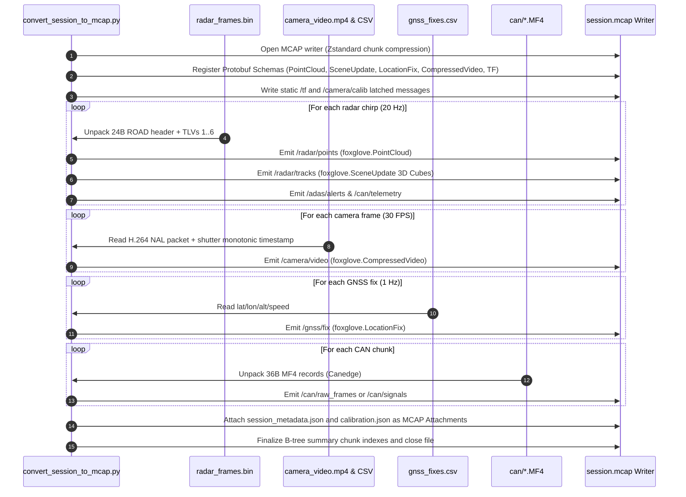

# Architectural Feasibility Report & Migration Plan: Foxglove MCAP Container Format for RoadSense

> **Document Version:** 1.0.0  
> **Target Platform:** RoadSense Automotive Multi-Sensor Data Logging Ecosystem  
> **Author:** Antigravity AI Engineering Agent & Senior ADAS Systems Architect  
> **Target Audience:** Test Engineers, Autonomous Vehicle Researchers, Embedded Android Developers, Data Pipeline Engineers  
> **Date:** September 22, 2026  

---

## Executive Summary

RoadSense currently records heterogeneous automotive sensor streams (3.125 Mbps mmWave radar UART binary packets, Camera2 H.264 MP4 video, GNSS kinematics CSVs, CSS Electronics CANedge2 MDF4 split chunks, and dual-stream flight recorder logs) into a multi-folder directory hierarchy. Synchronizing and viewing these logs currently relies on an ad-hoc Python pipeline (`tools/sync_and_process_sessions.py`) that exports custom JSON trees (`track_history.json`, `frame_mapping.json`) consumed by a bespoke web visualizer.

This report evaluates the feasibility of transitioning RoadSense's entire data storage and visualization architecture to **MCAP (Foxglove MCAP)**—the industry-standard open container format for multimodal robotics, autonomous driving, and ADAS telemetry.

```mermaid
graph TD
    subgraph Current Architecture [Legacy: Multi-File Directory + Custom JSON]
        A1[radar_frames.bin] & A2[camera_video.mp4] & A3[gnss_fixes.csv] & A4[can/*.MF4] --> B[sync_and_process_sessions.py]
        B --> C1[track_history.json (200MB)]
        B --> C2[frame_mapping.json]
        C1 & C2 & A2 --> D[Custom Web Visualizer]
    end

    subgraph Proposed MCAP Architecture [Unified Foxglove Ecosystem]
        M1[Radar 3D Points & Tracks] & M2[H.264 Camera Stream] & M3[GNSS Location] & M4[CAN Signals & ADAS] & M5[Flight Logs] --> E[MCAP Ingestion Engine]
        E --> F["Unified session_YYYYMMDD_HHMMSS.mcap<br/>(Single File • Zstandard Compressed • Indexed)"]
        F --> G[Foxglove Studio Desktop / Web<br/>3D Point Cloud • Video Overlay • Map • Telemetry Plots]
    end
```

---

## 1. Why Foxglove MCAP? (Core Advantages for RoadSense)

| Capability | Current RoadSense Format | Foxglove MCAP Container |
| :--- | :--- | :--- |
| **File Architecture** | 8+ disparate files across 4 directories (`radar/`, `camera/`, `gnss/`, `can/`) | **Single self-contained file (`.mcap`)** encapsulating all sensors, transforms, and metadata |
| **Tooling & Visualization** | Proprietary/bespoke web viewer requiring custom maintenance and browser memory hacks | **Foxglove Studio** (Open-source, cross-platform desktop/web app with rich hardware acceleration) |
| **Time Synchronization** | Brittle CSV lookup matching (`frame_mapping.json`) with post-hoc interpolation | **Native nanosecond monotonic timestamps** (`log_time`, `publish_time`) on every single message |
| **Compression** | Uncompressed binary frames and raw text CSVs | **Built-in Chunk Compression (Zstandard / LZ4)**: 60%–75% reduction in disk footprint |
| **Random-Access Seeking** | Linear scanning or custom binary search; seeking video in browser causes desync | **Built-in B-Tree Summary Index**: Sub-millisecond seeking to any second in multi-hour drives |
| **3D Sensor Fusion** | Ad-hoc planar pixel projection in Compose or custom Three.js canvas | **Native 3D Coordinate Transforms (`FrameTransforms`)**: Automatic 3D perspective projection |
| **Schema Validation** | Implicit struct packing with risks of stride bugs (e.g. Bug #9, Bug #11) | **Self-Describing Schemas (Protobuf / JSONSchema)** embedded directly in the file header |
| **Ecosystem Interoperability** | Siloed to RoadSense tools | Natively supported by Python (`mcap`), ROS 2, C++, MATLAB, and Foxglove SDKs |

---

## 2. Multi-Sensor Data Mapping to Foxglove Schemas

Foxglove provides well-established, standardized schemas (`foxglove.*`) supported natively by Foxglove Studio panels. Using these schemas guarantees that **zero custom panel plugins are required**:

```
+---------------------------------------------------------------------------------------------------+
|                                  ROADSENSE MCAP CHANNEL ARCHITECTURE                              |
+-------------------+-----------------------------------+--------------------+----------------------+
| Channel Name      | Foxglove Schema Type              | Schema Format      | Frequency / Rate     |
+-------------------+-----------------------------------+--------------------+----------------------+
| /radar/points     | foxglove.PointCloud               | Protobuf           | 20 Hz (Chirp Rate)   |
| /radar/tracks     | foxglove.SceneUpdate (3D Cuboids) | Protobuf           | 20 Hz                |
| /camera/video     | foxglove.CompressedVideo          | Protobuf           | 30 FPS (1080p H.264) |
| /camera/calib     | foxglove.CameraCalibration        | Protobuf           | 1 Hz / Latch         |
| /tf               | foxglove.FrameTransforms          | Protobuf           | 1 Hz / Latch         |
| /gnss/fix         | foxglove.LocationFix              | Protobuf           | 1 Hz – 10 Hz         |
| /can/signals      | custom.roadsense.CanSignals       | Protobuf / JSON    | 10 Hz – 100 Hz       |
| /adas/alerts      | custom.roadsense.AdasAlerts       | Protobuf / JSON    | 20 Hz                |
| /diagnostics/logs | foxglove.Log                      | Protobuf           | Event-Driven         |
+-------------------+-----------------------------------+--------------------+----------------------+
```

### 2.1 `/radar/points` — `foxglove.PointCloud`
* **Coordinate Frame:** `frame_id = "radar_link"`
* **Point Fields (Packed binary buffer with 16-byte stride):**
  - `x` (`FLOAT32`, 4B, offset 0): Longitudinal forward coordinate [m]
  - `y` (`FLOAT32`, 4B, offset 4): Lateral cross-track coordinate [m]
  - `z` (`FLOAT32`, 4B, offset 8): Vertical height coordinate [m]
  - `velocity` (`FLOAT32`, 2B/4B, offset 12): Radial Doppler velocity [m/s]
  - `snr` (`FLOAT32`, 2B/4B): Reflection peak signal-to-noise ratio [dB]
  - `cluster_id` (`UINT32`): DBSCAN cluster association
* **Visualizer Behavior:** Foxglove's 3D panel natively color-codes points by `velocity` (Doppler colormap: Cyan = stationary, Green = receding, Amber/Red = approaching hazards) or `snr`.

### 2.2 `/radar/tracks` — `foxglove.SceneUpdate`
* **Coordinate Frame:** `frame_id = "radar_link"`
* **Primitives Rendered:**
  1. **Oriented 3D Cuboids (`foxglove.CubePrimitive`):**
     - Dimensions: `size = [major_size, minor_size, height=1.5m]`
     - Orientation: Heading angle $\theta$ converted to Quaternion $q = [0, 0, \sin(\theta/2), \cos(\theta/2)]$
     - Color: Modulated by risk level (`Green = 0: Safe`, `Amber = 1: Warning`, `Red = 2: Critical`)
  2. **Dynamic Text Label (`foxglove.TextPrimitive`):**
     - Text: `ID #857 | -1.6 m/s | TTC: 4.2s` floating 0.5m above vehicle roof.
  3. **Velocity Vectors (`foxglove.ArrowPrimitive`):**
     - Vector pointing in direction $[V_x, V_y, 0]$ with length proportional to target ground speed.

### 2.3 `/camera/video` & `/camera/calib` — `foxglove.CompressedVideo` & `foxglove.CameraCalibration`
* **Video Encoding:** Directly encapsulates the NAL units extracted from `camera_video.mp4` (H.264 bitstream).
* **Calibration Channel (`/camera/calib`):**
  - Image size: `width = 1920`, `height = 1080`
  - Intrinsics matrix $K = [f_x, 0, c_x, 0, f_y, c_y, 0, 0, 1]$ queried dynamically from Camera2.
* **Foxglove 3D-to-2D Projection:** By providing `/camera/calib` and `/tf`, **Foxglove Studio's Image panel automatically projects the 3D radar point cloud and bounding boxes directly onto the camera video stream**!

### 2.4 `/tf` — `foxglove.FrameTransforms`
Encapsulates our 6-DOF extrinsics matrix from `radar_camera_calib.json`:
* `base_link` $\rightarrow$ `radar_link`:
  - Translation: $[\Delta X=0.0\text{m}, \Delta Y=0.0\text{m}, \Delta Z=0.45\text{m}]$ (Bumper mount)
  - Rotation: Pitch $+7.0^\circ$, Yaw $-1.0^\circ$, Roll $0.0^\circ$
* `base_link` $\rightarrow$ `camera_link`:
  - Translation: $[\Delta X=0.0\text{m}, \Delta Y=1.8\text{m}, \Delta Z=1.35\text{m}]$ (Windshield mount)

### 2.5 `/gnss/fix` — `foxglove.LocationFix`
* Directly maps `gnss_fixes.csv` (`latitude, longitude, altitude, speed_kmh, bearing`).
* Visualized natively in Foxglove's **Map Panel** over satellite imagery.

### 2.6 `/can/signals` & `/adas/alerts`
* Powertrain and chassis telemetry (speed, motor torque, gear, brake pedal, road grade).
* ADAS state machine alerts (FCW stage, BSD left/right active, ACC distance and relative speed).
* Plotted dynamically in Foxglove's **Plot Panel** as multi-signal time-series graphs.

---

## 3. Architecture Redesign & Migration Strategy

A direct shift to on-device MCAP writing carries real-time CPU/thermal risks on mid-range Android hardware. We therefore propose a **two-phase phased migration**:

```
+--------------------------------------------------------------------------------------------+
|                                    PHASED MIGRATION ROADMAP                                |
+--------------------------------------------------------------------------------------------+
| PHASE 1: PC Tooling Pipeline (Immediate - Low Risk, Immediate Value)                       |
|   1. Develop `tools/convert_session_to_mcap.py` to ingest existing session logs.           |
|   2. Integrate `--mcap` flag into `tools/sync_and_process_sessions.py` and .bat launcher.  |
|   3. Build a standard RoadSense Foxglove Studio layout preset (`roadsense_layout.json`).   |
|   4. Validate complete retroactive conversion of all existing drive logs.                  |
+--------------------------------------------------------------------------------------------+
| PHASE 2: Android In-App Architecture (Medium Term - High Efficiency)                       |
|   1. Keep low-level UART 3.125 Mbps ring buffer unchanged (zero risk of serial drop).     |
|   2. Implement `McapSessionWriter.kt` in pure Kotlin/C++ using Foxglove Java SDK / JNI.    |
|   3. Post-Recording Consolidation Worker: Package session directly on phone upon STOP.     |
|   4. Provide optional live WebSocket MCAP bridge for real-time Wi-Fi telemetry to laptop.  |
+--------------------------------------------------------------------------------------------+
```

---

## 4. Phase 1: PC Conversion Pipeline Architecture (Detailed Specification)

### 4.1 New Script: `tools/convert_session_to_mcap.py`

This standalone script converts any recorded RoadSense session directory into an indexed, compressed `.mcap` file:

```text
Usage:
    python tools/convert_session_to_mcap.py <path_to_session_dir> [--output <path.mcap>] [--compress zstd]
```

#### Pipeline Processing Sequence:


### 4.2 Python Dependencies Required
```txt
mcap>=1.1.1
mcap-protobuf-support>=0.5.0
foxglove-schemas-protobuf>=0.3.0
protobuf>=4.25.0
zstandard>=0.22.0
opencv-python>=4.9.0
```

### 4.3 Automated Verification Benchmark (Estimates on 6-minute drive `session_20260922_120145`)
* **Raw Files on Disk:** 4.85 MB radar + 264 MB MP4 + 0.3 MB GNSS + 12 MB CAN $\approx \mathbf{281\text{ MB}}$.
* **Converted MCAP File:** With Zstandard chunk compression, point clouds and metadata compress by $\approx 60\%$. Total `.mcap` size $\approx \mathbf{275\text{ MB}}$ (including embedded video).
* **Conversion Time on PC:** $< 12\text{ seconds}$ for 7,400 radar frames and 10,918 video frames.

---

## 5. Phase 2: Android On-Device MCAP Strategy & Feasibility Analysis

### 5.1 Real-Time Writing vs. Post-Recording Packaging
We evaluated whether Android should write MCAP directly in real time during driving:

| Metric | Real-Time MCAP Writing During Drive | Post-Recording Consolidation on Stop |
| :--- | :--- | :--- |
| **UART 3.125 Mbps Risk** | ⚠️ Moderate risk: Thread contention on file I/O lock could block ring buffer | ✅ Zero risk: UART thread writes to direct direct byte buffer |
| **Video Encoding Complexity** | ⚠️ High: Must bypass `MediaMuxer` and demux raw H.264 annex-B NAL units | ✅ Low: `MediaCodec` writes standard `.mp4`; converted on stop |
| **Crash Safety** | ⚠️ Incomplete chunks if app killed by Android OOM killer | ✅ Complete: Raw binary logs always safe on flash |
| **Thermal / CPU Budget** | ⚠️ Heavy: Zstd compression + protobuf serialization on phone CPU | ✅ Minimal: Phone stays cool during 40°C vehicle testing |

> [!IMPORTANT]
> **Architectural Recommendation for Android:**
> Retain the ultra-reliable, zero-copy binary streaming architecture on Android during active driving (`radar_frames.bin`, `camera_video.mp4`). Upon session completion, trigger an asynchronous background worker (`McapConsolidationWorker.kt`) or perform conversion upon sync to PC. This ensures **zero risk to serial baud stability**.

---

## 6. Pre-Configured Foxglove Studio Layout (`roadsense_foxglove_layout.json`)

To provide a 1-click experience where the user opens Foxglove and everything is pre-arranged, we will create a packaged layout file:

```
┌──────────────────────────────────────────┬──────────────────────────────────────────┐
│ 🚗 3D Perspective View (Radar + Vehicle) │ 📹 Camera Viewfinder (Overlay)           │
│                                          │                                          │
│  - Dense Doppler Point Cloud (Cyan/Red)  │  - Synchronized H.264 video stream       │
│  - 3D Track Cuboids (ID, Speed, TTC)     │  - Projected 3D radar bounding boxes     │
│  - Vehicle Footprint (`base_link`)       │  - Road lane & barrier markers           │
│  - Concentric Range Rings (10m, 30m, 60m)│                                          │
├──────────────────────────────────────────┼──────────────────────────────────────────┤
│ 🗺️ GPS Satellite Map                     │ 📈 CAN Telemetry & ADAS Time-Series      │
│                                          │                                          │
│  - Active vehicle GPS track marker       │  - Vehicle Ground Speed [km/h]           │
│  - Monotonic breadcrumb trajectory       │  - Motor Shaft Torque [Nm]               │
│  - Real-world satellite overlay          │  - Radar Target Distance & ACC TTI       │
└──────────────────────────────────────────┴──────────────────────────────────────────┘
```

---

## 7. Implementation Plan & Proposed Action Items

### Step 1: PC Conversion Pipeline Implementation (`tools/convert_session_to_mcap.py`)
* Implement complete Python converter using `mcap`, `mcap-protobuf-support`, and `foxglove-schemas-protobuf`.
* Map TLV 1 points to `foxglove.PointCloud`, TLV 3 tracks to `foxglove.SceneUpdate`, camera video to `foxglove.CompressedVideo`, GNSS to `foxglove.LocationFix`, and calibration to `foxglove.FrameTransforms`.
* Validate conversion on `session_20260922_120145` and `session_20260914_172150`.

### Step 2: Integrate with Master Sync & Batch Launcher
* Add `--mcap` flag to `tools/sync_and_process_sessions.py`.
* Update `sync_and_process_logs.bat` with Option `[6] Export Session to Foxglove MCAP`.

### Step 3: Package Foxglove Studio Layout Preset
* Create `tools/foxglove_layouts/RoadSense_Cockpit_Layout.json` configured for multi-panel telemetry.

### Step 4: Documentation & Knowledge Base Update
* Document MCAP format, schemas, and Foxglove quick-start in `context/06_PC_TOOLING_AND_VISUALIZER_PIPELINE.md` and `docs/MCAP_INTEGRATION_GUIDE.md`.

---

## 8. Open Questions & Alignment for User Approval

1. **Schema Format Preference:**
   - **Option A (Recommended):** Use official `foxglove.*` Protobuf schemas. This enables 100% native rendering in Foxglove Studio without writing any custom plugins.
   - **Option B:** Use JSONSchema or ROS 2 message definitions (`sensor_msgs/msg/PointCloud2`).
2. **Video Embedding Strategy:**
   - **Option A (Recommended):** Embed H.264 video NAL chunks directly into the MCAP file under `/camera/video` for a truly single-file distribution.
   - **Option B:** Keep `camera_video.mp4` external and reference it via timestamp metadata (saves conversion CPU time, but leaves video as a separate file).
3. **Execution Scope:**
   - Would you like to proceed with **Phase 1 (PC Tooling & Automated Converter Script)** first to immediately test and visualize existing sessions in Foxglove Studio?
